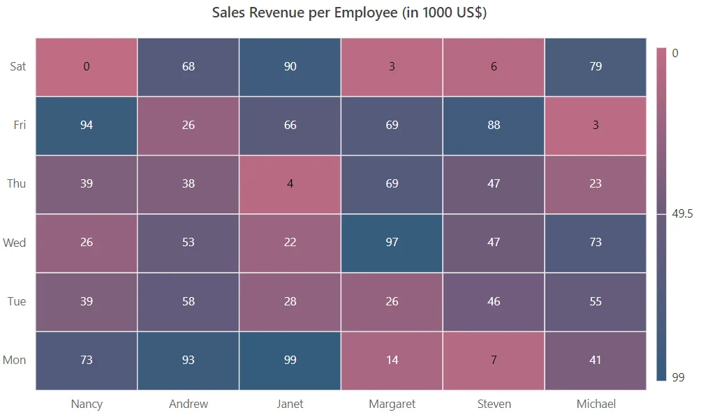
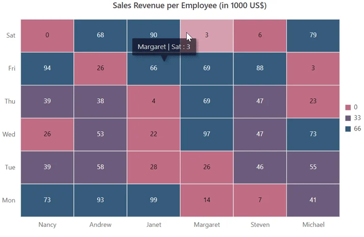

# Blazor HeatMap Chart Palette

In the HeatMap, each data point is represented as a cell, and the cell color is determined by its corresponding data value. The palette is used to define the color range for cells and the color transition type. You can specify colors using RGB values or hexadecimal color codes through the [`Color`](https://help.syncfusion.com/cr/blazor/Syncfusion.Blazor.HeatMap.HeatMapPalette.html#Syncfusion_Blazor_HeatMap_HeatMapPalette_Color) property of [`HeatMapPalette`](https://help.syncfusion.com/cr/blazor/Syncfusion.Blazor.HeatMap.HeatMapPalette.html). The configured colors are applied to the cell background based on the selected palette type and the associated cell value.

## Palette Types

You can display the heat map cells either in gradient colors or fixed colors.

### Gradient

A smooth transition between the specified palette colors is applied to HeatMap cells based on their values. The HeatMap calculates intermediate colors between the defined palette colors and applies them to the cells according to their corresponding values. If palette colors are not specified, the default start and end colors are used for gradient calculation.

To enable gradient color mapping, set the [`Type`](https://help.syncfusion.com/cr/blazor/Syncfusion.Blazor.HeatMap.HeatMapPaletteSettings.html#Syncfusion_Blazor_HeatMap_HeatMapPaletteSettings_Type) property of [`HeatMapPaletteSettings`](https://help.syncfusion.com/cr/blazor/Syncfusion.Blazor.HeatMap.HeatMapPaletteSettings.html) to [`PaletteType.Gradient`](https://help.syncfusion.com/cr/blazor/Syncfusion.Blazor.HeatMap.PaletteType.html).

```cshtml

@using Syncfusion.Blazor.HeatMap

<SfHeatMap DataSource="@HeatMapData">
    <HeatMapTitleSettings Text="Sales Revenue per Employee (in 1000 US$)">
    </HeatMapTitleSettings>
    <HeatMapXAxis Labels="@XAxisLabels"></HeatMapXAxis>
    <HeatMapYAxis Labels="@YAxisLabels"></HeatMapYAxis>
    <HeatMapCellSettings ShowLabel="true" TileType="CellType.Rect"></HeatMapCellSettings>
    <HeatMapPaletteSettings Type="PaletteType.Gradient">
        <HeatMapPalettes>
            <HeatMapPalette Color="#C06C84"></HeatMapPalette>
            <HeatMapPalette Color="#6C5B7B"></HeatMapPalette>
            <HeatMapPalette Color="#355C7D"></HeatMapPalette>
        </HeatMapPalettes>
    </HeatMapPaletteSettings>
</SfHeatMap>

@code{
    int[,] GetDefaultData()
    {
        int[,] dataSource = new int[,]
        {
            {73, 39, 26, 39, 94, 0},
            {93, 58, 53, 38, 26, 68},
            {99, 28, 22, 4, 66, 90},
            {14, 26, 97, 69, 69, 3},
            {7, 46, 47, 47, 88, 6},
            {41, 55, 73, 23, 3, 79}
        };
        return dataSource;
    }
    string[] XAxisLabels = new string[] {"Nancy", "Andrew", "Janet", "Margaret", "Steven", "Michael" };
    string[] YAxisLabels = new string[] { "Mon", "Tue", "Wed", "Thu", "Fri", "Sat" };
    public object HeatMapData { get; set; }
    protected override void OnInitialized()
    {
        HeatMapData = GetDefaultData();
    }
}

```



### Fixed

In the fixed palette type, solid colors are applied to HeatMap cells. The data values are grouped and mapped to the defined palette colors. The number of groups is determined by the number of colors specified in the palette.

To enable fixed color mapping, set the [`Type`](https://help.syncfusion.com/cr/blazor/Syncfusion.Blazor.HeatMap.HeatMapPaletteSettings.html#Syncfusion_Blazor_HeatMap_HeatMapPaletteSettings_Type) property of [`HeatMapPaletteSettings`](https://help.syncfusion.com/cr/blazor/Syncfusion.Blazor.HeatMap.HeatMapPaletteSettings.html) to [`PaletteType.Fixed`](https://help.syncfusion.com/cr/blazor/Syncfusion.Blazor.HeatMap.PaletteType.html).

```cshtml

@using Syncfusion.Blazor.HeatMap

<SfHeatMap DataSource="@HeatMapData">
    <HeatMapTitleSettings Text="Sales Revenue per Employee (in 1000 US$)">
    </HeatMapTitleSettings>
    <HeatMapXAxis Labels="@XAxisLabels"></HeatMapXAxis>
    <HeatMapYAxis Labels="@YAxisLabels"></HeatMapYAxis>
    <HeatMapCellSettings ShowLabel="true" TileType="CellType.Rect"></HeatMapCellSettings>
    <HeatMapPaletteSettings Type="PaletteType.Fixed">
        <HeatMapPalettes>
            <HeatMapPalette Color="#C06C84"></HeatMapPalette>
            <HeatMapPalette Color="#6C5B7B"></HeatMapPalette>
            <HeatMapPalette Color="#355C7D"></HeatMapPalette>
        </HeatMapPalettes>
    </HeatMapPaletteSettings>
</SfHeatMap>

@code{
    int[,] GetDefaultData()
    {
        int[,] dataSource = new int[,]
        {
            {73, 39, 26, 39, 94, 0},
            {93, 58, 53, 38, 26, 68},
            {99, 28, 22, 4, 66, 90},
            {14, 26, 97, 69, 69, 3},
            {7, 46, 47, 47, 88, 6},
            {41, 55, 73, 23, 3, 79}
        };
        return dataSource;
    }
    string[] XAxisLabels = new string[] {"Nancy", "Andrew", "Janet", "Margaret", "Steven", "Michael" };
    string[] YAxisLabels = new string[] { "Mon", "Tue", "Wed", "Thu", "Fri", "Sat" };
    public object HeatMapData { get; set; }
    protected override void OnInitialized()
    {
        HeatMapData = GetDefaultData();
    }
}

```



<!-- ## Defining color stops

You can define the colors ranges or color stops for data values in both gradient and fixed palette types. You need to define the data value in the `Value` property for `HeatMapPalette` property to calculate the color stops. The heat map automatically calculates the color stops if the `Value` property is not defined. The `Label` property is used to provide the additional information about the color that is to be displayed in the legend. If the label is not provided, the value will be displayed in the legend. The labels can be automatically calculated based on data values, if both the values and labels are not defined.

```cshtml

@using Syncfusion.Blazor.HeatMap

<SfHeatMap DataSource="@HeatMapData">
    <HeatMapTitleSettings Text="Sales Revenue per Employee (in 1000 US$)">
    </HeatMapTitleSettings>
    <HeatMapXAxis Labels="@XAxisLabels"></HeatMapXAxis>
    <HeatMapYAxis Labels="@YAxisLabels"></HeatMapYAxis>
    <HeatMapCellSettings ShowLabel="true" TileType="CellType.Rect"></HeatMapCellSettings>
    <HeatMapPaletteSettings Type="PaletteType.Fixed">
        <HeatMapPalettes>
            <HeatMapPalette Color="#C06C84" Label="Low" Value=3></HeatMapPalette>
            <HeatMapPalette Color="#6C5B7B" Label="Moderate" Value=33.3></HeatMapPalette>
            <HeatMapPalette Color="#355C7D" Label="High" Value=75></HeatMapPalette>
        </HeatMapPalettes>
    </HeatMapPaletteSettings>
</SfHeatMap>

@code{
    int[,] GetDefaultData()
    {
        int[,] dataSource = new int[,]
        {
            {73, 39, 26, 39, 94, 0},
            {93, 58, 53, 38, 26, 68},
            {99, 28, 22, 4, 66, 90},
            {14, 26, 97, 69, 69, 3},
            {7, 46, 47, 47, 88, 6},
            {41, 55, 73, 23, 3, 79}
        };
        return dataSource;
    }
    string[] XAxisLabels = new string[] {"Nancy", "Andrew", "Janet", "Margaret", "Steven", "Michael" };
    string[] YAxisLabels = new string[] { "Mon", "Tue", "Wed", "Thu", "Fri", "Sat" };
    public object HeatMapData { get; set; }
    protected override void OnInitialized()
    {
        HeatMapData = GetDefaultData();
    }
}

```
 -->