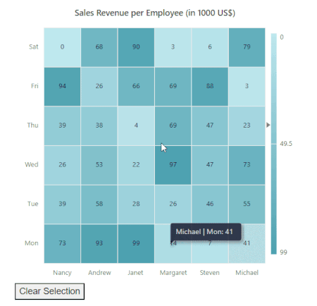

# Selection in Blazor HeatMap Chart Component

In the [Blazor HeatMap Chart](https://www.syncfusion.com/blazor-components/blazor-heatmap-chart), the cell selection is used to select single or multiple cells at runtime and get the selected cell details using the [CellSelected](https://help.syncfusion.com/cr/blazor/Syncfusion.Blazor.HeatMap.HeatMapEvents.html#Syncfusion_Blazor_HeatMap_HeatMapEvents_CellSelected) event. You can enable the cell selection using the [AllowSelection](https://help.syncfusion.com/cr/blazor/Syncfusion.Blazor.HeatMap.SfHeatMap-1.html#Syncfusion_Blazor_HeatMap_SfHeatMap_1_AllowSelection) property.

The HeatMap cells can be selected using the following interactions, as shown in the table below.

|   Modes of Interactions |   Description                                                                                                      |
|------------------------ | -------------------------------------------------------------------------------------------------------------------|
|   Mouse                 |  HeatMap cells can be selected by clicking or dragging and dropping over them.                                     |
|   Touch                 |  HeatMap cells can be selected by tapping or dragging and dropping over them.                                      |
|   Keyboard              |  The **Ctrl** key on the keyboard can be used to enable multiple cell selection with mouse and touch interaction. The **Ctrl** key can only be used if the `EnableMultiSelect` property is set to **true** in order to enable multiple cell selection.                                                                                                                                     |

```cshtml

@using Syncfusion.Blazor.HeatMap

<SfHeatMap AllowSelection="true" DataSource="@HeatMapData">
    <HeatMapTitleSettings Text="Sales Revenue per Employee (in 1000 US$)">
    </HeatMapTitleSettings>
    <HeatMapXAxis Labels="@XAxisLabels"></HeatMapXAxis>
    <HeatMapYAxis Labels="@YAxisLabels"></HeatMapYAxis>
    <HeatMapCellSettings ShowLabel="true" TileType="CellType.Rect"></HeatMapCellSettings>
</SfHeatMap>

@code{
    public int[,] GetDefaultData()
    {
        int[,] dataSource = new int[,]
        {
            {73, 39, 26, 39, 94, 0},
            {93, 58, 53, 38, 26, 68},
            {99, 28, 22, 4, 66, 90},
            {14, 26, 97, 69, 69, 3},
            {7, 46, 47, 47, 88, 6},
            {41, 55, 73, 23, 3, 79}
        };
        return dataSource;
    }
    public string[] XAxisLabels = new string[] {"Nancy", "Andrew", "Janet", "Margaret", "Steven", "Michael" };
    public string[] YAxisLabels = new string[] { "Mon", "Tue", "Wed", "Thu", "Fri", "Sat" };
    public object HeatMapData { get; set; }
    protected override void OnInitialized()
    {
        HeatMapData = GetDefaultData();
    }
}

```


The illustration below shows how to select multiple cells in the HeatMap by clicking and dragging the mouse across the cells.


## Enable single cell selection

In the HeatMap, the [EnableMultiSelect](https://help.syncfusion.com/cr/blazor/Syncfusion.Blazor.HeatMap.SfHeatMap-1.html#Syncfusion_Blazor_HeatMap_SfHeatMap_1_EnableMultiSelect) property is used to enable and carry out single cell selection. When you set the `EnableMultiSelect` property to **false**, only one cell is selected at a time. By default, `EnableMultiSelect` property is set to **true**.

```cshtml

@using Syncfusion.Blazor.HeatMap

<SfHeatMap DataSource="@DataSource"AllowSelection="true" EnableMultiSelect="false">
    <HeatMapTitleSettings Text="Sales Revenue per Employee (in 1000 US$)"></HeatMapTitleSettings>
    <HeatMapXAxis Labels="@XLabels"></HeatMapXAxis>
    <HeatMapYAxis Labels="@YLabels"></HeatMapYAxis>
</SfHeatMap>

@code{
    public int YIndex = 0;
    public string[] XLabels = new string[] { "Nancy", "Andrew", "Janet", "Margaret", "Steven", "Michael", "Robert", "Laura", "Anne", "Paul", "Karin", "Mario" };
    public string[] YLabels = new string[] { "Mon", "Tues", "Wed", "Thurs", "Fri", "Sat" };
    public double[,] DataSource = new double[,]
    {
         { 73, 39, 26, 39, 94, 0 },
         { 93, 58, 53, 38, 26, 68 },
         { 99, 28, 22, 4, 66, 90 },
         { 14, 26, 97, 69, 69, 3 },
         { 7, 46, 47, 47, 88, 6 },
         { 41, 55, 73, 23, 3, 79 },
         { 56, 69, 21, 86, 3, 33 },
         { 45, 7, 53, 81, 95, 79 },
         { 60, 77, 74, 68, 88, 51 },
         { 25, 25, 10, 12, 78, 14 },
         { 25, 56, 55, 58, 12, 82 },
         {74, 33, 88, 23, 86, 59 }
    };
}

```


### Clearing cell selection

The [ClearSelectionAsync](https://help.syncfusion.com/cr/blazor/Syncfusion.Blazor.HeatMap.SfHeatMap-1.html#Syncfusion_Blazor_HeatMap_SfHeatMap_1_ClearSelectionAsync) method can be used to clear all the selected cells. The below example illustrates the same.

```cshtml

@using Syncfusion.Blazor.HeatMap

<SfHeatMap @ref="Heatmap" AllowSelection="true" DataSource="@dataSource">
    <HeatMapTitleSettings Text="Sales Revenue per Employee (in 1000 US$)">
    </HeatMapTitleSettings>
    <HeatMapXAxis Labels="@XAxisLabels"></HeatMapXAxis>
    <HeatMapYAxis Labels="@YAxisLabels"></HeatMapYAxis>
    <HeatMapCellSettings ShowLabel="true" TileType="CellType.Rect"></HeatMapCellSettings>
</SfHeatMap>

<button @onclick="ClearSelection">Clear Selection</button>

@code {
    public SfHeatMap<int[,]> Heatmap;
   
    public int[,] dataSource = new int[,]
    {
        {73, 39, 26, 39, 94, 0},
        {93, 58, 53, 38, 26, 68},
        {99, 28, 22, 4, 66, 90},
        {14, 26, 97, 69, 69, 3},
        {7, 46, 47, 47, 88, 6},
        {41, 55, 73, 23, 3, 79}
    };
       
    public string[] XAxisLabels = new string[] { "Nancy", "Andrew", "Janet", "Margaret", "Steven", "Michael" };
    public string[] YAxisLabels = new string[] { "Mon", "Tue", "Wed", "Thu", "Fri", "Sat" };
    
    public async Task ClearSelection()
    {
        Heatmap.ClearSelectionAsync();
    }
}

```

