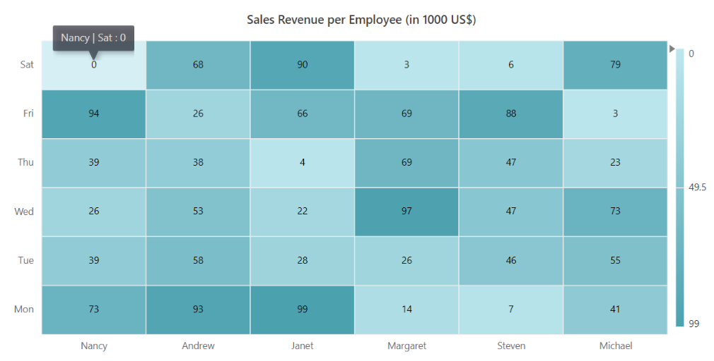
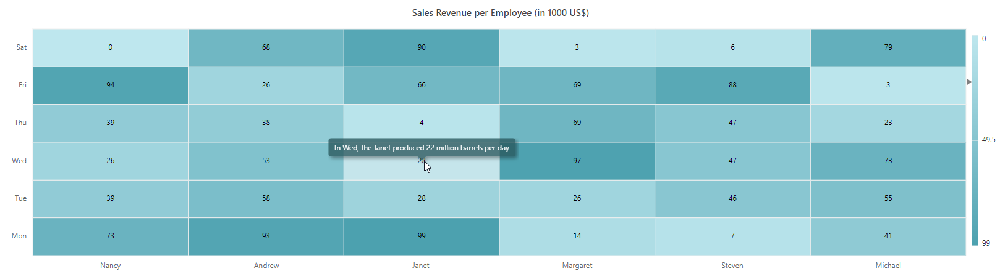

# Tooltip in Blazor HeatMap Chart Component

Tooltip is used to provide the details of the heatmap cell, and this can be displayed, while hovering the cursor over the cell or performing tap action in touch devices.

## Default tooltip

You can enable the tooltip by setting the [Enable](https://help.syncfusion.com/cr/blazor/Syncfusion.Blazor.HeatMap.HeatMapTooltipSettings.html#Syncfusion_Blazor_HeatMap_HeatMapTooltipSettings_Enable) property to **true** inside the [HeatMapTooltipSettings](https://help.syncfusion.com/cr/blazor/Syncfusion.Blazor.HeatMap.HeatMapTooltipSettings.html) tag.

```cshtml

@using Syncfusion.Blazor.HeatMap

<SfHeatMap DataSource="@HeatMapData">
    <HeatMapTitleSettings Text="Sales Revenue per Employee (in 1000 US$)">
    </HeatMapTitleSettings>
    <HeatMapXAxis Labels="@XAxisLabels"></HeatMapXAxis>
    <HeatMapYAxis Labels="@YAxisLabels"></HeatMapYAxis>
    <HeatMapCellSettings ShowLabel="true" TileType="CellType.Rect"></HeatMapCellSettings>
     <HeatMapTooltipSettings Enable="true"></HeatMapTooltipSettings>
</SfHeatMap>

@code{
    int[,] GetDefaultData()
    {
        int[,] dataSource = new int[,]
        {
            {73, 39, 26, 39, 94, 0},
            {93, 58, 53, 38, 26, 68},
            {99, 28, 22, 4, 66, 90},
            {14, 26, 97, 69, 69, 3},
            {7, 46, 47, 47, 88, 6},
            {41, 55, 73, 23, 3, 79}
        };
        return dataSource;
    }
    string[] XAxisLabels = new string[] {"Nancy", "Andrew", "Janet", "Margaret", "Steven", "Michael" };
    string[] YAxisLabels = new string[] { "Mon", "Tue", "Wed", "Thu", "Fri", "Sat" };
    public object HeatMapData { get; set; }
    protected override void OnInitialized()
    {
        HeatMapData = GetDefaultData();
    }
}

```



## Customize the appearance of tooltip

The [Fill](https://help.syncfusion.com/cr/blazor/Syncfusion.Blazor.HeatMap.HeatMapTooltipSettings.html#Syncfusion_Blazor_HeatMap_HeatMapTooltipSettings_Fill) and [HeatMapTooltipBorder](https://help.syncfusion.com/cr/blazor/Syncfusion.Blazor.HeatMap.HeatMapTooltipBorder.html#properties) properties are used to customize the background color and border of the Tooltip respectively. The [HeatMapFont](https://help.syncfusion.com/cr/blazor/Syncfusion.Blazor.HeatMap.HeatMapFont.html) property in the Tooltip is used to customize the font of the tooltip text.

In heatmap, you can customize the tooltip using the [TooltipRendering](https://help.syncfusion.com/cr/blazor/Syncfusion.Blazor.HeatMap.HeatMapEvents.html#Syncfusion_Blazor_HeatMap_HeatMapEvents_TooltipRendering) client side event.

```cshtml

@using Syncfusion.Blazor.HeatMap

<SfHeatMap DataSource="@HeatMapData">
    <HeatMapEvents TooltipRendering="@TooltipRendering"></HeatMapEvents>
    <HeatMapTitleSettings Text="Sales Revenue per Employee (in 1000 US$)">
    </HeatMapTitleSettings>
    <HeatMapXAxis Labels="@XAxisLabels"></HeatMapXAxis>
    <HeatMapYAxis Labels="@YAxisLabels"></HeatMapYAxis>
    <HeatMapCellSettings ShowLabel="true" TileType="CellType.Rect"></HeatMapCellSettings>
    <HeatMapTooltipSettings Fill="#265259">
        <HeatMapTooltipBorder Width="1"></HeatMapTooltipBorder>
        <HeatMapFont Size="12px" Color="#FFFFFF"></HeatMapFont>
    </HeatMapTooltipSettings>
</SfHeatMap>

@code {
    int[,] GetDefaultData()
    {
        int[,] dataSource = new int[,]
        {
            {73, 39, 26, 39, 94, 0},
            {93, 58, 53, 38, 26, 68},
            {99, 28, 22, 4, 66, 90},
            {14, 26, 97, 69, 69, 3},
            {7, 46, 47, 47, 88, 6},
            {41, 55, 73, 23, 3, 79}
        };
        return dataSource;
    }
    string[] XAxisLabels = new string[] { "Nancy", "Andrew", "Janet", "Margaret", "Steven", "Michael" };
    string[] YAxisLabels = new string[] { "Mon", "Tue", "Wed", "Thu", "Fri", "Sat" };
    public object HeatMapData { get; set; }
    public void TooltipRendering(TooltipEventArgs args)
    {
        args.Content = new string[] { "In " + args.YLabel + ", the " + args.XLabel + " produced " + args.Value + " million barrels per day" };
    }
    protected override void OnInitialized()
    {
        HeatMapData = GetDefaultData();
    }
}

```


