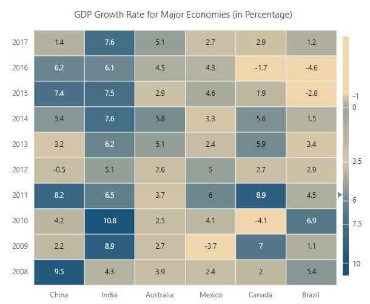
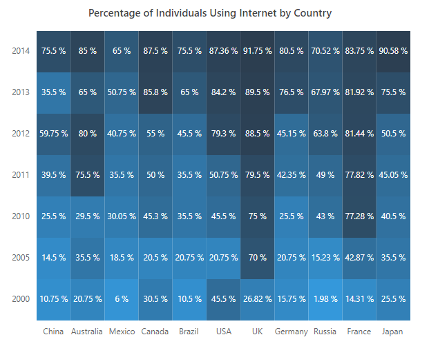
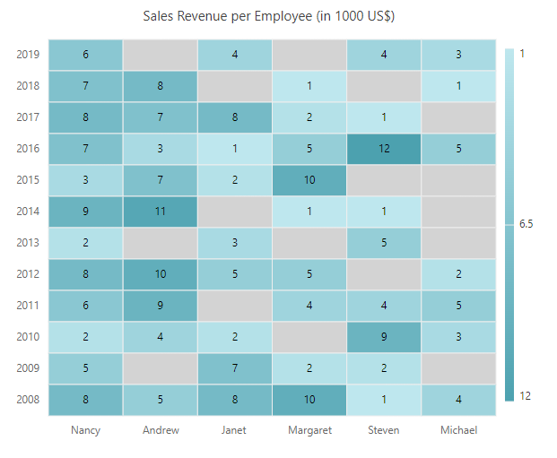

# Working with data in Blazor HeatMap Chart Component

Heatmap visualizes the JSON data and two-dimensional array data. Using the data adaptor support, data can be bound to the heatmap.

## Local Data

### Data adaptor

Heatmap supports the following types of data binding with the adaptor support.

* Array 
     * Table Binding
     * Cell Binding

#### Array - Table binding

Each inner array of an array table binding data contains data points for an X-axis data label, which is a collection of one dimensional array objects.
This is the default data binding type for heatmap. You can also directly bind the array object to the [DataSource](https://help.syncfusion.com/cr/blazor/Syncfusion.Blazor.HeatMap.SfHeatMap-1.html#Syncfusion_Blazor_HeatMap_SfHeatMap_1_DataSource) property.

```cshtml

@using Syncfusion.Blazor.HeatMap

<SfHeatMap DataSource="@HeatMapData">
    <HeatMapTitleSettings Text="GDP Growth Rate for Major Economies (in Percentage)">
    </HeatMapTitleSettings>
    <HeatMapXAxis Labels="@XAxisLabels"></HeatMapXAxis>
    <HeatMapYAxis Labels="@YAxisLabels"></HeatMapYAxis>
    <HeatMapPaletteSettings Type="PaletteType.Gradient">
        <HeatMapPalettes>
            <HeatMapPalette Color="#F0D6AD" Value=-1></HeatMapPalette>
            <HeatMapPalette Color="#9da49a" Value=0></HeatMapPalette>
            <HeatMapPalette Color="#d7c7a7" Value=3.5></HeatMapPalette>
            <HeatMapPalette Color="#6e888f" Value=6.0></HeatMapPalette>
            <HeatMapPalette Color="#466f86" Value=7.5></HeatMapPalette>
            <HeatMapPalette Color="#19547B" Value=10></HeatMapPalette>
        </HeatMapPalettes>
    </HeatMapPaletteSettings>
</SfHeatMap>

@code{
    double[,] GetDefaultData()
    {
        double[,] dataSource = new double[6, 10]
            {
                {9.5, 2.2, 4.2, 8.2, -0.5, 3.2, 5.4, 7.4, 6.2, 1.4 },
                {4.3, 8.9, 10.8, 6.5, 5.1, 6.2, 7.6, 7.5, 6.1, 7.6},
                {3.9, 2.7, 2.5, 3.7, 2.6, 5.1, 5.8, 2.9, 4.5, 5.1},
                {2.4, -3.7, 4.1, 6.0, 5.0, 2.4, 3.3, 4.6, 4.3, 2.7},
                {2.0, 7.0, -4.1, 8.9, 2.7, 5.9, 5.6, 1.9, -1.7, 2.9},
                {5.4, 1.1, 6.9, 4.5, 2.9, 3.4, 1.5, -2.8, -4.6, 1.2}
            };
            return dataSource;
    }
    string[] XAxisLabels = new string[] { "China", "India", "Australia", "Mexico", "Canada", "Brazil" };
    string[] YAxisLabels = new string[] { "2008", "2009", "2010", "2011", "2012", "2013", "2014", "2015", "2016", "2017" };
    public object HeatMapData { get; set; }
    protected override void OnInitialized()
    {
        HeatMapData = GetDefaultData();
    }
}

```



#### Array - Cell binding

Each cell in an array cell binding data contain information about the row index, column index, and data value, which is a collection of array object. To bind the data to the heatmap, you can use the [DataSource](https://help.syncfusion.com/cr/blazor/Syncfusion.Blazor.HeatMap.SfHeatMap-1.html#Syncfusion_Blazor_HeatMap_SfHeatMap_1_DataSource) property and set the [AdaptorType](https://help.syncfusion.com/cr/blazor/Syncfusion.Blazor.HeatMap.HeatMapDataSourceSettings.html#Syncfusion_Blazor_HeatMap_HeatMapDataSourceSettings_AdaptorType) property to **Cell** in the [DataSourceSettings](https://help.syncfusion.com/cr/blazor/Syncfusion.Blazor.HeatMap.HeatMapDataSourceSettings.html#properties)

```cshtml

<SfHeatMap DataSource="@HeatMapData">
    <HeatMapTitleSettings Text="Percentage of Individuals Using Internet by Country">
        <HeatMapTitleTextStyle Size="15px" FontWeight="500" FontStyle="Normal" FontFamily="Segoe UI"></HeatMapTitleTextStyle>
    </HeatMapTitleSettings>
    <HeatMapXAxis Labels="@XAxisLabels"></HeatMapXAxis>
    <HeatMapYAxis Labels="@YAxisLabels"></HeatMapYAxis>
    <HeatMapLegendSettings Visible="false"></HeatMapLegendSettings>
    <HeatMapCellSettings Format="{value} %">
        <HeatMapCellBorder Width="0">
        </HeatMapCellBorder>
        <HeatMapCellTextStyle Color="White"></HeatMapCellTextStyle>
    </HeatMapCellSettings>
    <HeatMapDataSourceSettings IsJsonData="false" AdaptorType="AdaptorType.Cell"></HeatMapDataSourceSettings>
    <HeatMapPaletteSettings Type="PaletteType.Gradient">
        <HeatMapPalettes>
            <HeatMapPalette Color="#3498DB"></HeatMapPalette>
            <HeatMapPalette Color="#2C3E50"></HeatMapPalette>
        </HeatMapPalettes>
    </HeatMapPaletteSettings>
</SfHeatMap>

@code {
    double[,] GetDefaultData()
    {
        double[,] dataSource = new double[,]
            {

                {0, 0, 10.75 }, {0, 1, 14.5 }, {0, 2, 25.5 }, {0, 3, 39.5 }, {0, 4, 59.75 }, {0, 5, 35.50 }, {0, 6, 75.5 },

                {1, 0, 20.75 }, {1, 1, 35.5 }, {1, 2, 29.5 }, {1, 3, 75.5 }, {1, 4, 80 }, {1, 5, 65 }, {1, 6, 85 },

                { 2, 0, 6}, {2, 1, 18.5 }, {2, 2, 30.05 }, {2, 3, 35.5 }, {2, 4, 40.75 }, {2, 5, 50.75 }, {2, 6, 65 },

                {3, 0, 30.5 }, {3, 1, 20.5 }, {3, 2, 45.30 }, {3, 3, 50 }, {3, 4, 55 }, {3, 5, 85.80 }, {3, 6, 87.5 },

                {4, 0, 10.5 }, {4, 1, 20.75 }, {4, 2, 35.5 }, {4, 3, 35.5 }, {4, 4, 45.5 }, {4, 5, 65}, {4, 6, 75.5 },

                {5, 0, 45.5 }, {5, 1, 20.75}, {5, 2, 45.5}, {5, 3, 50.75}, {5, 4, 79.30}, {5, 5, 84.20}, {5, 6, 87.36},

                {6, 0, 26.82 }, {6, 1, 70 }, {6, 2, 75 }, {6, 3, 79.5 }, {6, 4, 88.5 }, {6, 5, 89.5 }, {6, 6, 91.75 },

                {7, 0, 15.75 }, {7, 1, 20.75}, {7, 2, 25.5}, {7, 3, 42.35}, {7, 4, 45.15}, {7, 5, 76.5}, {7, 6, 80.5},

                {8, 0, 1.98 }, {8, 1, 15.23 }, {8, 2, 43 }, {8, 3, 49 }, {8, 4, 63.80 }, {8, 5, 67.97 }, {8, 6, 70.52 },

                {9, 0, 14.31 }, {9, 1, 42.87}, {9, 2, 77.28}, {9, 3, 77.82}, {9, 4, 81.44}, {9, 5, 81.92}, {9, 6, 83.75},

                {10, 0, 25.5 }, {10, 1, 35.5 }, {10, 2, 40.5 }, {10, 3, 45.05 }, {10, 4, 50.5 }, {10, 5, 75.5 }, {10, 6, 90.58 }
            };
        return dataSource;
    }
    string[] XAxisLabels = new string[] { "China", "Australia", "Mexico", "Canada", "Brazil", "USA", "UK" , "Germany", "Russia", "France", "Japan" };
    string[] YAxisLabels = new string[] { "2000", "2005", "2010", "2011", "2012", "2013", "2014" };
    public object HeatMapData { get; set; }
    protected override void OnInitialized()
    {
        HeatMapData = GetDefaultData();
    }
}

```



## Empty points

The data points that use the **null** value are considered as empty points. Empty data points are ignored and not displayed in the heatmap, and these points are rendered with default palette. You can customize the empty data point color value using the [EmptyPointColor](https://help.syncfusion.com/cr/blazor/Syncfusion.Blazor.HeatMap.HeatMapPaletteSettings.html#Syncfusion_Blazor_HeatMap_HeatMapPaletteSettings_EmptyPointColor) property.

```cshtml

@using Syncfusion.Blazor.HeatMap

<SfHeatMap DataSource="@HeatMapData">
    <HeatMapTitleSettings Text="Sales Revenue per Employee (in 1000 US$)">
    </HeatMapTitleSettings>
    <HeatMapXAxis Labels="@XAxisLabels"></HeatMapXAxis>
    <HeatMapYAxis Labels="@YAxisLabels"></HeatMapYAxis>
    <HeatMapPaletteSettings EmptyPointColor="black">
        <HeatMapPalettes>
        </HeatMapPalettes>
    </HeatMapPaletteSettings>
</SfHeatMap>

@code{
        int?[,] GetDefaultData()
        {
            int?[,] dataSource = new int?[6, 12]
            {
                {8, 5, 2, 6, 8, 2, 9, 3, 7, 8, 7, 6},
                {5, null, 4, 9, 10, null, 11, 7, 3, 7, 8, null},
                {8, 7, 2, null, 5, 3, null, 2, 1, 8, null, 4},
                {10, 2, null, 4, 5, null, 1, 10, 5, 2, 1, null},
                {1, 2, 9, 4, null, 5, 1, null, 12, 1, null, 4},
                {4, null, 3, 5, 2, null, null, null, 5, null, 1, 3},
            };
            return dataSource;
        }
    string[] XAxisLabels = new string[] {"Nancy", "Andrew", "Janet", "Margaret", "Steven", "Michael", "Robert","Laura", "Anne", "Paul", "Karin", "Mario" };
    string[] YAxisLabels = new string[] { "2008", "2009", "2010", "2011", "2012", "2013", "2014", "2015", "2016", "2017", "2018", "2019" };
    public object HeatMapData { get; set; }
    protected override void OnInitialized()
    {
        HeatMapData = GetDefaultData();
    }
}


```

