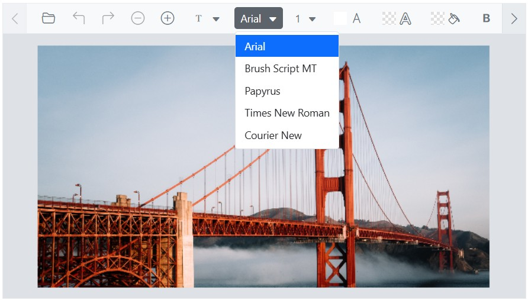
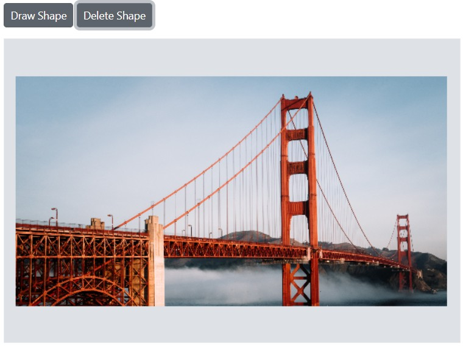

# Annotations in the Blazor Image Editor component

The [Blazor Image Editor](https://www.syncfusion.com/blazor-components/blazor-image-editor) component supports annotations including text, freehand drawings, and shapes such as rectangles, ellipses, arrows, paths, and lines. These tools enable effective visual markup for notes and sketches. Multiple annotations can be drawn simultaneously. All actions, including customizations, are tracked in the undo/redo collection to support iterative editing.

## Text annotation

The text annotation feature enables adding labels, captions, and other text elements directly on the image with customizable options.

Customization options include text content, font family, font style, font color, fill color, stroke color, stroke width, and font size.

### Add a text

The [DrawTextAsync](https://help.syncfusion.com/cr/blazor/Syncfusion.Blazor.ImageEditor.SfImageEditor.html#Syncfusion_Blazor_ImageEditor_SfImageEditor_DrawTextAsync_System_Double_System_Double_System_String_System_String_System_Int32_System_Boolean_System_Boolean_System_String_System_Boolean_System_Int32_System_String_System_String_System_Int32_) method inserts a text annotation into the image with specific customization options. Parameters:

- x - Specifies the x-coordinate of the text, determining its horizontal position within the image.

- y - Specifies the y-coordinate of the text, determining its vertical position within the image.

- text - Specifies the actual text content to be added to the image.

- fontFamily - Specifies the font family of the text.

- fontSize - Specifies the font size of the text.

- bold - Specifies whether the text is displayed in bold style. Set to true for bold text, and false for regular text.

- italic - Specifies whether the text is displayed in italic style. Set to true for italic text, and false for regular text.

- color - Specifies the font color of the text.

- isSelected - Specifies whether the text is shown in the selected state.

- degree - Specifies the degree to rotate the text.

- fillColor - Specifies the background color of the text.

- strokeColor - Specifies the outline color of the text annotation.

- strokeWidth - Specifies the outline stroke width of the text annotation.

- transformCollection - Specifies the transform collection of the text annotation.

- underline - Specifies whether the text is underlined.

- strikethrough - Specifies whether the text has a strikethrough.

By using `DrawTextAsync`, text annotations can be precisely positioned and customized to enhance clarity and presentation.

Here is an example of adding a text in a button click using `DrawTextAsync`.

```cshtml
@using Syncfusion.Blazor.ImageEditor
@using Syncfusion.Blazor.Buttons

<div style="padding-bottom: 15px">
    <SfButton OnClick="DrawTextAsync">Draw Text</SfButton>
    <SfButton OnClick="DrawTextOutlineAsync">Draw Text Outline</SfButton>
    <SfButton OnClick="DrawTextBackgroundColorAsync">Draw Text Background Color</SfButton>
</div>
<SfImageEditor @ref="ImageEditor" Toolbar="customToolbarItem" Height="400">
    <ImageEditorEvents Created="OpenAsync"></ImageEditorEvents>
</SfImageEditor>

@code {
    SfImageEditor ImageEditor;
    private List<ImageEditorToolbarItemModel> customToolbarItem = new List<ImageEditorToolbarItemModel>() { };

    private async void OpenAsync()
    {
        await ImageEditor.OpenAsync("https://ej2.syncfusion.com/react/demos/src/image-editor/images/bridge.png");
    }

    private async void DrawTextAsync()
    {
        ImageDimension Dimension = await ImageEditor.GetImageDimensionAsync();
        await ImageEditor.DrawTextAsync(Dimension.X.Value, Dimension.Y.Value, "Syncfusion");
    }
    private async void DrawTextOutlineAsync()
    {
        ImageDimension Dimension = await ImageEditor.GetImageDimensionAsync();
        await ImageEditor.DrawTextAsync(Dimension.X.Value + 50, Dimension.Y.Value + 50, "Syncfusion", "Arial", 40, false, false,
        "", false, 0, "", "green", 8);
    }
    private async void DrawTextBackgroundColorAsync()
    {
        ImageDimension Dimension = await ImageEditor.GetImageDimensionAsync();
        await ImageEditor.DrawTextAsync(Dimension.X.Value + 100, Dimension.Y.Value + 100, "Syncfusion", "Arial", 40, false,
        false, "", false, 0, "red", "", 0);
    }
}
```


### Multiline text

The [DrawTextAsync](https://help.syncfusion.com/cr/blazor/Syncfusion.Blazor.ImageEditor.SfImageEditor.html#Syncfusion_Blazor_ImageEditor_SfImageEditor_DrawTextAsync_System_Double_System_Double_System_String_System_String_System_Int32_System_Boolean_System_Boolean_System_String_System_Boolean_System_Int32_System_String_System_String_System_Int32_) method supports multiline text when the provided text contains newline characters (\n). Each line is rendered on a separate line in the annotation.

Here is an example of adding a multiline text in a button click using `DrawTextAsync`.

```cshtml
@using Syncfusion.Blazor.ImageEditor
@using Syncfusion.Blazor.Buttons

<div style="padding-bottom: 15px">
    <SfButton OnClick="DrawTextAsync">Draw MultiLine Text</SfButton>
</div>
<SfImageEditor @ref="ImageEditor" Toolbar="customToolbarItem" Height="400">
    <ImageEditorEvents Created="OpenAsync"></ImageEditorEvents>
</SfImageEditor>

@code {
    SfImageEditor ImageEditor;
    private List<ImageEditorToolbarItemModel> customToolbarItem = new List<ImageEditorToolbarItemModel>() { };

    private async void OpenAsync()
    {
        await ImageEditor.OpenAsync("https://ej2.syncfusion.com/react/demos/src/image-editor/images/bridge.png");
    }

    private async void DrawTextAsync()
    {
        ImageDimension Dimension = await ImageEditor.GetImageDimensionAsync();
        await ImageEditor.DrawTextAsync(Dimension.X.Value, Dimension.Y.Value, "Enter\nText");
    }
}
```


### Delete a text

The [DeleteShapeAsync](https://help.syncfusion.com/cr/blazor/Syncfusion.Blazor.ImageEditor.SfImageEditor.html#Syncfusion_Blazor_ImageEditor_SfImageEditor_DeleteShapeAsync_System_String_) method removes a text annotation by passing its [ID](https://help.syncfusion.com/cr/blazor/Syncfusion.Blazor.ImageEditor.ShapeSettings.html#Syncfusion_Blazor_ImageEditor_ShapeSettings_ID).

The `ID` is a unique identifier assigned to each text annotation in the Image Editor and enables targeted deletion. The [GetShapesAsync](https://help.syncfusion.com/cr/blazor/Syncfusion.Blazor.ImageEditor.SfImageEditor.html#Syncfusion_Blazor_ImageEditor_SfImageEditor_GetShapesAsync) method returns a collection of annotations represented by [ShapeSettings](https://help.syncfusion.com/cr/blazor/Syncfusion.Blazor.ImageEditor.ShapeSettings.html).

Here is an example of deleting a text in a button click using `DeleteShapeAsync`.

```cshtml
@using Syncfusion.Blazor.ImageEditor
@using Syncfusion.Blazor.Buttons

<div style="padding-bottom: 15px">
    <SfButton OnClick="DrawTextAsync">Draw Text</SfButton>
    <SfButton OnClick="DeleteShapeAsync">Delete Text</SfButton>
</div>
<SfImageEditor @ref="ImageEditor" Toolbar="customToolbarItem" Height="400">
    <ImageEditorEvents Created="OpenAsync"></ImageEditorEvents>
</SfImageEditor>

@code {
    SfImageEditor ImageEditor;
    private List<ImageEditorToolbarItemModel> customToolbarItem = new List<ImageEditorToolbarItemModel>() { };

    private async void OpenAsync()
    {
        await ImageEditor.OpenAsync("https://ej2.syncfusion.com/react/demos/src/image-editor/images/bridge.png");
    }

    private async void DrawTextAsync()
    {
        ImageDimension Dimension = await ImageEditor.GetImageDimensionAsync();
        await ImageEditor.DrawTextAsync(Dimension.X.Value, Dimension.Y.Value);
    }

    private async void DeleteShapeAsync()
    {
        await ImageEditor.DeleteShapeAsync("shape_1");
    }
}
```


### Customize font family and text color

The [ShapeChanging](https://help.syncfusion.com/cr/blazor/Syncfusion.Blazor.ImageEditor.ImageEditorEvents.html#Syncfusion_Blazor_ImageEditor_ImageEditorEvents_ShapeChanging) event triggers when a text annotation is modified through toolbar interaction. This event enables customization of text color and font family by updating the relevant properties.

Here is an example of changing the text color and font family using `ShapeChanging`.

```cshtml
@using Syncfusion.Blazor.ImageEditor

<SfImageEditor @ref="ImageEditor" Height="400">
    <ImageEditorEvents Created="OpenAsync" ShapeChanging="ShapeChanging"></ImageEditorEvents>
</SfImageEditor>

@code {
    SfImageEditor ImageEditor;
    private async void OpenAsync()
    {
        await ImageEditor.OpenAsync("https://ej2.syncfusion.com/react/demos/src/image-editor/images/bridge.png");
    }

    private void ShapeChanging(ShapeChangeEventArgs args)
    {
        if (args.CurrentShapeSettings.Type == ShapeType.Text)
        {
            args.CurrentShapeSettings.Color = "red";
            args.CurrentShapeSettings.FontFamily = "Times New Roman";
        }
    }
}
```


### Add additional font families

The [ImageEditorFontFamily](https://help.syncfusion.com/cr/blazor/Syncfusion.Blazor.ImageEditor.ImageEditorFontFamily.html) option allows adding additional font families for broader text styling choices.

Here is an example of adding additional font families using `ImageEditorFontFamily`.

```cshtml
@using Syncfusion.Blazor.ImageEditor

<SfImageEditor @ref="ImageEditor" Height="400">
    <ImageEditorFontFamily Items="@CustomItems" Default="Arial"></ImageEditorFontFamily>
    <ImageEditorEvents Created="OpenAsync"></ImageEditorEvents>
</SfImageEditor>

@code {
    SfImageEditor ImageEditor;
    private List<ImageEditorDropDownItemModel> CustomItems = new List<ImageEditorDropDownItemModel>
    {
        new ImageEditorDropDownItemModel { Text = "Arial", Value = "arial" },
        new ImageEditorDropDownItemModel { Text = "Brush Script MT", Value = "brush script mt"},
        new ImageEditorDropDownItemModel { Text = "Papyrus", Value = "papyrus" },
        new ImageEditorDropDownItemModel { Text = "Times New Roman", Value = "times new roman"},
        new ImageEditorDropDownItemModel { Text = "Courier New", Value = "courier new" }
    };
    private async void OpenAsync()
    {
        await ImageEditor.OpenAsync("https://ej2.syncfusion.com/react/demos/src/image-editor/images/bridge.png");
    }
}
```



### Formatting text with bold, italic, underline, and strikethrough

The [DrawTextAsync](https://help.syncfusion.com/cr/blazor/Syncfusion.Blazor.ImageEditor.SfImageEditor.html#Syncfusion_Blazor_ImageEditor_SfImageEditor_DrawTextAsync_System_Double_System_Double_System_String_System_String_System_Int32_System_Boolean_System_Boolean_System_String_System_Boolean_System_Int32_System_String_System_String_System_Int32_) method inserts a text annotation with customization options. Bold increases visual weight to highlight important content, italic adds slanted emphasis, underline draws a line beneath text, and strikethrough indicates removal or outdated content. These options enhance readability and emphasis.

Here is an example of adding a formatting text in a button click using `DrawTextAsync`.

```cshtml
@using Syncfusion.Blazor.ImageEditor
@using Syncfusion.Blazor.Buttons
@using Syncfusion.Blazor.SplitButtons

<SfImageEditor @ref="ImageEditor" Toolbar="customToolbarItem" Height="330" Width="550" ShowQuickAccessToolbar="false">
    <ImageEditorEvents Created="OpenAsync"></ImageEditorEvents>
</SfImageEditor>
<div class="button-toolbar">
    <SfButton CssClass="@(IsTextInsterted ? "e-disabled" : "e-primary")" Disabled="@IsTextInsterted" OnClick="AddTextAsync">Add Text</SfButton>
    <SfButtonGroup Mode="SelectionMode.Multiple">
        <ButtonGroupButton onclick="@BoldAsync" IconCss="e-icons e-bold">
            Bold
        </ButtonGroupButton>
        <ButtonGroupButton onclick="@ItalicAsync" IconCss="e-icons e-italic">
            Italic
        </ButtonGroupButton>
        <ButtonGroupButton onclick="@UnderlineAsync" IconCss="e-icons e-underline">
            Underline
        </ButtonGroupButton>
        <ButtonGroupButton onclick="@StrikethroughAsync" IconCss="e-icons e-strikethrough">
            Strikethrough
        </ButtonGroupButton>
    </SfButtonGroup>
</div>
<style>
    .button-toolbar {
        display: flex;
        align-items: center;
        gap: 12px;
        flex-wrap: nowrap;
        margin-top: 10px;
    }
</style>

@code {
    SfImageEditor ImageEditor;
    Boolean IsTextInsterted = false;
    private List<ImageEditorToolbarItemModel> customToolbarItem = new List<ImageEditorToolbarItemModel>() { };

    private async void OpenAsync()
    {
        await ImageEditor.OpenAsync("https://ej2.syncfusion.com/react/demos/src/image-editor/images/bridge.png");
    }

    private async void AddTextAsync()
    {
        if (!IsTextInsterted)
        {
            IsTextInsterted = true;
            ImageDimension Dimension = await ImageEditor.GetImageDimensionAsync();
            await ImageEditor.DrawTextAsync(Dimension.X.Value, Dimension.Y.Value, "Syncfusion");
        }
    }
    private async void BoldAsync()
    {
        ShapeSettings[] shapes = await ImageEditor.GetShapesAsync();
        if (shapes != null && shapes.Length > 0)
        {
            var shape = shapes[0];
            var fontStyles = shape.FontStyle?.ToList();

            if (fontStyles.Contains("bold"))
            {
                fontStyles.Remove("bold");
            }
            else
            {
                fontStyles.Add("bold");
            }

            shape.FontStyle = fontStyles.ToArray();
            await ImageEditor.UpdateShapeAsync(shapes[0]);
        }
    }
    private async void ItalicAsync()
    {
        ShapeSettings[] shapes = await ImageEditor.GetShapesAsync();
        if (shapes != null && shapes.Length > 0)
        {
            var shape = shapes[0];
            var fontStyles = shape.FontStyle?.ToList();

            if (fontStyles.Contains("italic"))
            {
                fontStyles.Remove("italic");
            }
            else
            {
                fontStyles.Add("italic");
            }

            shape.FontStyle = fontStyles.ToArray();
            await ImageEditor.UpdateShapeAsync(shapes[0]);
        }
    }
    private async void UnderlineAsync()
    {
        ShapeSettings[] shapes = await ImageEditor.GetShapesAsync();
        if (shapes != null && shapes.Length > 0)
        {
            var shape = shapes[0];
            var fontStyles = shape.FontStyle?.ToList();

            if (fontStyles.Contains("underline"))
            {
                fontStyles.Remove("underline");
            }
            else
            {
                fontStyles.Add("underline");
            }

            shape.FontStyle = fontStyles.ToArray();
            await ImageEditor.UpdateShapeAsync(shapes[0]);
        }
    }
    private async void StrikethroughAsync()
    {
        ShapeSettings[] shapes = await ImageEditor.GetShapesAsync();
        if (shapes != null && shapes.Length > 0)
        {
            var shape = shapes[0];
            var fontStyles = shape.FontStyle?.ToList();

            if (fontStyles.Contains("strikethrough"))
            {
                fontStyles.Remove("strikethrough");
            }
            else
            {
                fontStyles.Add("strikethrough");
            }

            shape.FontStyle = fontStyles.ToArray();
            await ImageEditor.UpdateShapeAsync(shapes[0]);
        }
    }
}
```


## Freehand drawing

The Freehand Draw annotation tool enables drawing and sketching directly on the image using mouse or touch input.

Freehand drawing can be enabled or disabled using the following methods:

- [EnableFreehandDrawAsync](https://help.syncfusion.com/cr/blazor/Syncfusion.Blazor.ImageEditor.SfImageEditor.html#Syncfusion_Blazor_ImageEditor_SfImageEditor_EnableFreehandDrawAsync) - Enables freehand drawing.

- [DisableFreehandDrawAsync](https://help.syncfusion.com/cr/blazor/Syncfusion.Blazor.ImageEditor.SfImageEditor.html#Syncfusion_Blazor_ImageEditor_SfImageEditor_DisableFreehandDrawAsync) - Disables freehand drawing.

Here is an example of using `EnableFreehandDrawAsync` and `DisableFreehandDrawAsync` in button click events.

```cshtml
@using Syncfusion.Blazor.ImageEditor
@using Syncfusion.Blazor.Buttons

<div style="padding-bottom: 15px">
    <SfButton OnClick="EnableFreehandDrawAsync">Enable Freehand Draw</SfButton>
    <SfButton OnClick="DisableFreehandDrawAsync">Disable Freehand Draw</SfButton>
</div>
<SfImageEditor @ref="ImageEditor" Toolbar="customToolbarItem" Height="400">
    <ImageEditorEvents Created="OpenAsync"></ImageEditorEvents>
</SfImageEditor>

@code {
    SfImageEditor ImageEditor;
    private List<ImageEditorToolbarItemModel> customToolbarItem = new List<ImageEditorToolbarItemModel>() { };
    private async void OpenAsync()
    {
        await ImageEditor.OpenAsync("https://ej2.syncfusion.com/react/demos/src/image-editor/images/bridge.png");
    }
    private async void EnableFreehandDrawAsync()
    {
        await ImageEditor.EnableFreehandDrawAsync();
    }
    private async void DisableFreehandDrawAsync()
    {
        await ImageEditor.DisableFreehandDrawAsync();
    }
}
```


### Adjust stroke width and color

The [ShapeChanging](https://help.syncfusion.com/cr/blazor/Syncfusion.Blazor.ImageEditor.ImageEditorEvents.html#Syncfusion_Blazor_ImageEditor_ImageEditorEvents_ShapeChanging) event triggers when a freehand annotation is modified through toolbar interaction. Use this event to update stroke color and stroke width.

Here is an example of changing the freehand draw stroke width and color using `ShapeChanging`.

```cshtml
@using Syncfusion.Blazor.ImageEditor

<SfImageEditor @ref="ImageEditor" Height="400">
    <ImageEditorEvents Created="OpenAsync" ShapeChanging="ShapeChanging"></ImageEditorEvents>
</SfImageEditor>

@code {
    SfImageEditor ImageEditor;
    private async void OpenAsync()
    {
        await ImageEditor.OpenAsync("https://ej2.syncfusion.com/react/demos/src/image-editor/images/bridge.png");
    }
    private void ShapeChanging(ShapeChangeEventArgs args)
    {
        if (args.CurrentShapeSettings.Type == ShapeType.FreehandDraw)
        {
            args.CurrentShapeSettings.StrokeColor = "red";
            args.CurrentShapeSettings.StrokeWidth = 5;
        }
    }
}
```


### Delete a freehand drawing

The [DeleteShapeAsync](https://help.syncfusion.com/cr/blazor/Syncfusion.Blazor.ImageEditor.SfImageEditor.html#Syncfusion_Blazor_ImageEditor_SfImageEditor_DeleteShapeAsync_System_String_) method removes a freehand annotation by passing its [ID](https://help.syncfusion.com/cr/blazor/Syncfusion.Blazor.ImageEditor.ShapeSettings.html#Syncfusion_Blazor_ImageEditor_ShapeSettings_ID). The `ID` uniquely identifies each freehand annotation and enables targeted deletion. The [GetShapesAsync](https://help.syncfusion.com/cr/blazor/Syncfusion.Blazor.ImageEditor.SfImageEditor.html#Syncfusion_Blazor_ImageEditor_SfImageEditor_GetShapesAsync) method returns a collection of annotations represented by [ShapeSettings](https://help.syncfusion.com/cr/blazor/Syncfusion.Blazor.ImageEditor.ShapeSettings.html).

Here is an example of deleting a freehand annotation in a button click using `DeleteShapeAsync`.

```cshtml
@using Syncfusion.Blazor.ImageEditor
@using Syncfusion.Blazor.Buttons

<div style="padding-bottom: 15px">
    <SfButton OnClick="EnableFreehandDrawAsync">Enable Freehand Draw</SfButton>
    <SfButton OnClick="DeleteShapeAsync">Delete Shape</SfButton>
</div>
<SfImageEditor @ref="ImageEditor" Toolbar="customToolbarItem" Height="400">
    <ImageEditorEvents Created="OpenAsync"></ImageEditorEvents>
</SfImageEditor>

@code {
    SfImageEditor ImageEditor;
    private List<ImageEditorToolbarItemModel> customToolbarItem = new List<ImageEditorToolbarItemModel>() { };
    private async void OpenAsync()
    {
        await ImageEditor.OpenAsync("https://ej2.syncfusion.com/react/demos/src/image-editor/images/bridge.png");
    }
    private async void EnableFreehandDrawAsync()
    {
        await ImageEditor.EnableFreehandDrawAsync();
    }
    private async void DeleteShapeAsync()
    {
        await ImageEditor.DeleteShapeAsync("pen_1");
    }
}
```


## Shape annotation

The Image Editor provides the ability to add shape annotations including rectangles, ellipses, arrows, paths, and lines.

### Add a rectangle / ellipse / line / arrow / path

The [DrawRectangleAsync](https://help.syncfusion.com/cr/blazor/Syncfusion.Blazor.ImageEditor.SfImageEditor.html#Syncfusion_Blazor_ImageEditor_SfImageEditor_DrawRectangleAsync_System_Double_System_Double_System_Int32_System_Int32_System_Int32_System_String_System_String_System_Double_System_Boolean_System_Double_) method draws a rectangle.

Parameters:

- x - Specifies the x-coordinate of the top-left corner.

- y - Specifies the y-coordinate of the top-left corner.

- width - Specifies the width of the rectangle.

- height - Specifies the height of the rectangle.

- strokeWidth - Specifies the stroke width of the border.

- strokeColor - Specifies the stroke color of the border.

- fillColor - Specifies the fill color of the rectangle.

- degree - Specifies the degree to rotate the rectangle.

- isSelected - Specifies whether the rectangle is shown in the selected state.

- borderRadius - Specifies the radius to apply border radius to the rectangle.

The [DrawEllipseAsync](https://help.syncfusion.com/cr/blazor/Syncfusion.Blazor.ImageEditor.SfImageEditor.html#Syncfusion_Blazor_ImageEditor_SfImageEditor_DrawEllipseAsync_System_Double_System_Double_System_Double_System_Double_System_Double_System_String_System_String_System_Double_System_Boolean_) method draws an ellipse.

Parameters:

- x - Specifies the x-coordinate of the center of the ellipse.

- y - Specifies the y-coordinate of the center of the ellipse.

- radiusX - Specifies the horizontal radius of the ellipse.

- radiusY - Specifies the vertical radius of the ellipse.

- strokeWidth - Specifies the width of the ellipse stroke.

- strokeColor - Specifies the color of the ellipse stroke.

- fillColor - Specifies the fill color of the ellipse.

- degree - Specifies the degree to rotate the ellipse.

- isSelected - Specifies whether the ellipse is shown in the selected state.

The [DrawLineAsync](https://help.syncfusion.com/cr/blazor/Syncfusion.Blazor.ImageEditor.SfImageEditor.html#Syncfusion_Blazor_ImageEditor_SfImageEditor_DrawLineAsync_System_Double_System_Double_System_Double_System_Double_System_Double_System_String_System_Boolean_) method draws a line.

Parameters:

- startX - Specifies the x-coordinate of the start point.

- startY - Specifies the y-coordinate of the start point.

- endX - Specifies the x-coordinate of the end point.

- endY - Specifies the y-coordinate of the end point.

- strokeWidth - Specifies the stroke width of the line.

- strokeColor - Specifies the stroke color of the line.

- isSelected - Specifies whether the line is shown in the selected state.

The [DrawArrowAsync](https://help.syncfusion.com/cr/blazor/Syncfusion.Blazor.ImageEditor.SfImageEditor.html#Syncfusion_Blazor_ImageEditor_SfImageEditor_DrawArrowAsync_System_Double_System_Double_System_Double_System_Double_System_Double_System_String_Syncfusion_Blazor_ImageEditor_ImageEditorArrowHeadType_Syncfusion_Blazor_ImageEditor_ImageEditorArrowHeadType_System_Boolean_) method draws an arrow.

Parameters:

- startX - Specifies the x-coordinate of the start point.

- startY - Specifies the y-coordinate of the start point.

- endX - Specifies the x-coordinate of the end point.

- endY - Specifies the y-coordinate of the end point.

- strokeWidth - Specifies the stroke width of the arrow.

- strokeColor - Specifies the stroke color of the arrow.

- arrowStart - Specifies the arrowhead type at the start of the arrow.

- arrowEnd - Specifies the arrowhead type at the end of the arrow.

- isSelected - Specifies whether the arrow is shown in the selected state.

The [DrawPathAsync](https://help.syncfusion.com/cr/blazor/Syncfusion.Blazor.ImageEditor.SfImageEditor.html#Syncfusion_Blazor_ImageEditor_SfImageEditor_DrawPathAsync_Syncfusion_Blazor_ImageEditor_ImageEditorPoint___System_Double_System_String_System_Boolean_) method draws a path.

Parameters:

- points - Specifies a collection of coordinates `ImageEditorPoint` to draw a path.

- strokeWidth - Specifies the stroke width of the path.

- strokeColor - Specifies the stroke color of the path.

- isSelected - Specifies whether the path is shown in the selected state.

Here is an example of inserting rectangle, ellipse, arrow, path, and line in button click events.

```cshtml
@using Syncfusion.Blazor.ImageEditor
@using Syncfusion.Blazor.Buttons

<div style="padding-bottom: 15px">
    <SfButton OnClick="RectangleAsync">Draw Rectangle</SfButton>
    <SfButton OnClick="EllipseAsync">Draw Ellipse</SfButton>
    <SfButton OnClick="LineAsync">Draw Line</SfButton>
    <SfButton OnClick="ArrowAsync">Draw Arrow</SfButton>
    <SfButton OnClick="PathAsync">Draw Path</SfButton>
</div>

<SfImageEditor @ref="ImageEditor" Toolbar="customToolbarItem" Height="400">
    <ImageEditorEvents Created="CreatedAsync"></ImageEditorEvents>
</SfImageEditor>

@code {
    SfImageEditor ImageEditor;
    private List<ImageEditorToolbarItemModel> customToolbarItem = new List<ImageEditorToolbarItemModel>() { };
    private async void CreatedAsync()
    {
        await ImageEditor.OpenAsync("https://ej2.syncfusion.com/react/demos/src/image-editor/images/bridge.png");
    }
    private async void RectangleAsync()
    {
        ImageDimension Dimension = await ImageEditor.GetImageDimensionAsync();
        await ImageEditor.DrawRectangleAsync(Dimension.X.Value + 10, Dimension.Y.Value + 60, 150, 70);
        await ImageEditor.DrawRectangleAsync(Dimension.X.Value + 250, Dimension.Y.Value + 60, 150, 70, 2, "", "", 0, false, 8);
    }
    private async void EllipseAsync()
    {
        ImageDimension Dimension = await ImageEditor.GetImageDimensionAsync();
        await ImageEditor.DrawEllipseAsync(Dimension.X.Value, Dimension.Y.Value + 200);
    }
    private async void ArrowAsync()
    {
        ImageDimension Dimension = await ImageEditor.GetImageDimensionAsync();
        await ImageEditor.DrawArrowAsync(Dimension.X.Value + 150, Dimension.Y.Value + 150, Dimension.X.Value + 300,
        Dimension.Y.Value + 150, 10);
    }
    private async Task PathAsync()
    {
        ImageDimension dimension = await ImageEditor.GetImageDimensionAsync();
        ImageEditorPoint[] points = new ImageEditorPoint[]
        {
            new ImageEditorPoint { X = dimension.X.Value, Y = dimension.Y.Value },
            new ImageEditorPoint { X = dimension.X.Value + 50, Y = dimension.Y.Value + 50 },
            new ImageEditorPoint { X = dimension.X.Value + 20, Y = dimension.Y.Value + 50 }
        };
        await ImageEditor.DrawPathAsync(points, 8);
    }
    private async void LineAsync()
    {
        ImageDimension Dimension = await ImageEditor.GetImageDimensionAsync();
        await ImageEditor.DrawLineAsync(Dimension.X.Value + 100, Dimension.Y.Value + 50, Dimension.X.Value + 300,
        Dimension.Y.Value + 50);
    }
}
```


### Delete a shape

The [DeleteShapeAsync](https://help.syncfusion.com/cr/blazor/Syncfusion.Blazor.ImageEditor.SfImageEditor.html#Syncfusion_Blazor_ImageEditor_SfImageEditor_DeleteShapeAsync_System_String_) method removes a shape annotation by passing its [ID](https://help.syncfusion.com/cr/blazor/Syncfusion.Blazor.ImageEditor.ShapeSettings.html#Syncfusion_Blazor_ImageEditor_ShapeSettings_ID). The `ID` uniquely identifies each shape annotation and enables targeted deletion. The [GetShapesAsync](https://help.syncfusion.com/cr/blazor/Syncfusion.Blazor.ImageEditor.SfImageEditor.html#Syncfusion_Blazor_ImageEditor_SfImageEditor_GetShapesAsync) method returns a collection of annotations represented by [ShapeSettings](https://help.syncfusion.com/cr/blazor/Syncfusion.Blazor.ImageEditor.ShapeSettings.html).

Here is an example of deleting ellipse in a button click event.

```cshtml
@using Syncfusion.Blazor.ImageEditor
@using Syncfusion.Blazor.Buttons

<div style="padding-bottom: 15px">
    <SfButton OnClick="DrawShapeAsync">Draw Shape</SfButton>
    <SfButton OnClick="DeleteShapeAsync">Delete Shape</SfButton>
</div>
<SfImageEditor @ref="ImageEditor" Toolbar="customToolbarItem" Height="400" width="600px">
    <ImageEditorEvents Created="OpenAsync"></ImageEditorEvents>
</SfImageEditor>

@code {
    SfImageEditor ImageEditor;
    private List<ImageEditorToolbarItemModel> customToolbarItem = new List<ImageEditorToolbarItemModel>() { };
    private async void OpenAsync()
    {
        await ImageEditor.OpenAsync("https://ej2.syncfusion.com/react/demos/src/image-editor/images/bridge.png");
    }
    private async void DrawShapeAsync()
    {
        ImageDimension Dimension = await ImageEditor.GetImageDimensionAsync();
        await ImageEditor.DrawEllipseAsync(Dimension.X.Value + 50, Dimension.Y.Value + 50);
    }
    private async void DeleteShapeAsync()
    {
        await ImageEditor.DeleteShapeAsync("shape_1");
    }
}
```



### Customize default stroke color for shapes

Default settings are provided for stroke color, stroke width, fill color, and other options. To modify only the default options while preserving previously selected customizations, handle the [ShapeChanging](https://help.syncfusion.com/cr/blazor/Syncfusion.Blazor.ImageEditor.ImageEditorEvents.html#Syncfusion_Blazor_ImageEditor_ImageEditorEvents_ShapeChanging) event and update values in [CurrentShapeSettings](https://help.syncfusion.com/cr/blazor/Syncfusion.Blazor.ImageEditor.ShapeChangeEventArgs.html#Syncfusion_Blazor_ImageEditor_ShapeChangeEventArgs_CurrentShapeSettings). This approach conditionally updates defaults while maintaining other settings.

```cshtml
@using Syncfusion.Blazor.ImageEditor

<SfImageEditor @ref="ImageEditor" Height="400">
    <ImageEditorEvents Created="CreatedAsync" ShapeChanging="ShapeChangingAsync"></ImageEditorEvents>
</SfImageEditor> 

@code {
    SfImageEditor ImageEditor;
    private async void CreatedAsync()
    {
        await ImageEditor.OpenAsync("https://ej2.syncfusion.com/react/demos/src/image-editor/images/bridge.png");
    }
    private void ShapeChangingAsync(ShapeChangeEventArgs args)
    {
        if (args.Action == "insert" && args.CurrentShapeSettings?.Type == ShapeType.Rectangle)
        {
            args.CurrentShapeSettings.StrokeColor = "red";
        }
    }
}
```


## Image annotation

Image annotation enables inserting and customizing images or icons directly on the image. Options include rotate, flip, and transparency.

### Add an image annotation

The [DrawImageAsync](https://help.syncfusion.com/cr/blazor/Syncfusion.Blazor.ImageEditor.SfImageEditor.html#Syncfusion_Blazor_ImageEditor_SfImageEditor_DrawImageAsync_System_String_System_Double_System_Double_System_Int32_System_Int32_System_Boolean_System_Double_System_Double_System_Boolean_) method inserts an image for adding logos, watermarks, or decorative elements.

Parameters:

- data - Specifies the image data or URL of the image to be inserted.

- x - Specifies the x-coordinate of the top-left corner of the image.

- y - Specifies the y-coordinate of the top-left corner of the image.

- width - Specifies the width of the image.

- height - Specifies the height of the image.

- isAspectRatio - Specifies whether the image maintains aspect ratio.

- degree - Specifies the degree to rotate the image.

- opacity - Specifies the opacity value for the image.

- isSelected - Specifies whether the image is shown in the selected state.

Here is an example of adding a image in a button click using `DrawImageAsync`.

```cshtml
@using Syncfusion.Blazor.ImageEditor
@using Syncfusion.Blazor.Buttons

<div style="padding-bottom: 15px">
    <SfButton OnClick="DrawImageAsync">Add Image</SfButton>
</div>
<SfImageEditor @ref="ImageEditor" Toolbar="customToolbarItem" Height="400">
    <ImageEditorEvents Created="CreatedAsync"></ImageEditorEvents>
</SfImageEditor>

@code {
    SfImageEditor ImageEditor;
    private List<ImageEditorToolbarItemModel> customToolbarItem = new List<ImageEditorToolbarItemModel>() { };
    private async void CreatedAsync()
    {
        await ImageEditor.OpenAsync("https://ej2.syncfusion.com/react/demos/src/image-editor/images/bridge.png");
    }
    private async void DrawImageAsync()
    {
        ImageDimension Dimension = await ImageEditor.GetImageDimensionAsync();
        await ImageEditor.DrawImageAsync("https://ej2.syncfusion.com/react/demos/src/image-editor/images/flower.png",
        Dimension.X.Value, Dimension.Y.Value, 200, 200, true);
    }
}
```


## Show or hide the annotation options

Using the [Toolbar](https://help.syncfusion.com/cr/blazor/Syncfusion.Blazor.ImageEditor.SfImageEditor.html#Syncfusion_Blazor_ImageEditor_SfImageEditor_Toolbar) property, annotation options can be shown or hidden from the annotation dropdown.

```cshtml
@using Syncfusion.Blazor.ImageEditor

<SfImageEditor Height="400" Toolbar="CustomToolbarItem" @ref="ImageEditor">
    <ImageEditorEvents Created="Created"></ImageEditorEvents>
</SfImageEditor>

@code {
    private SfImageEditor ImageEditor;
    private List<ImageEditorToolbarItemModel> CustomToolbarItem = new List<ImageEditorToolbarItemModel>
    {
        new ImageEditorToolbarItemModel { Name = "Open"},
        new ImageEditorToolbarItemModel { Name = "Zoom"},
        new ImageEditorToolbarItemModel { Name = "Crop"},
        new ImageEditorToolbarItemModel { Name = "Annotation"},
        new ImageEditorToolbarItemModel { Name = "Pen"},
        new ImageEditorToolbarItemModel { Name = "Line"},
        new ImageEditorToolbarItemModel { Name = "Ellipse"},
        new ImageEditorToolbarItemModel { Name = "Path"},
        new ImageEditorToolbarItemModel { Name = "Arrow"},
        new ImageEditorToolbarItemModel { Name = "Finetune"},
        new ImageEditorToolbarItemModel { Name = "Filter"},
        new ImageEditorToolbarItemModel { Name = "Frame"},
        new ImageEditorToolbarItemModel { Name = "Resize"},
        new ImageEditorToolbarItemModel { Name = "Reset"},
        new ImageEditorToolbarItemModel { Name = "Save"}
    };
    private async void Created()
    {
        await ImageEditor.OpenAsync("https://ej2.syncfusion.com/react/demos/src/image-editor/images/bridge.png");
    }
}

```


## See Also

- [Identify Inserted Annotations](https://support.syncfusion.com/kb/article/21449/how-to-identify-inserted-annotations-in-blazor-image-editor)
