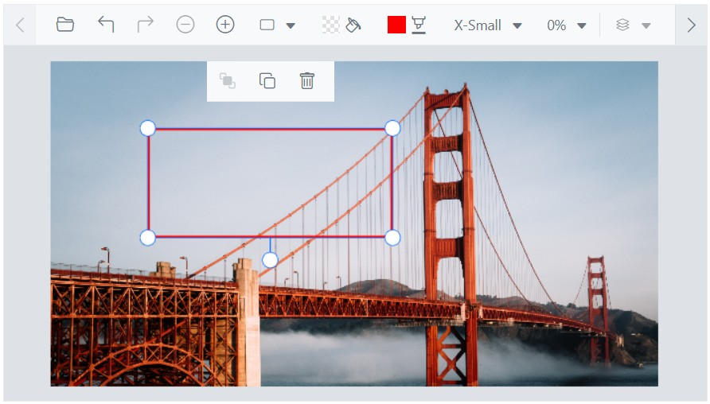

# Annotations in the Blazor Image Editor component

The [Blazor Image Editor](https://www.syncfusion.com/blazor-components/blazor-image-editor) component allows adding annotations to the image, including text, freehand drawings, and shapes like rectangles, ellipses, arrows, paths, and lines. This gives the flexibility to mark up the image with notes, sketches, and other visual elements as needed. These annotation tools can help to communicate and share ideas more effectively. Users are allowed to draw multiple annotations simultaneously, enhancing creative flexibility. Furthermore, every action, including customizations, will be tracked in the undo/redo collection, ensuring a seamless user experience and making it easier to experiment with different designs.

## Text annotation

Text annotation feature in the Blazor Image Editor component provides the capability to add and customize labels, captions, and other text elements directly onto the image. With this feature, you can easily insert text at specific locations within the image and customize various aspects of the text to meet your requirements.

You have control over the customization options including text content, font family, font style, font color, fill color, stroke color, stroke width and font size for the text annotation.

### Add a text

The [`DrawTextAsync`](https://help.syncfusion.com/cr/blazor/Syncfusion.Blazor.ImageEditor.SfImageEditor.html#Syncfusion_Blazor_ImageEditor_SfImageEditor_DrawTextAsync_System_Double_System_Double_System_String_System_String_System_Int32_System_Boolean_System_Boolean_System_String_System_Boolean_System_Int32_System_String_System_String_System_Int32_) method in the Blazor Image Editor component allows you to insert a text annotation into the image with specific customization options. This method accepts the following parameters:

* x - Specifies the x-coordinate of the text, determining its horizontal position within the image.

* y - Specifies the y-coordinate of the text, determining its vertical position within the image.

* text - Specifies the actual text content to be added to the image.

* fontFamily - Specifies the font family of the text, allowing you to choose a specific typeface or style for the text.

* fontSize - Specifies the font size of the text, determining its relative size within the image.

* bold - Specifies whether the text should be displayed in bold style. Set to true for bold text, and false for regular text.

* italic - Specifies whether the text should be displayed in italic style. Set to true for italic text, and false for regular text.

* color - Specifies the font color of the text, allowing you to define the desired color using appropriate color values or names.

* isSelected: Specifies to show the text in the selected state.

* degree: Specifies the degree to rotate the text.

* fillColor: Specifies the background color of the text.

* strokeColor: Specifies the outline color of the text annotation.

* strokeWidth: Specifies the outline stroke width of the text annotation.

* transformCollection: Specifies the transform collection of the text annotation.

* underline — Specifies whether the text should be underlined.

* strikethrough — Specifies whether the text should have a strikethrough.

By utilizing the `DrawTextAsync` method with these parameters, you can precisely position and customize text annotations within the image. This provides the flexibility to add labels, captions, or other text elements with specific font styles, sizes, and colors, enhancing the visual presentation and clarity of the image. 

Here is an example of adding a text in a button click using `DrawTextAsync` method. 

In the following example, you can using the DrawTextAsync method in the button click event.

```cshtml
@using Syncfusion.Blazor.ImageEditor
@using Syncfusion.Blazor.Buttons

<div style="padding-bottom: 15px">
    <SfButton OnClick="DrawTextAsync">Draw Text</SfButton>
    <SfButton OnClick="DrawTextOutlineAsync">Draw Text Outline</SfButton>
    <SfButton OnClick="DrawTextBackgroundColorAsync">Draw Text Background Color</SfButton>
</div>
<SfImageEditor @ref="ImageEditor" Toolbar="customToolbarItem" Height="400">
    <ImageEditorEvents Created="OpenAsync"></ImageEditorEvents>
</SfImageEditor>

@code {
    SfImageEditor ImageEditor;
    private List<ImageEditorToolbarItemModel> customToolbarItem = new List<ImageEditorToolbarItemModel>() { };

    private async void OpenAsync()
    {
        await ImageEditor.OpenAsync("https://ej2.syncfusion.com/react/demos/src/image-editor/images/bridge.png");
    }

    private async void DrawTextAsync()
    {
        ImageDimension Dimension = await ImageEditor.GetImageDimensionAsync();
        await ImageEditor.DrawTextAsync(Dimension.X.Value, Dimension.Y.Value, "Syncfusion");
    }
    private async void DrawTextOutlineAsync()
    {
        ImageDimension Dimension = await ImageEditor.GetImageDimensionAsync();
        await ImageEditor.DrawTextAsync(Dimension.X.Value + 50, Dimension.Y.Value + 50, "Syncfusion", "Arial", 40, false, false,
        "", false, 0, "", "green", 8);
    }
    private async void DrawTextBackgroundColorAsync()
    {
        ImageDimension Dimension = await ImageEditor.GetImageDimensionAsync();
        await ImageEditor.DrawTextAsync(Dimension.X.Value + 100, Dimension.Y.Value + 100, "Syncfusion", "Arial", 40, false,
        false, "", false, 0, "red", "", 0);
    }
}
```


### Multiline text

The [`DrawTextAsync`](https://help.syncfusion.com/cr/blazor/Syncfusion.Blazor.ImageEditor.SfImageEditor.html#Syncfusion_Blazor_ImageEditor_SfImageEditor_DrawTextAsync_System_Double_System_Double_System_String_System_String_System_Int32_System_Boolean_System_Boolean_System_String_System_Boolean_System_Int32_System_String_System_String_System_Int32_) method in the Blazor Image Editor component is commonly used to insert text annotations into an image. If the provided text parameter contains a newline character (\n), the text will be automatically split into multiple lines, with each line appearing on a separate line in the annotation. 

Here is an example of adding a multiline text in a button click using `DrawTextAsync` method.

```cshtml
@using Syncfusion.Blazor.ImageEditor
@using Syncfusion.Blazor.Buttons

<div style="padding-bottom: 15px">
    <SfButton OnClick="DrawTextAsync">Draw MultiLine Text</SfButton>
</div>
<SfImageEditor @ref="ImageEditor" Toolbar="customToolbarItem" Height="400">
    <ImageEditorEvents Created="OpenAsync"></ImageEditorEvents>
</SfImageEditor>

@code {
    SfImageEditor ImageEditor;
    private List<ImageEditorToolbarItemModel> customToolbarItem = new List<ImageEditorToolbarItemModel>() { };

    private async void OpenAsync()
    {
        await ImageEditor.OpenAsync("https://ej2.syncfusion.com/react/demos/src/image-editor/images/bridge.png");
    }

    private async void DrawTextAsync()
    {
        ImageDimension Dimension = await ImageEditor.GetImageDimensionAsync();
        await ImageEditor.DrawTextAsync(Dimension.X.Value, Dimension.Y.Value, "Enter\nText");
    }
}
```


### Delete a text

The [`DeleteShapeAsync`](https://help.syncfusion.com/cr/blazor/Syncfusion.Blazor.ImageEditor.SfImageEditor.html#Syncfusion_Blazor_ImageEditor_SfImageEditor_DeleteShapeAsync_System_String_) method allows you to remove a text annotation from the Blazor Image Editor component. To use this method, you need to pass the [`ID`](https://help.syncfusion.com/cr/blazor/Syncfusion.Blazor.ImageEditor.ShapeSettings.html#Syncfusion_Blazor_ImageEditor_ShapeSettings_ID) of the annotation as a parameter. 

The `ID` is a unique identifier assigned to each text annotation within the Blazor Image Editor. It serves as a reference to a specific annotation, enabling targeted deletion of the desired text element. By specifying the `ID` associated with the text annotation you want to remove, you can effectively delete it from the image editor.

To retrieve the inserted text annotations, you can utilize the [`GetShapesAsync`](https://help.syncfusion.com/cr/blazor/Syncfusion.Blazor.ImageEditor.SfImageEditor.html#Syncfusion_Blazor_ImageEditor_SfImageEditor_GetShapesAsync) method, which provides a collection of annotations represented by [`ShapeSettings`](https://help.syncfusion.com/cr/blazor/Syncfusion.Blazor.ImageEditor.ShapeSettings.html). This method allows you to access and work with the annotations that have been inserted into the image.

Here is an example of deleting a text in a button click using `DeleteShapeAsync` method. 

```cshtml
@using Syncfusion.Blazor.ImageEditor
@using Syncfusion.Blazor.Buttons

<div style="padding-bottom: 15px">
    <SfButton OnClick="DrawTextAsync">Draw Text</SfButton>
    <SfButton OnClick="DeleteShapeAsync">Delete Text</SfButton>
</div>
<SfImageEditor @ref="ImageEditor" Toolbar="customToolbarItem" Height="400">
    <ImageEditorEvents Created="OpenAsync"></ImageEditorEvents>
</SfImageEditor>

@code {
    SfImageEditor ImageEditor;
    private List<ImageEditorToolbarItemModel> customToolbarItem = new List<ImageEditorToolbarItemModel>() { };

    private async void OpenAsync()
    {
        await ImageEditor.OpenAsync("https://ej2.syncfusion.com/react/demos/src/image-editor/images/bridge.png");
    }

    private async void DrawTextAsync()
    {
        ImageDimension Dimension = await ImageEditor.GetImageDimensionAsync();
        await ImageEditor.DrawTextAsync(Dimension.X.Value, Dimension.Y.Value);
    }

    private async void DeleteShapeAsync()
    {
        await ImageEditor.DeleteShapeAsync("shape_1");
    }
}
```


### Customize font family and text color

The [`ShapeChanging`](https://help.syncfusion.com/cr/blazor/Syncfusion.Blazor.ImageEditor.ImageEditorEvents.html#Syncfusion_Blazor_ImageEditor_ImageEditorEvents_ShapeChanging) event in the Blazor Image Editor component is triggered when a text annotation is being modified or changed through the toolbar interaction. This event provides an opportunity to make alterations to the text's color and font family by adjusting the relevant properties. 

By leveraging the `ShapeChanging` event, you can enhance the customization options for text annotations and provide a more tailored and interactive experience within the Image Editor component. 

Here is an example of changing the text color using the `ShapeChanging` event.

```cshtml
@using Syncfusion.Blazor.ImageEditor

<SfImageEditor @ref="ImageEditor" Height="400">
    <ImageEditorEvents Created="OpenAsync" ShapeChanging="ShapeChanging"></ImageEditorEvents>
</SfImageEditor>

@code {
    SfImageEditor ImageEditor;
    private async void OpenAsync()
    {
        await ImageEditor.OpenAsync("https://ej2.syncfusion.com/react/demos/src/image-editor/images/bridge.png");
    }

    private void ShapeChanging(ShapeChangeEventArgs args)
    {
        if (args.CurrentShapeSettings.Type == ShapeType.Text)
        {
            args.CurrentShapeSettings.Color = "red";
            args.CurrentShapeSettings.FontFamily = "Times New Roman";
        }
    }
}
```


### Add additional font family

The [`ImageEditorFontFamily`](https://help.syncfusion.com/cr/blazor/Syncfusion.Blazor.ImageEditor.ImageEditorFontFamily.html) option in the Blazor Image Editor component provides the flexibility to incorporate supplementary font families, expanding your options for text styling and ensuring a broader range of fonts can be utilized within your design or content.

This enhancement offers a more personalized and dynamic interaction, empowering users to tailor their text styles for a truly engaging editing experience.

Here is an example of adding additional font family using the `ImageEditorFontFamily` options in an image editor component.

```cshtml
@using Syncfusion.Blazor.ImageEditor
@using Syncfusion.Blazor.Buttons

<SfImageEditor @ref="ImageEditor" Height="400">
    <ImageEditorFontFamily Items="@CustomItems" Default="Arial"></ImageEditorFontFamily>
    <ImageEditorEvents Created="OpenAsync"></ImageEditorEvents>
</SfImageEditor>

@code {
    SfImageEditor ImageEditor;
    private List<ImageEditorDropDownItemModel> CustomItems = new List<ImageEditorDropDownItemModel>
    {
        new ImageEditorDropDownItemModel { Text = "Arial", Value = "arial" },
        new ImageEditorDropDownItemModel { Text = "Brush Script MT", Value = "brush script mt"},
        new ImageEditorDropDownItemModel { Text = "Papyrus", Value = "papyrus" },
        new ImageEditorDropDownItemModel { Text = "Times New Roman", Value = "times new roman"},
        new ImageEditorDropDownItemModel { Text = "Courier New", Value = "courier new" }
    };
    private async void OpenAsync()
    {
        await ImageEditor.OpenAsync("https://ej2.syncfusion.com/react/demos/src/image-editor/images/bridge.png");
    }
}
```


### Formatting Text with Bold, Italic, Underline, and Strikethrough

The [`DrawTextAsync`](https://help.syncfusion.com/cr/blazor/Syncfusion.Blazor.ImageEditor.SfImageEditor.html#Syncfusion_Blazor_ImageEditor_SfImageEditor_DrawTextAsync_System_Double_System_Double_System_String_System_String_System_Int32_System_Boolean_System_Boolean_System_String_System_Boolean_System_Int32_System_String_System_String_System_Int32_) method in the Blazor Image Editor component allows you to insert a text annotation into the image with specific customization options. Applying these styles enhances the text by improving readability and emphasizing key information, where bold increases visual weight to highlight important points, italic adds a slanted emphasis or creative touch, underline draws a line beneath the text for clarity or separation, and strikethrough places a line through text to indicate removal or outdated content. These formatting options enable users to make their annotations more visually distinctive and effective in conveying information


Here is an example of adding a text in a button click using `DrawTextAsync` method. 

In the following example, you can using the DrawTextAsync method in the button click event.

```cshtml
@using Syncfusion.Blazor.ImageEditor
@using Syncfusion.Blazor.Buttons
@using Syncfusion.Blazor.SplitButtons

<SfImageEditor @ref="ImageEditor" Toolbar="customToolbarItem" Height="330" Width="550" ShowQuickAccessToolbar="false">
    <ImageEditorEvents Created="OpenAsync"></ImageEditorEvents>
</SfImageEditor>
<div class="button-toolbar">
    <SfButton CssClass="@(IsTextInsterted ? "e-disabled" : "e-primary")" Disabled="@IsTextInsterted" OnClick="AddTextAsync">Add Text</SfButton>
    <SfButtonGroup Mode="SelectionMode.Multiple">
        <ButtonGroupButton onclick="@BoldAsync" IconCss="e-icons e-bold">
            Bold
        </ButtonGroupButton>
        <ButtonGroupButton onclick="@ItalicAsync" IconCss="e-icons e-italic">
            Italic
        </ButtonGroupButton>
        <ButtonGroupButton onclick="@UnderlineAsync" IconCss="e-icons e-underline">
            Underline
        </ButtonGroupButton>
        <ButtonGroupButton onclick="@StrikethroughAsync" IconCss="e-icons e-strikethrough">
            Strikethrough
        </ButtonGroupButton>
    </SfButtonGroup>
</div>
<style>
    .button-toolbar {
        display: flex;
        align-items: center;
        gap: 12px;
        flex-wrap: nowrap;
        margin-top: 10px;
    }
</style>

@code {
    SfImageEditor ImageEditor;
    Boolean IsTextInsterted = false;
    private List<ImageEditorToolbarItemModel> customToolbarItem = new List<ImageEditorToolbarItemModel>() { };

    private async void OpenAsync()
    {
        await ImageEditor.OpenAsync("https://ej2.syncfusion.com/react/demos/src/image-editor/images/bridge.png");
    }

    private async void AddTextAsync()
    {
        if (!IsTextInsterted)
        {
            IsTextInsterted = true;
            ImageDimension Dimension = await ImageEditor.GetImageDimensionAsync();
            await ImageEditor.DrawTextAsync(Dimension.X.Value, Dimension.Y.Value, "Syncfusion");
        }
    }
    private async void BoldAsync()
    {
        ShapeSettings[] shapes = await ImageEditor.GetShapesAsync();
        if (shapes != null && shapes.Length > 0)
        {
            var shape = shapes[0];
            var fontStyles = shape.FontStyle?.ToList();

            if (fontStyles.Contains("bold"))
            {
                fontStyles.Remove("bold");
            }
            else
            {
                fontStyles.Add("bold");
            }

            shape.FontStyle = fontStyles.ToArray();
            await ImageEditor.UpdateShapeAsync(shapes[0]);
        }
    }
    private async void ItalicAsync()
    {
        ShapeSettings[] shapes = await ImageEditor.GetShapesAsync();
        if (shapes != null && shapes.Length > 0)
        {
            var shape = shapes[0];
            var fontStyles = shape.FontStyle?.ToList();

            if (fontStyles.Contains("italic"))
            {
                fontStyles.Remove("italic");
            }
            else
            {
                fontStyles.Add("italic");
            }

            shape.FontStyle = fontStyles.ToArray();
            await ImageEditor.UpdateShapeAsync(shapes[0]);
        }
    }
    private async void UnderlineAsync()
    {
        ShapeSettings[] shapes = await ImageEditor.GetShapesAsync();
        if (shapes != null && shapes.Length > 0)
        {
            var shape = shapes[0];
            var fontStyles = shape.FontStyle?.ToList();

            if (fontStyles.Contains("underline"))
            {
                fontStyles.Remove("underline");
            }
            else
            {
                fontStyles.Add("underline");
            }

            shape.FontStyle = fontStyles.ToArray();
            await ImageEditor.UpdateShapeAsync(shapes[0]);
        }
    }
    private async void StrikethroughAsync()
    {
        ShapeSettings[] shapes = await ImageEditor.GetShapesAsync();
        if (shapes != null && shapes.Length > 0)
        {
            var shape = shapes[0];
            var fontStyles = shape.FontStyle?.ToList();

            if (fontStyles.Contains("strikethrough"))
            {
                fontStyles.Remove("strikethrough");
            }
            else
            {
                fontStyles.Add("strikethrough");
            }

            shape.FontStyle = fontStyles.ToArray();
            await ImageEditor.UpdateShapeAsync(shapes[0]);
        }
    }
}
```


## Freehand drawing

The Freehand Draw annotation tool in the Blazor Image Editor component is a versatile feature that allows users to draw and sketch directly on the image using mouse or touch input. This tool provides a flexible and creative way to add freehand drawings or annotations to the image. 

To enable or disable the freehand drawing option, the Blazor Image Editor component provides two methods: 

[`EnableFreehandDrawAsync`](https://help.syncfusion.com/cr/blazor/Syncfusion.Blazor.ImageEditor.SfImageEditor.html#Syncfusion_Blazor_ImageEditor_SfImageEditor_EnableFreehandDrawAsync): This method is used to enable the freehand drawing option in the Image Editor. Once enabled, users can start drawing freely on the image using their mouse or touch input. 

[`DisableFreehandDrawAsync`](https://help.syncfusion.com/cr/blazor/Syncfusion.Blazor.ImageEditor.SfImageEditor.html#Syncfusion_Blazor_ImageEditor_SfImageEditor_DisableFreehandDrawAsync): This method is used to disable the freehand drawing option in the Image Editor. When disabled, users will no longer be able to perform freehand drawings on the image. 

Here is an example of using the `EnableFreehandDrawAsync` and `DisableFreehandDrawAsync` methods in a button click event. 

```cshtml
@using Syncfusion.Blazor.ImageEditor
@using Syncfusion.Blazor.Buttons

<div style="padding-bottom: 15px">
    <SfButton OnClick="EnableFreehandDrawAsync">Enable Freehand Draw</SfButton>
    <SfButton OnClick="DisableFreehandDrawAsync">Disable Freehand Draw</SfButton>
</div>
<SfImageEditor @ref="ImageEditor" Toolbar="customToolbarItem" Height="400">
    <ImageEditorEvents Created="OpenAsync"></ImageEditorEvents>
</SfImageEditor>

@code {
    SfImageEditor ImageEditor;
    private List<ImageEditorToolbarItemModel> customToolbarItem = new List<ImageEditorToolbarItemModel>() { };
    private async void OpenAsync()
    {
        await ImageEditor.OpenAsync("https://ej2.syncfusion.com/react/demos/src/image-editor/images/bridge.png");
    }
    private async void EnableFreehandDrawAsync()
    {
        await ImageEditor.EnableFreehandDrawAsync();
    }
    private async void DisableFreehandDrawAsync()
    {
        await ImageEditor.DisableFreehandDrawAsync();
    }
}
```


### Adjust a stroke width and color

The [`ShapeChanging`](https://help.syncfusion.com/cr/blazor/Syncfusion.Blazor.ImageEditor.ImageEditorEvents.html#Syncfusion_Blazor_ImageEditor_ImageEditorEvents_ShapeChanging) event in the Blazor Image Editor component is triggered when a freehand annotation is being modified or changed through the toolbar interaction. This event provides an opportunity to make alterations to the freehand annotation’s color and stroke width by adjusting the relevant properties.

By leveraging the `ShapeChanging` event, you can enhance the customization options for freehand annotations and provide a more tailored and interactive experience within the Blazor Image Editor component.

Here is an example of changing the freehand draw stroke width and color using the `ShapeChanging` event.

```cshtml
@using Syncfusion.Blazor.ImageEditor

<SfImageEditor @ref="ImageEditor" Height="400">
    <ImageEditorEvents Created="OpenAsync" ShapeChanging="ShapeChanging"></ImageEditorEvents>
</SfImageEditor>

@code {
    SfImageEditor ImageEditor;
    private async void OpenAsync()
    {
        await ImageEditor.OpenAsync("https://ej2.syncfusion.com/react/demos/src/image-editor/images/bridge.png");
    }
    private void ShapeChanging(ShapeChangeEventArgs args)
    {
        if (args.CurrentShapeSettings.Type == ShapeType.FreehandDraw)
        {
            args.CurrentShapeSettings.StrokeColor = "red";
            args.CurrentShapeSettings.StrokeWidth = 5;
        }
    }
}
```


### Delete a freehand drawing

The [`DeleteShapeAsync`](https://help.syncfusion.com/cr/blazor/Syncfusion.Blazor.ImageEditor.SfImageEditor.html#Syncfusion_Blazor_ImageEditor_SfImageEditor_DeleteShapeAsync_System_String_) method allows you to remove a freehand annotation from the Blazor Image Editor component. To use this method, you need to pass the [`ID`](https://help.syncfusion.com/cr/blazor/Syncfusion.Blazor.ImageEditor.ShapeSettings.html#Syncfusion_Blazor_ImageEditor_ShapeSettings_ID) of the annotation as a parameter. 

The `ID` is a unique identifier assigned to each freehand annotation within the Blazor Image Editor. It serves as a reference to a specific annotation, enabling targeted deletion of the desired text element. By specifying the `ID` associated with the text annotation you want to remove, you can effectively delete it from the image editor.

To retrieve the inserted freehand drawings, you can utilize the [`GetShapesAsync`](https://help.syncfusion.com/cr/blazor/Syncfusion.Blazor.ImageEditor.SfImageEditor.html#Syncfusion_Blazor_ImageEditor_SfImageEditor_GetShapesAsync) method, which provides a collection of annotations represented by [`ShapeSettings`](https://help.syncfusion.com/cr/blazor/Syncfusion.Blazor.ImageEditor.ShapeSettings.html). This method allows you to access and work with the annotations that have been inserted into the image.

Here is an example of deleting a freehand annotation in a button click using `DeleteShapeAsync` method. 


```cshtml
@using Syncfusion.Blazor.ImageEditor
@using Syncfusion.Blazor.Buttons

<div style="padding-bottom: 15px">
    <SfButton OnClick="EnableFreehandDrawAsync">Enable Freehand Draw</SfButton>
    <SfButton OnClick="DeleteShapeAsync">Delete Shape</SfButton>
</div>
<SfImageEditor @ref="ImageEditor" Toolbar="customToolbarItem" Height="400">
    <ImageEditorEvents Created="OpenAsync"></ImageEditorEvents>
</SfImageEditor>

@code {
    SfImageEditor ImageEditor;
    private List<ImageEditorToolbarItemModel> customToolbarItem = new List<ImageEditorToolbarItemModel>() { };
    private async void OpenAsync()
    {
        await ImageEditor.OpenAsync("https://ej2.syncfusion.com/react/demos/src/image-editor/images/bridge.png");
    }
    private async void EnableFreehandDrawAsync()
    {
        await ImageEditor.EnableFreehandDrawAsync();
    }
    private async void DeleteShapeAsync()
    {
        await ImageEditor.DeleteShapeAsync("pen_1");
    }
}
```


## Shape annotation

The Blazor Image Editor component provides the ability to add shape annotations to an image. These shape annotations include rectangles, ellipses, arrows, paths, and lines, allowing you to highlight, emphasize, or mark specific areas or elements within the image.

### Add a rectangle /ellipse / line / arrow / path

The [`DrawRectangleAsync`](https://help.syncfusion.com/cr/blazor/Syncfusion.Blazor.ImageEditor.SfImageEditor.html#Syncfusion_Blazor_ImageEditor_SfImageEditor_DrawRectangleAsync_System_Double_System_Double_System_Int32_System_Int32_System_Int32_System_String_System_String_System_Double_System_Boolean_System_Double_) method is used to draw rectangle in the Blazor Image Editor component. Rectangle annotations are valuable tools for highlighting, emphasizing, or marking specific areas of an image to draw attention or provide additional context.

The `DrawRectangleAsync` method in the Image Editor component takes ten parameters to define the properties of the rectangle annotation: 

* x: Specifies the x-coordinate of the top-left corner of the rectangle. 

* y: Specifies the y-coordinate of the top-left corner of the rectangle. 

* width: Specifies the width of the rectangle. 

* height: Specifies the height of the rectangle. 

* strokeWidth: Specifies the stroke width of the rectangle's border. 

* strokeColor: Specifies the stroke color of the rectangle's border. 

* fillColor: Specifies the fill color of the rectangle.

* degree: Specifies the degree to rotate the rectangle.

* isSelected: Specifies to show the rectangle in the selected state.

* borderRadius: Specifies the radius to apply border radius to rectangle.

The [`DrawEllipseAsync`](https://help.syncfusion.com/cr/blazor/Syncfusion.Blazor.ImageEditor.SfImageEditor.html#Syncfusion_Blazor_ImageEditor_SfImageEditor_DrawEllipseAsync_System_Double_System_Double_System_Double_System_Double_System_Double_System_String_System_String_System_Double_System_Boolean_) method in the Blazor Image Editor component is used to draw an ellipse. Ellipse annotations are valuable for highlighting, emphasizing, or marking specific areas of an image.

The `DrawEllipseAsync` method in the Image Editor component takes seven parameters to define the properties of the ellipse annotation: 

* x: Specifies the x-coordinate of the center of the ellipse. 

* y: Specifies the y-coordinate of the center of the ellipse. 

* radiusX: Specifies the horizontal radius (radiusX) of the ellipse. 

* radiusY: Specifies the vertical radius (radiusY) of the ellipse. 

* strokeWidth: Specifies the width of the ellipse's stroke (border). 

* strokeColor: Specifies the color of the ellipse's stroke (border). 

* fillColor: Specifies the fill color of the ellipse. 

* degree: Specifies the degree to rotate the ellipse.

* isSelected: Specifies to show the ellipse in the selected state.

The [`DrawLineAsync`](https://help.syncfusion.com/cr/blazor/Syncfusion.Blazor.ImageEditor.SfImageEditor.html#Syncfusion_Blazor_ImageEditor_SfImageEditor_DrawLineAsync_System_Double_System_Double_System_Double_System_Double_System_Double_System_String_System_Boolean_) method is used to draw line in the Blazor Image Editor component. Line annotations are valuable for highlighting, emphasizing, or marking specific areas of an image.

The `DrawLineAsync` method in the Image Editor component takes seven parameters to define the properties of the ellipse annotation:

* startX - Specifies the x-coordinate of the start point.

* startY - Specifies the y-coordinate of the start point.

* endX - Specifies the x-coordinate of the end point.

* endY - Specifies the y-coordinate of the end point.

* strokeWidth - Specifies the stroke width of the line.

* strokeColor - Specifies the stroke color of the line.

* isSelected: Specifies to show the line in the selected state.

The [`DrawArrowAsync`](https://help.syncfusion.com/cr/blazor/Syncfusion.Blazor.ImageEditor.SfImageEditor.html#Syncfusion_Blazor_ImageEditor_SfImageEditor_DrawArrowAsync_System_Double_System_Double_System_Double_System_Double_System_Double_System_String_Syncfusion_Blazor_ImageEditor_ImageEditorArrowHeadType_Syncfusion_Blazor_ImageEditor_ImageEditorArrowHeadType_System_Boolean_) method is used to draw arrow in the Blazor Image Editor component. Arrow annotations are valuable for highlighting, emphasizing, or marking specific areas of an image.

The `DrawArrowAsync` method in the Image Editor component takes seven parameters to define the properties of the ellipse annotation:

* startX - Specifies the x-coordinate of the start point.

* startY - Specifies the y-coordinate of the start point.

* endX - Specifies the x-coordinate of the end point.

* endY - Specifies the y-coordinate of the end point.

* strokeWidth - Specifies the stroke width of the arrow.

* strokeColor - Specifies the stroke color of the arrow.

* arrowStart - Specifies the arrowhead as ImageEditorArrowHeadType at the start of arrow.

* arrowEnd - Specifies the arrowhead as ImageEditorArrowHeadType at the end of the arrow.

* isSelected: Specifies to show the arrow in the selected state.

The [`DrawPathAsync`](https://help.syncfusion.com/cr/blazor/Syncfusion.Blazor.ImageEditor.SfImageEditor.html#Syncfusion_Blazor_ImageEditor_SfImageEditor_DrawPathAsync_Syncfusion_Blazor_ImageEditor_ImageEditorPoint___System_Double_System_String_System_Boolean_) method is used to draw path in the Blazor Image Editor component. Line annotations are valuable for highlighting, emphasizing, or marking specific areas of an image.

The `DrawPathAsync` method in the Image Editor component takes three parameters to define the properties of the ellipse annotation:

* points - Specifies collection of x and y coordinates as ImageEditorPoint to draw a path.

* strokeWidth - Specifies the stroke width of the path.

* strokeColor - Specifies the stroke color of the path.

* isSelected: Specifies to show the path in the selected state.

Here is an example of inserting rectangle, ellipse, arrow, path, and line in a button click event.

```cshtml
@using Syncfusion.Blazor.ImageEditor
@using Syncfusion.Blazor.Buttons

<div style="padding-bottom: 15px">
    <SfButton OnClick="RectangleAsync">Draw Rectangle</SfButton>
    <SfButton OnClick="EllipseAsync">Draw Ellipse</SfButton>
    <SfButton OnClick="LineAsync">Draw Line</SfButton>
    <SfButton OnClick="ArrowAsync">Draw Arrow</SfButton>
    <SfButton OnClick="PathAsync">Draw Path</SfButton>
</div>

<SfImageEditor @ref="ImageEditor" Toolbar="customToolbarItem" Height="400">
    <ImageEditorEvents Created="CreatedAsync"></ImageEditorEvents>
</SfImageEditor>

@code {
    SfImageEditor ImageEditor;
    private List<ImageEditorToolbarItemModel> customToolbarItem = new List<ImageEditorToolbarItemModel>() { };
    private async void CreatedAsync()
    {
        await ImageEditor.OpenAsync("https://ej2.syncfusion.com/react/demos/src/image-editor/images/bridge.png");
    }
    private async void RectangleAsync()
    {
        ImageDimension Dimension = await ImageEditor.GetImageDimensionAsync();
        await ImageEditor.DrawRectangleAsync(Dimension.X.Value + 10, Dimension.Y.Value + 60, 150, 70);
        await ImageEditor.DrawRectangleAsync(Dimension.X.Value + 250, Dimension.Y.Value + 60, 150, 70, 2, "", "", 0, false, 8);
    }
    private async void EllipseAsync()
    {
        ImageDimension Dimension = await ImageEditor.GetImageDimensionAsync();
        await ImageEditor.DrawEllipseAsync(Dimension.X.Value, Dimension.Y.Value + 200);
    }
    private async void ArrowAsync()
    {
        ImageDimension Dimension = await ImageEditor.GetImageDimensionAsync();
        await ImageEditor.DrawArrowAsync(Dimension.X.Value + 150, Dimension.Y.Value + 150, Dimension.X.Value + 300,
        Dimension.Y.Value + 150, 10);
    }
    private async Task PathAsync()
    {
        ImageDimension dimension = await ImageEditor.GetImageDimensionAsync();
        ImageEditorPoint[] points = new ImageEditorPoint[]
        {
            new ImageEditorPoint { X = dimension.X.Value, Y = dimension.Y.Value },
            new ImageEditorPoint { X = dimension.X.Value + 50, Y = dimension.Y.Value + 50 },
            new ImageEditorPoint { X = dimension.X.Value + 20, Y = dimension.Y.Value + 50 }
        };
        await ImageEditor.DrawPathAsync(points, 8);
    }
    private async void LineAsync()
    {
        ImageDimension Dimension = await ImageEditor.GetImageDimensionAsync();
        await ImageEditor.DrawLineAsync(Dimension.X.Value + 100, Dimension.Y.Value + 50, Dimension.X.Value + 300,
        Dimension.Y.Value + 50);
    }
}
```


### Delete a shape 

The [`DeleteShapeAsync`](https://help.syncfusion.com/cr/blazor/Syncfusion.Blazor.ImageEditor.SfImageEditor.html#Syncfusion_Blazor_ImageEditor_SfImageEditor_DeleteShapeAsync_System_String_) method allows you to remove a shape annotation from the Blazor Image Editor component. To use this method, you need to pass the [`ID`](https://help.syncfusion.com/cr/blazor/Syncfusion.Blazor.ImageEditor.ShapeSettings.html#Syncfusion_Blazor_ImageEditor_ShapeSettings_ID) of the annotation as a parameter. 

The `ID` is a unique identifier assigned to each shape annotation within the Blazor Image Editor. It serves as a reference to a specific annotation, enabling targeted deletion of the desired text element. By specifying the `ID` associated with the text annotation you want to remove, you can effectively delete it from the image editor.

To retrieve the inserted shapes, you can utilize the [`GetShapesAsync`](https://help.syncfusion.com/cr/blazor/Syncfusion.Blazor.ImageEditor.SfImageEditor.html#Syncfusion_Blazor_ImageEditor_SfImageEditor_GetShapesAsync) method, which provides a collection of annotations represented by [`ShapeSettings`](https://help.syncfusion.com/cr/blazor/Syncfusion.Blazor.ImageEditor.ShapeSettings.html). This method allows you to access and work with the annotations that have been inserted into the image.

Here is an example of deleting rectangle, ellipse, arrow, path, and line in a button click event.

```cshtml
@using Syncfusion.Blazor.ImageEditor
@using Syncfusion.Blazor.Buttons

<div style="padding-bottom: 15px">
    <SfButton OnClick="DrawShapeAsync">Draw Shape</SfButton>
    <SfButton OnClick="DeleteShapeAsync">Delete Shape</SfButton>
</div>
<SfImageEditor @ref="ImageEditor" Toolbar="customToolbarItem" Height="400" width="600px">
    <ImageEditorEvents Created="OpenAsync"></ImageEditorEvents>
</SfImageEditor>

@code {
    SfImageEditor ImageEditor;
    private List<ImageEditorToolbarItemModel> customToolbarItem = new List<ImageEditorToolbarItemModel>() { };
    private async void OpenAsync()
    {
        await ImageEditor.OpenAsync("https://ej2.syncfusion.com/react/demos/src/image-editor/images/bridge.png");
    }
    private async void DrawShapeAsync()
    {
        ImageDimension Dimension = await ImageEditor.GetImageDimensionAsync();
        await ImageEditor.DrawEllipseAsync(Dimension.X.Value + 50, Dimension.Y.Value + 50);
    }
    private async void DeleteShapeAsync()
    {
        await ImageEditor.DeleteShapeAsync("shape_1");
    }
}
```


### Customize default stroke color for shapes 

We provide default settings for stroke color, stroke width, fill color, and other customizations. If users wish to modify only the default options while preserving their previously selected customizations, they can do so by utilizing the [`ShapeChanging`](https://help.syncfusion.com/cr/blazor/Syncfusion.Blazor.ImageEditor.ImageEditorEvents.html#Syncfusion_Blazor_ImageEditor_ImageEditorEvents_ShapeChanging) event. Within this event, users can update the values in the [`CurrentShapeSettings`](https://help.syncfusion.com/cr/blazor/Syncfusion.Blazor.ImageEditor.ShapeChangeEventArgs.html#Syncfusion_Blazor_ImageEditor_ShapeChangeEventArgs_CurrentShapeSettings) object to apply their own preferences instead of the defaults. This approach allows conditional updates to the `CurrentShapeSettings`, ensuring that only the desired defaults are changed while maintaining the other settings.

```cshtml
@using Syncfusion.Blazor.ImageEditor

<SfImageEditor @ref="ImageEditor" Height="400">
    <ImageEditorEvents Created="CreatedAsync" ShapeChanging="ShapeChangingAsync"></ImageEditorEvents>
</SfImageEditor> 

@code {
    SfImageEditor ImageEditor;
    private async void CreatedAsync()
    {
        await ImageEditor.OpenAsync("https://ej2.syncfusion.com/react/demos/src/image-editor/images/bridge.png");
    }
    private async void ShapeChangingAsync(ShapeChangeEventArgs args)
    {
        if (args.Action == "insert" && args.CurrentShapeSettings?.Type == ShapeType.Rectangle)
        {
            args.CurrentShapeSettings.StrokeColor = "red";
        }
    }
}
```


## Image annotation

The image annotation feature in the Image Editor provides the capability to add and customize images directly onto the image. With this feature, you can easily insert image or icons at specific locations within the image and customize various aspects of the image to meet your requirements. You have control over the customization options including rotate, flip, transparency for the image annotation.

### Add an image annotation

The [`DrawImageAsync`](https://help.syncfusion.com/cr/blazor/Syncfusion.Blazor.ImageEditor.SfImageEditor.html#Syncfusion_Blazor_ImageEditor_SfImageEditor_DrawImageAsync_System_String_System_Double_System_Double_System_Int32_System_Int32_System_Boolean_System_Double_System_Double_System_Boolean_) method serves the purpose of inserting an image into the Image Editor control, allowing for image annotations to be added. These image annotations can be used for various purposes, such as adding logos, watermarks, or decorative elements to the image.

The `DrawImageAsync` method in the Image Editor control takes six parameters to define the properties of the Image annotation:

* data: Specified the image data or url of the image to be inserted.

* x: Specifies the x-coordinate of the top-left corner of the image.

* y: Specifies the y-coordinate of the top-left corner of the image.

* width: Specifies the width of the image.

* height: Specifies the height of the image.

* isAspectRatio: Specifies whether the image is rendered with aspect ratio or not.

* degree: Specifies the degree to rotate the image.

* opacity: Specifies the value for the image.

* isSelected: Specifies to show the image in the selected state.

In the following example, you can use the `DrawImageAsync` method in the button click event.

```cshtml
@using Syncfusion.Blazor.ImageEditor
@using Syncfusion.Blazor.Buttons

<div style="padding-bottom: 15px">
    <SfButton OnClick="DrawImageAsync">Add Image</SfButton>
</div>
<SfImageEditor @ref="ImageEditor" Toolbar="customToolbarItem" Height="400">
    <ImageEditorEvents Created="CreatedAsync"></ImageEditorEvents>
</SfImageEditor>

@code {
    SfImageEditor ImageEditor;
    private List<ImageEditorToolbarItemModel> customToolbarItem = new List<ImageEditorToolbarItemModel>() { };
    private async void CreatedAsync()
    {
        await ImageEditor.OpenAsync("https://ej2.syncfusion.com/react/demos/src/image-editor/images/bridge.png");
    }
    private async void DrawImageAsync()
    {
        ImageDimension Dimension = await ImageEditor.GetImageDimensionAsync();
        await ImageEditor.DrawImageAsync("https://ej2.syncfusion.com/react/demos/src/image-editor/images/flower.png",
        Dimension.X.Value, Dimension.Y.Value, 200, 200, true);
    }
}
```


## Show or hide the annotation options

Using the [`Toolbar`](https://help.syncfusion.com/cr/blazor/Syncfusion.Blazor.ImageEditor.SfImageEditor.html#Syncfusion_Blazor_ImageEditor_SfImageEditor_Toolbar) property of image editor component, you can hide or show the annotation options from annotation dropdown menu.

```cshtml
@using Syncfusion.Blazor.ImageEditor

<SfImageEditor Height="400" Toolbar="CustomToolbarItem" @ref="ImageEditor">
    <ImageEditorEvents Created="Created"></ImageEditorEvents>
</SfImageEditor>

@code {
    private SfImageEditor ImageEditor;
    private List<ImageEditorToolbarItemModel> CustomToolbarItem = new List<ImageEditorToolbarItemModel>
    {
        new ImageEditorToolbarItemModel { Name = "Open"},
        new ImageEditorToolbarItemModel { Name = "Zoom"},
        new ImageEditorToolbarItemModel { Name = "Crop"},
        new ImageEditorToolbarItemModel { Name = "Annotation"},
        new ImageEditorToolbarItemModel { Name = "Pen"},
        new ImageEditorToolbarItemModel { Name = "Line"},
        new ImageEditorToolbarItemModel { Name = "Ellipse"},
        new ImageEditorToolbarItemModel { Name = "Path"},
        new ImageEditorToolbarItemModel { Name = "Arrow"},
        new ImageEditorToolbarItemModel { Name = "Finetune"},
        new ImageEditorToolbarItemModel { Name = "Filter"},
        new ImageEditorToolbarItemModel { Name = "Frame"},
        new ImageEditorToolbarItemModel { Name = "Resize"},
        new ImageEditorToolbarItemModel { Name = "Reset"},
        new ImageEditorToolbarItemModel { Name = "Save"}
    };
    private async void Created()
    {
        await ImageEditor.OpenAsync("https://ej2.syncfusion.com/react/demos/src/image-editor/images/bridge.png");
    }
}

```


## See Also

* [Identify Inserted Annotations](https://support.syncfusion.com/kb/article/21449/how-to-identify-inserted-annotations-in-blazor-image-editor)