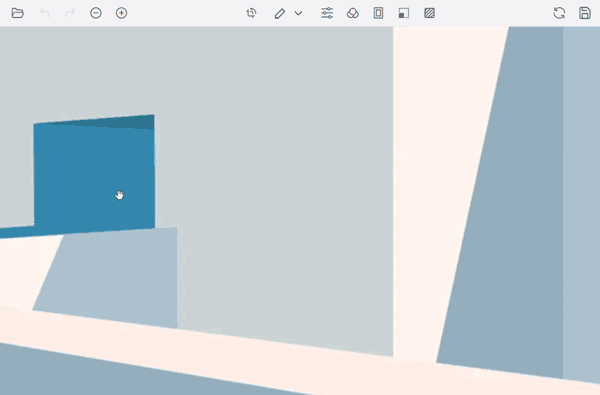

# End-user capabilities in the Blazor Image Editor component

The following operations are available for end users and are outlined in the sections below.

## Open an image

To open an image in the image editor, follow these steps:

* Click the Open icon on the left side of the toolbar.

* The file explorer lists only JPEG, PNG, JPG, WEBP, and BMP files.

* Select an image from the file explorer to load it in the editor.

## Zooming

Image zooming can be performed in the following ways:

* Using the toolbar

* Using pinch zoom on touch-enabled devices

* Using the mouse wheel

* Using the keyboard

### Using toolbar

To zoom the image using the toolbar:

* Zoom In/Out options are enabled after opening an image.

### Using pinch

To zoom the image using touch gestures:

* Perform a two-finger pinch gesture to zoom in or out.

* Zoom level is controlled by the pinch distance.

### Using mouse wheel

To zoom the image using the mouse:

* Press Ctrl and scroll the mouse wheel to zoom in or out.

* Zoom level is adjusted based on the scroll direction.

### Using keyboard

To zoom the image using keyboard shortcuts:

* Press Ctrl + ‘+’ to zoom in.

* Press Ctrl + ‘−’ to zoom out.

## Panning

To pan the image in the editor:

* Click and drag on the image to move it within the canvas.

* Panning is enabled in the following cases:

  * When a selection is active for cropping.

  * When the image size exceeds the canvas size due to zooming.

## Cropping and image transformation

To crop and transform an image:

* Cropping is based on a selection within the editor.

* Click the Crop button on the toolbar to open the contextual toolbar with crop selection, rotate, flip, and straighten options.

* Click the crop selection button and choose a selection type: custom, circle, square, or ratio.

* After creating a selection, pan the image to position the desired crop region.

* Use rotate and flip buttons and the straighten slider to apply transformations, including to inserted annotations.

* When the crop region is finalized, click the tick icon at the top-right of the toolbar to apply the crop.

## Image annotation

To add and modify annotations:

* Click the annotation button on the toolbar and choose an annotation type: Line, Rectangle, Ellipse, Path, Arrow, Text, or Freehand.

* Click and drag on the canvas to draw the selected annotation.

* After insertion, annotations can be repositioned by clicking and dragging with the mouse, and resized by interacting with the selection circle placed around the annotation.

* To rotate an annotation, drag the circle at the bottom of the annotation.

* Customize annotations using the contextual toolbar: color, stroke width, font family, and font size. The contextual toolbar appears when an annotation is selected.

* When annotations are selected, the quick access toolbar enables common actions such as duplicate, delete, and edit text to streamline editing.

## Fine-tune

To apply fine-tuning adjustments:

* Click the Fine-tune button to display available adjustments.

* Choose an adjustment to display a slider for control.

* Click on the canvas or the tick icon at the right corner of the toolbar to apply changes.

## Filter

To apply filters:

* Click the Filter button to display available filters.

* Select a filter to apply it to the image.

* Click on the canvas or the tick icon at the right corner of the toolbar to apply changes.

## Undo and redo the operations

To undo and redo actions in the editor:

* The Undo button is enabled after an action is performed.

* The Redo button is enabled after an undo action is performed.

* Click the Undo or Redo button on the left side of the toolbar.

* Keyboard shortcuts: Ctrl + Z (undo) and Ctrl + Y (redo).

## Reset an image

To revert all changes in the editor:

* Click the Reset button on the right side of the toolbar.

* This action reverts all modifications applied in the editor.

## Export an image

To save the modified image in the Image Editor, follow these steps:

* Click the Save button
  * Locate the Save button on the right side of the toolbar and click it.

* Select the file format
  * In the export popup, choose the preferred file format (PNG, JPEG, SVG, or WEBP) to save the image with all applied modifications.

* Adjust image quality (JPEG only)
  * If saving as JPEG, use predefined settings (Good, Great, Highest) or use the Image Quality slider (0–100). Higher values retain more detail and increase file size.

* Download the image
  * Click Download to save the modified image.

* Use keyboard shortcut (Ctrl + S)
  * Press Ctrl + S to download the image in the same format as the loaded image without opening the Save dialog. For example, if the loaded image is PNG, it will be saved as PNG.

