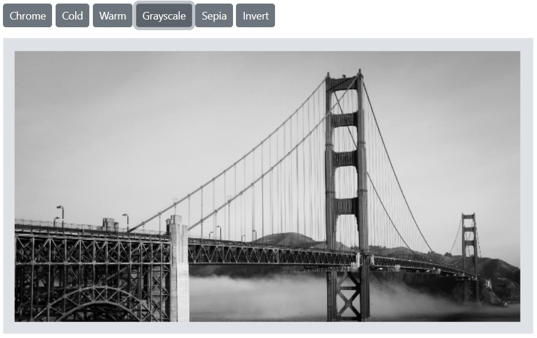

# Filters in the Blazor Image Editor component

Filters are predefined effects that modify an image’s appearance or mood. They can add visual emphasis or enhance specific elements of an image. Common filters include cold, warm, chrome, sepia, and invert.

## Apply filter effect

The [ApplyImageFilterAsync](https://help.syncfusion.com/cr/blazor/Syncfusion.Blazor.ImageEditor.SfImageEditor.html#Syncfusion_Blazor_ImageEditor_SfImageEditor_ApplyImageFilterAsync_Syncfusion_Blazor_ImageEditor_ImageFilterOption_) method applies a filter to the image. Provide the desired filter as the first parameter using the [ImageFilterOption](https://help.syncfusion.com/cr/blazor/Syncfusion.Blazor.ImageEditor.ImageFilterOption.html) enumeration.

Here is an example of filtering using the `ApplyImageFilterAsync` method.

```cshtml
@using Syncfusion.Blazor.ImageEditor
@using Syncfusion.Blazor.Buttons

<div style="padding-bottom: 15px">
    <SfButton OnClick="ChromeClick">Chrome</SfButton>
    <SfButton OnClick="ColdClick">Cold</SfButton>
    <SfButton OnClick="WarmClick">Warm</SfButton>
    <SfButton OnClick="GrayscaleClick">Grayscale</SfButton>
    <SfButton OnClick="SepiaClick">Sepia</SfButton>
    <SfButton OnClick="InvertClick">Invert</SfButton>
</div>

<SfImageEditor @ref="ImageEditor" Toolbar="customToolbarItem" Height="400">
    <ImageEditorEvents Created="OpenAsync"></ImageEditorEvents>
</SfImageEditor>

@code {
    SfImageEditor ImageEditor;
    private List<ImageEditorToolbarItemModel> customToolbarItem = new List<ImageEditorToolbarItemModel>() { };

    private async void OpenAsync()
    {
        await ImageEditor.OpenAsync("https://ej2.syncfusion.com/react/demos/src/image-editor/images/bridge.png");
    }

    private async void ChromeClick()
    {
        await ImageEditor.ApplyImageFilterAsync(ImageFilterOption.Chrome);
    }

    private async void ColdClick()
    {
        await ImageEditor.ApplyImageFilterAsync(ImageFilterOption.Cold);
    }

    private async void WarmClick()
    {
        await ImageEditor.ApplyImageFilterAsync(ImageFilterOption.Warm);
    }

    private async void GrayscaleClick()
    {
        await ImageEditor.ApplyImageFilterAsync(ImageFilterOption.Grayscale);
    }

    private async void SepiaClick()
    {
        await ImageEditor.ApplyImageFilterAsync(ImageFilterOption.Sepia);
    }

    private async void InvertClick()
    {
        await ImageEditor.ApplyImageFilterAsync(ImageFilterOption.Invert);
    }
}
```



## Image filtering event

The [ImageFiltering](https://help.syncfusion.com/cr/blazor/Syncfusion.Blazor.ImageEditor.ImageEditorEvents.html#Syncfusion_Blazor_ImageEditor_ImageEditorEvents_ImageFiltering) event is triggered when a filter is applied to the image. The event provides details about the action.

Parameters available in [ImageFilterEventArgs](https://help.syncfusion.com/cr/blazor/Syncfusion.Blazor.ImageEditor.ImageFilterEventArgs.html):

- [ImageFilterEventArgs.Filter](https://help.syncfusion.com/cr/blazor/Syncfusion.Blazor.ImageEditor.ImageFilterEventArgs.html#Syncfusion_Blazor_ImageEditor_ImageFilterEventArgs_Filter) - The filter type, as an `ImageFilterOption`, to be applied.

- [ImageFilterEventArgs.Cancel](https://help.syncfusion.com/cr/blazor/Syncfusion.Blazor.ImageEditor.ImageFilterEventArgs.html#Syncfusion_Blazor_ImageEditor_ImageFilterEventArgs_Cancel) - Indicates whether the filtering action should be canceled.