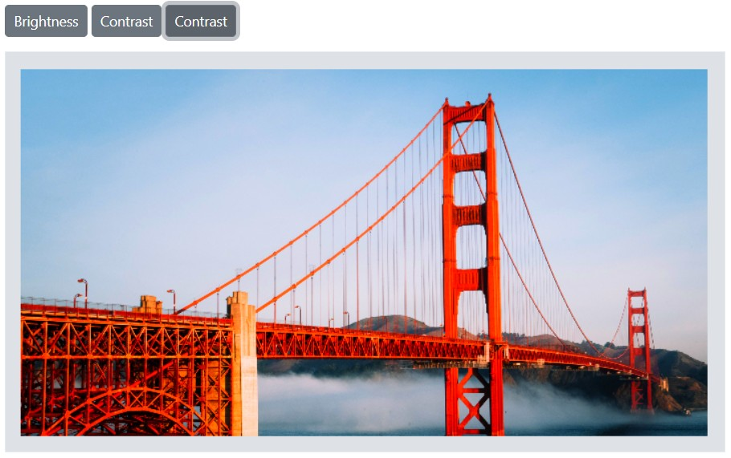
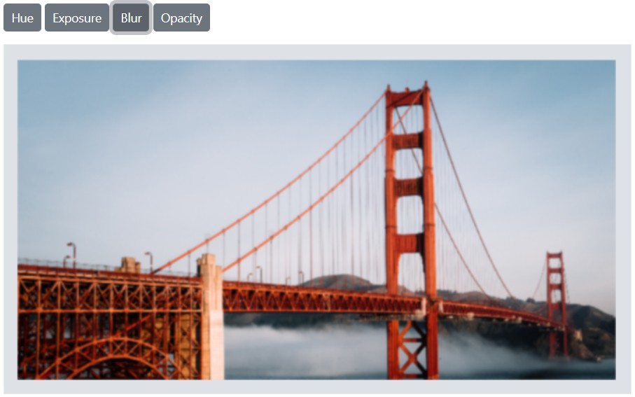

# Fine-tune in the Blazor Image Editor component

Fine-tuning refers to precise adjustments to image filter settings to achieve a targeted visual result. It provides control over the intensity and specific aspects of a filter’s effect on an image. Typical parameters include brightness and saturation, among other properties, enabling accurate control of the filter’s outcome.

## Adjust brightness, contrast, and saturation

The [FinetuneImageAsync](https://help.syncfusion.com/cr/blazor/Syncfusion.Blazor.ImageEditor.SfImageEditor.html#Syncfusion_Blazor_ImageEditor_SfImageEditor_FinetuneImageAsync_Syncfusion_Blazor_ImageEditor_ImageFinetuneOption_System_Int32_) method performs fine-tuning on an image. It accepts two parameters: the first is [ImageFinetuneOption](https://help.syncfusion.com/cr/blazor/Syncfusion.Blazor.ImageEditor.ImageFinetuneOption.html), which specifies the type of fine-tuning (brightness, contrast, and saturation), and the second is an integer value indicating the degree or intensity of the adjustment. This method enables convenient adjustments to brightness, contrast, and saturation by specifying the desired type and corresponding value.

The following example demonstrates brightness, contrast, and saturation fine-tuning using the `FinetuneImageAsync` method.

```cshtml
@using Syncfusion.Blazor.ImageEditor
@using Syncfusion.Blazor.Buttons

<div style="padding-bottom: 15px">
    <SfButton OnClick="BrightnessClick">Brightness</SfButton>
    <SfButton OnClick="ContrastClick">Contrast</SfButton>
    <SfButton OnClick="SaturationClick">Contrast</SfButton>
</div>

<SfImageEditor @ref="ImageEditor" Toolbar="customToolbarItem" Height="400">
    <ImageEditorEvents Created="OpenAsync"></ImageEditorEvents>
</SfImageEditor>

@code {
    SfImageEditor ImageEditor;
    private List<ImageEditorToolbarItemModel> customToolbarItem = new List<ImageEditorToolbarItemModel>() { };

    private async void OpenAsync()
    {
        await ImageEditor.OpenAsync("https://ej2.syncfusion.com/react/demos/src/image-editor/images/bridge.png");
    }

    private async void BrightnessClick()
    {
        await ImageEditor.FinetuneImageAsync(ImageFinetuneOption.Brightness, 10);
    }

    private async void ContrastClick()
    {
        await ImageEditor.FinetuneImageAsync(ImageFinetuneOption.Contrast, 10);
    }

    private async void SaturationClick()
    {
        await ImageEditor.FinetuneImageAsync(ImageFinetuneOption.Saturation, 100);
    }
}
```



## Adjust hue, exposure, blur, and opacity

The [FinetuneImageAsync](https://help.syncfusion.com/cr/blazor/Syncfusion.Blazor.ImageEditor.SfImageEditor.html#Syncfusion_Blazor_ImageEditor_SfImageEditor_FinetuneImageAsync_Syncfusion_Blazor_ImageEditor_ImageFinetuneOption_System_Int32_) method also supports fine-tuning for hue, exposure, blur, and opacity. The first parameter is [ImageFinetuneOption](https://help.syncfusion.com/cr/blazor/Syncfusion.Blazor.ImageEditor.ImageFinetuneOption.html), which specifies the type of fine-tuning to apply (hue, exposure, blur, and opacity), and the second parameter is an integer value representing the intensity of the adjustment. This method allows straightforward adjustment of these properties by specifying the type and value.

The following example demonstrates hue, exposure, blur, and opacity fine-tuning using the `FinetuneImageAsync` method.

```cshtml
@using Syncfusion.Blazor.ImageEditor
@using Syncfusion.Blazor.Buttons

<div style="padding-bottom: 15px">
    <SfButton OnClick="HueClick">Hue</SfButton>
    <SfButton OnClick="ExposureClick">Exposure</SfButton>
    <SfButton OnClick="BlurClick">Blur</SfButton>
    <SfButton OnClick="OpacityClick">Opacity</SfButton>
</div>

<SfImageEditor @ref="ImageEditor" Toolbar="customToolbarItem" Height="400">
    <ImageEditorEvents Created="OpenAsync"></ImageEditorEvents>
</SfImageEditor>

@code {
    SfImageEditor ImageEditor;
    private List<ImageEditorToolbarItemModel> customToolbarItem = new List<ImageEditorToolbarItemModel>() { };

    private async void OpenAsync()
    {
        await ImageEditor.OpenAsync("https://ej2.syncfusion.com/react/demos/src/image-editor/images/bridge.png");
    }

    private async void HueClick()
    {
        await ImageEditor.FinetuneImageAsync(ImageFinetuneOption.Hue, 10);
    }

    private async void ExposureClick()
    {
        await ImageEditor.FinetuneImageAsync(ImageFinetuneOption.Exposure, 10);
    }

    private async void BlurClick()
    {
        await ImageEditor.FinetuneImageAsync(ImageFinetuneOption.Blur, 10);
    }

    private async void OpacityClick()
    {
        await ImageEditor.FinetuneImageAsync(ImageFinetuneOption.Opacity, 70);
    }
}
```



## Finetune value changing event

The [FinetuneValueChanging](https://help.syncfusion.com/cr/blazor/Syncfusion.Blazor.ImageEditor.ImageEditorEvents.html#Syncfusion_Blazor_ImageEditor_ImageEditorEvents_FinetuneValueChanging) event is triggered during fine-tuning. It provides details such as the fine-tune type and the applied value.

Parameters available in [FinetuneEventArgs](https://help.syncfusion.com/cr/blazor/Syncfusion.Blazor.ImageEditor.FinetuneEventArgs.html):

- [FinetuneEventArgs.Finetune](https://help.syncfusion.com/cr/blazor/Syncfusion.Blazor.ImageEditor.FinetuneEventArgs.html#Syncfusion_Blazor_ImageEditor_FinetuneEventArgs_Finetune) - The type of fine-tuning as `ImageFinetuneOption` to be applied in the image editor.

- [FinetuneEventArgs.Value](https://help.syncfusion.com/cr/blazor/Syncfusion.Blazor.ImageEditor.FinetuneEventArgs.html#Syncfusion_Blazor_ImageEditor_FinetuneEventArgs_Value) - The fine-tuning value to be applied in the image editor.

- [FinetuneEventArgs.Cancel](https://help.syncfusion.com/cr/blazor/Syncfusion.Blazor.ImageEditor.FinetuneEventArgs.html#Syncfusion_Blazor_ImageEditor_FinetuneEventArgs_Cancel) - A boolean value that cancels the fine-tuning action. 