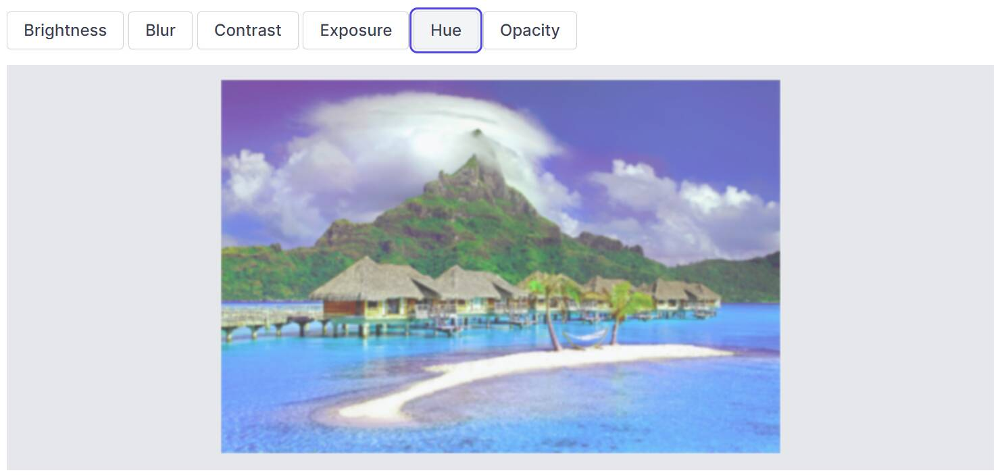

# Fine-tune in the Blazor Image Editor component

Fine-tuning involves making precise adjustments to the settings of an image filter in order to achieve a specific desired effect. It provides control over the intensity and specific aspects of the filter's impact on the image. For example, fine-tuning allows you to modify parameters like brightness, saturation, or other relevant properties to fine-tune the level or quality of the filter's effect. This level of control enables you to achieve the exact look or outcome you want for your image.

## Adjust the brightness, contrast, and saturation

The [`FinetuneImageAsync`](https://help.syncfusion.com/cr/blazor/Syncfusion.Blazor.ImageEditor.SfImageEditor.html#Syncfusion_Blazor_ImageEditor_SfImageEditor_FinetuneImageAsync_Syncfusion_Blazor_ImageEditor_ImageFinetuneOption_System_Int32_) method is designed to facilitate fine-tuning operations on an image. It accepts two parameters: the first parameter is [`ImageFinetuneOption`](https://help.syncfusion.com/cr/blazor/Syncfusion.Blazor.ImageEditor.ImageFinetuneOption.html) which determines the type of fine-tuning to be applied (brightness, contrast, and saturation), and the second parameter represents the fine-tuning value, indicating the degree or intensity of the adjustment. This method allows for convenient adjustment of brightness, contrast, and saturation by specifying the desired type and corresponding value.

Here is an example of brightness, contrast, and saturation fine-tuning using the `FinetuneImageAsync` method.

## Adjust the hue, exposure, blur, and opacity

The [`FinetuneImageAsync`](https://help.syncfusion.com/cr/blazor/Syncfusion.Blazor.ImageEditor.SfImageEditor.html#Syncfusion_Blazor_ImageEditor_SfImageEditor_FinetuneImageAsync_Syncfusion_Blazor_ImageEditor_ImageFinetuneOption_System_Int32_) method is designed to facilitate fine-tuning operations on an image. It accepts two parameters: the first parameter is [`ImageFinetuneOption`](https://help.syncfusion.com/cr/blazor/Syncfusion.Blazor.ImageEditor.ImageFinetuneOption.html) which determines the type of fine-tuning to be applied (hue, exposure, blur, and opacity), and the second parameter represents the fine-tuning value, indicating the degree or intensity of the adjustment. This method allows for convenient adjustment of hue, exposure, blur, and opacity by specifying the desired type and corresponding value.

Here is an example of hue, exposure, blur, and opacity fine-tuning using the `FinetuneImageAsync` method.


```cshtml
@using Syncfusion.Blazor.ImageEditor
@using Syncfusion.Blazor.Buttons

<div style="padding-bottom: 15px">
    <SfButton OnClick="BrightnessClick">Brightness</SfButton>
    <SfButton OnClick="BlurClick">Blur</SfButton>
    <SfButton OnClick="ContrastClick">Contrast</SfButton>
    <SfButton OnClick="SaturationClick">Contrast</SfButton>
    <SfButton OnClick="ExposureClick">Exposure</SfButton>
    <SfButton OnClick="HueClick">Hue</SfButton>
    <SfButton OnClick="OpacityClick">Opacity</SfButton>
</div>

<SfImageEditor @ref="ImageEditor" Toolbar="customToolbarItem" Height="400">
    <ImageEditorEvents Created="OpenAsync"></ImageEditorEvents>
</SfImageEditor>

@code {
    SfImageEditor ImageEditor;
    private List<ImageEditorToolbarItemModel> customToolbarItem = new List<ImageEditorToolbarItemModel>() { };

    private async void OpenAsync()
    {
        await ImageEditor.OpenAsync("https://ej2.syncfusion.com/react/demos/src/image-editor/images/bridge.png");
    }

    private async void BrightnessClick()
    {
        await ImageEditor.FinetuneImageAsync(ImageFinetuneOption.Brightness, 10);
    }

    private async void BlurClick()
    {
        await ImageEditor.FinetuneImageAsync(ImageFinetuneOption.Blur, 10);
    }

    private async void ContrastClick()
    {
        await ImageEditor.FinetuneImageAsync(ImageFinetuneOption.Contrast, 10);
    }

    private async void SaturationClick()
    {
        await ImageEditor.FinetuneImageAsync(ImageFinetuneOption.Saturation, 100);
    }

    private async void ExposureClick()
    {
        await ImageEditor.FinetuneImageAsync(ImageFinetuneOption.Exposure, 10);
    }

    private async void HueClick()
    {
        await ImageEditor.FinetuneImageAsync(ImageFinetuneOption.Hue, 10);
    }

    private async void OpacityClick()
    {
        await ImageEditor.FinetuneImageAsync(ImageFinetuneOption.Opacity, 70);
    }
}
```



## Finetune value changing event

The [`FinetuneValueChanging`](https://help.syncfusion.com/cr/blazor/Syncfusion.Blazor.ImageEditor.ImageEditorEvents.html#Syncfusion_Blazor_ImageEditor_ImageEditorEvents_FinetuneValueChanging) event is triggered when performing fine-tuning on the image. This event is passed an object that contains information about the fine-tuning event, such as the type of fine-tuning and the value of fine-tuning performed.

The parameter available in the `FinetuneValueChanging` event is,

FinetuneEventArgs.Finetune - The type of fine-tuning as ImageFinetuneOption to be applied in the image editor.

FinetuneEventArgs.Value - The fine-tuning value to be applied in the image editor.

FinetuneEventArgs.Cancel – Specifies a boolean value to cancel the fine-tuning action.
