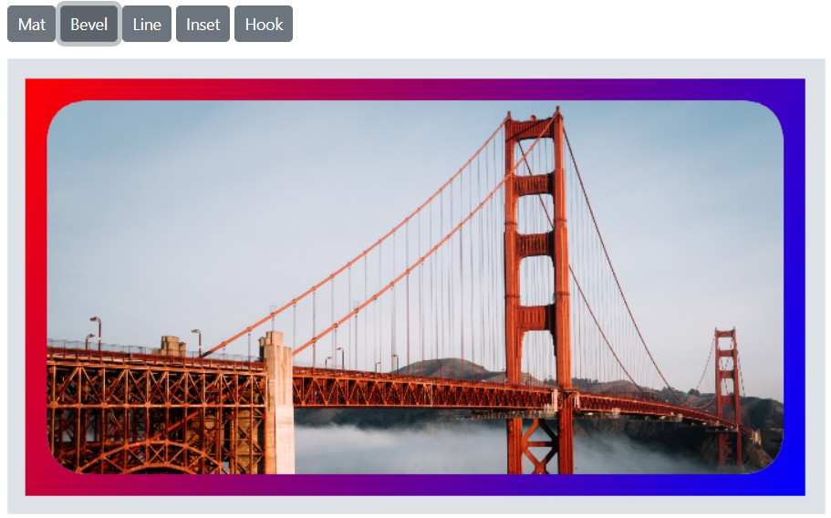

# Frames in the Blazor Image Editor component

The frame feature in the Image Editor enables adding decorative borders around images. Frames enhance visual appeal and can be styled to match the image context or design requirements.

## Apply frame to the Image

The [DrawFrameAsync](https://help.syncfusion.com/cr/blazor/Syncfusion.Blazor.ImageEditor.SfImageEditor.html#Syncfusion_Blazor_ImageEditor_SfImageEditor_DrawFrameAsync_Syncfusion_Blazor_ImageEditor_FrameType_System_String_System_String_System_Int32_System_Int32_System_Int32_System_Int32_Syncfusion_Blazor_ImageEditor_FrameLineStyle_System_Int32_) method applies a frame to an image with options such as mat, bevel, line, hook, and inset.

Depending on the selected frame type, additional customization options may be available, such as thickness, color, gradient, and other styling attributes.

The `DrawFrameAsync` method accepts nine parameters that define the frame properties:

- `frameType` - Specifies the type of frame to apply.

- `color` - Specifies the frame color.

- `gradientColor` - Specifies the gradient color for the frame.

- `size` - Specifies the frame size.

- `inset` - Specifies the inset value for line, hook, and inset frame types.

- `offset` - Specifies the offset value for line and inset frame types.

- `borderRadius` - Specifies the border radius for the line frame type.

- `frameLineStyle` - Specifies the frame line style for the line frame type.

- `lineCount` - Specifies the line count for the line frame type.

Here is an example of applying frames using the `DrawFrameAsync` method.

```cshtml
@using Syncfusion.Blazor.ImageEditor
@using Syncfusion.Blazor.Buttons

<div style="padding-bottom: 15px">
    <SfButton OnClick="MatClick">Mat</SfButton>
    <SfButton OnClick="BevelClick">Bevel</SfButton>
    <SfButton OnClick="LineClick">Line</SfButton>
    <SfButton OnClick="InsetClick">Inset</SfButton>
    <SfButton OnClick="HookClick">Hook</SfButton>
</div>

<SfImageEditor @ref="ImageEditor" Toolbar="customToolbarItem" Height="400">
    <ImageEditorEvents Created="CreatedAsync"></ImageEditorEvents>
</SfImageEditor>

@code {
    SfImageEditor ImageEditor;
    private List<ImageEditorToolbarItemModel> customToolbarItem = new List<ImageEditorToolbarItemModel>() { };

    private async void CreatedAsync()
    {
        await ImageEditor.OpenAsync("https://ej2.syncfusion.com/react/demos/src/image-editor/images/bridge.png");
    }

    private async void MatClick()
    {
        await ImageEditor.DrawFrameAsync(FrameType.Mat, "red", "blue", 20, 20, 20, 20, FrameLineStyle.Solid, 1);
    }

    private async void BevelClick()
    {
        await ImageEditor.DrawFrameAsync(FrameType.Bevel, "red", "blue", 20, 20, 20, 20, FrameLineStyle.Solid, 1);
    }

    private async void LineClick()
    {
        await ImageEditor.DrawFrameAsync(FrameType.Line, "red", "blue", 20, 20, 20, 20, FrameLineStyle.Solid, 1);
    }

    private async void InsetClick()
    {
        await ImageEditor.DrawFrameAsync(FrameType.Inset, "red", "blue", 20, 20, 20, 20, FrameLineStyle.Solid, 1);
    }

    private async void HookClick()
    {
        await ImageEditor.DrawFrameAsync(FrameType.Hook, "red", "blue", 20, 20, 20, 20, FrameLineStyle.Solid, 1);
    }
}
```



## Frame changing event

The [FrameChanging](https://help.syncfusion.com/cr/blazor/Syncfusion.Blazor.ImageEditor.ImageEditorEvents.html#Syncfusion_Blazor_ImageEditor_ImageEditorEvents_FrameChanging) event is triggered while applying a frame. The event object provides details about the frame settings involved in the change.

- Frame type: Specifies the type of frame applied, such as mat, bevel, line, hook, or inset.

- Customization values: Includes attributes such as color, size, style, inset, offset, gradient color, and related settings.

Parameters available in [FrameChangeEventArgs](https://help.syncfusion.com/cr/blazor/Syncfusion.Blazor.ImageEditor.FrameChangeEventArgs.html):

- [FrameChangeEventArgs.PreviousFrameSetting](https://help.syncfusion.com/cr/blazor/Syncfusion.Blazor.ImageEditor.FrameChangeEventArgs.html#Syncfusion_Blazor_ImageEditor_FrameChangeEventArgs_PreviousFrameSetting) - Frame settings (size, color, inset, offset, gradient color) applied before the change.

- [FrameChangeEventArgs.CurrentFrameSetting](https://help.syncfusion.com/cr/blazor/Syncfusion.Blazor.ImageEditor.FrameChangeEventArgs.html#Syncfusion_Blazor_ImageEditor_FrameChangeEventArgs_CurrentFrameSetting) - Frame settings (size, color, inset, offset, gradient color) to be applied after the change.

- [FrameChangeEventArgs.Cancel](https://help.syncfusion.com/cr/blazor/Syncfusion.Blazor.ImageEditor.FrameChangeEventArgs.html#Syncfusion_Blazor_ImageEditor_FrameChangeEventArgs_Cancel) - Indicates whether to cancel the frame-changing action.