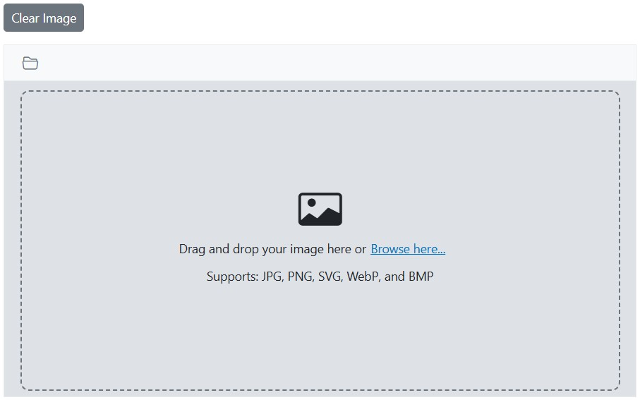

# Clear an Image in the Blazor Image Editor component

The [ClearImageAsync](https://help.syncfusion.com/cr/blazor/Syncfusion.Blazor.ImageEditor.SfImageEditor.html#Syncfusion_Blazor_ImageEditor_SfImageEditor_ClearImageAsync) method clears the current image from the editor. This is useful when the component is rendered in a dialog: calling `ClearImageAsync` before closing the dialog prevents the previously loaded image from persisting when the dialog is reopened, ensuring a fresh state for a new selection.

```cshtml
@using Syncfusion.Blazor.ImageEditor
@using Syncfusion.Blazor.Buttons

<div style="padding-bottom: 15px">
    <SfButton OnClick="ClearImageAsync">Clear Image</SfButton>
</div>
<SfImageEditor @ref="ImageEditor" Height="400">
    <ImageEditorEvents Created="OpenAsync"></ImageEditorEvents>
</SfImageEditor>

@code {
    SfImageEditor ImageEditor;

    private async void OpenAsync()
    {
        await ImageEditor.OpenAsync("https://ej2.syncfusion.com/react/demos/src/image-editor/images/bridge.png");
    }

    private async void ClearImageAsync()
    {
        await ImageEditor.ClearImageAsync();
    }
}
```

