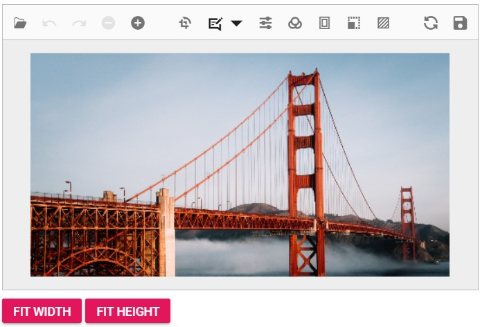

# Fit Image to Editor Width and Height

The Image Editor's [ZoomAsync](https://help.syncfusion.com/cr/blazor/Syncfusion.Blazor.ImageEditor.SfImageEditor.html#Syncfusion_Blazor_ImageEditor_SfImageEditor_ZoomAsync_System_Double_Syncfusion_Blazor_ImageEditor_ImageEditorPoint_)  method to fit an image to the editor by width or height. Programmatically increase the zoom level until the image dimension matches the editor container's width or height.

This example demonstrates scenarios that include buttons for fitting the image to its width (Fit Width) or height (Fit Height).

```cshtml
@using Syncfusion.Blazor.ImageEditor
@using Syncfusion.Blazor.Buttons
<SfImageEditor @ref="ImageEditor" Height="400" Width="500">
    <ImageEditorEvents Created="OpenAsync"></ImageEditorEvents>
</SfImageEditor>
<div style="padding-bottom: 15px">
    <SfButton OnClick="FitWidth">Fit Width</SfButton>
    <SfButton OnClick="FitHeight">Fit Height</SfButton>
</div>
@code {
    SfImageEditor ImageEditor;
    private async void OpenAsync()
    {
        await ImageEditor.OpenAsync("https://ej2.syncfusion.com/react/demos/src/image-editor/images/bridge.png");
    }
    private async void FitWidth()
    {
        await ImageEditor.ZoomAsync(1); // Reset zoom to original size before applying Fit Width
        ImageDimension Dimension = await ImageEditor.GetImageDimensionAsync();
        double ContainerWidth = Convert.ToDouble(ImageEditor.Width);
        if (Dimension is not null)
        {
            double ImageWidth = Dimension.Width;
            double OldWidth = Dimension.Width;
            double ZoomFactor = 0.1;
            double NewZoom;
            NewZoom = 1;
            while (ImageWidth < ContainerWidth)
            {
                NewZoom++;
                ImageWidth = OldWidth + (OldWidth * ZoomFactor);
                ZoomFactor += 0.1;
            }
            await ImageEditor.ZoomAsync(NewZoom);
        }
    }
    private async void FitHeight()
    {
        await ImageEditor.ZoomAsync(1); // Reset zoom to original size before applying Fit Height
        ImageDimension Dimension = await ImageEditor.GetImageDimensionAsync();
        double ContainerHeight = Convert.ToDouble(ImageEditor.Height);
        if (Dimension is not null)
        {
            double ImageHeight = Dimension.Height;
            double OldHeight = Dimension.Height;
            double ZoomFactor = 0.1;
            double NewZoom = 1;
            while (ImageHeight < ContainerHeight)
            {
                NewZoom++;
                ImageHeight = OldHeight + (OldHeight * ZoomFactor);
                ZoomFactor += 0.1;
            }
            await ImageEditor.ZoomAsync(NewZoom);
        }
    }
}
```

