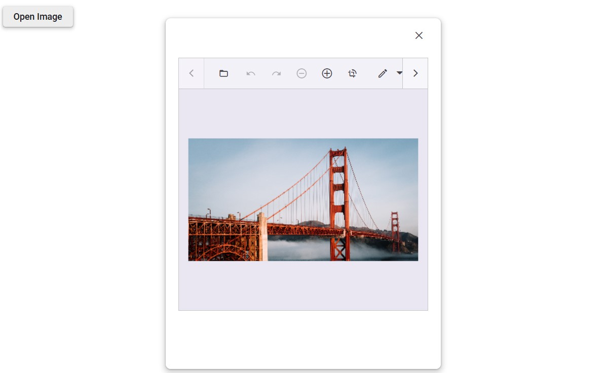

# Render Image Editor in Dialog Component

Rendering the Image Editor in a dialog involves displaying the image editor component within a modal dialog window, allowing users to edit images in a pop-up interface. This can be useful for maintaining a clean layout and providing a focused editing experience without navigating away from the current page.

```cshtml
@using Syncfusion.Blazor.ImageEditor
@using Syncfusion.Blazor.Buttons
@using Syncfusion.Blazor.Popups
@using Syncfusion.Blazor.Inputs

<div style="padding-bottom: 15px">
    <SfButton OnClick="OpenDialog">Edit Image</SfButton>
</div>

<div class="control-section" id="target" style="height: 500px">
    <SfDialog Width="600px" Height="500px" Target="#target" ShowCloseIcon="true" @bind-Visible="IsDialogVisible">
        <DialogEvents Opened="OnDialogOpened" Closed="OnDialogClosed"></DialogEvents>
        <DialogTemplates>
            <Content>
                <div class="dialog-content">
                    @if (IsImageEditorVisible)
                    {
                        <SfImageEditor @ref="ImageEditor" Height="400px">
                            <ImageEditorEvents Created="OnImageEditorCreated"></ImageEditorEvents>
                        </SfImageEditor>
                    }
                </div>
            </Content>
        </DialogTemplates>
    </SfDialog>
</div>

@code {
    private bool IsDialogVisible { get; set; } = false;
    private bool IsImageEditorVisible { get; set; } = false;
    private SfImageEditor ImageEditor;

    private void OpenDialog()
    {
        IsDialogVisible = true;
    }

    private void OnDialogOpened()
    {
        IsImageEditorVisible = true;
    }

    private void OnDialogClosed()
    {
        IsImageEditorVisible = false;
    }

    private async void OnImageEditorCreated()
    {
        await ImageEditor.OpenAsync("https://ej2.syncfusion.com/react/demos/src/image-editor/images/bridge.png");
    }
}
```

