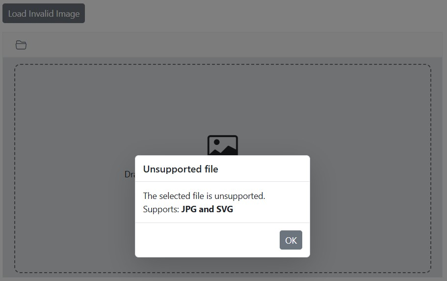

# Image Restrictions in the Blazor Image Editor component

The Image Editor supports restricting image uploads by file extension and by minimum and maximum file size using the [ImageEditorUploadSettings](https://help.syncfusion.com/cr/blazor/Syncfusion.Blazor.ImageEditor.ImageEditorUploadSettings.html) property. When an uploaded image does not meet the configured criteria, the component displays an alert to guide the end user and maintain a smooth workflow.

Note: File restrictions apply when opening images via the open method or the built-in uploader. If upload settings are not defined, the Image Editor allows files with .jpg, .png, .svg, .webp, and .bmp extensions, with no file size restrictions.

## Allowed image extensions

Configure allowed file extensions for uploaded images using the [ImageEditorUploadSettings.AllowedExtensions](https://help.syncfusion.com/cr/blazor/Syncfusion.Blazor.ImageEditor.ImageEditorUploadSettings.html#Syncfusion_Blazor_ImageEditor_ImageEditorUploadSettings_AllowedExtensions) property. This ensures that only supported formats—such as .jpg, .png, .svg, .webp, and .bmp—are processed, improving compatibility and preventing errors caused by unsupported file types. By default, the Image Editor allows .jpg, .png, .svg, .webp, and .bmp.

Note: Specify allowed extensions as a comma-separated string, for example: '.jpg, .svg'.

Here is an example of configuring image restrictions using the `ImageEditorUploadSettings` property.

```cshtml
@using Syncfusion.Blazor.ImageEditor
@using Syncfusion.Blazor.Buttons

<div style="padding-bottom: 15px">
    <SfButton OnClick="LoadInvalidImage">Load Invalid Image</SfButton>
</div>

<SfImageEditor @ref="ImageEditor" Height="400">
    <ImageEditorUploadSettings AllowedExtensions="@AllowedExtensions"></ImageEditorUploadSettings>
</SfImageEditor>
@code {
    private SfImageEditor ImageEditor;
    string AllowedExtensions = ".jpg, .svg";
    private async void LoadInvalidImage()
    {
        await ImageEditor.OpenAsync("https://ej2.syncfusion.com/react/demos/src/image-editor/images/bridge.png");
    }
}
```



## Minimum and maximum image size

Set minimum and maximum upload size limits using the [ImageEditorUploadSettings.MinFileSize](https://help.syncfusion.com/cr/blazor/Syncfusion.Blazor.ImageEditor.ImageEditorUploadSettings.html#Syncfusion_Blazor_ImageEditor_ImageEditorUploadSettings_MinFileSize) and [ImageEditorUploadSettings.MaxFileSize](https://help.syncfusion.com/cr/blazor/Syncfusion.Blazor.ImageEditor.ImageEditorUploadSettings.html#Syncfusion_Blazor_ImageEditor_ImageEditorUploadSettings_MaxFileSize) properties. These constraints enforce consistent input and prevent oversized or undersized files from being processed.

Note: When images are uploaded as base64 strings, file extension validation is bypassed; file size restrictions still apply.

Here is an example of configuring image restrictions using the `ImageEditorUploadSettings` property.

```cshtml
@using Syncfusion.Blazor.ImageEditor
@using Syncfusion.Blazor.Buttons

<div style="padding-bottom: 15px">
    <SfButton OnClick="LoadInvalidImage">Load Invalid Image</SfButton>
</div>

<SfImageEditor @ref="ImageEditor" Height="400">
    <ImageEditorUploadSettings MinFileSize="@MinFileSize" MaxFileSize="@MaxFileSize"></ImageEditorUploadSettings>
</SfImageEditor>
@code {
    private SfImageEditor ImageEditor;
    double MinFileSize = 1;
    double MaxFileSize = 100;
    private async void LoadInvalidImage()
    {
        await ImageEditor.OpenAsync("https://ej2.syncfusion.com/react/demos/src/image-editor/images/bridge.png");
    }
}
```

