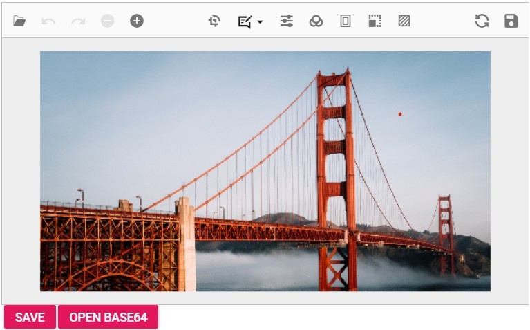
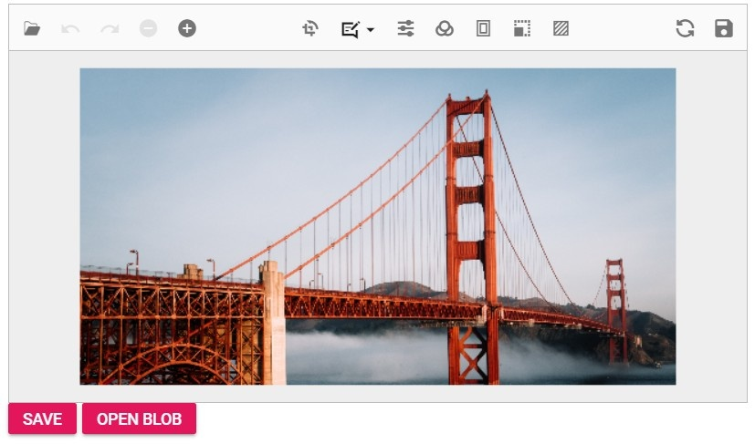

456989---
layout: post
title: Open save with Blazor Image Editor Component | Syncfusion
description: Checkout the Open save available in Blazor Image Editor component in Blazor Server App and Blazor WebAssembly App.
platform: Blazor
control: Image Editor
documentation: ug
---


# Open and Save in the Blazor Image Editor component

The [Blazor Image Editor](https://www.syncfusion.com/blazor-components/blazor-image-editor) component supports to import an image into the canvas, it must first be converted into a blob object. The Uploader component can be used to facilitate the process of uploading an image from the user interface. Once the image has been uploaded, it can then be converted into a blob and drawn onto the canvas.

## Supported image formats

The Image Editor control supports three common image formats: PNG, JPEG, and SVG. These formats allow you to work with a wide range of image files within the Image Editor.

When it comes to saving the edited image, the default file type is set as PNG. This means that when you save the edited image without specifying a different file type, it will be saved as a PNG file. However, it's important to note that the Image Editor typically provides options or methods to specify a different file type if desired. This allows you to save the edited image in formats other than the default PNG, such as JPEG or SVG, based on your specific requirements or preferences.

## Open an image

The [`OpenAsync`](https://help.syncfusion.com/cr/blazor/Syncfusion.Blazor.ImageEditor.SfImageEditor.html#Syncfusion_Blazor_ImageEditor_SfImageEditor_OpenAsync_System_Object_) method in the Blazor Image Editor component offers the capability to open an image by providing it in different formats. This method accepts various types of arguments, such as a base64-encoded string, raw image data, or a hosted/online URL. You can pass either the file name or the actual image data as an argument to the [`OpenAsync`](https://help.syncfusion.com/cr/blazor/Syncfusion.Blazor.ImageEditor.SfImageEditor.html#Syncfusion_Blazor_ImageEditor_SfImageEditor_OpenAsync_System_Object_) method, and it will load the specified image into the image editor component. This flexibility allows you to work with images from different sources and formats, making it easier to integrate and manipulate images within the Image Editor component.

Note: To load the image in the image editor, the image is placed within the application's "wwwroot" folder.

```cshtml
@using Syncfusion.Blazor.ImageEditor 

<SfImageEditor @ref="ImageEditor" Toolbar="customToolbarItem" Height="400">
    <ImageEditorEvents Created="OpenAsync"></ImageEditorEvents>
</SfImageEditor> 

@code { 
    SfImageEditor ImageEditor; 
    private List<ImageEditorToolbarItemModel> customToolbarItem = new List<ImageEditorToolbarItemModel>() { }; 

    private async void OpenAsync() 
    { 
        await ImageEditor.OpenAsync("nature.png"); 
    } 
}
```


### Open an image from Base64 format 

Users can easily open images in the Image Editor using a Base64-encoded string. This method allows you to load images directly from their Base64 representation, ensuring seamless integration and flexibility in your application. Simply pass the Base64 string to the open method, and the image will be loaded into the editor. 

`Note:` You can obtain the Base64 representation of an image from the Image Editor using the [`GetImageDataAsync`](https://help.syncfusion.com/cr/blazor/Syncfusion.Blazor.ImageEditor.SfImageEditor.html#Syncfusion_Blazor_ImageEditor_SfImageEditor_GetImageDataAsync) method. This process will be explained in the upcoming section.

```cshtml
@using Syncfusion.Blazor.ImageEditor 
<div style="padding-bottom: 15px">
    <SfButton OnClick="SaveAsync">Save</SfButton>
    <SfButton OnClick="OpenBaseAsync">Open base64</SfButton>
</div>
<SfImageEditor @ref="ImageEditor" Height="400">
    <ImageEditorEvents Created="OpenAsync"></ImageEditorEvents>
</SfImageEditor> 

@code { 
    SfImageEditor ImageEditor;
    private string base64String;

    private async void OpenAsync() 
    { 
        await ImageEditor.OpenAsync("nature.png"); 
    }

    private async void SaveAsync() 
    { 
        var imageData = await ImageEditor.GetImageDataAsync();
        base64String = Convert.ToBase64String(imageData);
    }

    private async void OpenBaseAsync()
    {
       await ImageEditor.OpenAsync("data:image/png;base64," + base64String);
    }
}
```



### Open an image from Blob storage

User can easily open images in the Image Editor from Blob storage. This method allows you to load images directly from Blob storage, ensuring seamless integration and flexibility in your application. Simply retrieve the image Blob from storage and pass it to the open method, and the image will be loaded into the editor. 

`Note:` You can obtain the Base64 representation of an image from the Image Editor using the [`GetImageDataAsync`](https://help.syncfusion.com/cr/blazor/Syncfusion.Blazor.ImageEditor.SfImageEditor.html#Syncfusion_Blazor_ImageEditor_SfImageEditor_GetImageDataAsync) method. This process will be explained in the upcoming section.

```cshtml
@using Syncfusion.Blazor.ImageEditor
@using Syncfusion.Blazor.Buttons
@inject IJSRuntime JS

<div style="padding-bottom: 15px">
    <SfButton OnClick="SaveAsync">Save Blob</SfButton>
    <SfButton OnClick="OpenBlob">Open Blob</SfButton>
</div>

<SfImageEditor @ref="ImageEditor" Height="400">
    <ImageEditorEvents Created="OpenAsync"></ImageEditorEvents>
</SfImageEditor>

@code {
    private SfImageEditor ImageEditor;
    private string blobUrl;

    private async Task OpenAsync() 
    { 
        await ImageEditor.OpenAsync("nature.png"); 
    }

    private async Task SaveAsync()
    {
        var imageData = await ImageEditor.GetImageDataAsync();
        blobUrl = await CreateBlobUrl(imageData);
    }

    private async Task OpenBlob()
    {
        if (!string.IsNullOrEmpty(blobUrl))
        {
            await ImageEditor.OpenAsync(blobUrl);
        }
    }

    private async Task<string> CreateBlobUrl(byte[] imageData)
    {
        var base64String = Convert.ToBase64String(imageData);
        var jsCode = $@"
            return new Promise((resolve) => {{
                const byteCharacters = atob('{base64String}');
                const byteNumbers = new Uint8Array(byteCharacters.length);
                for (let i = 0; i < byteCharacters.length; i++) {{
                    byteNumbers[i] = byteCharacters.charCodeAt(i);
                }}
                const blob = new Blob([byteNumbers], {{type: 'image/png'}});
                resolve(URL.createObjectURL(blob));
            }});
        ";

        return await JS.InvokeAsync<string>("eval", jsCode);
    }
}
```


### Open an image from file uploader 

User can easily open images in the Image Editor using a file uploader. This method allows users to upload an image file from their device and load it directly into the editor. Once the image is selected through the file uploader, pass the file to the [`OpenAsync`](https://help.syncfusion.com/cr/blazor/Syncfusion.Blazor.ImageEditor.SfImageEditor.html#Syncfusion_Blazor_ImageEditor_SfImageEditor_OpenAsync_System_Object_System_Boolean_System_String_) method, and the image will be seamlessly loaded into the editor.

```cshtml
@using Syncfusion.Blazor.Inputs
@using Syncfusion.Blazor.ImageEditor
@using System.IO

<div class="e-img-editor-sample">
    <SfUploader AllowedExtensions=".jpg,.jpeg,.png" AutoUpload="false" @ref="uploader" Selected="@OnImageSelected">
    </SfUploader>
    <SfImageEditor @ref="imageEditor" Height="350px"></SfImageEditor>
</div>

@code {
    private SfUploader uploader;
    private SfImageEditor imageEditor;

    private async Task OnImageSelected(UploadChangeEventArgs args)
    {
        if (args.Files != null && args.Files.Count > 0)
        {
            var file = args.Files[0];
            if (file != null)
            {
                using (var memoryStream = new MemoryStream())
                {
                    await file.File.OpenReadStream(long.MaxValue).CopyToAsync(memoryStream);
                    string base64String = Convert.ToBase64String(memoryStream.ToArray());
                    string dataUrl = "data:image/png;base64," + base64String;
                    await imageEditor.OpenAsync(dataUrl);
                }
            }
        }
    }
}
```

### Add Watermarks while opening an image 

You can utilize the ‘[`FileOpenEventArgs`](https://help.syncfusion.com/cr/blazor/Syncfusion.Blazor.ImageEditor.FileOpenEventArgs.html)’ event, which triggers once the image is loaded into the image editor. After this event, you can use the ‘[`DrawTextAsync`](https://help.syncfusion.com/cr/blazor/Syncfusion.Blazor.ImageEditor.SfImageEditor.html#Syncfusion_Blazor_ImageEditor_SfImageEditor_DrawTextAsync_System_Double_System_Double_System_String_System_String_System_Int32_System_Boolean_System_Boolean_System_String_System_Boolean_System_Int32_System_String_System_String_System_Int32_)’ method to add a watermark. This approach allows the watermark to be automatically drawn on the canvas every time an image is opened in the editor, making it useful for handling copyright-related content.

```cshtml
@using Syncfusion.Blazor.ImageEditor 
<SfImageEditor @ref="ImageEditor" Height="400">
    <ImageEditorEvents Created="OpenAsync" FileOpened="FileOpenedAsync"></ImageEditorEvents>
</SfImageEditor> 

@code { 
    SfImageEditor ImageEditor;
    private string base64String;

    private async void OpenAsync() 
    { 
        await ImageEditor.OpenAsync("nature.png"); 
    }

    private async void FileOpenedAsync() 
    { 
       ImageDimension Dimension = await ImageEditor.GetImageDimensionAsync();
        await ImageEditor.DrawTextAsync(Dimension.X.Value + 100, Dimension.Y.Value + 100, "Enter\nText", "Arial", 40, false, false, "#80330075");
    }
}
```


### Save as image

The [`ExportAsync`](https://help.syncfusion.com/cr/blazor/Syncfusion.Blazor.ImageEditor.SfImageEditor.html#Syncfusion_Blazor_ImageEditor_SfImageEditor_ExportAsync_System_String_Syncfusion_Blazor_ImageEditor_ImageEditorFileType_) method in the Blazor Image Editor component is used to save the modified image as an image, and it accepts a file name and file type as parameters. The file type parameter supports PNG, JPEG, and SVG and the default file type is PNG. Users are allowed to save an image with a specified file name, file type, and image quality. This enhancement provides more control over the output, ensuring that users can save their work exactly as they need it.

In the following example, the [`ExportAsync`](https://help.syncfusion.com/cr/blazor/Syncfusion.Blazor.ImageEditor.SfImageEditor.html#Syncfusion_Blazor_ImageEditor_SfImageEditor_ExportAsync_System_String_Syncfusion_Blazor_ImageEditor_ImageEditorFileType_) method is used in the button click event.

```cshtml
@using Syncfusion.Blazor.ImageEditor
@using Syncfusion.Blazor.Buttons

<div style="padding-bottom: 15px">
    <SfButton OnClick="ExportAsync">Export</SfButton>
</div>
<SfImageEditor @ref="ImageEditor" Toolbar="customToolbarItem" Height="400">
    <ImageEditorEvents Created="OpenAsync"></ImageEditorEvents>
</SfImageEditor> 

@code { 
    SfImageEditor ImageEditor; 
    private List<ImageEditorToolbarItemModel> customToolbarItem = new List<ImageEditorToolbarItemModel>() { }; 

    private async void OpenAsync() 
    { 
        await ImageEditor.OpenAsync("nature.png"); 
    }

    private async void ExportAsync()
    {
        await ImageEditor.ExportAsync("Syncfusion", ImageEditorFileType.PNG);
    }
}
```


### Save the image as base64 format. 

To save an image as a base64 format, use the [`GetImageDataAsync`](https://help.syncfusion.com/cr/blazor/Syncfusion.Blazor.ImageEditor.SfImageEditor.html#Syncfusion_Blazor_ImageEditor_SfImageEditor_GetImageDataAsync) method of the editor to retrieve the image data and convert it into a Data URL, which contains the base64-encoded string. By invoking the open method on the Syncfusion Image Editor instance, you can load this Data URL into the editor. The resulting base64 string can then be embedded directly in HTML or CSS or transmitted over data channels without requiring an external file.

```cshtml
@using Syncfusion.Blazor.ImageEditor 
<div style="padding-bottom: 15px">
    <SfButton OnClick="SaveAsync">Save</SfButton>
</div>
<SfImageEditor @ref="ImageEditor" Height="400">
    <ImageEditorEvents Created="OpenAsync"></ImageEditorEvents>
</SfImageEditor> 

@code { 
    SfImageEditor ImageEditor;
    private string base64String;

    private async void OpenAsync() 
    { 
        await ImageEditor.OpenAsync("nature.png"); 
    }

    private async void SaveAsync() 
    { 
        var imageData = await ImageEditor.GetImageDataAsync();
        base64String = Convert.ToBase64String(imageData);
    }
}
```

### Save the image as byte[]

To save an image as a byte array, use the [`GetImageDataAsync`](https://help.syncfusion.com/cr/blazor/Syncfusion.Blazor.ImageEditor.SfImageEditor.html#Syncfusion_Blazor_ImageEditor_SfImageEditor_GetImageDataAsync) method of the editor to retrieve the image data and convert it into a byte array. You can then invoke the open method on the Syncfusion Image Editor instance to load this byte array into the editor. The resulting byte array can be stored in a database for data management and maintenance.

### Save the image as blob

To save an image as a blob, use the [`GetImageDataAsync`](https://help.syncfusion.com/cr/blazor/Syncfusion.Blazor.ImageEditor.SfImageEditor.html#Syncfusion_Blazor_ImageEditor_SfImageEditor_GetImageDataAsync) method of the editor to retrieve the image data and convert it into a blob. You can then invoke the open method on the Syncfusion Image Editor instance to load this byte array into the editor. The resulting byte array can be stored in a database for data management and maintenance.

```cshtml
@using Syncfusion.Blazor.ImageEditor
@using Syncfusion.Blazor.Buttons
@inject IJSRuntime JS

<div style="padding-bottom: 15px">
    <SfButton OnClick="SaveAsync">Save Blob</SfButton>
</div>

<SfImageEditor @ref="ImageEditor" Height="400">
    <ImageEditorEvents Created="OpenAsync"></ImageEditorEvents>
</SfImageEditor>

@code {
    private SfImageEditor ImageEditor;
    private string blobUrl;

    private async Task OpenAsync() 
    { 
        await ImageEditor.OpenAsync("nature.png"); 
    }

    private async Task SaveAsync()
    {
        var imageData = await ImageEditor.GetImageDataAsync();
        blobUrl = await CreateBlobUrl(imageData);
    }

    private async Task<string> CreateBlobUrl(byte[] imageData)
    {
        var base64String = Convert.ToBase64String(imageData);
        var jsCode = $@"
            return new Promise((resolve) => {{
                const byteCharacters = atob('{base64String}');
                const byteNumbers = new Uint8Array(byteCharacters.length);
                for (let i = 0; i < byteCharacters.length; i++) {{
                    byteNumbers[i] = byteCharacters.charCodeAt(i);
                }}
                const blob = new Blob([byteNumbers], {{type: 'image/png'}});
                resolve(URL.createObjectURL(blob));
            }});
        ";

        return await JS.InvokeAsync<string>("eval", jsCode);
    }
}
```
### Add Watermarks while saving the image 

User can utilize the ‘[`BeforeSave`](https://help.syncfusion.com/cr/blazor/Syncfusion.Blazor.ImageEditor.SaveEventArgs.html)’ event, which triggers just before the image is downloaded, to apply a text annotation as a watermark. After the image is downloaded, the ‘[`SaveEventArgs`](https://help.syncfusion.com/cr/blazor/Syncfusion.Blazor.ImageEditor.SaveEventArgs.html)’ event is triggered, allowing you to remove the watermark using the ‘[`DeleteShapeAsync`](https://help.syncfusion.com/cr/blazor/Syncfusion.Blazor.ImageEditor.SfImageEditor.html#Syncfusion_Blazor_ImageEditor_SfImageEditor_DeleteShapeAsync_System_String_)’ method. This ensures that the watermark is only visible in the downloaded image and not in the editor.

```cshtml
@using Syncfusion.Blazor.ImageEditor 
<SfImageEditor @ref="ImageEditor" Height="400">
    <ImageEditorEvents Created="OpenAsync" BeforeSave="BeforeSaveAsync" Saved="SavedAsync"></ImageEditorEvents>
</SfImageEditor> 

@code { 
    SfImageEditor ImageEditor;

    private async void OpenAsync() 
    { 
        await ImageEditor.OpenAsync("nature.png"); 
    }

    private async void BeforeSaveAsync() 
    { 
       ImageDimension Dimension = await ImageEditor.GetImageDimensionAsync();
        await ImageEditor.DrawTextAsync(Dimension.X.Value + 100, Dimension.Y.Value + 100, "Enter\nText", "Arial", 40, false, false, "#80330075");
    }

    private async void SavedAsync() 
    { 
        var Shapes = await ImageEditor.GetShapeSettingsAsync();
        await ImageEditor.DeleteShapeAsync(shapes[shapes.length - 1].id);
    }
}
```

### Save as image in server

The [`GetImageDataUrlAsync`](https://help.syncfusion.com/cr/blazor/Syncfusion.Blazor.ImageEditor.SfImageEditor.html#Syncfusion_Blazor_ImageEditor_SfImageEditor_GetImageDataUrlAsync) method in the Blazor Image Editor component is used to gets the current image data url from the Image Editor component

The value returned from this method is used to save the edited image to database as well as open in our image editor using The [`OpenAsync`](https://help.syncfusion.com/cr/blazor/Syncfusion.Blazor.ImageEditor.SfImageEditor.html#Syncfusion_Blazor_ImageEditor_SfImageEditor_OpenAsync_System_Object_)method.

N> Increase the connection buffer size in Blazor Image Editor component

The Syncfusion's Blazor Image Editor component allows to increase the connection buffer size by adding the below service in program.cs file if the size of the image is too large.

```cshtml
builder.Services.AddServerSideBlazor().AddHubOptions(o => { o.MaximumReceiveMessageSize = 102400000; });
```

### Remove default Save button and add custom button to save the image to server 

User can leverage the [`Toolbar`](https://help.syncfusion.com/cr/blazor/Syncfusion.Blazor.ImageEditor.SfImageEditor.html#Syncfusion_Blazor_ImageEditor_SfImageEditor_Toolbar) property to replace the default save button with a custom one. By doing so, you can use the [`GetImageDataAsync`](https://help.syncfusion.com/cr/blazor/Syncfusion.Blazor.ImageEditor.SfImageEditor.html#Syncfusion_Blazor_ImageEditor_SfImageEditor_GetImageDataAsync) method to retrieve the image data, convert it to base64 format, and then save it to the server. This approach gives you more control over the image-saving process. 

### Prevent default save option and save the image to specific location 

User can make use of the [`BeforeSave`](https://help.syncfusion.com/cr/blazor/Syncfusion.Blazor.ImageEditor.SaveEventArgs.html) event, which triggers just before the image is downloaded, to override the default save option by setting `args.cancel` to true. Afterward, you can utilize the [`GetImageDataAsync`](https://help.syncfusion.com/cr/blazor/Syncfusion.Blazor.ImageEditor.SfImageEditor.html#Syncfusion_Blazor_ImageEditor_SfImageEditor_GetImageDataAsync) method to retrieve the current image data and convert it into a format like `byte[]`, `blob`, or `base64` for further processing. This gives you greater flexibility in handling the image data. 

## Events to handle Save Actions 

The Image Editor provides several events related to opening and saving images. These events offer detailed control over the image handling process. For comprehensive information about these events, including their triggers and usage, please refer to the dedicated section on open and save support. This section will provide you with the specifics needed to effectively utilize these events in your application. 

### File opened event

The [`FileOpened`](https://help.syncfusion.com/cr/blazor/Syncfusion.Blazor.ImageEditor.ImageEditorEvents.html#Syncfusion_Blazor_ImageEditor_ImageEditorEvents_FileOpened) event is triggered in the Blazor Image Editor component after an image is successfully loaded. It provides the [`FileOpenEventArgs`](https://help.syncfusion.com/cr/blazor/Syncfusion.Blazor.ImageEditor.FileOpenEventArgs.html) as the event argument, which contains two specific arguments:

[`FileName`](https://help.syncfusion.com/cr/blazor/Syncfusion.Blazor.ImageEditor.FileOpenEventArgs.html#Syncfusion_Blazor_ImageEditor_FileOpenEventArgs_FileName): This argument is a string that contains the file name of the opened image. It represents the name of the file that was selected or provided when loading the image into the Image Editor.

[`FileType`](https://help.syncfusion.com/cr/blazor/Syncfusion.Blazor.ImageEditor.FileOpenEventArgs.html#Syncfusion_Blazor_ImageEditor_FileOpenEventArgs_FileType): This argument is a string that contains the type of the opened image. It specifies the format or file type of the image that was loaded, such as PNG, JPEG, or SVG. 

By accessing these arguments within the [`FileOpened`](https://help.syncfusion.com/cr/blazor/Syncfusion.Blazor.ImageEditor.ImageEditorEvents.html#Syncfusion_Blazor_ImageEditor_ImageEditorEvents_FileOpened) event handler, you can retrieve information about the loaded image, such as its file name and file type. This can be useful for performing additional actions or implementing logic based on the specific image that was opened in the Image Editor component. 

### Saving event

The [`Saving`](https://help.syncfusion.com/cr/blazor/Syncfusion.Blazor.ImageEditor.ImageEditorEvents.html#Syncfusion_Blazor_ImageEditor_ImageEditorEvents_Saving) event is triggered in the Blazor Image Editor component when an image is being saved to the local disk. It provides the [`SaveEventArgs `](https://help.syncfusion.com/cr/blazor/Syncfusion.Blazor.ImageEditor.SaveEventArgs.html) as the event argument, which includes the following specific arguments:

[`FileName`](https://help.syncfusion.com/cr/blazor/Syncfusion.Blazor.ImageEditor.SaveEventArgs.html#Syncfusion_Blazor_ImageEditor_SaveEventArgs_FileName): This argument is a string that holds the file name of the saved image. It represents the name of the file that will be used when saving the image to the local disk.

[`FileType`](https://help.syncfusion.com/cr/blazor/Syncfusion.Blazor.ImageEditor.SaveEventArgs.html#Syncfusion_Blazor_ImageEditor_SaveEventArgs_FileType): This argument is a string indicating the type or format of the saved image. It specifies the desired file type in which the image will be saved, such as PNG, JPEG, or SVG.

[`Cancel`](https://help.syncfusion.com/cr/blazor/Syncfusion.Blazor.ImageEditor.SaveEventArgs.html#Syncfusion_Blazor_ImageEditor_SaveEventArgs_Cancel): This argument is a boolean value that can be set to true in order to cancel the saving action. By default, it is set to false, allowing the saving process to proceed. However, if you want to prevent the saving action from occurring, you can set Cancel to true within the event handler.

By accessing these arguments within the Saving event handler, you can retrieve information about the file name and file type of the image being saved. Additionally, you have the option to cancel the saving action if necessary.

### Created event

The [`Created`](https://help.syncfusion.com/cr/blazor/Syncfusion.Blazor.ImageEditor.ImageEditorEvents.html#Syncfusion_Blazor_ImageEditor_ImageEditorEvents_Created) event is triggered once the Blazor Image Editor component is created. This event serves as a notification that the component has been fully initialized and is ready to be used. It provides a convenient opportunity to render the Image Editor with a predefined set of initial settings, including the image, annotations, and transformations.

In the following example, the [`Created`](https://help.syncfusion.com/cr/blazor/Syncfusion.Blazor.ImageEditor.ImageEditorEvents.html#Syncfusion_Blazor_ImageEditor_ImageEditorEvents_Created) event is used to load an image.

```cshtml
@using Syncfusion.Blazor.ImageEditor 

<SfImageEditor @ref="ImageEditor" Toolbar="customToolbarItem" Height="400">
    <ImageEditorEvents Created="OpenAsync"></ImageEditorEvents>
</SfImageEditor> 

@code { 
    SfImageEditor ImageEditor; 
    private List<ImageEditorToolbarItemModel> customToolbarItem = new List<ImageEditorToolbarItemModel>() { }; 

    private async void OpenAsync() 
    { 
        await ImageEditor.OpenAsync("nature.png"); 
    } 
}
```


### Destroyed event

The [`Destroyed`](https://help.syncfusion.com/cr/blazor/Syncfusion.Blazor.ImageEditor.ImageEditorEvents.html#Syncfusion_Blazor_ImageEditor_ImageEditorEvents_Destroyed) event is triggered once the Blazor Image Editor component is destroyed or removed from the application. This event serves as a notification that the component and its associated resources have been successfully cleaned up and are no longer active.

### Reset an image

The [`ResetAsync`](https://help.syncfusion.com/cr/blazor/Syncfusion.Blazor.ImageEditor.SfImageEditor.html#Syncfusion_Blazor_ImageEditor_SfImageEditor_ResetAsync) method in the Blazor Image Editor component provides the capability to undo all the changes made to an image and revert it back to its original state. This method is particularly useful when multiple adjustments, annotations, or transformations have been applied to an image and you want to start over with the original, unmodified version of the image. 

By invoking the [`ResetAsync`](https://help.syncfusion.com/cr/blazor/Syncfusion.Blazor.ImageEditor.SfImageEditor.html#Syncfusion_Blazor_ImageEditor_SfImageEditor_ResetAsync) method, any modifications or edits made to the image will be undone, and the image will be restored to its initial state. This allows you to easily discard any changes and begin again with the fresh, unaltered image.
