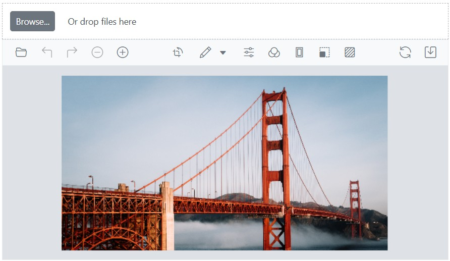
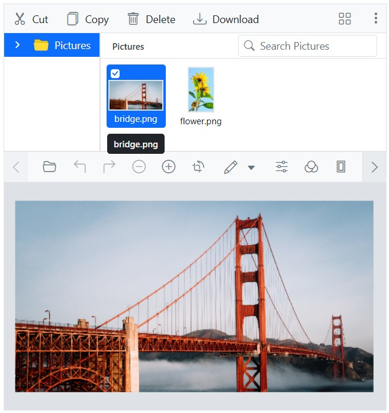
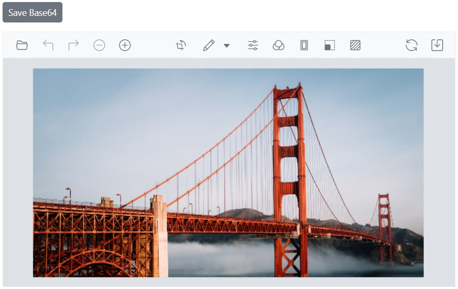

# Open and Save in the Blazor Image Editor component

The [Blazor Image Editor](https://www.syncfusion.com/blazor-components/blazor-image-editor) component supports importing an image into the canvas by converting it into a blob object. The Uploader component facilitates uploading an image from the user interface. After the upload, the image can be converted into a blob and drawn onto the canvas.

## Supported image formats

The Image Editor control supports five common image formats: PNG, JPEG, SVG, WEBP, and BMP. These formats enable working with a wide range of image files within the Image Editor.

When saving an edited image, the default file type is PNG. If a different format is required, specify another file type such as JPEG, SVG, or WEBP.

## Open an image

The [OpenAsync](https://help.syncfusion.com/cr/blazor/Syncfusion.Blazor.ImageEditor.SfImageEditor.html#Syncfusion_Blazor_ImageEditor_SfImageEditor_OpenAsync_System_Object_System_Boolean_System_String_) method in the Blazor Image Editor component opens an image provided in different formats. This method accepts a base64-encoded string, raw image data, or a hosted/online URL. Pass either the file name or the actual image data as an argument to `OpenAsync` to load the image into the Image Editor component. This flexibility supports images from various sources and formats.

### Opening local images in the Blazor Image Editor 

Local images can be opened in the Image Editor by placing the image in the same folder as the sample and specifying the local file name directly in the open method.

Note: To load an image in the Image Editor, place the image within the application's "wwwroot" folder.

```cshtml
@using Syncfusion.Blazor.ImageEditor 

<SfImageEditor @ref="ImageEditor" Toolbar="customToolbarItem" Height="400">
    <ImageEditorEvents Created="OpenAsync"></ImageEditorEvents>
</SfImageEditor> 

@code { 
    SfImageEditor ImageEditor; 
    private List<ImageEditorToolbarItemModel> customToolbarItem = new List<ImageEditorToolbarItemModel>() { }; 

    private async void OpenAsync() 
    { 
        await ImageEditor.OpenAsync("bridge.png"); 
    } 
}
```


### Open an image from base64 format 

Images can be opened in the Image Editor using a Base64-encoded string. Pass the Base64 string to the [OpenAsync](https://help.syncfusion.com/cr/blazor/Syncfusion.Blazor.ImageEditor.SfImageEditor.html#Syncfusion_Blazor_ImageEditor_SfImageEditor_OpenAsync_System_Object_System_Boolean_System_String_) method to load the image into the editor.

`Note:` The Base64 representation of an image can be obtained from the Image Editor using the [GetImageDataUrlAsync](https://help.syncfusion.com/cr/blazor/Syncfusion.Blazor.ImageEditor.SfImageEditor.html#Syncfusion_Blazor_ImageEditor_SfImageEditor_GetImageDataUrlAsync_System_Boolean_) method. This process is explained in a later section.

```cshtml
@using Syncfusion.Blazor.ImageEditor
@using Syncfusion.Blazor.Buttons

<div style="padding-bottom: 15px">
    <SfButton OnClick="SaveAsync">Save Base64</SfButton>
    <SfButton OnClick="OpenBaseAsync">Open Base64</SfButton>
</div>
<SfImageEditor @ref="ImageEditor" Height="400">
    <ImageEditorEvents Created="OpenAsync"></ImageEditorEvents>
</SfImageEditor>

@code {
    SfImageEditor ImageEditor;
    private string base64String;

    private async void OpenAsync()
    {
        await ImageEditor.OpenAsync("https://ej2.syncfusion.com/react/demos/src/image-editor/images/bridge.png");
    }

    private async void SaveAsync()
    {
        var imageDataUrl = await ImageEditor.GetImageDataUrlAsync();
        if (!string.IsNullOrEmpty(imageDataUrl))
        {
            int base64Index = imageDataUrl.IndexOf(',') + 1;
            base64String = imageDataUrl.Substring(base64Index);
        }
    }

    private async void OpenBaseAsync()
    {
        await ImageEditor.OpenAsync("data:image/png;base64," + base64String);
    }
}
```


### Open an image from Blob storage

Images can be opened in the Image Editor from Blob storage. Retrieve the image Blob from storage and pass it to the [OpenAsync](https://help.syncfusion.com/cr/blazor/Syncfusion.Blazor.ImageEditor.SfImageEditor.html#Syncfusion_Blazor_ImageEditor_SfImageEditor_OpenAsync_System_Object_System_Boolean_System_String_) method to load the image into the editor.

`Note:` The Blob URL representation of an image can be obtained from the Image Editor using the [GetImageDataUrlAsync](https://help.syncfusion.com/cr/blazor/Syncfusion.Blazor.ImageEditor.SfImageEditor.html#Syncfusion_Blazor_ImageEditor_SfImageEditor_GetImageDataUrlAsync_System_Boolean_) method. This process is explained in a later section. 

```cshtml
@using Syncfusion.Blazor.ImageEditor
@using Syncfusion.Blazor.Buttons
@using System.IO

<div style="padding-bottom: 15px">
    <SfButton OnClick="SaveBlobAsync">Save Blob</SfButton>
    <SfButton OnClick="OpenBlobAsync">Open Blob</SfButton>
</div>
<SfImageEditor @ref="ImageEditor" Height="400">
    <ImageEditorEvents Created="OnImageEditorCreated"></ImageEditorEvents>
</SfImageEditor>

@code {
    private SfImageEditor ImageEditor;
    private string blobUrl;

    private async void OnImageEditorCreated()
    {
        await ImageEditor.OpenAsync("https://ej2.syncfusion.com/react/demos/src/image-editor/images/bridge.png");
    }

    private async Task SaveBlobAsync()
    {
        var imageDataUrl = await ImageEditor.GetImageDataUrlAsync();
        if (!string.IsNullOrEmpty(imageDataUrl))
        {
            int base64Index = imageDataUrl.IndexOf(',') + 1;
            var base64String = imageDataUrl.Substring(base64Index);
            var bytes = Convert.FromBase64String(base64String);
            var stream = new MemoryStream(bytes);
            blobUrl = "data:image/png;base64," + base64String;
        }
    }

    private async Task OpenBlobAsync()
    {
        if (!string.IsNullOrEmpty(blobUrl))
        {
            await ImageEditor.OpenAsync(blobUrl);
        }
    }
}
```


### Open an image from File Uploader 

Images can be opened in the Image Editor using a file uploader. After selecting an image file from a device, pass the file to the [OpenAsync](https://help.syncfusion.com/cr/blazor/Syncfusion.Blazor.ImageEditor.SfImageEditor.html#Syncfusion_Blazor_ImageEditor_SfImageEditor_OpenAsync_System_Object_System_Boolean_System_String_) method to load it into the editor.

```cshtml
@using Syncfusion.Blazor.Inputs
@using Syncfusion.Blazor.ImageEditor
@using System.IO

<div class="e-img-editor-sample">
    <SfUploader AllowedExtensions=".jpg,.jpeg,.png" @ref="uploader" ShowFileList=false>
        <UploaderEvents ValueChange="@OnImageSelected"></UploaderEvents>
    </SfUploader>
    <SfImageEditor @ref="ImageEditor" Height="350px"></SfImageEditor>
</div>

@code {
    private SfUploader uploader;
    private SfImageEditor ImageEditor;

    private async Task OnImageSelected(UploadChangeEventArgs args)
    {
        if (args.Files?.Count > 0)
        {
            var file = args.Files[0];
            if (file != null)
            {
                using var memoryStream = new MemoryStream();
                await file.File.OpenReadStream(long.MaxValue).CopyToAsync(memoryStream);
                string base64String = Convert.ToBase64String(memoryStream.ToArray());
                string dataUrl = $"data:image/png;base64,{base64String}";
                await ImageEditor.OpenAsync(dataUrl);
            }
        }
    }
}
```



### Open an image from File Manager 

Images can be opened in the Image Editor using the File Manager. After selecting an image from the File Manager, pass the file to the [OpenAsync](https://help.syncfusion.com/cr/blazor/Syncfusion.Blazor.ImageEditor.SfImageEditor.html#Syncfusion_Blazor_ImageEditor_SfImageEditor_OpenAsync_System_Object_System_Boolean_System_String_) method to load it into the editor. 

```cshtml
@using Syncfusion.Blazor.FileManager
@using Syncfusion.Blazor.ImageEditor
@inject NavigationManager UriHelper

<div class="container mt-4">
    <div class="row">
        <div class="col-md-6">
            <SfFileManager TValue="FileManagerDirectoryContent" @ref="fileManager" Height="200px" Width="100%">
                <FileManagerEvents TValue="FileManagerDirectoryContent"
                                   OnRead="OnReadAsync"
                                   BeforeImageLoad="BeforeImageLoadAsync"
                                   OnFileOpen="OnFileOpenAsync"
                                   BeforePopupOpen="BeforePopupOpenAsync">
                </FileManagerEvents>
            </SfFileManager>
        </div>
        <div class="col-md-6">
            <SfImageEditor @ref="imageEditor" Height="350px" Width="100%">
            </SfImageEditor>
        </div>
    </div>
</div>

@code {
    private SfImageEditor imageEditor;
    private SfFileManager<FileManagerDirectoryContent> fileManager;
    public FileManagerService FileService = new FileManagerService();

    public async Task OnReadAsync(ReadEventArgs<FileManagerDirectoryContent> args)
    {
        args.Response = await FileService.ReadAsync(args.Path, args.Folder);
    }

    public void BeforeImageLoadAsync(BeforeImageLoadEventArgs<FileManagerDirectoryContent> args)
    {
        string relativePath = $"https://ej2.syncfusion.com/react/demos/src/image-editor/images/{args.FileDetails.Name}";
        args.ImageUrl = UriHelper.ToAbsoluteUri(relativePath).ToString();
    }

    private async Task OnFileOpenAsync(FileOpenEventArgs<FileManagerDirectoryContent> args)
    {
        if (args.FileDetails != null && args.FileDetails.IsFile)
        {
            string relativePath = $"https://ej2.syncfusion.com/react/demos/src/image-editor/images/{args.FileDetails.Name}";
            await imageEditor.OpenAsync(relativePath);
        }
    }

    public void BeforePopupOpenAsync(BeforePopupOpenCloseEventArgs args)
    {
        args.Cancel = true;
    }

    public class FileManagerService
    {
        public List<FileManagerDirectoryContent> Data = new List<FileManagerDirectoryContent>();

        public FileManagerService()
        {
            this.GetData();
        }

        private void GetData()
        {
            Data.Add(new FileManagerDirectoryContent()
            {
                Id = "0",
                Name = "Pictures",
                IsFile = false,
                HasChild = true,
                ParentId = null,
                FilterPath = "",
                FilterId = "",
                Type = "folder",
                Size = 1779448,
                DateCreated = new DateTime(2022, 1, 2),
                DateModified = new DateTime(2022, 2, 3),
                CaseSensitive = false,
                ShowHiddenItems = false
            });

            Data.Add(new FileManagerDirectoryContent()
            {
                Id = "1",
                Name = "bridge.png",
                IsFile = true,
                HasChild = false,
                ParentId = "0",
                FilterPath = "/Pictures/",
                FilterId = "0/",
                Type = ".png",
                Size = 680786,
                DateCreated = new DateTime(2022, 1, 2),
                DateModified = new DateTime(2022, 2, 3),
                CaseSensitive = false,
                ShowHiddenItems = false
            });

            Data.Add(new FileManagerDirectoryContent()
            {
                Id = "2",
                Name = "flower.png",
                IsFile = true,
                HasChild = false,
                ParentId = "0",
                FilterPath = "/Pictures/",
                FilterId = "0/",
                Type = ".png",
                Size = 680786,
                DateCreated = new DateTime(2022, 1, 2),
                DateModified = new DateTime(2022, 2, 3),
                CaseSensitive = false,
                ShowHiddenItems = false
            });
        }

        public async Task<FileManagerResponse<FileManagerDirectoryContent>> ReadAsync(string path, List<FileManagerDirectoryContent> fileDetails)
        {
            var response = new FileManagerResponse<FileManagerDirectoryContent>();

            if (path == "/")
            {
                var parentId = Data.First(x => x.FilterPath == "").Id;
                response.CWD = Data.First(x => x.FilterPath == "");
                response.Files = Data.Where(x => x.ParentId == parentId).ToList();
            }
            else
            {
                var id = fileDetails.Count > 0 && fileDetails[0] != null
                    ? fileDetails[0].Id
                    : Data.First(x => x.FilterPath == path).ParentId;

                response.CWD = Data.First(x => x.Id == id);
                response.Files = Data.Where(x => x.ParentId == id).ToList();
            }

            await Task.Yield();
            return await Task.FromResult(response);
        }
    }
}
```



### Open an image from Treeview 

Images can be opened in the Syncfusion<sup style="font-size:70%">&reg;</sup> Image Editor by selecting a node from a tree view. When an image node is selected, the corresponding image is loaded into the editor using the [OpenAsync](https://help.syncfusion.com/cr/blazor/Syncfusion.Blazor.ImageEditor.SfImageEditor.html#Syncfusion_Blazor_ImageEditor_SfImageEditor_OpenAsync_System_Object_System_Boolean_System_String_) method.

```cshtml
@using Syncfusion.Blazor.Navigations
@using Syncfusion.Blazor.ImageEditor
@inject NavigationManager UriHelper

<div class="container mt-4">
    <div class="row">
        <div class="col-md-6">
            <SfTreeView TValue="TreeItem" @ref="treeView" SortOrder="Syncfusion.Blazor.Navigations.SortOrder.Ascending">
                <TreeViewFieldsSettings DataSource="@TreeDataSource"
                                        Id="NodeId"
                                        Text="NodeText"
                                        Expanded="Expanded"
                                        Child="Child"
                                        IconCss="Icon"
                                        ImageUrl="ImageUrl">
                </TreeViewFieldsSettings>
                <TreeViewEvents TValue="TreeItem" NodeSelected="NodeSelected">
                </TreeViewEvents>
            </SfTreeView>
        </div>
        <div class="col-md-6">
            <SfImageEditor @ref="imageEditor" Height="350px" Width="100%">
            </SfImageEditor>
        </div>
    </div>
</div>

@code {
    private SfImageEditor imageEditor;
    private SfTreeView<TreeItem> treeView;
    List<TreeItem> TreeDataSource = new();

    protected override void OnInitialized()
    {
        TreeDataSource.Add(new TreeItem
        {
            NodeId = "01",
            NodeText = "Pictures",
            Icon = "folder",
            Expanded = true,
            Child = new List<TreeItem>
            {
                new TreeItem
                {
                    NodeId = "01-01",
                    NodeText = "Flower",
                    ImageUrl = "https://ej2.syncfusion.com/react/demos/src/image-editor/images/flower.png"
                },
                new TreeItem
                {
                    NodeId = "01-02",
                    NodeText = "Bridge",
                    ImageUrl = "https://ej2.syncfusion.com/react/demos/src/image-editor/images/bridge.png"
                }
            }
        });
    }

    public async void NodeSelected(NodeSelectEventArgs args)
    {
        var selectedNodes = treeView.GetTreeData(args.NodeData.Id);
        if (selectedNodes.Count > 0 && selectedNodes[0].ImageUrl != null)
        {
            await imageEditor.OpenAsync(selectedNodes[0].ImageUrl);
        }
    }

    class TreeItem
    {
        public string? NodeId { get; set; }
        public string? NodeText { get; set; }
        public string? Icon { get; set; }
        public string? ImageUrl { get; set; }
        public bool Expanded { get; set; }
        public List<TreeItem> Child { get; set; } = new();
    }
}
```


### Add watermarks while opening an image 

The [FileOpenEventArgs](https://help.syncfusion.com/cr/blazor/Syncfusion.Blazor.ImageEditor.FileOpenEventArgs.html) event triggers once the image is loaded into the Image Editor. After this event, use the [DrawTextAsync](https://help.syncfusion.com/cr/blazor/Syncfusion.Blazor.ImageEditor.SfImageEditor.html#Syncfusion_Blazor_ImageEditor_SfImageEditor_DrawTextAsync_System_Double_System_Double_System_String_System_String_System_Int32_System_Boolean_System_Boolean_System_String_System_Boolean_System_Int32_System_String_System_String_System_Int32_) method to add a watermark. This approach draws the watermark on the canvas each time an image is opened, which is useful for copyright-related content.

```cshtml
@using Syncfusion.Blazor.ImageEditor

<SfImageEditor @ref="ImageEditor" Height="400">
    <ImageEditorEvents Created="OpenAsync" FileOpened="FileOpenedAsync"></ImageEditorEvents>
</SfImageEditor> 

@code { 
    SfImageEditor ImageEditor;

    private async void OpenAsync() 
    { 
        await ImageEditor.OpenAsync("https://ej2.syncfusion.com/react/demos/src/image-editor/images/bridge.png"); 
    }

    private async void FileOpenedAsync() 
    { 
        ImageDimension Dimension = await ImageEditor.GetImageDimensionAsync();
        await ImageEditor.DrawTextAsync(Dimension.X.Value, Dimension.Y.Value, "Syncfusion", "Arial", 40, false, false, "#80330075");
    }
}
```


### Opening Images with Custom Width and Height

Images can be opened with specific width and height values using optional parameters in the [OpenAsync](https://help.syncfusion.com/cr/blazor/Syncfusion.Blazor.ImageEditor.SfImageEditor.html#Syncfusion_Blazor_ImageEditor_SfImageEditor_OpenAsync_System_Object_System_Boolean_System_String_) method. The optional parameters `width`, `height`, and `isAspectRatio` allow control over image dimensions with the option to preserve the original aspect ratio.
 
The following behaviors are supported through these properties:
- Contains behavior - When a single dimension (`width` or `height`) is provided with `isAspectRatio` enabled, the other dimension is calculated automatically to maintain the original proportions.

- Cover behavior - When both `width` and `height` are specified with `isAspectRatio` set to `true`, the image scales proportionally to fit within the given dimensions while preserving the aspect ratio.

- Stretch or Shrink behavior - When `isAspectRatio` is `false`, the image strictly follows the specified `width` and `height`, allowing stretching or shrinking regardless of the original aspect ratio.

The following example demonstrates all three behaviors using the OpenAsync method.

```cshtml
@using Syncfusion.Blazor.ImageEditor 
@using Syncfusion.Blazor.Buttons

<SfImageEditor @ref="ImageEditor" Toolbar="customToolbarItem" Height="330" Width="550">
    <ImageEditorEvents Created="OpenAsync"></ImageEditorEvents>
</SfImageEditor>
<div style="display: flex; gap: 12px; margin-top: 10px">
    <SfButton CssClass="e-primary" OnClick="ContainsAsync">Fit to Width (Aspect Ratio)</SfButton>
    <SfButton CssClass="e-primary" OnClick="CoverAsync">Cover (Aspect Ratio)</SfButton>
    <SfButton CssClass="e-primary" OnClick="StretchAsync">Stretch / Shrink</SfButton>
</div>
@code {
    SfImageEditor ImageEditor;
    private List<ImageEditorToolbarItemModel> customToolbarItem = new List<ImageEditorToolbarItemModel>() { };

    private async void OpenAsync()
    {
        await ImageEditor.OpenAsync("https://ej2.syncfusion.com/react/demos/src/image-editor/images/bridge.png");
    }

    private async void ContainsAsync()
    {
        await ImageEditor.OpenAsync("https://ej2.syncfusion.com/react/demos/src/image-editor/images/bridge.png", true, "", 550, -1, true);
    }
    private async void CoverAsync()
    {
        await ImageEditor.OpenAsync("https://ej2.syncfusion.com/react/demos/src/image-editor/images/bridge.png", true, "", 550, 550, true);
    }
    private async void StretchAsync()
    {
        await ImageEditor.OpenAsync("https://ej2.syncfusion.com/react/demos/src/image-editor/images/bridge.png", true, "", 330, 330, false);
    }
}
```


## Save as image

The [ExportAsync](https://help.syncfusion.com/cr/blazor/Syncfusion.Blazor.ImageEditor.SfImageEditor.html#Syncfusion_Blazor_ImageEditor_SfImageEditor_ExportAsync_System_String_Syncfusion_Blazor_ImageEditor_ImageEditorFileType_System_Double_) method in the Blazor Image Editor component saves the modified image as an image and accepts a file name and file type as parameters. The file type parameter supports PNG, JPEG, SVG, and WEBP; the default file type is PNG. Images can be saved with a specified file name, file type, and image quality.

In the following example, the `ExportAsync` method is invoked on a button click.

```cshtml
@using Syncfusion.Blazor.ImageEditor
@using Syncfusion.Blazor.Buttons

<div style="padding-bottom: 15px">
    <SfButton OnClick="ExportAsync">Export</SfButton>
</div>
<SfImageEditor @ref="ImageEditor" Toolbar="customToolbarItem" Height="400">
    <ImageEditorEvents Created="OpenAsync"></ImageEditorEvents>
</SfImageEditor> 

@code { 
    SfImageEditor ImageEditor; 
    private List<ImageEditorToolbarItemModel> customToolbarItem = new List<ImageEditorToolbarItemModel>() { }; 

    private async void OpenAsync() 
    { 
        await ImageEditor.OpenAsync("https://ej2.syncfusion.com/react/demos/src/image-editor/images/bridge.png"); 
    }

    private async void ExportAsync()
    {
        await ImageEditor.ExportAsync("Syncfusion", ImageEditorFileType.PNG);
    }
}
```


### Save the image as base64 format

To save an image as base64, use the [GetImageDataUrlAsync](https://help.syncfusion.com/cr/blazor/Syncfusion.Blazor.ImageEditor.SfImageEditor.html#Syncfusion_Blazor_ImageEditor_SfImageEditor_GetImageDataUrlAsync_System_Boolean_) method of the editor to retrieve the image data and convert it into a Data URL containing the base64-encoded string. By invoking the [OpenAsync](https://help.syncfusion.com/cr/blazor/Syncfusion.Blazor.ImageEditor.SfImageEditor.html#Syncfusion_Blazor_ImageEditor_SfImageEditor_OpenAsync_System_Object_System_Boolean_System_String_) method on the Syncfusion<sup style="font-size:70%">&reg;</sup> Image Editor instance, this Data URL can be loaded into the editor. The resulting base64 string can be embedded in HTML or CSS or transmitted over data channels without relying on an external file.

```cshtml
@using Syncfusion.Blazor.ImageEditor
@using Syncfusion.Blazor.Buttons

<div style="padding-bottom: 15px">
    <SfButton OnClick="SaveAsync">Save Base64</SfButton>
</div>
<SfImageEditor @ref="ImageEditor" Height="400">
    <ImageEditorEvents Created="OpenAsync"></ImageEditorEvents>
</SfImageEditor>

@code {
    SfImageEditor ImageEditor;
    private string base64String;

    private async void OpenAsync()
    {
        await ImageEditor.OpenAsync("https://ej2.syncfusion.com/react/demos/src/image-editor/images/bridge.png");
    }

    private async void SaveAsync()
    {
        var imageDataUrl = await ImageEditor.GetImageDataUrlAsync();
        if (!string.IsNullOrEmpty(imageDataUrl))
        {
            int base64Index = imageDataUrl.IndexOf(',') + 1;
            base64String = imageDataUrl.Substring(base64Index);
        }
    }
}
```



### Save the image as byte[]

To save an image as a byte array, use the [GetImageDataAsync](https://help.syncfusion.com/cr/blazor/Syncfusion.Blazor.ImageEditor.SfImageEditor.html#Syncfusion_Blazor_ImageEditor_SfImageEditor_GetImageDataAsync) method of the editor to retrieve a byte array. Then invoke the [OpenAsync](https://help.syncfusion.com/cr/blazor/Syncfusion.Blazor.ImageEditor.SfImageEditor.html#Syncfusion_Blazor_ImageEditor_SfImageEditor_OpenAsync_System_Object_System_Boolean_System_String_) method on the Syncfusion<sup style="font-size:70%">&reg;</sup> Image Editor instance to load this byte array into the editor. The resulting byte array can be stored in a database for data management and maintenance.

```cshtml
@using Syncfusion.Blazor.ImageEditor
@using Syncfusion.Blazor.Buttons

<div style="padding-bottom: 15px">
    <SfButton OnClick="SaveImageAsByteArray">Save Byte[]</SfButton>
    <SfButton OnClick="OpenImage">Open Byte[]</SfButton>
</div>
<SfImageEditor @ref="ImageEditor" Height="400">
    <ImageEditorEvents Created="OpenAsync"></ImageEditorEvents>
</SfImageEditor>

@code {
    SfImageEditor ImageEditor;
    private byte[] savedImageData;

    private async void OpenAsync()
    {
        await ImageEditor.OpenAsync("https://ej2.syncfusion.com/react/demos/src/image-editor/images/bridge.png");
    }

    private async Task SaveImageAsByteArray()
    {
        savedImageData = await ImageEditor.GetImageDataAsync();
    }

    private async Task OpenImage()
    {
        if (savedImageData != null)
        {
            string base64String = Convert.ToBase64String(savedImageData);
            base64String = "data:image/png;base64," + base64String;
            await ImageEditor.OpenAsync(base64String);
        }
    }
}
```


### Save the image as Blob

To save an image as a blob, use the [GetImageDataUrlAsync](https://help.syncfusion.com/cr/blazor/Syncfusion.Blazor.ImageEditor.SfImageEditor.html#Syncfusion_Blazor_ImageEditor_SfImageEditor_GetImageDataUrlAsync_System_Boolean_) method of the editor to retrieve the image data and convert it into a blob. Then invoke the open method on the Syncfusion<sup style="font-size:70%">&reg;</sup> Image Editor instance to load this byte array into the editor. The resulting byte array can be stored in a database for data management and maintenance. 

```cshtml
@using Syncfusion.Blazor.ImageEditor
@using Syncfusion.Blazor.Buttons
@using System.IO

<div style="padding-bottom: 15px">
    <SfButton OnClick="SaveBlobAsync">Save Blob</SfButton>
</div>
<SfImageEditor @ref="ImageEditor" Height="400">
    <ImageEditorEvents Created="OnImageEditorCreated"></ImageEditorEvents>
</SfImageEditor>

@code {
    private SfImageEditor ImageEditor;
    private string blobUrl;

    private async void OnImageEditorCreated()
    {
        await ImageEditor.OpenAsync("https://ej2.syncfusion.com/react/demos/src/image-editor/images/bridge.png");
    }

    private async Task SaveBlobAsync()
    {
        var imageDataUrl = await ImageEditor.GetImageDataUrlAsync();
        if (!string.IsNullOrEmpty(imageDataUrl))
        {
            int base64Index = imageDataUrl.IndexOf(',') + 1;
            var base64String = imageDataUrl.Substring(base64Index);
            var bytes = Convert.FromBase64String(base64String);
            var stream = new MemoryStream(bytes);
            blobUrl = "data:image/png;base64," + base64String;
        }
    }
}
```


### Save as image in server

The [GetImageDataUrlAsync](https://help.syncfusion.com/cr/blazor/Syncfusion.Blazor.ImageEditor.SfImageEditor.html#Syncfusion_Blazor_ImageEditor_SfImageEditor_GetImageDataUrlAsync_System_Boolean_) method in the Blazor Image Editor component retrieves the current image data URL from the Image Editor component.

The value returned from this method can be used to save the edited image to a database as well as open it in the Image Editor using the [OpenAsync](https://help.syncfusion.com/cr/blazor/Syncfusion.Blazor.ImageEditor.SfImageEditor.html#Syncfusion_Blazor_ImageEditor_SfImageEditor_OpenAsync_System_Object_System_Boolean_System_String_) method.

N> Increase the connection buffer size in Blazor Image Editor component

The Syncfusion's Blazor Image Editor component allows increasing the connection buffer size by adding the following service in Program.cs if the image size is large.

```cshtml
builder.Services.AddServerSideBlazor().AddHubOptions(o => { o.MaximumReceiveMessageSize = 102400000; });
```

### Remove default Save button and add custom button to save the image to server 

The [Toolbar](https://help.syncfusion.com/cr/blazor/Syncfusion.Blazor.ImageEditor.SfImageEditor.html#Syncfusion_Blazor_ImageEditor_SfImageEditor_Toolbar) property can be used to replace the default save button with a custom one. Then use the [GetImageDataUrlAsync](https://help.syncfusion.com/cr/blazor/Syncfusion.Blazor.ImageEditor.SfImageEditor.html#Syncfusion_Blazor_ImageEditor_SfImageEditor_GetImageDataUrlAsync_System_Boolean_) method to retrieve the image data, convert it to base64 format, and save it to the server, providing more control over the image-saving process.

```cshtml
@using Syncfusion.Blazor.ImageEditor
@using Syncfusion.Blazor.Buttons

<div style="padding-bottom: 15px">
    <SfButton OnClick="SaveImage">Save to Server</SfButton>
</div>

<SfImageEditor @ref="ImageEditor" Height="400px">
    <ImageEditorEvents Created="OpenAsync"></ImageEditorEvents>
</SfImageEditor>

@code {
    private SfImageEditor ImageEditor;
    private string base64String;
    private async void OpenAsync()
    {
        await ImageEditor.OpenAsync("https://ej2.syncfusion.com/react/demos/src/image-editor/images/bridge.png");
    }
    private async Task SaveImage()
    {
        var imageDataUrl = await ImageEditor.GetImageDataUrlAsync();
        if (!string.IsNullOrEmpty(imageDataUrl))
        {
            int base64Index = imageDataUrl.IndexOf(',') + 1;
            base64String = imageDataUrl.Substring(base64Index);
        }
    }
}
```


### Prevent default save option and save the image to specific location 

The [Saving](https://help.syncfusion.com/cr/blazor/Syncfusion.Blazor.ImageEditor.ImageEditorEvents.html#Syncfusion_Blazor_ImageEditor_ImageEditorEvents_Saving) event, which triggers just before the image is downloaded, can be used to override the default save option by setting `args.cancel` to true. Afterward, use the [GetImageDataUrlAsync](https://help.syncfusion.com/cr/blazor/Syncfusion.Blazor.ImageEditor.SfImageEditor.html#Syncfusion_Blazor_ImageEditor_SfImageEditor_GetImageDataUrlAsync_System_Boolean_) method to retrieve the current image data and convert it into a format like `byte[]`, `blob`, or `base64` for further processing.

```cshtml
@using Syncfusion.Blazor.ImageEditor
@using System.IO

<div>
    <SfImageEditor @ref="ImageEditor" Height="400px">
        <ImageEditorEvents Created="OpenAsync" Saving="OnBeforeSave"></ImageEditorEvents>
    </SfImageEditor>
</div>

@code {
    private SfImageEditor ImageEditor;
    private async void OpenAsync()
    {
        await ImageEditor.OpenAsync("https://ej2.syncfusion.com/react/demos/src/image-editor/images/bridge.png");
    }
    private async Task OnBeforeSave(SaveEventArgs args)
    {
        args.Cancel = true;
        var imageData = await ImageEditor.GetImageDataUrlAsync();
        if (!string.IsNullOrEmpty(imageData) && imageData.Contains(","))
        {
            var base64Data = imageData.Split(',')[1];
            byte[] imageBytes = Convert.FromBase64String(base64Data);
        }
    }
}
```


## Events to handle Save Actions 

The Image Editor provides several events related to opening and saving images. These events offer detailed control over the image handling process. For comprehensive information about these events, including their triggers and usage, refer to the dedicated section on open and save support.

### File opened event

The [FileOpened](https://help.syncfusion.com/cr/blazor/Syncfusion.Blazor.ImageEditor.ImageEditorEvents.html#Syncfusion_Blazor_ImageEditor_ImageEditorEvents_FileOpened) event is triggered in the Blazor Image Editor component after an image is successfully loaded. It provides the [FileOpenEventArgs](https://help.syncfusion.com/cr/blazor/Syncfusion.Blazor.ImageEditor.FileOpenEventArgs.html) as the event argument, which contains two specific arguments:

- [FileName](https://help.syncfusion.com/cr/blazor/Syncfusion.Blazor.ImageEditor.FileOpenEventArgs.html#Syncfusion_Blazor_ImageEditor_FileOpenEventArgs_FileName) - A string that contains the file name of the opened image.

- [FileType](https://help.syncfusion.com/cr/blazor/Syncfusion.Blazor.ImageEditor.FileOpenEventArgs.html#Syncfusion_Blazor_ImageEditor_FileOpenEventArgs_FileType) - A string that contains the type of the opened image, such as PNG, JPEG, SVG, WEBP, and BMP. 

These arguments enable retrieving information about the loaded image, such as its file name and type, which can be used for additional actions.

### Saving event

The [Saving](https://help.syncfusion.com/cr/blazor/Syncfusion.Blazor.ImageEditor.ImageEditorEvents.html#Syncfusion_Blazor_ImageEditor_ImageEditorEvents_Saving) event is triggered in the Blazor Image Editor component when an image is being saved to the local disk. It provides the [SaveEventArgs](https://help.syncfusion.com/cr/blazor/Syncfusion.Blazor.ImageEditor.SaveEventArgs.html) as the event argument, which includes the following specific arguments:

- [FileName](https://help.syncfusion.com/cr/blazor/Syncfusion.Blazor.ImageEditor.SaveEventArgs.html#Syncfusion_Blazor_ImageEditor_SaveEventArgs_FileName) - A string that holds the file name of the saved image.

- [FileType](https://help.syncfusion.com/cr/blazor/Syncfusion.Blazor.ImageEditor.SaveEventArgs.html#Syncfusion_Blazor_ImageEditor_SaveEventArgs_FileType) - A string indicating the format of the saved image, such as PNG, JPEG, SVG, and WEBP.

- [Cancel](https://help.syncfusion.com/cr/blazor/Syncfusion.Blazor.ImageEditor.SaveEventArgs.html#Syncfusion_Blazor_ImageEditor_SaveEventArgs_Cancel) - A boolean value that can be set to true to cancel the saving action. The default value is false.

These arguments provide control over the save operation, including file naming, format selection, and cancellation.

### Created event

The [Created](https://help.syncfusion.com/cr/blazor/Syncfusion.Blazor.ImageEditor.ImageEditorEvents.html#Syncfusion_Blazor_ImageEditor_ImageEditorEvents_Created) event is triggered once the Blazor Image Editor component is created. This event indicates that the component has been fully initialized and is ready to be used. It provides an opportunity to render the Image Editor with a predefined set of initial settings, including the image, annotations, and transformations.

In the following example, the `Created` event is used to load an image.

```cshtml
@using Syncfusion.Blazor.ImageEditor 

<SfImageEditor @ref="ImageEditor" Toolbar="customToolbarItem" Height="400">
    <ImageEditorEvents Created="OpenAsync"></ImageEditorEvents>
</SfImageEditor> 

@code { 
    SfImageEditor ImageEditor; 
    private List<ImageEditorToolbarItemModel> customToolbarItem = new List<ImageEditorToolbarItemModel>() { }; 

    private async void OpenAsync() 
    { 
        await ImageEditor.OpenAsync("https://ej2.syncfusion.com/react/demos/src/image-editor/images/bridge.png"); 
    } 
}
```


### Destroyed event

The [Destroyed](https://help.syncfusion.com/cr/blazor/Syncfusion.Blazor.ImageEditor.ImageEditorEvents.html#Syncfusion_Blazor_ImageEditor_ImageEditorEvents_Destroyed) event is triggered once the Blazor Image Editor component is destroyed or removed from the application. This event indicates that the component and its associated resources have been cleaned up and are no longer active.
