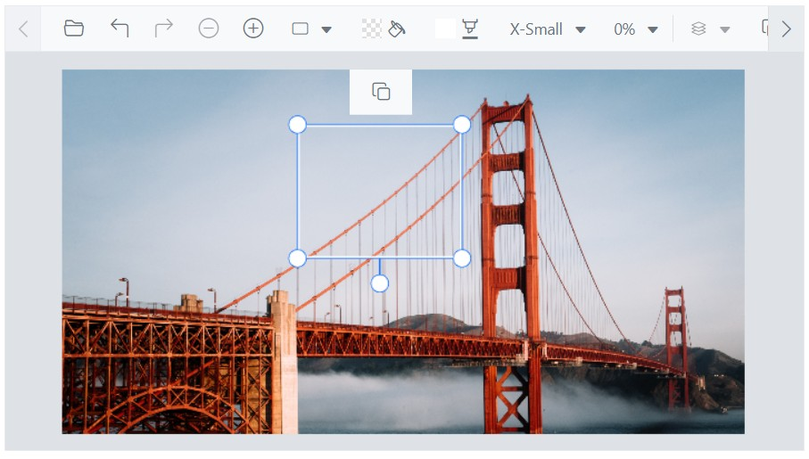

# Quick Access Toolbar in the Blazor Image Editor Component

The quick access toolbars in the Image Editor facilitate interactions with annotations such as Rectangle, Ellipse, Line, Arrow, and Path. These toolbars provide a configurable set of tools and options tailored to each annotation type. The toolbar appears only when an annotation is selected, ensuring a focused and contextual editing experience.

The [ShowQuickAccessToolbar](https://help.syncfusion.com/cr/blazor/Syncfusion.Blazor.ImageEditor.SfImageEditor.html#Syncfusion_Blazor_ImageEditor_SfImageEditor_ShowQuickAccessToolbar) property controls quick access toolbar visibility. The toolbar can be enabled or disabled, items can be added or removed, and a customized toolset can be configured.

## Add a custom toolbar item

The quick access toolbar that appears when inserting annotations in the Blazor Image Editor component is customizable using the [QuickAccessToolbarOpening](https://help.syncfusion.com/cr/blazor/Syncfusion.Blazor.ImageEditor.ImageEditorEvents.html#Syncfusion_Blazor_ImageEditor_ImageEditorEvents_QuickAccessToolbarOpening) event. This event is triggered when the quick access toolbar opens, allowing modification of its contents. Additional toolbar items can be included by accessing the `ToolbarItems` property of the [QuickAccessToolbarEventArgs](https://help.syncfusion.com/cr/blazor/Syncfusion.Blazor.ImageEditor.QuickAccessToolbarEventArgs.html) object within the event handler. By adding or removing items from `ToolbarItems` based on the `Item` property, the quick access toolbar options can be customized to match specific requirements for working with inserted annotations.

Here is an example of adding a custom toolbar item to the quick access toolbar.

```cshtml
@using Syncfusion.Blazor.ImageEditor
@using Syncfusion.Blazor.Navigations

<SfImageEditor @ref="ImageEditor" Height="400">
    <ImageEditorEvents Created="OpenAsync" QuickAccessToolbarOpening="QuickAccessToolbarOpening"></ImageEditorEvents>
</SfImageEditor>

@code {
    SfImageEditor ImageEditor;
    private async void OpenAsync()
    {
        await ImageEditor.OpenAsync("https://ej2.syncfusion.com/react/demos/src/image-editor/images/bridge.png");
    }

    private void QuickAccessToolbarOpening(QuickAccessToolbarEventArgs args)
    {
        args.ToolbarItems = new List<ImageEditorToolbarItemModel>() { new ImageEditorToolbarItemModel { Name = "Clone" } };
    }
}
```

