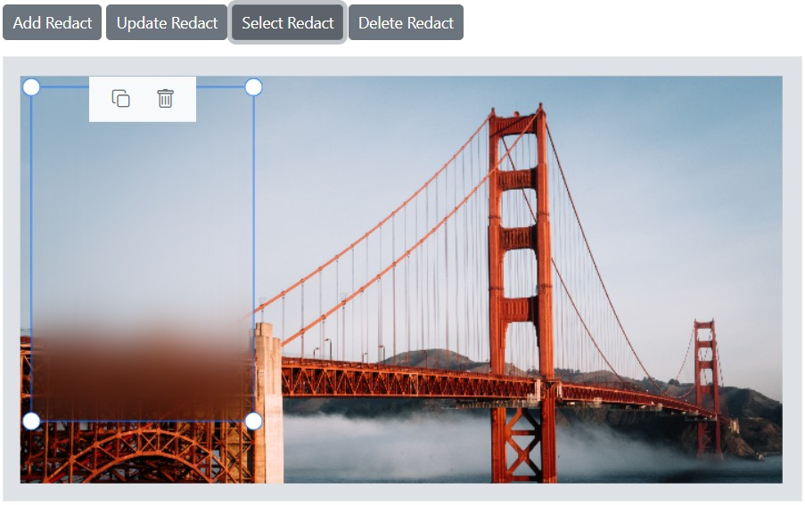

# Redact in the Blazor Image Editor component

The redact feature conceals sensitive content by applying blur or pixel effects to selected regions of an image. It supports privacy protection and regulatory compliance, enabling secure image sharing without exposing confidential information.

## Apply redact to the image

The Image Editor control provides the [DrawRedactAsync](https://help.syncfusion.com/cr/blazor/Syncfusion.Blazor.ImageEditor.SfImageEditor.html#Syncfusion_Blazor_ImageEditor_SfImageEditor_DrawRedactAsync_Syncfusion_Blazor_ImageEditor_RedactType_System_Double_System_Double_System_Double_System_Double_System_Int32_) method to draw a redaction on an image. This method accepts six parameters that define how the redaction is applied:

* redactType: Defines the redaction type to draw on the image, such as blur or pixelate. If not specified, redaction uses the default blur type.

* startX: Defines the x-coordinate of the redaction. If not specified, redaction starts from the image center.

* startY: Defines the y-coordinate of the redaction. If not specified, redaction starts from the image center.

* width: Defines the redaction width. The default value is 100.

* height: Defines the redaction height. The default value is 50.

* value: Defines the blur intensity for blur-type redaction or the pixel size for pixelate-type redaction. The default is 20 because the default redaction type is blur.

## Selecting a redact

The Image Editor control provides the [SelectRedactAsync](https://help.syncfusion.com/cr/blazor/Syncfusion.Blazor.ImageEditor.SfImageEditor.html#Syncfusion_Blazor_ImageEditor_SfImageEditor_SelectRedactAsync_System_String_) method to select a redaction by its identifier. Use the [GetRedactsAsync](https://help.syncfusion.com/cr/blazor/Syncfusion.Blazor.ImageEditor.SfImageEditor.html#Syncfusion_Blazor_ImageEditor_SfImageEditor_GetRedactsAsync) method to obtain the redaction identifier and pass it to perform selection. This method accepts one parameter:

* id: Defines the redaction identifier to select a redaction on an image.

## Deleting a redact

The Image Editor control provides the [DeleteRedactAsync](https://help.syncfusion.com/cr/blazor/Syncfusion.Blazor.ImageEditor.SfImageEditor.html#Syncfusion_Blazor_ImageEditor_SfImageEditor_DeleteRedactAsync_System_String_) method to delete a redaction by its identifier. Use the [GetRedactsAsync](https://help.syncfusion.com/cr/blazor/Syncfusion.Blazor.ImageEditor.SfImageEditor.html#Syncfusion_Blazor_ImageEditor_SfImageEditor_GetRedactsAsync) method to obtain the redaction identifier and pass it to delete the corresponding redaction. This method accepts one parameter:

* id: Defines the redaction identifier to delete a redaction on an image.

## Updating a redact

The Image Editor control provides the [UpdateRedactAsync](https://help.syncfusion.com/cr/blazor/Syncfusion.Blazor.ImageEditor.SfImageEditor.html#Syncfusion_Blazor_ImageEditor_SfImageEditor_UpdateRedactAsync_Syncfusion_Blazor_ImageEditor_RedactSettings_System_Boolean_) method to update existing redactions by modifying height, width, blur intensity, or pixel size. Use the [GetRedactsAsync](https://help.syncfusion.com/cr/blazor/Syncfusion.Blazor.ImageEditor.SfImageEditor.html#Syncfusion_Blazor_ImageEditor_SfImageEditor_GetRedactsAsync) method to obtain the redactions and pass them to update the desired options. This method accepts two parameters:

* setting: Defines the redact settings to update for the redaction on an image.

* isSelected: Defines whether to show the redactions in the selected state.

## Getting redacts

The Image Editor control provides the [GetRedactsAsync](https://help.syncfusion.com/cr/blazor/Syncfusion.Blazor.ImageEditor.SfImageEditor.html#Syncfusion_Blazor_ImageEditor_SfImageEditor_GetRedactsAsync) method to retrieve all redaction details drawn in the Image Editor.

The following example demonstrates how to draw, select, delete, update, and get redactions using the `DrawRedactAsync`, `SelectRedactAsync`, `DeleteRedactAsync`, `UpdateRedactAsync` and `GetRedactsAsync` methods.

```cshtml
@using Syncfusion.Blazor.ImageEditor
@using Syncfusion.Blazor.Buttons

<div style="padding-bottom: 15px">
    <SfButton OnClick="addRedact">Add Redact</SfButton>
    <SfButton OnClick="updateRedact">Update Redact</SfButton>
    <SfButton OnClick="selectRedact">Select Redact</SfButton>
    <SfButton OnClick="deleteRedact">Delete Redact</SfButton>
</div>

<SfImageEditor @ref="ImageEditor" Toolbar="customToolbarItem" Height="400">
<ImageEditorEvents Created="OpenAsync"></ImageEditorEvents>
</SfImageEditor>
@code {
    private SfImageEditor ImageEditor;
    private List<ImageEditorToolbarItemModel> customToolbarItem = new List<ImageEditorToolbarItemModel>() { };
    private async void OpenAsync()
    {
        await ImageEditor.OpenAsync("https://ej2.syncfusion.com/react/demos/src/image-editor/images/bridge.png");
    }
    private async void addRedact()
    {
        ImageDimension Dimension = await ImageEditor.GetImageDimensionAsync();
        await ImageEditor.DrawRedactAsync(RedactType.Blur, Dimension.X.Value + 10, Dimension.Y.Value + 10, 200, 300);
    }
    private async void updateRedact()
    {
        RedactSettings[] redacts = await ImageEditor.GetRedactsAsync();
        if (redacts.Length > 0) {
            redacts[redacts.Length - 1].BlurIntensity = 100;
           await  ImageEditor.UpdateRedactAsync(redacts[redacts.Length - 1]);
        }
    }
    private async void selectRedact()
    {
        RedactSettings[] redacts = await ImageEditor.GetRedactsAsync();
        if (redacts.Length > 0) {
            await ImageEditor.SelectRedactAsync(redacts[redacts.Length - 1].ID);
        }
    }
    private async void deleteRedact()
    {
        RedactSettings[] redacts = await ImageEditor.GetRedactsAsync();
        if (redacts.Length > 0) {
            await ImageEditor.DeleteRedactAsync(redacts[redacts.Length - 1].ID);
        }
    }
}
```

