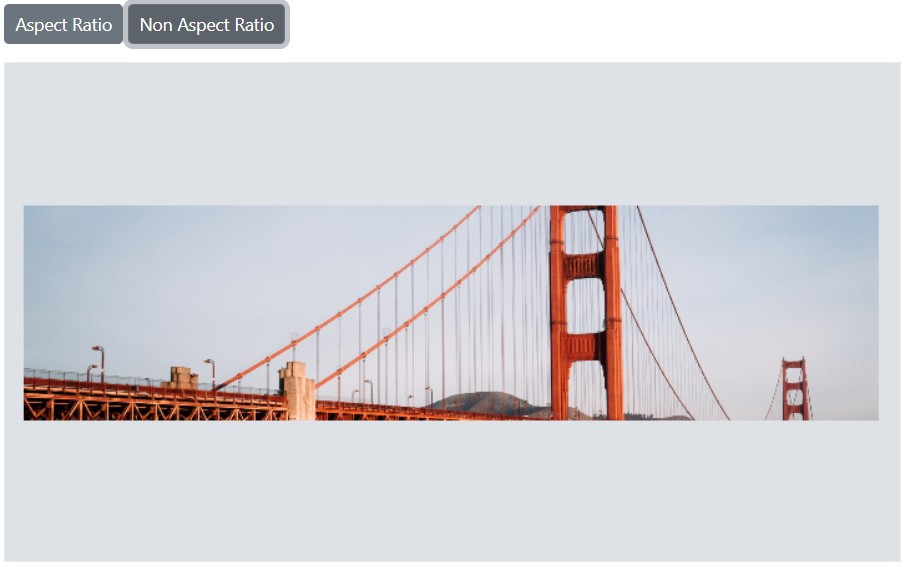

# Resize in the Blazor Image Editor component

The resize feature adjusts the size or dimensions of an image to match specific requirements for printing, web display, or other use cases.

## Apply resize to the image 

The Image Editor control provides the [`ImageResizeAsync`](https://help.syncfusion.com/cr/blazor/Syncfusion.Blazor.ImageEditor.SfImageEditor.html#Syncfusion_Blazor_ImageEditor_SfImageEditor_ImageResizeAsync_System_Int32_System_Int32_System_Boolean_) method to change image size. This method accepts three parameters that define the resizing behavior:

- width: Sets the target width of the image.

- height: Sets the target height of the image.

- isAspectRatio: Indicates whether to preserve the original aspect ratio.
  - When `true`, the image maintains its original aspect ratio. The specified width is applied, and the height adjusts automatically.
  - When `false`, the image resizes to the specified width and height without preserving the aspect ratio.
  - The default value is `false`.

Here is an example of resizing the image using the `ImageResizeAsync` method.

```cshtml
@using Syncfusion.Blazor.ImageEditor
@using Syncfusion.Blazor.Buttons

<div style="padding-bottom: 15px">
    <SfButton OnClick="AspectClick">Aspect Ratio</SfButton>
    <SfButton OnClick="NonAspectClick">Non Aspect Ratio</SfButton>
</div>

<SfImageEditor @ref="ImageEditor" Toolbar="customToolbarItem" Height="400">
    <ImageEditorEvents Created="CreatedAsync"></ImageEditorEvents>
</SfImageEditor>

@code {
    SfImageEditor ImageEditor;
    private List<ImageEditorToolbarItemModel> customToolbarItem = new List<ImageEditorToolbarItemModel>() {};

    private async void CreatedAsync()
    {
        await ImageEditor.OpenAsync("https://ej2.syncfusion.com/react/demos/src/image-editor/images/bridge.png");
    }

    private async void AspectClick()
    {
        await ImageEditor.ImageResizeAsync(300, 400, true);
    }

    private async void NonAspectClick()
    {
        await ImageEditor.ImageResizeAsync(400, 100, false);
    }
}
```



## Resizing event

The [`ImageResizing`](https://help.syncfusion.com/cr/blazor/Syncfusion.Blazor.ImageEditor.ImageEditorEvents.html#Syncfusion_Blazor_ImageEditor_ImageEditorEvents_ImageResizing) event triggers while an image is being resized and provides details about the previous and current dimensions.

Parameters available in [ImageResizeEventArgs](https://help.syncfusion.com/cr/blazor/Syncfusion.Blazor.ImageEditor.ImageResizeEventArgs.html):

- [`ImageResizeEventArgs.PreviousWidth`](https://help.syncfusion.com/cr/blazor/Syncfusion.Blazor.ImageEditor.ImageResizeEventArgs.html#Syncfusion_Blazor_ImageEditor_ImageResizeEventArgs_PreviousWidth) – The width of the image before resizing.

- [`ImageResizeEventArgs.PreviousHeight`](https://help.syncfusion.com/cr/blazor/Syncfusion.Blazor.ImageEditor.ImageResizeEventArgs.html#Syncfusion_Blazor_ImageEditor_ImageResizeEventArgs_PreviousHeight) – The height of the image before resizing.

- [`ImageResizeEventArgs.Width`](https://help.syncfusion.com/cr/blazor/Syncfusion.Blazor.ImageEditor.ImageResizeEventArgs.html#Syncfusion_Blazor_ImageEditor_ImageResizeEventArgs_Width) – The width of the image after resizing.

- [`ImageResizeEventArgs.Height`](https://help.syncfusion.com/cr/blazor/Syncfusion.Blazor.ImageEditor.ImageResizeEventArgs.html#Syncfusion_Blazor_ImageEditor_ImageResizeEventArgs_Height) – The height of the image after resizing.

- [`ImageResizeEventArgs.IsAspectRatio`](https://help.syncfusion.com/cr/blazor/Syncfusion.Blazor.ImageEditor.ImageResizeEventArgs.html#Syncfusion_Blazor_ImageEditor_ImageResizeEventArgs_IsAspectRatio) – Indicates whether the resizing preserved the aspect ratio.

- [`ImageResizeEventArgs.Cancel`](https://help.syncfusion.com/cr/blazor/Syncfusion.Blazor.ImageEditor.ImageResizeEventArgs.html#Syncfusion_Blazor_ImageEditor_ImageResizeEventArgs_Cancel) – A boolean value that cancels the resizing action when set to true.