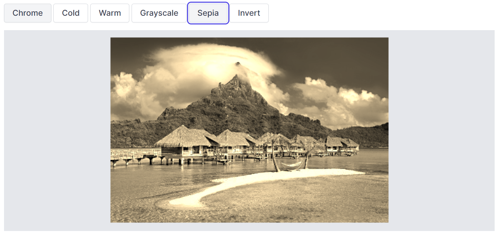

# Resize

The resize feature in an Image Editor is a valuable tool that empowers users to modify the size or dimensions of an image to meet their specific requirements. Whether it's for printing, web display, or any other purpose, this feature allows users to tailor images to their desired specifications.

## Apply resize to the image 

The Image Editor control includes a [`resizeAsync`](https://ej2.syncfusion.com/vue/documentation/api/image-editor/#resize) method, which allows you to adjust the size of an image. This method takes three parameters that define how the resizing should be carried out:

* width: Specifies the resizing width of the image.

* height: Specifies the resizing height of the image.

* isAspectRatio: Specifies a boolean value indicating whether the image should maintain its original aspect ratio during resizing. When set to true, the image will be resized while preserving its aspect ratio 

Here is an example of resizing the image using the [`resizeAsync`](https://help.syncfusion.com/cr/blazor/Syncfusion.Blazor.ImageEditor.SfImageEditor.html#Syncfusion_Blazor_ImageEditor_SfImageEditor_resizeAsync_System_String_System_Nullable_System_Double__System_Nullable_System_Double__System_Nullable_System_Double__System_Nullable_System_Double__) method.  

```cshtml
@using Syncfusion.Blazor.ImageEditor
@using Syncfusion.Blazor.Buttons

<div style="padding-bottom: 15px">
    <SfButton OnClick="aspectClick">Aspect Ratio</SfButton>
    <SfButton OnClick="nonaspectClick">Non Aspect Ratio</SfButton>
</div>

<SfImageEditor @ref="ImageEditor" Toolbar="customToolbarItem" Height="400">
    <ImageEditorEvents Created="OpenAsync"></ImageEditorEvents>
</SfImageEditor>

@code {
    SfImageEditor ImageEditor;
    private List<ImageEditorToolbarItemModel> customToolbarItem = new List<ImageEditorToolbarItemModel>() { };

    private async void OpenAsync()
    {
        await ImageEditor.OpenAsync("nature.png");
    }

    private async void aspectClick()
    {
        await ImageEditor.ResizeAsync(450, 342, true);
    }

    private async void nonaspectClick()
    {
        await ImageEditor.ResizeAsync(450, 342, true);
    }

}
```



## Resizing event

The [`resizing`] event is triggered when resizing the image. This event provides information encapsulated within an object, which includes details about the previous and current height and width of an image.

The parameter available in ResizeEventArgs is,

* ResizeEventArgs.previousWidth - The width of the image before resizing is performed.

* ResizeEventArgs.previousHeight - The height of the image before resizing is performed.

* ResizeEventArgs.width - The width of the image after resizing is performed.

* ResizeEventArgs.height - The width of the image after resizing is performed.

* ResizeEventArgs.isAspectRatio - The type of resizing performed such as aspect ratio or non-aspect ratio.

* ResizeEventArgs.cancel - Specifies a boolean value to cancel the resizing action.