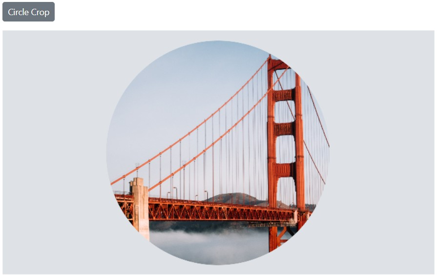
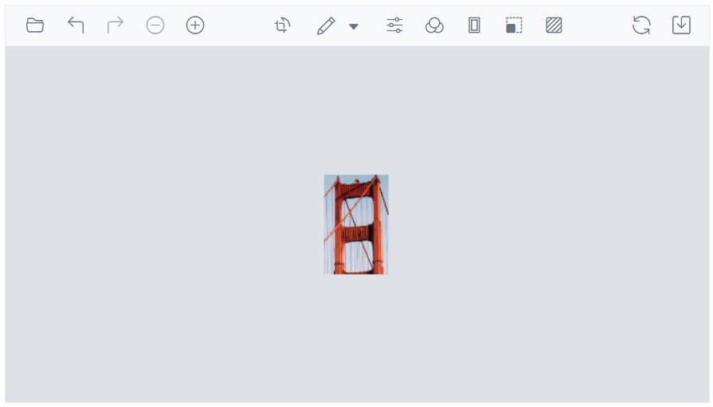

# Selection cropping in the Blazor Image Editor Component

The cropping feature in the Blazor Image Editor allows you to select and crop specific regions of an image. It offers different selection options, including custom shapes, squares, circles, and various aspect ratios such as 2:3, 3:2, 3:4, 4:3, 4:5, 5:4, 5:7, 7:5, 9:16, and 16:9. 

To perform a selection, you can use the [`SelectAsync`](https://help.syncfusion.com/cr/blazor/Syncfusion.Blazor.ImageEditor.SfImageEditor.html#Syncfusion_Blazor_ImageEditor_SfImageEditor_SelectAsync_System_String_System_Double_System_Double_System_Double_System_Double_) method, which allows you to define the desired selection area within the image. Once the selection is made, you can then use the [`CropAsync`](https://help.syncfusion.com/cr/blazor/Syncfusion.Blazor.ImageEditor.SfImageEditor.html#Syncfusion_Blazor_ImageEditor_SfImageEditor_CropAsync) method to crop the image based on the selected region. This enables you to extract and focus on specific parts of the image while discarding the rest.

## Insert custom / square / circle region 

The [`SelectAsync`](https://help.syncfusion.com/cr/blazor/Syncfusion.Blazor.ImageEditor.SfImageEditor.html#Syncfusion_Blazor_ImageEditor_SfImageEditor_SelectAsync_System_String_System_Double_System_Double_System_Double_System_Double_) method allows to perform selection based on the type of selection. Here, the `SelectAsync` method is used to perform the selection as custom, circle, or square. The selection region can also be customized using the select method based on the parameters below. 

type - Specify the type of selection 

startX - Specify the x-coordinate of the selection region’s starting point 

startY - Specify the y-coordinate of the selection region’s starting point 

width - Specify the width of the selection region 

height - Specify the height of the selection region 

Here is an example of square selection using the `SelectAsync` method. 

```cshtml
@using Syncfusion.Blazor.ImageEditor
@using Syncfusion.Blazor.Buttons

<div style="padding-bottom: 15px">
    <SfButton OnClick="SelectAsync">Square Selection</SfButton>
</div>
<SfImageEditor @ref="ImageEditor" Toolbar="customToolbarItem" Height="400">
    <ImageEditorEvents Created="OpenAsync"></ImageEditorEvents>
</SfImageEditor>

@code {
    SfImageEditor ImageEditor;
    private List<ImageEditorToolbarItemModel> customToolbarItem = new List<ImageEditorToolbarItemModel>() { };

    private async void OpenAsync()
    {
        await ImageEditor.OpenAsync("https://ej2.syncfusion.com/react/demos/src/image-editor/images/bridge.png");
    }

    private async void SelectAsync()
    {
        await ImageEditor.SelectAsync("Square");
    }
}
```


## Insert selection based on aspect ratio 

The [`SelectAsync`](https://help.syncfusion.com/cr/blazor/Syncfusion.Blazor.ImageEditor.SfImageEditor.html#Syncfusion_Blazor_ImageEditor_SfImageEditor_SelectAsync_System_String_System_Double_System_Double_System_Double_System_Double_) method is used to perform the selection with the various aspect ratios such as 2:3, 3:2, 3:4, 4:3, 4:5, 5:4, 5:7, 7:5, 9:16, and 16:9. The selection region can also be customized using the `SelectAsync` method based on the parameters below. 

type - Specify the type of selection 

startX - Specify the x-coordinate of the selection region’s starting point 

startY - Specify the y-coordinate of the selection region’s starting point 

Here is an example of ratio selection using the `SelectAsync` method. 

```cshtml
@using Syncfusion.Blazor.ImageEditor
@using Syncfusion.Blazor.Buttons

<div style="padding-bottom: 15px">
    <SfButton OnClick="SelectAsync">Ratio Selection</SfButton>
</div>
<SfImageEditor @ref="ImageEditor" Toolbar="customToolbarItem" Height="400">
    <ImageEditorEvents Created="OpenAsync"></ImageEditorEvents>
</SfImageEditor>

@code {
    SfImageEditor ImageEditor;
    private List<ImageEditorToolbarItemModel> customToolbarItem = new List<ImageEditorToolbarItemModel>() { };

    private async void OpenAsync()
    {
        await ImageEditor.OpenAsync("https://ej2.syncfusion.com/react/demos/src/image-editor/images/bridge.png");
    }

    private async void SelectAsync()
    {
        await ImageEditor.SelectAsync("16:9");
    }
}
```


## Crop an image

The [`CropAsync`](https://help.syncfusion.com/cr/blazor/Syncfusion.Blazor.ImageEditor.SfImageEditor.html#Syncfusion_Blazor_ImageEditor_SfImageEditor_CropAsync) method allows cropping based on the selected region. Here is an example of cropping the selection region using the `CropAsync` method. 

Here is an example of circle cropping using the [`SelectAsync`](https://help.syncfusion.com/cr/blazor/Syncfusion.Blazor.ImageEditor.SfImageEditor.html#Syncfusion_Blazor_ImageEditor_SfImageEditor_SelectAsync_System_String_System_Double_System_Double_System_Double_System_Double_) and `CropAsync` method.

```cshtml
@using Syncfusion.Blazor.ImageEditor
@using Syncfusion.Blazor.Buttons

<div style="padding-bottom: 15px">
    <SfButton OnClick="CropAsync">Circle Crop</SfButton>
</div>
<SfImageEditor @ref="ImageEditor" Toolbar="customToolbarItem" Height="400">
    <ImageEditorEvents Created="OpenAsync"></ImageEditorEvents>
</SfImageEditor>

@code {
    SfImageEditor ImageEditor;
    private List<ImageEditorToolbarItemModel> customToolbarItem = new List<ImageEditorToolbarItemModel>() { };

    private async void OpenAsync()
    {
        await ImageEditor.OpenAsync("https://ej2.syncfusion.com/react/demos/src/image-editor/images/bridge.png");
    }

    private async void CropAsync()
    {
        await ImageEditor.SelectAsync("Circle");
        await ImageEditor.CropAsync();
    }
}
```



## Cropping event

The [`Cropping`](https://help.syncfusion.com/cr/blazor/Syncfusion.Blazor.ImageEditor.ImageEditorEvents.html#Syncfusion_Blazor_ImageEditor_ImageEditorEvents_Cropping) event is triggered when performing cropping on the image. This event is passed an object that contains information about the cropping event, such as the start and end point of the selection region. And this event uses [`CropEventArgs`](https://help.syncfusion.com/cr/blazor/Syncfusion.Blazor.ImageEditor.CropEventArgs.html) to handle the cropping action. 

The parameter available in the `Cropping` event is,

* CropEventArgs.StartPoint – The x and y coordinates of a start point as [`ImageEditorPoint`](https://help.syncfusion.com/cr/blazor/Syncfusion.Blazor.ImageEditor.ImageEditorPoint.html) of the selection region. 

* CropEventArgs.EndPoint - The x and y coordinates of an end point as [`ImageEditorPoint`](https://help.syncfusion.com/cr/blazor/Syncfusion.Blazor.ImageEditor.ImageEditorPoint.html) of the selection region. 

* CropEventArgs.Cancel - To cancel the cropping action.

### Maintaining original image size during cropping 

In the image editor, when an image is cropped, it is usually enlarged or scaled to improve visibility within the user interface. If you want to prevent this scaling and maintain the original cropping size, you can bind to the [`Cropping`](https://help.syncfusion.com/cr/blazor/Syncfusion.Blazor.ImageEditor.ImageEditorEvents.html#Syncfusion_Blazor_ImageEditor_ImageEditorEvents_Cropping) event and set the [`PreventScaling`](https://help.syncfusion.com/cr/blazor/Syncfusion.Blazor.ImageEditor.CropEventArgs.html#Syncfusion_Blazor_ImageEditor_CropEventArgs_PreventScaling) value to true. This not only keeps the image size consistent during cropping but also ensures that the saved image retains its original cropping size without being enlarged.

```cshtml
@using Syncfusion.Blazor.ImageEditor

<SfImageEditor @ref="ImageEditor" Height="400">
    <ImageEditorEvents Created="OpenAsync" Cropping="CroppingAsync"></ImageEditorEvents>
</SfImageEditor>

@code {
    SfImageEditor ImageEditor;
    private async void OpenAsync()
    {
        await ImageEditor.OpenAsync("https://ej2.syncfusion.com/react/demos/src/image-editor/images/bridge.png");
    }

    private async void CroppingAsync(CropEventArgs args)
    {
        args.PreventScaling = true;
    }
}
```



## SelectionResize events

The selection region can be changed programmatically by using [`OnSelectionResizeStart`](https://help.syncfusion.com/cr/blazor/Syncfusion.Blazor.ImageEditor.ImageEditorEvents.html#Syncfusion_Blazor_ImageEditor_ImageEditorEvents_OnSelectionResizeStart) and [`OnSelectionResizeEnd`](https://help.syncfusion.com/cr/blazor/Syncfusion.Blazor.ImageEditor.ImageEditorEvents.html#Syncfusion_Blazor_ImageEditor_ImageEditorEvents_OnSelectionResizeEnd) event. This event is activated during resizing the selection using mouse, and it allows for alterations to the selection region by adjusting the specified properties. 

The [`SelectionChangeEventArgs`](https://help.syncfusion.com/cr/blazor/Syncfusion.Blazor.ImageEditor.SelectionChangeEventArgs.html) is used in these events to customize the selection and it has the following parameters.

SelectionChangeEventArgs.Action - The type of action such as inserting or resizing 

SelectionChangeEventArgs.Cancel - Specifies to cancel the selection. 

SelectionChangeEventArgs.CurrentSelectionPoint - Represents all the details of the selection including its type, position, width, and height after the current action as [`CropSelectionSettings`](https://help.syncfusion.com/cr/blazor/Syncfusion.Blazor.ImageEditor.CropSelectionSettings.html). 

SelectionChangeEventArgs.PreviousSelectionPoint - Represents all the details of the selection including its type, position, width, and height before this current action as [`CropSelectionSettings`](https://help.syncfusion.com/cr/blazor/Syncfusion.Blazor.ImageEditor.CropSelectionSettings.html) 

### Locking selection area during cropping 

When selecting an area for cropping, users can typically resize the selection from all corners and edges. If you want to prevent the resizing of the selection area, you can bind to the [`OnSelectionResizeStart`](https://help.syncfusion.com/cr/blazor/Syncfusion.Blazor.ImageEditor.ImageEditorEvents.html#Syncfusion_Blazor_ImageEditor_ImageEditorEvents_OnSelectionResizeStart) and [`OnSelectionResizeEnd`](https://help.syncfusion.com/cr/blazor/Syncfusion.Blazor.ImageEditor.ImageEditorEvents.html#Syncfusion_Blazor_ImageEditor_ImageEditorEvents_OnSelectionResizeEnd) event. Check if the action is `resize`, and if it is, set `Cancel` value to `true`. This will lock the selection area, preventing any adjustments to its size.

```cshtml
@using Syncfusion.Blazor.ImageEditor

<SfImageEditor @ref="ImageEditor" Height="400">
    <ImageEditorEvents Created="OpenAsync" OnSelectionResizeStart="OnSelectionResizeStartAsync"></ImageEditorEvents>
</SfImageEditor>

@code {
    SfImageEditor ImageEditor;
    private async void OpenAsync()
    {
        await ImageEditor.OpenAsync("https://ej2.syncfusion.com/react/demos/src/image-editor/images/bridge.png");
    }

    private async void OnSelectionResizeStartAsync(SelectionChangeEventArgs args)
    {
        args.Cancel = true;
    }
}
```


### Cropping with custom ratio selection

Users can perform cropping either through the toolbar or by using our public methods. While predefined ratio selections are available in the toolbar, users can also crop with custom ratios using our public method, select. Regardless of the ratio type used, the selection will adhere to the specified ratio, even when resizing the selection area.

Here is an example of cropping with a custom ratio selection using the [`OnSelectionResizeStart`](https://help.syncfusion.com/cr/blazor/Syncfusion.Blazor.ImageEditor.ImageEditorEvents.html#Syncfusion_Blazor_ImageEditor_ImageEditorEvents_OnSelectionResizeStart) and [`OnSelectionResizeEnd`](https://help.syncfusion.com/cr/blazor/Syncfusion.Blazor.ImageEditor.ImageEditorEvents.html#Syncfusion_Blazor_ImageEditor_ImageEditorEvents_OnSelectionResizeEnd) event.

```cshtml
@using Syncfusion.Blazor.ImageEditor

<SfImageEditor @ref="ImageEditor" Height="400" Toolbar="customToolbarItem">
    <ImageEditorEvents Created="OpenAsync" OnSelectionResizeStart="OnSelectionResizeStart"></ImageEditorEvents>
</SfImageEditor>

@code {
    SfImageEditor ImageEditor;
    private List<ImageEditorToolbarItemModel> customToolbarItem = new List<ImageEditorToolbarItemModel>()
    {
        new ImageEditorToolbarItemModel { Name = "Crop" },
        new ImageEditorToolbarItemModel { Name = "Reset" },
        new ImageEditorToolbarItemModel { Name = "Confirm" }
    };

    private async void OpenAsync()
    {
        await ImageEditor.OpenAsync("https://ej2.syncfusion.com/react/demos/src/image-editor/images/bridge.png");
    }

    private void OnSelectionResizeStart(SelectionChangeEventArgs args)
    {
        if (args.CurrentSelectionSettings.Type == "Custom")
        {
            args.CurrentSelectionSettings.Height = 200;
        }
    }
}
```


## See Also

* [Crop an Image with Aspect Ratio](https://support.syncfusion.com/kb/article/21448/how-to-crop-an-image-with-aspect-ratio-in-blazor-image-editor)