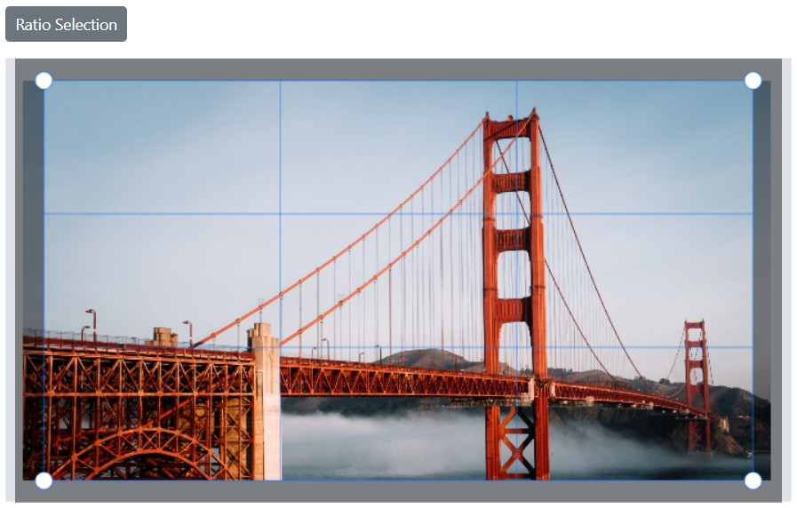
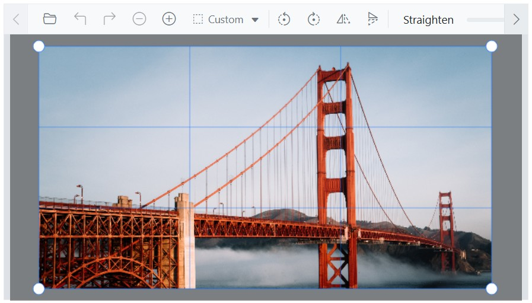
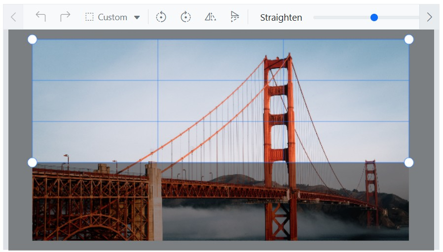

# Selection cropping in the Blazor Image Editor Component

The cropping feature in the Blazor Image Editor enables selection and cropping of specific regions of an image. It supports custom shapes, squares, circles, and preset aspect ratios, including 2:3, 3:2, 3:4, 4:3, 4:5, 5:4, 5:7, 7:5, 9:16, and 16:9.

To perform a selection, use the [SelectAsync](https://help.syncfusion.com/cr/blazor/Syncfusion.Blazor.ImageEditor.SfImageEditor.html#Syncfusion_Blazor_ImageEditor_SfImageEditor_SelectAsync_System_String_System_Double_System_Double_System_Double_System_Double_) method to define the selection area within the image. After the selection is made, call the [CropAsync](https://help.syncfusion.com/cr/blazor/Syncfusion.Blazor.ImageEditor.SfImageEditor.html#Syncfusion_Blazor_ImageEditor_SfImageEditor_CropAsync) method to crop the image based on the selected region. This workflow extracts and focuses on the selected area while discarding the remainder.

## Insert custom / square / circle region 

The [SelectAsync](https://help.syncfusion.com/cr/blazor/Syncfusion.Blazor.ImageEditor.SfImageEditor.html#Syncfusion_Blazor_ImageEditor_SfImageEditor_SelectAsync_System_String_System_Double_System_Double_System_Double_System_Double_) method performs selection based on the specified selection type. In this context, `SelectAsync` is used to select custom, circle, or square regions. The selection region can be customized using the following parameters:

- type - Specifies the type of selection.

- startX - Specifies the x-coordinate of the selection region’s starting point.

- startY - Specifies the y-coordinate of the selection region’s starting point.

- width - Specifies the width of the selection region.

- height - Specifies the height of the selection region.

Here is an example of square selection using the `SelectAsync` method. 

```cshtml
@using Syncfusion.Blazor.ImageEditor
@using Syncfusion.Blazor.Buttons

<div style="padding-bottom: 15px">
    <SfButton OnClick="SelectAsync">Square Selection</SfButton>
</div>
<SfImageEditor @ref="ImageEditor" Toolbar="customToolbarItem" Height="400">
    <ImageEditorEvents Created="OpenAsync"></ImageEditorEvents>
</SfImageEditor>

@code {
    SfImageEditor ImageEditor;
    private List<ImageEditorToolbarItemModel> customToolbarItem = new List<ImageEditorToolbarItemModel>() { };

    private async void OpenAsync()
    {
        await ImageEditor.OpenAsync("https://ej2.syncfusion.com/react/demos/src/image-editor/images/bridge.png");
    }

    private async void SelectAsync()
    {
        await ImageEditor.SelectAsync("Square");
    }
}
```


## Insert selection based on aspect ratio 

The [SelectAsync](https://help.syncfusion.com/cr/blazor/Syncfusion.Blazor.ImageEditor.SfImageEditor.html#Syncfusion_Blazor_ImageEditor_SfImageEditor_SelectAsync_System_String_System_Double_System_Double_System_Double_System_Double_) method selects regions using various aspect ratios, including 2:3, 3:2, 3:4, 4:3, 4:5, 5:4, 5:7, 7:5, 9:16, and 16:9. The selection region can be customized using the following parameters:

- type - Specifies the type of selection.

- startX - Specifies the x-coordinate of the selection region’s starting point.

- startY - Specifies the y-coordinate of the selection region’s starting point.

Here is an example of ratio selection using the `SelectAsync` method. 

```cshtml
@using Syncfusion.Blazor.ImageEditor
@using Syncfusion.Blazor.Buttons

<div style="padding-bottom: 15px">
    <SfButton OnClick="SelectAsync">Ratio Selection</SfButton>
</div>
<SfImageEditor @ref="ImageEditor" Toolbar="customToolbarItem" Height="400">
    <ImageEditorEvents Created="OpenAsync"></ImageEditorEvents>
</SfImageEditor>

@code {
    SfImageEditor ImageEditor;
    private List<ImageEditorToolbarItemModel> customToolbarItem = new List<ImageEditorToolbarItemModel>() { };

    private async void OpenAsync()
    {
        await ImageEditor.OpenAsync("https://ej2.syncfusion.com/react/demos/src/image-editor/images/bridge.png");
    }

    private async void SelectAsync()
    {
        await ImageEditor.SelectAsync("16:9");
    }
}
```



## Crop an image

The [CropAsync](https://help.syncfusion.com/cr/blazor/Syncfusion.Blazor.ImageEditor.SfImageEditor.html#Syncfusion_Blazor_ImageEditor_SfImageEditor_CropAsync) method crops the image based on the selected region. 

Here is an example of circle cropping using the `SelectAsync` and `CropAsync` methods.

```cshtml
@using Syncfusion.Blazor.ImageEditor
@using Syncfusion.Blazor.Buttons

<div style="padding-bottom: 15px">
    <SfButton OnClick="CropAsync">Circle Crop</SfButton>
</div>
<SfImageEditor @ref="ImageEditor" Toolbar="customToolbarItem" Height="400">
    <ImageEditorEvents Created="OpenAsync"></ImageEditorEvents>
</SfImageEditor>

@code {
    SfImageEditor ImageEditor;
    private List<ImageEditorToolbarItemModel> customToolbarItem = new List<ImageEditorToolbarItemModel>() { };

    private async void OpenAsync()
    {
        await ImageEditor.OpenAsync("https://ej2.syncfusion.com/react/demos/src/image-editor/images/bridge.png");
    }

    private async void CropAsync()
    {
        await ImageEditor.SelectAsync("Circle");
        await ImageEditor.CropAsync();
    }
}
```


## Cropping event

The [Cropping](https://help.syncfusion.com/cr/blazor/Syncfusion.Blazor.ImageEditor.ImageEditorEvents.html#Syncfusion_Blazor_ImageEditor_ImageEditorEvents_Cropping) event is triggered during cropping. The event provides details such as the start and end points of the selection region.

Parameters available in [CropEventArgs](https://help.syncfusion.com/cr/blazor/Syncfusion.Blazor.ImageEditor.CropEventArgs.html):

- [CropEventArgs.StartPoint](https://help.syncfusion.com/cr/blazor/Syncfusion.Blazor.ImageEditor.CropEventArgs.html#Syncfusion_Blazor_ImageEditor_CropEventArgs_StartPoint) - The x and y coordinates of the start point as [ImageEditorPoint](https://help.syncfusion.com/cr/blazor/Syncfusion.Blazor.ImageEditor.ImageEditorPoint.html) of the selection region.

- [CropEventArgs.EndPoint](https://help.syncfusion.com/cr/blazor/Syncfusion.Blazor.ImageEditor.CropEventArgs.html#Syncfusion_Blazor_ImageEditor_CropEventArgs_EndPoint) - The x and y coordinates of the end point as [ImageEditorPoint](https://help.syncfusion.com/cr/blazor/Syncfusion.Blazor.ImageEditor.ImageEditorPoint.html) of the selection region.

- [CropEventArgs.Cancel](https://help.syncfusion.com/cr/blazor/Syncfusion.Blazor.ImageEditor.CropEventArgs.html#Syncfusion_Blazor_ImageEditor_CropEventArgs_Cancel) - Indicates whether to cancel the cropping action.

- [CropEventArgs.PreventScaling](https://help.syncfusion.com/cr/blazor/Syncfusion.Blazor.ImageEditor.CropEventArgs.html#Syncfusion_Blazor_ImageEditor_CropEventArgs_PreventScaling) - Default is `false`. When set to `true`, scaling during cropping is prevented so both the editor view and saved image keep the original cropped dimensions.

### Maintaining original image size during cropping 

In the image editor, a cropped image is typically enlarged or scaled for better visibility within the interface. To prevent this scaling and maintain the original cropping size, bind to the [Cropping](https://help.syncfusion.com/cr/blazor/Syncfusion.Blazor.ImageEditor.ImageEditorEvents.html#Syncfusion_Blazor_ImageEditor_ImageEditorEvents_Cropping) event and set [PreventScaling](https://help.syncfusion.com/cr/blazor/Syncfusion.Blazor.ImageEditor.CropEventArgs.html#Syncfusion_Blazor_ImageEditor_CropEventArgs_PreventScaling) to true. This preserves the image size during cropping and ensures the saved image retains the original cropping size without enlargement.

```cshtml
@using Syncfusion.Blazor.ImageEditor

<SfImageEditor @ref="ImageEditor" Height="400">
    <ImageEditorEvents Created="OpenAsync" Cropping="CroppingAsync"></ImageEditorEvents>
</SfImageEditor>

@code {
    SfImageEditor ImageEditor;
    private async void OpenAsync()
    {
        await ImageEditor.OpenAsync("https://ej2.syncfusion.com/react/demos/src/image-editor/images/bridge.png");
    }

    private void CroppingAsync(CropEventArgs args)
    {
        args.PreventScaling = true;
    }
}
```


## SelectionResize events

The selection region can be updated programmatically using the [OnSelectionResizeStart](https://help.syncfusion.com/cr/blazor/Syncfusion.Blazor.ImageEditor.ImageEditorEvents.html#Syncfusion_Blazor_ImageEditor_ImageEditorEvents_OnSelectionResizeStart) and [OnSelectionResizeEnd](https://help.syncfusion.com/cr/blazor/Syncfusion.Blazor.ImageEditor.ImageEditorEvents.html#Syncfusion_Blazor_ImageEditor_ImageEditorEvents_OnSelectionResizeEnd) events. These events are raised during pointer-based resizing and allow modifications to the selection region by adjusting the specified properties.

Parameters available in [SelectionChangeEventArgs](https://help.syncfusion.com/cr/blazor/Syncfusion.Blazor.ImageEditor.SelectionChangeEventArgs.html):

- [SelectionChangeEventArgs.Action](https://help.syncfusion.com/cr/blazor/Syncfusion.Blazor.ImageEditor.SelectionChangeEventArgs.html#Syncfusion_Blazor_ImageEditor_SelectionChangeEventArgs_Action) - The type of action, such as inserting or resizing.

- [SelectionChangeEventArgs.Cancel](https://help.syncfusion.com/cr/blazor/Syncfusion.Blazor.ImageEditor.SelectionChangeEventArgs.html#Syncfusion_Blazor_ImageEditor_SelectionChangeEventArgs_Cancel) - Indicates whether to cancel the selection.

- [SelectionChangeEventArgs.CurrentSelectionSettings](https://help.syncfusion.com/cr/blazor/Syncfusion.Blazor.ImageEditor.SelectionChangeEventArgs.html#Syncfusion_Blazor_ImageEditor_SelectionChangeEventArgs_CurrentSelectionSettings) - Details of the selection after the current action, including type, position, width, and height.

- [SelectionChangeEventArgs.PreviousSelectionSettings](https://help.syncfusion.com/cr/blazor/Syncfusion.Blazor.ImageEditor.SelectionChangeEventArgs.html#Syncfusion_Blazor_ImageEditor_SelectionChangeEventArgs_PreviousSelectionSettings) - Details of the selection before the previous action, including type, position, width, and height.

### Locking selection area during cropping 

During cropping, selection handles are available at corners and edges for resizing. To prevent resizing of the selection area, bind to the [OnSelectionResizeStart](https://help.syncfusion.com/cr/blazor/Syncfusion.Blazor.ImageEditor.ImageEditorEvents.html#Syncfusion_Blazor_ImageEditor_ImageEditorEvents_OnSelectionResizeStart) and [OnSelectionResizeEnd](https://help.syncfusion.com/cr/blazor/Syncfusion.Blazor.ImageEditor.ImageEditorEvents.html#Syncfusion_Blazor_ImageEditor_ImageEditorEvents_OnSelectionResizeEnd) events. If the action is `resize`, set `Cancel` to `true` to lock the selection area.

```cshtml
@using Syncfusion.Blazor.ImageEditor

<SfImageEditor @ref="ImageEditor" Height="400">
    <ImageEditorEvents Created="OpenAsync" OnSelectionResizeStart="OnSelectionResizeStartAsync"></ImageEditorEvents>
</SfImageEditor>

@code {
    SfImageEditor ImageEditor;
    private async void OpenAsync()
    {
        await ImageEditor.OpenAsync("https://ej2.syncfusion.com/react/demos/src/image-editor/images/bridge.png");
    }

    private void OnSelectionResizeStartAsync(SelectionChangeEventArgs args)
    {
        args.Cancel = true;
    }
}
```



### Cropping with custom ratio selection

Cropping can be performed using the toolbar or public methods. While predefined ratio selections are available in the toolbar, custom ratios can also be applied using the public `SelectAsync` method. Regardless of the ratio type, the selection adheres to the specified ratio, even when the selection area is resized.

Here is an example of cropping with a custom ratio selection using the `OnSelectionResizeStart`event.

```cshtml
@using Syncfusion.Blazor.ImageEditor

<SfImageEditor @ref="ImageEditor" Height="400" Toolbar="customToolbarItem">
    <ImageEditorEvents Created="OpenAsync" OnSelectionResizeStart="OnSelectionResizeStart"></ImageEditorEvents>
</SfImageEditor>

@code {
    SfImageEditor ImageEditor;
    private List<ImageEditorToolbarItemModel> customToolbarItem = new List<ImageEditorToolbarItemModel>()
    {
        new ImageEditorToolbarItemModel { Name = "Crop" },
        new ImageEditorToolbarItemModel { Name = "Reset" },
        new ImageEditorToolbarItemModel { Name = "Confirm" }
    };

    private async void OpenAsync()
    {
        await ImageEditor.OpenAsync("https://ej2.syncfusion.com/react/demos/src/image-editor/images/bridge.png");
    }

    private void OnSelectionResizeStart(SelectionChangeEventArgs args)
    {
        if (args.CurrentSelectionSettings.Type == "Custom")
        {
            args.CurrentSelectionSettings.Height = 200;
        }
    }
}
```



## See Also

* [Crop an Image with Aspect Ratio](https://support.syncfusion.com/kb/article/21448/how-to-crop-an-image-with-aspect-ratio-in-blazor-image-editor)