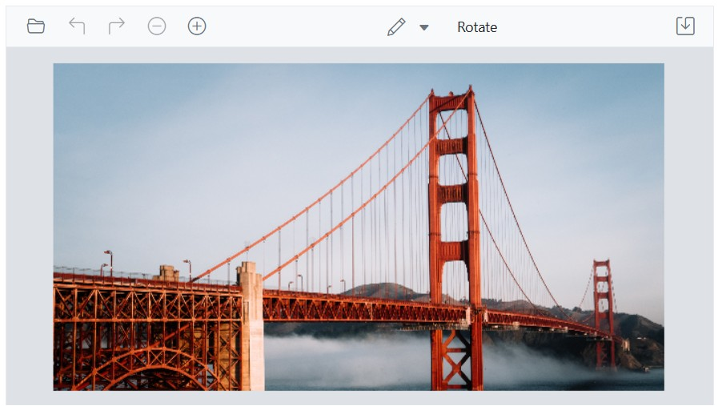
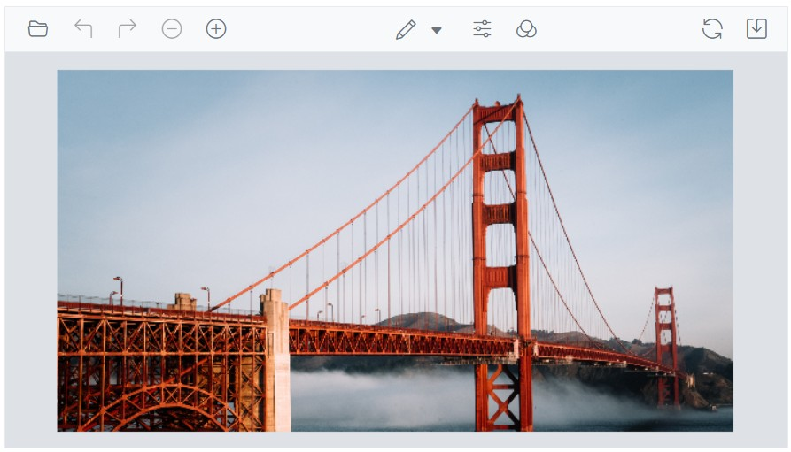
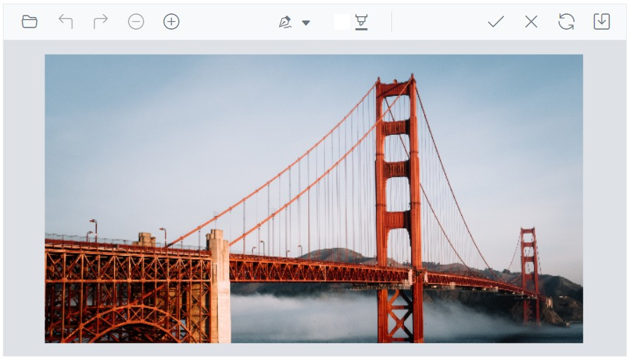

# Toolbar in the Blazor Image Editor Component

The toolbar in the Blazor Image Editor enables interaction and editing operations. It offers a range of tools and supports extensive customization to match specific requirements and workflows. Items can be added or removed to create a focused toolset, or a fully custom toolbar can be defined.

In the Image Editor, the toolbar property enables customization by adding or removing items or defining a complete custom toolbar. This flexibility helps align the editing experience with particular needs and processes.

## Built-in toolbar items

Specifies the toolbar items available for UI interactions. Refer to the built-in toolbar items for the default value.

* Open
* Undo
* Redo
* ZoomIn
* ZoomOut
* Crop
* RotateLeft
* RotateRight
* HorizontalFlip
* VerticalFlip
* Straightening
* Annotation
* Finetune
* Filter
* Frame
* Resize
* Redact
* Reset
* Save

## Add a custom toolbar item

The [Toolbar](https://help.syncfusion.com/cr/blazor/Syncfusion.Blazor.ImageEditor.SfImageEditor.html#Syncfusion_Blazor_ImageEditor_SfImageEditor_Toolbar) property in the Image Editor allows adding or removing toolbar items to include only frequently used tools, streamlining the editing process and reducing clutter.

Here is an example of adding custom toolbar item for rotate transformation using the `Toolbar` property.

```cshtml
@using Syncfusion.Blazor.ImageEditor
@using Syncfusion.Blazor.Navigations

<SfImageEditor @ref="ImageEditor" Toolbar="customToolbarItem" Height="400">
    <ImageEditorEvents Created="OpenAsync" ToolbarItemClicked="ToolbarItemClicked"></ImageEditorEvents>
</SfImageEditor>

@code {
    SfImageEditor ImageEditor;
    private List<ImageEditorToolbarItemModel> customToolbarItem = new List<ImageEditorToolbarItemModel>()
    {
        new ImageEditorToolbarItemModel { Name = "Open" },
        new ImageEditorToolbarItemModel { Name = "Undo" },
        new ImageEditorToolbarItemModel { Name = "Redo" },
        new ImageEditorToolbarItemModel { Name = "Zoom" },
        new ImageEditorToolbarItemModel { Name = "Annotation" },
        new ImageEditorToolbarItemModel { Name = "Save" },
        new ImageEditorToolbarItemModel { Text = "Rotate", TooltipText = "Rotate", Align = ItemAlign.Center }
    };

    private async void OpenAsync()
    {
        await ImageEditor.OpenAsync("https://ej2.syncfusion.com/react/demos/src/image-editor/images/bridge.png");
    }

    private async void ToolbarItemClicked(Syncfusion.Blazor.Navigations.ClickEventArgs args)
    {
        if (args.Item.Text == "Rotate")
        {
            await ImageEditor.RotateAsync(90);
        }
    }
}
```



## Show or hide a toolbar

The [Toolbar](https://help.syncfusion.com/cr/blazor/Syncfusion.Blazor.ImageEditor.SfImageEditor.html#Syncfusion_Blazor_ImageEditor_SfImageEditor_Toolbar) property controls toolbar visibility in the Image Editor. When set to an empty list, the toolbar is hidden. When populated with items, the toolbar is shown with the specified entries. This enables personalized editing experiences.

Here is an example of hiding the toolbar of the Image Editor using the `Toolbar` property.

```cshtml
@using Syncfusion.Blazor.ImageEditor

<SfImageEditor @ref="ImageEditor" Toolbar="customToolbarItem" Height="400">
    <ImageEditorEvents Created="OpenAsync"></ImageEditorEvents>
</SfImageEditor>

@code {
    SfImageEditor ImageEditor;
    private List<ImageEditorToolbarItemModel> customToolbarItem = new List<ImageEditorToolbarItemModel>(){ };

    private async void OpenAsync()
    {
        await ImageEditor.OpenAsync("https://ej2.syncfusion.com/react/demos/src/image-editor/images/bridge.png");
    }
}
```


## Show or hide a toolbar item

The [Toolbar](https://help.syncfusion.com/cr/blazor/Syncfusion.Blazor.ImageEditor.SfImageEditor.html#Syncfusion_Blazor_ImageEditor_SfImageEditor_Toolbar) property controls the visibility of individual toolbar items. By default, it includes the predefined set of toolbar items. To hide any default item, explicitly define only the required items in the `Toolbar` property.

Here is an example of hiding the crop and transform toolbar item using the `Toolbar` property

```cshtml
@using Syncfusion.Blazor.ImageEditor

<SfImageEditor @ref="ImageEditor" Toolbar="customToolbarItem" Height="400">
    <ImageEditorEvents Created="OpenAsync"></ImageEditorEvents>
</SfImageEditor>

@code {
    SfImageEditor ImageEditor;
    private List<ImageEditorToolbarItemModel> customToolbarItem = new List<ImageEditorToolbarItemModel>()
    {
        new ImageEditorToolbarItemModel { Name = "Open" },
        new ImageEditorToolbarItemModel { Name = "Undo" },
        new ImageEditorToolbarItemModel { Name = "Redo" },
        new ImageEditorToolbarItemModel { Name = "Zoom" },
        new ImageEditorToolbarItemModel { Name = "Annotation" },
        new ImageEditorToolbarItemModel { Name = "Finetune" },
        new ImageEditorToolbarItemModel { Name = "Filter" },
        new ImageEditorToolbarItemModel { Name = "Reset" },
        new ImageEditorToolbarItemModel { Name = "Save" }
    };

    private async void OpenAsync()
    {
        await ImageEditor.OpenAsync("https://ej2.syncfusion.com/react/demos/src/image-editor/images/bridge.png");
    }
}
```



## Enable or disable a toolbar item

The [Toolbar](https://help.syncfusion.com/cr/blazor/Syncfusion.Blazor.ImageEditor.SfImageEditor.html#Syncfusion_Blazor_ImageEditor_SfImageEditor_Toolbar) property can be used to enable or disable toolbar items. This allows control over the availability and behavior of custom toolbar items based on specific requirements.

Here is an example of disabling custom toolbar items using the `Toolbar` property.

```cshtml
@using Syncfusion.Blazor.ImageEditor

<SfImageEditor @ref="ImageEditor" Toolbar="customToolbarItem" Height="400">
    <ImageEditorEvents Created="OpenAsync"></ImageEditorEvents>
</SfImageEditor>

@code {
    SfImageEditor ImageEditor;
    private List<ImageEditorToolbarItemModel> customToolbarItem = new List<ImageEditorToolbarItemModel>()
    {
        new ImageEditorToolbarItemModel { Name = "Open" },
        new ImageEditorToolbarItemModel { Name = "Undo" },
        new ImageEditorToolbarItemModel { Name = "Redo" },
        new ImageEditorToolbarItemModel { Name = "Zoom" },
        new ImageEditorToolbarItemModel { Name = "Crop" },
        new ImageEditorToolbarItemModel { Name = "Annotation", Disabled = true },
        new ImageEditorToolbarItemModel { Name = "Finetune", Disabled = true },
        new ImageEditorToolbarItemModel { Name = "Filter" },
        new ImageEditorToolbarItemModel { Name = "Reset" },
        new ImageEditorToolbarItemModel { Name = "Save" }
    };

    private async void OpenAsync()
    {
        await ImageEditor.OpenAsync("https://ej2.syncfusion.com/react/demos/src/image-editor/images/bridge.png");
    }
}
```


## Enable or disable a contextual toolbar item

The [ToolbarUpdating](https://help.syncfusion.com/cr/blazor/Syncfusion.Blazor.ImageEditor.ImageEditorEvents.html#Syncfusion_Blazor_ImageEditor_ImageEditorEvents_ToolbarUpdating) event is triggered when inserting or selecting annotations, opening the contextual toolbar in the Blazor Image Editor. Within this event, the [ToolbarItems](https://help.syncfusion.com/cr/blazor/Syncfusion.Blazor.ImageEditor.ToolbarEventArgs.html#Syncfusion_Blazor_ImageEditor_ToolbarEventArgs_ToolbarItems) property in [ToolbarEventArgs](https://help.syncfusion.com/cr/blazor/Syncfusion.Blazor.ImageEditor.ToolbarEventArgs.html) is used to enable or disable contextual toolbar items.

To enable or disable default toolbar items, set the [Disabled](https://help.syncfusion.com/cr/blazor/Syncfusion.Blazor.Navigations.ItemModel.html#Syncfusion_Blazor_Navigations_ItemModel_Disabled) property to true within the [ImageEditorToolbarItemModel](https://help.syncfusion.com/cr/blazor/Syncfusion.Blazor.ImageEditor.ImageEditorToolbarItemModel.html) that is part of the `ToolbarItems` collection. This approach enables selective control over default items and supports a tailored toolbar configuration.

## Customize contextual toolbar

The [ToolbarUpdating](https://help.syncfusion.com/cr/blazor/Syncfusion.Blazor.ImageEditor.ImageEditorEvents.html#Syncfusion_Blazor_ImageEditor_ImageEditorEvents_ToolbarUpdating) event is triggered when inserting or selecting annotations, which opens the contextual toolbar in the Blazor Image Editor. Within this event, the [ToolbarItems](https://help.syncfusion.com/cr/blazor/Syncfusion.Blazor.ImageEditor.ToolbarEventArgs.html#Syncfusion_Blazor_ImageEditor_ToolbarEventArgs_ToolbarItems) property in the [ToolbarEventArgs](https://help.syncfusion.com/cr/blazor/Syncfusion.Blazor.ImageEditor.ToolbarEventArgs.html) is used to add or remove contextual toolbar items.

In the following example, the contextual toolbar for freehand drawing is rendered with only the stroke color, while the stroke width, remove, and separator options are excluded using the `ToolbarUpdating` event.

```cshtml
@using Syncfusion.Blazor.ImageEditor
@using Syncfusion.Blazor.Navigations

<SfImageEditor @ref="ImageEditor" Height="400">
    <ImageEditorEvents Created="OpenAsync" ToolbarUpdating="ToolbarUpdating"></ImageEditorEvents>
</SfImageEditor>

@code {
    SfImageEditor ImageEditor;

    private async void OpenAsync()
    {
        await ImageEditor.OpenAsync("https://ej2.syncfusion.com/react/demos/src/image-editor/images/bridge.png");
    }

    private void ToolbarUpdating(ToolbarEventArgs args)
    {
        if (args.ToolbarType == ShapeType.FreehandDraw)
        {
            args.ToolbarItems = new List<ImageEditorToolbarItemModel>() { new ImageEditorToolbarItemModel { Name = "StrokeColor" } };
        }
    }
}
```



## Toolbar created event

The [ToolbarCreated](https://help.syncfusion.com/cr/blazor/Syncfusion.Blazor.ImageEditor.ImageEditorEvents.html#Syncfusion_Blazor_ImageEditor_ImageEditorEvents_ToolbarCreated) event is triggered after the toolbar is created in the Image Editor. This event can be used to perform actions or modifications once the toolbar is fully initialized, such as adding event handlers, adjusting appearance, or configuring additional functionality.

## Toolbar item clicked event

The [ToolbarItemClicked](https://help.syncfusion.com/cr/blazor/Syncfusion.Blazor.ImageEditor.ImageEditorEvents.html#Syncfusion_Blazor_ImageEditor_ImageEditorEvents_ToolbarItemClicked) event is triggered when a toolbar item is clicked in the Blazor Image Editor. This event is useful when custom options are added to the main or contextual toolbar, enabling execution of specific actions based on the clicked item.

Here is an example of the toolbar item clicked event using the `ToolbarItemClicked` property.

```cshtml
@using Syncfusion.Blazor.ImageEditor

<SfImageEditor @ref="ImageEditor" Height="400" Toolbar="customToolbarItem">
    <ImageEditorEvents Created="OpenAsync" ToolbarItemClicked="ToolbarItemClicked"></ImageEditorEvents>
</SfImageEditor>

@code {
    SfImageEditor ImageEditor;
    private List<ImageEditorToolbarItemModel> customToolbarItem = new List<ImageEditorToolbarItemModel>(){
        new ImageEditorToolbarItemModel { Text = "Flip" }
    };
    private async void OpenAsync()
    {
        await ImageEditor.OpenAsync("https://ej2.syncfusion.com/react/demos/src/image-editor/images/bridge.png");
    }
    private void ToolbarItemClicked(Syncfusion.Blazor.Navigations.ClickEventArgs args)
    {
        if (args.Item.Text == "Flip")
        {
            ImageEditor.FlipAsync(ImageEditorDirection.Horizontal);
        }
    }
}
```


## Toolbar template

The [ToolbarTemplate](https://help.syncfusion.com/cr/blazor/Syncfusion.Blazor.ImageEditor.ImageEditorTemplates.html#Syncfusion_Blazor_ImageEditor_ImageEditorTemplates_ToolbarTemplate) property in the Image Editor enables complete customization of the toolbar through a custom template. This supports unique editing experiences beyond the default or configurable toolbar by providing control over layout, appearance, and functionality.

Here is an example of using `ToolbarTemplate` to render only a button to toggle the freehand draw option. The toolbar can be replaced with application-specific UI using the `ToolbarTemplate` property.

```cshtml
@using Syncfusion.Blazor.ImageEditor
@using Syncfusion.Blazor.Buttons

<SfImageEditor @ref="ImageEditor" Height="400">
    <ImageEditorTemplates>
        <ToolbarTemplate>
            <div class='e-toolbar'>
                <SfButton OnClick="EnableFreehandDrawAsync">Enable FreeHandDraw</SfButton>
            </div>
        </ToolbarTemplate>
    </ImageEditorTemplates>
    <ImageEditorEvents Created="OpenAsync"></ImageEditorEvents>
</SfImageEditor>

@code {
    SfImageEditor ImageEditor;
    private async void OpenAsync()
    {
        await ImageEditor.OpenAsync("https://ej2.syncfusion.com/react/demos/src/image-editor/images/bridge.png");
    }

    private async void EnableFreehandDrawAsync()
    {
        await ImageEditor.EnableFreehandDrawAsync();
    }
}
```

