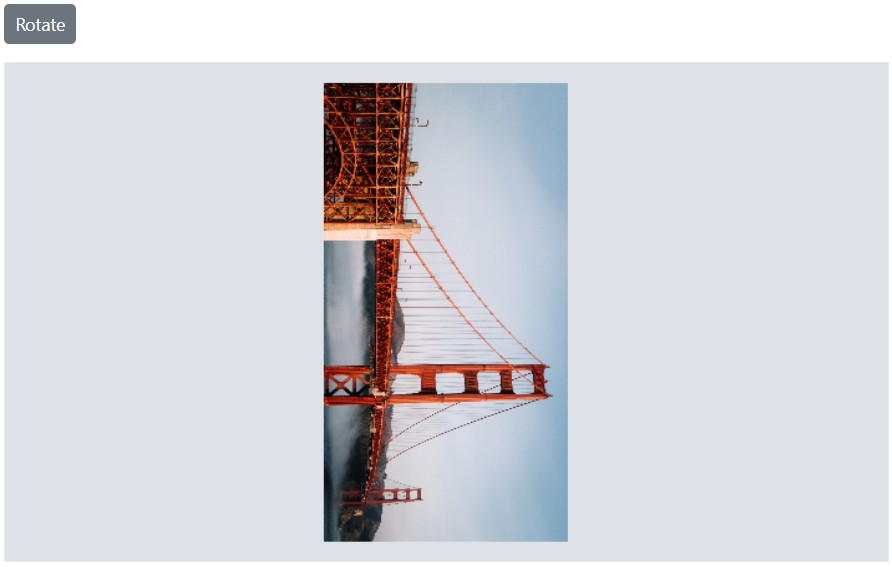
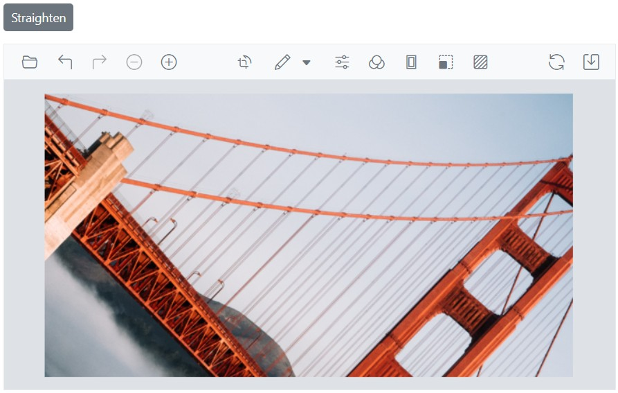
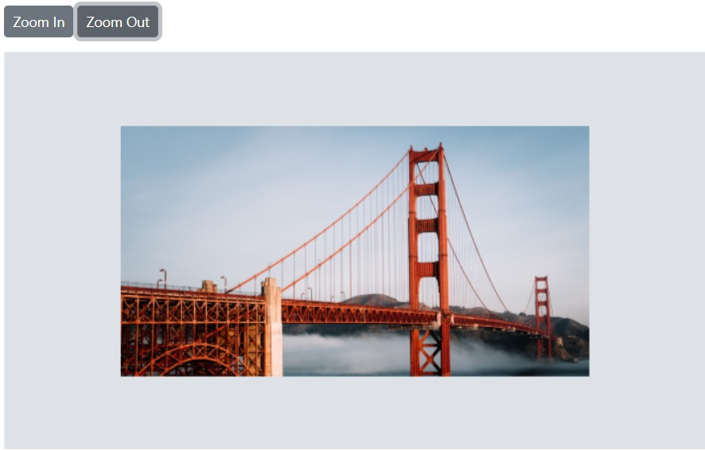

# Transform in the Blazor Image Editor Component

The [Blazor Image Editor](https://www.syncfusion.com/blazor-components/blazor-image-editor) component provides rotation, flipping, straightening, zooming, and panning for images and annotations. These transformations enable precise adjustments and help enhance visual presentation.

## Rotate an image

The [RotateAsync](https://help.syncfusion.com/cr/blazor/Syncfusion.Blazor.ImageEditor.SfImageEditor.html#Syncfusion_Blazor_ImageEditor_SfImageEditor_RotateAsync_System_Int32_) method rotates the image and annotations by a specified number of degrees clockwise or counterclockwise. This method accepts one parameter: the rotation angle in degrees. A positive value rotates clockwise; a negative value rotates counterclockwise.

Note: Use multiples of 90° (for example, 90, 180, -90) for proper alignment.

```cshtml
@using Syncfusion.Blazor.ImageEditor
@using Syncfusion.Blazor.Buttons

<div style="padding-bottom: 15px">
    <SfButton OnClick="RotateAsync">Rotate</SfButton>
</div>

<SfImageEditor @ref="ImageEditor" Toolbar="customToolbarItem" Height="400">
    <ImageEditorEvents Created="OpenAsync"></ImageEditorEvents>
</SfImageEditor>

@code {
    SfImageEditor ImageEditor;
    private List<ImageEditorToolbarItemModel> customToolbarItem = new List<ImageEditorToolbarItemModel>() { };

    private async void OpenAsync()
    {
        await ImageEditor.OpenAsync("https://ej2.syncfusion.com/react/demos/src/image-editor/images/bridge.png");
    }

    private async void RotateAsync()
    {
        await ImageEditor.RotateAsync(90);
    }
}
```



## Flip an image

The [FlipAsync](https://help.syncfusion.com/cr/blazor/Syncfusion.Blazor.ImageEditor.SfImageEditor.html#Syncfusion_Blazor_ImageEditor_SfImageEditor_FlipAsync_Syncfusion_Blazor_ImageEditor_ImageEditorDirection_) method flips the image and annotations horizontally or vertically. It accepts a single parameter of type `ImageEditorDirection`, which specifies the flip direction.

The [ImageEditorDirection](https://help.syncfusion.com/cr/blazor/Syncfusion.Blazor.ImageEditor.ImageEditorDirection.html) parameter supports two values: `Horizontal` and `Vertical`. `Horizontal` flips along the horizontal axis (mirror effect). `Vertical` flips along the vertical axis (flipping the image upside down).

Here is an example of flipping an image on button click.

```cshtml
@using Syncfusion.Blazor.ImageEditor
@using Syncfusion.Blazor.Buttons

<div style="padding-bottom: 15px">
    <SfButton OnClick="FlipAsync">Flip</SfButton>
</div>

<SfImageEditor @ref="ImageEditor" Toolbar="customToolbarItem" Height="400">
    <ImageEditorEvents Created="OpenAsync"></ImageEditorEvents>
</SfImageEditor>

@code {
    SfImageEditor ImageEditor;
    private List<ImageEditorToolbarItemModel> customToolbarItem = new List<ImageEditorToolbarItemModel>() { };

    private async void OpenAsync()
    {
        await ImageEditor.OpenAsync("https://ej2.syncfusion.com/react/demos/src/image-editor/images/bridge.png");
    }

    private async void FlipAsync()
    {
        await ImageEditor.FlipAsync(ImageEditorDirection.Horizontal);
    }
}
```


## Straighten an image

Straightening rotates an image clockwise or counterclockwise within a range of -45 to +45 degrees. Positive values indicate clockwise rotation; negative values indicate counterclockwise rotation. The [StraightenImageAsync](https://help.syncfusion.com/cr/blazor/Syncfusion.Blazor.ImageEditor.SfImageEditor.html#Syncfusion_Blazor_ImageEditor_SfImageEditor_StraightenImageAsync_System_Int32_) method adjusts the degree of rotation with one parameter:

- degree - Amount of rotation used to straighten the image.

Here is an example of straightening an image.

```cshtml
@using Syncfusion.Blazor.ImageEditor
@using Syncfusion.Blazor.Buttons

<div style="padding-bottom: 15px">
    <SfButton OnClick="Straighten">Straighten</SfButton>
</div>

<SfImageEditor @ref="ImageEditor" Height="400">
    <ImageEditorEvents Created="OpenAsync"></ImageEditorEvents>
</SfImageEditor>

@code {
    SfImageEditor ImageEditor;
    private async void OpenAsync()
    {
        await ImageEditor.OpenAsync("https://ej2.syncfusion.com/react/demos/src/image-editor/images/bridge.png");
    }

    private async void Straighten()
    {
        await ImageEditor.StraightenImageAsync(45);
    }
}
```



## Zoom in or out an image 

The [ZoomAsync](https://help.syncfusion.com/cr/blazor/Syncfusion.Blazor.ImageEditor.SfImageEditor.html#Syncfusion_Blazor_ImageEditor_SfImageEditor_ZoomAsync_System_Double_Syncfusion_Blazor_ImageEditor_ImageEditorPoint_) method magnifies or reduces the image and reveals details in hidden areas. It accepts two parameters:

- zoomFactor - Controls the magnification level.

- zoomPoint - Specifies the `ImageEditorPoint` (x, y) used as the focal point for zooming.

### Minimum and maximum zoom level 

The [MinZoomFactor](https://help.syncfusion.com/cr/blazor/Syncfusion.Blazor.ImageEditor.ImageEditorZoomSettings.html#Syncfusion_Blazor_ImageEditor_ImageEditorZoomSettings_MinZoomFactor) property defines the minimum zoom level. The default value is 0.1, allowing zoom out up to 10 times from the original size.

The [MaxZoomFactor](https://help.syncfusion.com/cr/blazor/Syncfusion.Blazor.ImageEditor.ImageEditorZoomSettings.html#Syncfusion_Blazor_ImageEditor_ImageEditorZoomSettings_MaxZoomFactor) property defines the maximum zoom level. The default value is 10, allowing zoom in up to 10 times the original size.

Here is an example of configuring `MinZoomFactor` and `MaxZoomFactor` in [ImageEditorZoomSettings](https://help.syncfusion.com/cr/blazor/Syncfusion.Blazor.ImageEditor.ImageEditorZoomSettings.html).

```cshtml
@using Syncfusion.Blazor.ImageEditor
@using Syncfusion.Blazor.Buttons

<div style="padding-bottom: 15px">
    <SfButton OnClick="ZoomInAsync">Zoom In </SfButton>
    <SfButton OnClick="ZoomOutAsync">Zoom Out </SfButton>
</div>

<SfImageEditor @ref="ImageEditor" Toolbar="customToolbarItem" Height="400">
    <ImageEditorZoomSettings MaxZoomFactor="MaxZoomFactor" MinZoomFactor="MinZoomFactor"></ImageEditorZoomSettings>
    <ImageEditorEvents Created="OpenAsync"></ImageEditorEvents>
</SfImageEditor>

@code {
    SfImageEditor ImageEditor;
    double ZoomLevel = 1;
    double MinZoomFactor = 0.1;
    double MaxZoomFactor = 30;
    private List<ImageEditorToolbarItemModel> customToolbarItem = new List<ImageEditorToolbarItemModel>() { };

    private async void OpenAsync()
    {
        await ImageEditor.OpenAsync("https://ej2.syncfusion.com/react/demos/src/image-editor/images/bridge.png");
    }

    private async void ZoomInAsync()
    {
        if (ZoomLevel < 1)
        {
            ZoomLevel += 0.1;
        }
        else
        {
            ZoomLevel += 1;
        }
        if (ZoomLevel > MaxZoomFactor)
        {
            ZoomLevel = MaxZoomFactor;
        }
        await ImageEditor.ZoomAsync(ZoomLevel);
    }

    private async void ZoomOutAsync()
    {
        if (ZoomLevel <= 1)
        {
            ZoomLevel -= 0.1;
        }
        else
        {
            ZoomLevel -= 1;
        }
        if (ZoomLevel < MinZoomFactor)
        {
            ZoomLevel = MinZoomFactor;
        }
        await ImageEditor.ZoomAsync(ZoomLevel);
    }
}
```



### Enable the specific types of zooming

Using the [ZoomTrigger](https://help.syncfusion.com/cr/blazor/Syncfusion.Blazor.ImageEditor.ImageEditorZoomSettings.html#Syncfusion_Blazor_ImageEditor_ImageEditorZoomSettings_ZoomTrigger) property of [ImageEditorZoomSettings](https://help.syncfusion.com/cr/blazor/Syncfusion.Blazor.ImageEditor.ImageEditorZoomSettings.html), enable one or more zoom actions such as pinch, mouse wheel, commands, and toolbar options.

```cshtml
@using Syncfusion.Blazor.ImageEditor

<SfImageEditor @ref="ImageEditor" Height="450">
    <ImageEditorEvents Created="Created"></ImageEditorEvents>
    <ImageEditorZoomSettings MinZoomFactor="0.1" MaxZoomFactor="50" ZoomTrigger="ZoomTrigger.Pinch | ZoomTrigger.MouseWheel"></ImageEditorZoomSettings>
</SfImageEditor>

@code {
    SfImageEditor ImageEditor;
    private async void Created()
    {
        await ImageEditor.OpenAsync("https://ej2.syncfusion.com/react/demos/src/image-editor/images/bridge.png");
    }
}
```


## Panning an image

Panning is available when the image exceeds the canvas or the selection area. After zooming or applying a selection for cropping, the image may extend beyond the canvas or selection. Click and drag on the canvas to move the image and view the desired area.

## OnPanStart and OnPanEnd event 

The [OnPanStart](https://help.syncfusion.com/cr/blazor/Syncfusion.Blazor.ImageEditor.ImageEditorEvents.html#Syncfusion_Blazor_ImageEditor_ImageEditorEvents_OnPanStart) event fires when dragging begins within the canvas, and the [OnPanEnd](https://help.syncfusion.com/cr/blazor/Syncfusion.Blazor.ImageEditor.ImageEditorEvents.html#Syncfusion_Blazor_ImageEditor_ImageEditorEvents_OnPanEnd) event fires when the panning action completes. These events can update state in response to the gesture and use [PanEventArgs](https://help.syncfusion.com/cr/blazor/Syncfusion.Blazor.ImageEditor.PanEventArgs.html).

Parameters for `OnPanStart` and `OnPanEnd`:

- `PanEventArgs.StartPoint` – The `ImageEditorPoint` (x, y) representing the start point.

- `PanEventArgs.Endpoint` – The `ImageEditorPoint` (x, y) representing the end point.

- `PanEventArgs.Cancel` – Boolean value to cancel the panning action.

## Zooming event 

The [Zooming](https://help.syncfusion.com/cr/blazor/Syncfusion.Blazor.ImageEditor.ImageEditorEvents.html#Syncfusion_Blazor_ImageEditor_ImageEditorEvents_Zooming) event triggers during zoom operations and can be used to react to image position or scale changes. It uses [ZoomEventArgs](https://help.syncfusion.com/cr/blazor/Syncfusion.Blazor.ImageEditor.ZoomEventArgs.html).

Parameter for `Zooming`:

- `ZoomEventArgs.ZoomPoint` – The `ImageEditorPoint` (x, y) used for zooming.

- `ZoomEventArgs.PreviousZoomFactor` – The previous zoom factor.

- `ZoomEventArgs.CurrentZoomFactor` – The current zoom factor.

- `ZoomEventArgs.Cancel` – Boolean value to cancel the zoom action.

- `ZoomEventArgs.ZoomTrigger` – The type of zoom interaction performed.

## Rotating event 

The [Rotating](https://help.syncfusion.com/cr/blazor/Syncfusion.Blazor.ImageEditor.ImageEditorEvents.html#Syncfusion_Blazor_ImageEditor_ImageEditorEvents_Rotating) event triggers during rotate or straighten operations and provides rotation details. It uses [RotateEventArgs](https://help.syncfusion.com/cr/blazor/Syncfusion.Blazor.ImageEditor.RotateEventArgs.html).

Parameters for `Rotating`:

- `RotateEventArgs.PreviousDegree` – The degree of rotation before the recent action in the Image Editor.

- `RotateEventArgs.CurrentDegree` – The degree of rotation after the action in the Image Editor.

- `RotateEventArgs.Cancel` – Boolean value to cancel the rotation action.

## Flipping event 

The [Flipping](https://help.syncfusion.com/cr/blazor/Syncfusion.Blazor.ImageEditor.ImageEditorEvents.html#Syncfusion_Blazor_ImageEditor_ImageEditorEvents_Flipping) event triggers during flip operations and provides details about the flip. It uses [FlipEventArgs](https://help.syncfusion.com/cr/blazor/Syncfusion.Blazor.ImageEditor.FlipEventArgs.html).

Parameters for `Flipping`:

- `FlipEventArgs.Direction` – The `ImageEditorDirection` to apply.

- `FlipEventArgs.PreviousDirection` – The previous `ImageEditorDirection`.

- `FlipEventArgs.Cancel` – Boolean value to cancel the flip action.
