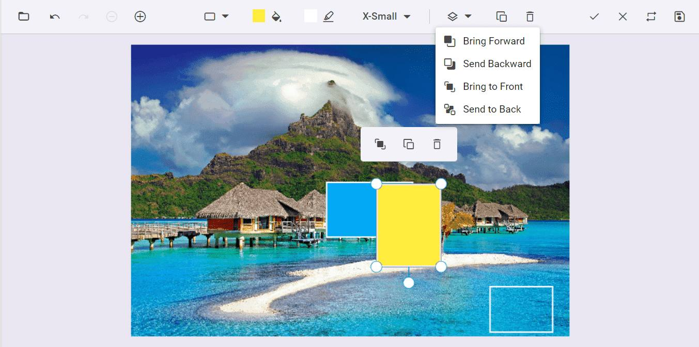

# Z-order in the Blazor Image Editor Component

We are excited to introduce `z-order` support in the Image Editor. It's a powerful tool that allows users to adjust the positioning of annotations. This feature is particularly useful for designing personalized templates like greeting cards or posters, where managing the layering of multiple annotations is crucial for a polished final product.

Types of adjustment in the Image Editor `z-order` support.

* Sent Backward - Switch the selected annotation with the annotation one layer behind it.

* Send to Back - Move the selected annotation to behind all other annotations.

* Bring to Front - Move the selected annotation to ahead of all other annotations.

* Bring forward - Switch the selected annotation with the annotation one layer ahead of it.

In the following example, you can use the `z-order` support.

```cshtml
@using Syncfusion.Blazor.ImageEditor 

<SfImageEditor @ref="ImageEditor" Height="400">
    <ImageEditorEvents Created="OpenAsync"></ImageEditorEvents>
</SfImageEditor> 

@code { 
    SfImageEditor ImageEditor; 
    private async void OpenAsync() 
    { 
        await ImageEditor.OpenAsync("nature.png"); 
    } 
}
```


