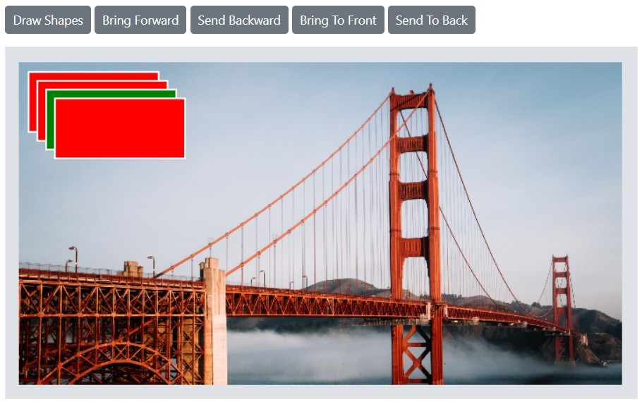

# Z-order in the Blazor Image Editor Component

The Image Editor supports z-order control to manage the stacking order of annotations. This capability is useful when designing templates such as greeting cards or posters, where arranging multiple annotations in the correct order is essential.

The following z-order actions are available:

- [Bring forward](https://help.syncfusion.com/cr/blazor/Syncfusion.Blazor.ImageEditor.SfImageEditor.html#Syncfusion_Blazor_ImageEditor_SfImageEditor_BringForwardAsync_System_String_) – Swap the selected annotation with the one directly above it.
- [Send backward](https://help.syncfusion.com/cr/blazor/Syncfusion.Blazor.ImageEditor.SfImageEditor.html#Syncfusion_Blazor_ImageEditor_SfImageEditor_SendBackwardAsync_System_String_) – Swap the selected annotation with the one directly below it.
- [Bring to front](https://help.syncfusion.com/cr/blazor/Syncfusion.Blazor.ImageEditor.SfImageEditor.html#Syncfusion_Blazor_ImageEditor_SfImageEditor_BringToFrontAsync_System_String_) – Move the selected annotation in front of all other annotations.
- [Send to back](https://help.syncfusion.com/cr/blazor/Syncfusion.Blazor.ImageEditor.SfImageEditor.html#Syncfusion_Blazor_ImageEditor_SfImageEditor_SendToBackAsync_System_String_) – Move the selected annotation behind all other annotations.

The following example demonstrates z-order support:

```cshtml
@using Syncfusion.Blazor.ImageEditor
@using Syncfusion.Blazor.Buttons

<div style="padding-bottom: 15px">
    <SfButton OnClick="DrawShapes">Draw Shapes</SfButton>
    <SfButton OnClick="BringForward">Bring Forward</SfButton>
    <SfButton OnClick="SendBackward">Send Backward</SfButton>
    <SfButton OnClick="BringToFront">Bring To Front</SfButton>
    <SfButton OnClick="SendToBack">Send To Back</SfButton>
</div>

<SfImageEditor @ref="ImageEditor" Toolbar="customToolbarItem" Height="400">
    <ImageEditorEvents Created="OpenAsync"></ImageEditorEvents>
</SfImageEditor>

@code {
    SfImageEditor ImageEditor;
    private List<ImageEditorToolbarItemModel> customToolbarItem = new List<ImageEditorToolbarItemModel>() { };
    private async void OpenAsync()
    {
        await ImageEditor.OpenAsync("https://ej2.syncfusion.com/react/demos/src/image-editor/images/bridge.png");
    }

    private async void DrawShapes()
    {
        ImageDimension Dimension = await ImageEditor.GetImageDimensionAsync();
        await ImageEditor.DrawRectangleAsync(Dimension.X.Value + 10, Dimension.Y.Value + 10, 150, 70, 2, "", "red");
        await ImageEditor.DrawRectangleAsync(Dimension.X.Value + 20, Dimension.Y.Value + 20, 150, 70, 2, "", "red");
        await ImageEditor.DrawRectangleAsync(Dimension.X.Value + 30, Dimension.Y.Value + 30, 150, 70, 2, "", "green");
        await ImageEditor.DrawRectangleAsync(Dimension.X.Value + 40, Dimension.Y.Value + 40, 150, 70, 2, "", "red");
    }

    private async void BringForward()
    {
        await ImageEditor.BringForwardAsync("shape_3");
    }

    private async void SendBackward()
    {
        await ImageEditor.SendBackwardAsync("shape_3");
    }

    private async void BringToFront()
    {
        await ImageEditor.BringToFrontAsync("shape_3");
    }

    private async void SendToBack()
    {
        await ImageEditor.SendToBackAsync("shape_3");
    }
}
```

