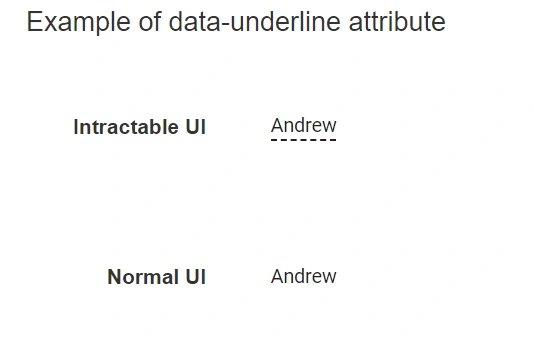

# Configuration in Blazor In-place Editor

## Rendering modes

This section explains the supported rendering modes of the Blazor In-place Editor. The supported rendering modes are:

- **Popup**
- **Inline**

N> Inline is the default rendering mode.

- **Popup** mode displays the editable container like a tooltip or popover above the target element.
- **Inline** mode replaces the element with the editable container. To open the editor in Inline mode, set the `Mode` property to `Inline`.

In the following example, the Blazor In-place Editor renders in Inline mode. The rendering mode can be switched dynamically by changing the drop-down value.

```cshtml

@using Syncfusion.Blazor.InPlaceEditor
@using Syncfusion.Blazor.DropDowns
@using Syncfusion.Blazor.Inputs

<table class="table-section">
    <tr>
        <td> Mode: </td>
        <td>
            <SfDropDownList Width="90%" TItem="InplaceModes" TValue="string" DataSource="@ModeData" @bind-Value="@DropdownValue">
                <DropDownListEvents TValue="string" TItem="InplaceModes" ValueChange="@OnChange"></DropDownListEvents>
                <DropDownListFieldSettings Text="text" Value="value"></DropDownListFieldSettings>
            </SfDropDownList>

        </td>
    </tr>
    <tr>
        <td class="sample-td">Enter your name: </td>
        <td class="sample-td">
            <SfInPlaceEditor @bind-Value="@TextValue" Mode="@InplaceMode" TValue="string">
                <EditorComponent>
                    <SfTextBox @bind-Value="@TextValue" Placeholder="Enter some text"></SfTextBox>
                </EditorComponent>
            </SfInPlaceEditor>
        </td>
    </tr>
</table>

<style>
    .table-section {
        margin: 0 auto;
    }

    tr td:first-child {
        text-align: right;
        padding-right: 20px;
    }

    .sample-td {
        padding-top: 10px;
        min-width: 230px;
        height: 100px;
    }
</style>

@code {
    public RenderMode InplaceMode = RenderMode.Inline;
    public string TextValue = "Andrew";
    public string DropdownValue = "Inline";

    public class InplaceModes
    {
        public string value { get; set; }
        public string text { get; set; }
    }
    List<InplaceModes> ModeData = new List<InplaceModes>()
    {
        new InplaceModes(){ value= "Inline", text= "Inline" },
        new InplaceModes(){ value= "Popup", text= "Popup" }
    };


    private void OnChange(Syncfusion.Blazor.DropDowns.ChangeEventArgs<string, InplaceModes> args)
    {
        this.InplaceMode = (args.Value.ToString() == "Popup" ? RenderMode.Popup : RenderMode.Inline);
        this.StateHasChanged();
    }
}

```

### Popup customization

Popup mode can be customized by using the `InPlaceEditorPopupSettings` tag.

Popup mode is rendered using the Blazor Tooltip component, so tooltip properties and events can be used to customize popup behavior through `InPlaceEditorPopupSettings`.

N> For more details, refer to the [Tooltip documentation](../tooltip/getting-started-webapp).

## Event actions for editing

The action that opens the editor is configured by the `EditableOn` property. By default, `Click` is enabled.
The following options are also supported:

* **Click**:  Opens the editor on a single click.
* **DoubleClick**: Opens the editor on a double click. This option does not apply to the edit icon.
* **EditIconClick**: Disables input-triggered editing and allows editing only through the edit icon.

N> The Blazor In-place Editor receives focus by pressing the Tab key from the previous focusable element. Press `Enter` to open the editor.

In the following code block, when switching the drop-down item, the selected value is assigned to the `EditableOn` property. The editor is opened when you double click on the input.

```cshtml

@using Syncfusion.Blazor.InPlaceEditor
@using Syncfusion.Blazor.DropDowns
@using Syncfusion.Blazor.Inputs

<table class="table-section">
    <tr>
        <td>Choose Editable Type: </td>
        <td>
            <SfDropDownList Width="90%" TValue="string" TItem="InplaceEditableModes" DataSource="@EditableData" @bind-Value="@DropDownValue">
                <DropDownListEvents TValue="string" TItem="InplaceEditableModes" ValueChange="@OnChange"></DropDownListEvents>
                <DropDownListFieldSettings Text="text" Value="value"></DropDownListFieldSettings>
            </SfDropDownList>
        </td>
    </tr>
    <tr>
        <td class="sample-td">Enter your name: </td>
        <td class="sample-td">
            <SfInPlaceEditor @bind-Value="@TextValue" EditableOn="EditableOn" SubmitOnEnter="true" TValue="string">
                <EditorComponent>
                    <SfTextBox @bind-Value="@TextValue" Placeholder="Enter some text"></SfTextBox>
                </EditorComponent>
            </SfInPlaceEditor>
        </td>
    </tr>
</table>

<style>
    .table-section {
        margin: 0 auto;
    }

    tr td:first-child {
        text-align: right;
        padding-right: 20px;
    }

    .sample-td {
        padding-top: 10px;
        min-width: 230px;
        height: 100px;
    }
</style>

@code {
    public string TextValue = "Andrew";
    public string DropDownValue = "Click";
    public EditableType EditableOn = EditableType.Click;

    public class InplaceEditableModes
    {
        public string value { get; set; }
        public string text { get; set; }
    }

    private List<InplaceEditableModes> EditableData = new List<InplaceEditableModes>()
    {
        new InplaceEditableModes(){ value= "Click", text= "Click" },
        new InplaceEditableModes(){ value= "Double Click", text= "Double Click" },
        new InplaceEditableModes(){ value= "Edit Icon Click", text= "Edit Icon Click" }
    };


    private void OnChange(Syncfusion.Blazor.DropDowns.ChangeEventArgs<string, InplaceEditableModes> args)
    {
        if (args.Value != null)
        {
            if (args.Value.ToString() == "Click")
            {
                this.EditableOn = EditableType.Click;
            }
            else if (args.Value.ToString() == "Double Click")
            {
                this.EditableOn = EditableType.DoubleClick;
            }
            else
            {
                this.EditableOn = EditableType.EditIconClick;
            }
            this.StateHasChanged();
        }
    }

}
```

## Action on focus out

An action can be performed when clicking outside the editor container. This is controlled by the `ActionOnBlur` property. By default, `Submit` is enabled. The following options are supported:

- **Cancel**: Cancels editing and restores the previous content.
- **Submit**: Saves the edited content.
- **Ignore**: Performs no action.

In the following example, the selected drop-down value is assigned to the `ActionOnBlur` property.

```cshtml
@using Syncfusion.Blazor.InPlaceEditor
@using Syncfusion.Blazor.DropDowns
@using Syncfusion.Blazor.Inputs

<table class="table-section">
    <tr>
        <td> ActionOnBlur: </td>
        <td>
            <SfDropDownList Width="90%" TItem="DropDownFields" TValue="string" DataSource="@Modes" @bind-Value="@DropdownValue">
                <DropDownListEvents TValue="string" TItem="DropDownFields" ValueChange="@OnChange"></DropDownListEvents>
                <DropDownListFieldSettings Text="Text" Value="Text"></DropDownListFieldSettings>
            </SfDropDownList>
        </td>
    </tr>
    <tr>
        <td class="sample-td">Enter your name: </td>
        <td class="sample-td">
            <SfInPlaceEditor @bind-Value="@TextValue" ActionOnBlur="OnBlur" SubmitOnEnter="true" TValue="string">
                <EditorComponent>
                    <SfTextBox @bind-Value="@TextValue" Placeholder="Enter some text"></SfTextBox>
                </EditorComponent>
            </SfInPlaceEditor>
        </td>
    </tr>
</table>

<style>
    .table-section {
        margin: 0 auto;
    }

    tr td:first-child {
        text-align: right;
        padding-right: 20px;
    }

    .sample-td {
        padding-top: 10px;
        min-width: 230px;
        height: 100px;
    }
</style>

@code {
    public string TextValue = "Andrew";
    public string DropdownValue = "Submit";
    public ActionBlur OnBlur = ActionBlur.Ignore;


    public class DropDownFields
    {
        public string Text { get; set; }
    }

    public List<DropDownFields> Modes = new List<DropDownFields>
{
        new DropDownFields() { Text= "Submit" },
        new DropDownFields() { Text= "Cancel" },
        new DropDownFields() { Text= "Ignore" }
    };

    private void OnChange(Syncfusion.Blazor.DropDowns.ChangeEventArgs<string, DropDownFields> args)
    {
        if (args.Value.ToString() == "Submit")
        {
            this.OnBlur = ActionBlur.Submit;
        }
        else if (args.Value.ToString() == "Cancel")
        {
            this.OnBlur = ActionBlur.Cancel;
        }
        else
        {
            this.OnBlur = ActionBlur.Ignore;
        }
        this.StateHasChanged();
    }
}

```

## Display modes

By default, the Blazor In-place Editor input element is highlighted with a dotted underline. To remove the dotted underline from the input element, add the `{"data-underline", "false"}` attribute to the Blazor In-place Editor root element.

The following example shows interactive and normal display modes.

```cshtml

@using Syncfusion.Blazor.InPlaceEditor
@using Syncfusion.Blazor.Inputs

<h4>Example of data-underline attribute</h4>
<table class="table-section">
    <tr>
        <td class="col-lg-6 col-md-6 col-sm-6 col-xs-6 control-title"> Intractable UI </td>
        <td class="col-lg-6 col-md-6 col-sm-6 col-xs-6">
            <SfInPlaceEditor @bind-Value="@TextValue" TValue="string" SubmitOnEnter="true">
                <EditorComponent>
                    <SfTextBox @bind-Value="@TextValue" Placeholder="Enter some text"></SfTextBox>
                </EditorComponent>
            </SfInPlaceEditor>
        </td>
    </tr>
    <tr>
        <td class="col-lg-6 col-md-6 col-sm-6 col-xs-6 control-title"> Normal UI </td>
        <td class="col-lg-6 col-md-6 col-sm-6 col-xs-6">
            <SfInPlaceEditor @bind-Value="@TextValue" TValue="string" SubmitOnEnter="true" @attributes="htmlAttribute">
                <EditorComponent>
                    <SfTextBox @bind-Value="@TextValue" Placeholder="Enter some text"></SfTextBox>
                </EditorComponent>
            </SfInPlaceEditor>
        </td>
    </tr>
</table>

<style>
    .table-section {
        margin: 0 auto;
    }

    td {
        padding: 20px 0;
        min-width: 230px;
        height: 100px;
    }

    .control-title {
        font-weight: 600;
        padding-right: 20px;
        text-align: right;
        width: 50%;
    }

    h4 {
        text-align: center;
    }
</style>

@code {
    public string TextValue = "Andrew";

    Dictionary<string, object> htmlAttribute = new Dictionary<string, object>() {
        {"data-underline", "false" }
    };
}

```



## See also

- [Disable the editor](./how-to/disable-edit-mode)
- [Animate the editor during popup mode](./how-to/custom-animation)