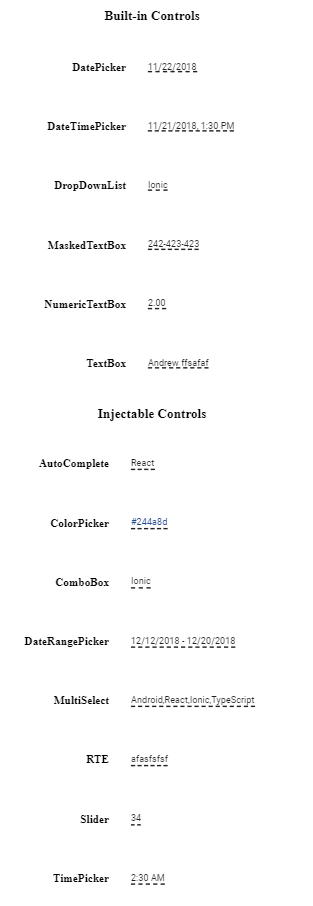

# List of Components in Blazor In-place Editor Component

The In-place Editor renders different editor components based on the `Type` property. Each editor component must be placed inside the In-place Editor and configured with two-way data binding between the In-place Editor and the embedded editor component to keep values in sync.

The following table lists the supported editor components and their corresponding Type values.

| [AutoComplete](../autocomplete/getting-started)  (`AutoComplete`)        | [TextBox](../textbox/getting-started)  (`Text`)             |
| [ComboBox](../combobox/getting-started)  (`ComboBox`)              | [DatePicker](../datepicker/getting-started)  (`Date`)        |
| [MultiSelect](../multiselect-dropdown/getting-started)   (`MultiSelect`)        | [DateTimePicker](../datetime-picker/getting-started)   (`DateTime`)     |
| [TimePicker](../timepicker/getting-started)   (`Time`)         | [DropDownList](../dropdown-list/getting-started)  (`DropDownList`)      |
| [DateRangePicker](../daterangepicker/getting-started)   (`DateRange`)       | [MaskedTextBox](../input-mask/getting-started)   (`Mask`)      |
| [Slider](../range-slider/getting-started)   (`Slider`)             | [NumericTextBox](../numeric-textbox/getting-started)   (`Numeric`)    |
| [RichTextEditor](../rich-text-editor/getting-started)     (`RichTextEditor`)  |   [ColorPicker](../color-picker/getting-started)    (`Color`)    |

The following example demonstrates how to render the Editor components in the In-place Editor,

```cshtml

@using Syncfusion.Blazor.InPlaceEditor
@using Syncfusion.Blazor.Inputs
@using Syncfusion.Blazor.Calendars;
@using Syncfusion.Blazor.DropDowns;
@using Syncfusion.Blazor.RichTextEditor;


<h3> Built-in Controls </h3>
<table class="table-section">
    <tr>
        <td class="col-lg-6 col-md-6 col-sm-6 col-xs-6 control-title"> DatePicker </td>
        <td class="col-lg-6 col-md-6 col-sm-6 col-xs-6">
            <SfInPlaceEditor Type="Syncfusion.Blazor.InPlaceEditor.InputType.Date" TValue="DateTime?" @bind-Value="@DateValue1">
                <EditorComponent>
                    <SfDatePicker TValue="DateTime?" @bind-Value="@DateValue1" Placeholder="Select a date"></SfDatePicker>
                </EditorComponent>
            </SfInPlaceEditor>
        </td>
    </tr>
    <tr>
        <td class="col-lg-6 col-md-6 col-sm-6 col-xs-6 control-title"> DateTimePicker </td>
        <td class="col-lg-6 col-md-6 col-sm-6 col-xs-6">
            <SfInPlaceEditor Type="Syncfusion.Blazor.InPlaceEditor.InputType.DateTime" TValue="DateTime?" @bind-Value="@DateValue3">
                <EditorComponent>
                    <SfDateTimePicker Placeholder="Select a date and time" TValue="DateTime?" @bind-Value="@DateValue3"></SfDateTimePicker>
                </EditorComponent>
            </SfInPlaceEditor>

        </td>
    </tr>
    <tr>
        <td class="col-lg-6 col-md-6 col-sm-6 col-xs-6 control-title"> DropDownList </td>
        <td class="col-lg-6 col-md-6 col-sm-6 col-xs-6">
            <SfInPlaceEditor @bind-Value="@DropdownValue" Type="Syncfusion.Blazor.InPlaceEditor.InputType.DropDownList" Mode="@Mode" TValue="string">
                <EditorComponent>
                    <SfDropDownList TValue="string" TItem="Countries" @bind-Value="@DropdownValue" DataSource="@Country">
                        <DropDownListFieldSettings Text="Name" Value="Code"></DropDownListFieldSettings>
                    </SfDropDownList>
                </EditorComponent>
            </SfInPlaceEditor>
        </td>
    </tr>
    <tr>
        <td class="col-lg-6 col-md-6 col-sm-6 col-xs-6 control-title"> MaskedTextBox </td>
        <td class="col-lg-6 col-md-6 col-sm-6 col-xs-6">
            <SfInPlaceEditor Type="Syncfusion.Blazor.InPlaceEditor.InputType.Mask" @bind-Value="@MaskValue" TValue="string">
                <EditorComponent>
                    <SfMaskedTextBox Mask="000-000-0000" @bind-Value="@MaskValue"></SfMaskedTextBox>
                </EditorComponent>
            </SfInPlaceEditor>
        </td>
    </tr>
    <tr>
        <td class="col-lg-6 col-md-6 col-sm-6 col-xs-6 control-title"> NumericTextBox </td>
        <td class="col-lg-6 col-md-6 col-sm-6 col-xs-6">
            <SfInPlaceEditor Type="Syncfusion.Blazor.InPlaceEditor.InputType.Numeric" @bind-Value=@NumericValue TValue="double">
                <EditorComponent>
                    <SfNumericTextBox TValue="double" @bind-Value=@NumericValue Format="c2" Placeholder="Currency format"></SfNumericTextBox>
                </EditorComponent>
            </SfInPlaceEditor>
        </td>
    </tr>
    <tr>
        <td class="col-lg-6 col-md-6 col-sm-6 col-xs-6 control-title"> TextBox </td>
        <td class="col-lg-6 col-md-6 col-sm-6 col-xs-6">
            <SfInPlaceEditor @bind-Value="@TextValue" TValue="string" Type="Syncfusion.Blazor.InPlaceEditor.InputType.Text">
                <EditorComponent>
                    <SfTextBox @bind-Value="@TextValue" Placeholder="Enter employee name"></SfTextBox>
                </EditorComponent>
            </SfInPlaceEditor>
        </td>
    </tr>
</table>
<h3> Injectable Controls </h3>
<table class="table-section">
    <tr>
        <td class="col-lg-6 col-md-6 col-sm-6 col-xs-6 control-title"> AutoComplete </td>
        <td class="col-lg-6 col-md-6 col-sm-6 col-xs-6">
            <SfInPlaceEditor Type="Syncfusion.Blazor.InPlaceEditor.InputType.AutoComplete" @bind-Value="@AutoValue" Mode="@Mode" TValue="string">
                <EditorComponent>
                    <SfAutoComplete TValue="string" TItem="Countries" @bind-Value="@AutoValue" DataSource="@Country" Autofill=true>
                        <AutoCompleteFieldSettings Value="Name"></AutoCompleteFieldSettings>
                    </SfAutoComplete>
                </EditorComponent>
            </SfInPlaceEditor>
        </td>
    </tr>
    <tr>
        <td class="col-lg-6 col-md-6 col-sm-6 col-xs-6 control-title"> ColorPicker </td>
        <td class="col-lg-6 col-md-6 col-sm-6 col-xs-6">
            <SfInPlaceEditor Type="Syncfusion.Blazor.InPlaceEditor.InputType.Color" @bind-Value="colorValue" TValue="string">
                <EditorComponent>
                    <SfColorPicker @bind-Value="colorValue"></SfColorPicker>
                </EditorComponent>
            </SfInPlaceEditor>
        </td>
    </tr>
    <tr>
        <td class="col-lg-6 col-md-6 col-sm-6 col-xs-6 control-title"> ComboBox </td>
        <td class="col-lg-6 col-md-6 col-sm-6 col-xs-6">
            <SfInPlaceEditor Type="Syncfusion.Blazor.InPlaceEditor.InputType.ComboBox" @bind-Value="@ComboValue" TValue="string">
                <EditorComponent>
                    <SfComboBox TValue="string" @bind-Value="@ComboValue" TItem="Countries" DataSource="@Country">
                        <ComboBoxFieldSettings Text="Name" Value="Code"></ComboBoxFieldSettings>
                    </SfComboBox>
                </EditorComponent>
            </SfInPlaceEditor>
        </td>
    </tr>
    <tr>
        <td class="col-lg-6 col-md-6 col-sm-6 col-xs-6 control-title"> DateRangePicker </td>
        <td class="col-lg-6 col-md-6 col-sm-6 col-xs-6">
            <SfInPlaceEditor Type="Syncfusion.Blazor.InPlaceEditor.InputType.DateRange" TValue="DateTime[]" @bind-Value="@DateRangeValue">
                <EditorComponent>
                    <SfDateRangePicker StartDate="@DateValue2" EndDate="@DateValue3"></SfDateRangePicker>
                </EditorComponent>
            </SfInPlaceEditor>
        </td>
    </tr>
    <tr>
        <td class="col-lg-6 col-md-6 col-sm-6 col-xs-6 control-title"> MultiSelect </td>
        <td class="col-lg-6 col-md-6 col-sm-6 col-xs-6">
            <SfInPlaceEditor Type="Syncfusion.Blazor.InPlaceEditor.InputType.MultiSelect" @bind-Value="@MultiValue" TValue="string[]">
                <EditorComponent>
                    <SfMultiSelect TValue="string[]" @bind-Value="@MultiValue" TItem="Countries" DataSource="@Country" AllowFiltering="true">
                        <MultiSelectFieldSettings Text="Name" Value="Code"></MultiSelectFieldSettings>
                    </SfMultiSelect>
                </EditorComponent>
            </SfInPlaceEditor>
        </td>
    </tr>
    <tr>
        <td class="col-lg-6 col-md-6 col-sm-6 col-xs-6 control-title"> RichTextEditor </td>
        <td class="col-lg-6 col-md-6 col-sm-6 col-xs-6">
            <SfInPlaceEditor Type="Syncfusion.Blazor.InPlaceEditor.InputType.RichTextEditor" @bind-Value="@value" TValue="string">
                <EditorComponent>
                    <SfRichTextEditor @bind-Value="@value">
                    </SfRichTextEditor>
                </EditorComponent>
            </SfInPlaceEditor>
        </td>
    </tr>
    <tr>
        <td class="col-lg-6 col-md-6 col-sm-6 col-xs-6 control-title"> Slider </td>
        <td class="col-lg-6 col-md-6 col-sm-6 col-xs-6">
            <SfInPlaceEditor @bind-Value="@sliderValue" Type="Syncfusion.Blazor.InPlaceEditor.InputType.Slider" TValue="double">
                <EditorComponent>
                    <SfSlider @bind-Value="@sliderValue"></SfSlider>
                </EditorComponent>
            </SfInPlaceEditor>
        </td>
    </tr>
    <tr>
        <td class="col-lg-6 col-md-6 col-sm-6 col-xs-6 control-title"> TimePicker </td>
        <td class="col-lg-6 col-md-6 col-sm-6 col-xs-6">
            <SfInPlaceEditor Mode="@Mode" Type="Syncfusion.Blazor.InPlaceEditor.InputType.Time" TValue="DateTime?" @bind-Value="@DateValue2">
                <EditorComponent>
                    <SfTimePicker TValue="DateTime?" @bind-Value="@DateValue2" Placeholder="Select a time"></SfTimePicker>
                </EditorComponent>
            </SfInPlaceEditor>
        </td>
    </tr>
</table>

<style>
    body {
        padding: 20px 0
    }

    .control-title {
        font-weight: 600;
        padding-right: 20px;
    }

    .control-title {
        width: 50%;
    }

    td {
        height: 80px;
    }

    tr td:first-child {
        text-align: right;
    }

    tr td:last-child {
        text-align: left;
    }

    .table-section {
        margin: 0 auto;
    }

    h3 {
        text-align: center;
    }
</style>


@code {
    private string value { get; set; } = "syncfusion";


    private DateTime? DateValue1 = new DateTime(2017, 05, 23);
    private DateTime? DateValue2 = new DateTime(2017, 05, 23);
    private DateTime? DateValue3 = new DateTime(2017, 05, 23);
    private DateTime[] DateRangeValue = new DateTime[2] { new DateTime(2017, 05, 23), new DateTime(2017, 07, 05) };
    private object DateData = new { placeholder = "Select a date" };
    private object TimeData = new { placeholder = "Select a time" };
    private object DateTimeData = new { placeholder = "Select a date and time" };
    private object DateRangeData = new { placeholder = "Select a date range" };

    private string TextValue = "Andrew";
    private string MaskValue = "012-345-6789";
    private double NumericValue = 100;
    private double sliderValue { get; set; } = 30;

    private string DropdownValue = "CA";
    private string AutoValue = "Australia";
    private string ComboValue { get; set; } = "FI";
    private string[] MultiValue = new string[] { "AU", "BM" };
    public string DropMode { get; set; } = "Inline";
    private string colorValue { get; set; } = "#0db1e7";

    private RenderMode Mode = RenderMode.Inline;

    public class Countries
    {
        public string Name { get; set; }
        public string Code { get; set; }
    }
    private List<Countries> Country = new List<Countries>
{
        new Countries() { Name = "Australia", Code = "AU" },
        new Countries() { Name = "Bermuda", Code = "BM" },
        new Countries() { Name = "Canada", Code = "CA" },
        new Countries() { Name = "Cameroon", Code = "CM" },
        new Countries() { Name = "Denmark", Code = "DK" },
        new Countries() { Name = "France", Code = "FR" },
        new Countries() { Name = "Finland", Code = "FI" },
        new Countries() { Name = "Germany", Code = "DE" },
        new Countries() { Name = "Greenland", Code = "GL" },
        new Countries() { Name = "Hong Kong", Code = "HK" },
        new Countries() { Name = "India", Code = "IN" },
        new Countries() { Name = "Italy", Code = "IT" },
        new Countries() { Name = "Japan", Code = "JP" },
        new Countries() { Name = "Mexico", Code = "MX" },
        new Countries() { Name = "Norway", Code = "NO" },
        new Countries() { Name = "Poland", Code = "PL" },
        new Countries() { Name = "Switzerland", Code = "CH" },
        new Countries() { Name = "United Kingdom", Code = "GB" },
        new Countries() { Name = "United States", Code = "US" },
    };
}

```




## See Also

* [HTML5 components](./integration)