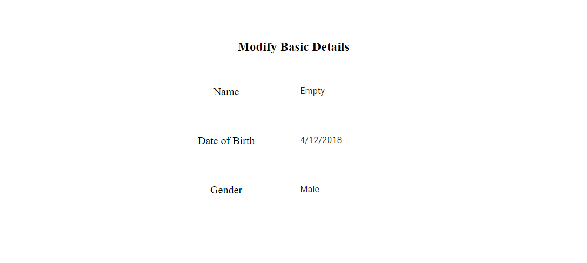

<!-- markdownlint-disable MD024 -->

# Getting Started with Blazor In-place Editor Component

This section briefly explains how to include a In-Place Editor component in your Blazor Server-side application. You can refer to our Getting Started with [Syncfusion Blazor for Server-Side in Visual Studio page](../getting-started/blazor-server-side-visual-studio/) for the introduction and configuring the common specifications.

## Importing Syncfusion Blazor component in the application

* Install **Syncfusion.Blazor.InPlaceEditor** NuGet package to the application by using the **NuGet Package Manager**.

* You can add the client-side resources through [CDN](https://blazor.syncfusion.com/documentation/appearance/themes#cdn-reference) or from [NuGet](https://blazor.syncfusion.com/documentation/appearance/themes#static-web-assets) package in the **HEAD** element of the **~/Pages/_Host.cshtml** page.

    ```cshtml

    <head>
        <environment include="Development">
        ....
        ....
            <link href="_content/Syncfusion.Blazor/styles/fabric.css" rel="stylesheet" />
            <!---CDN--->
            @*<link href="https://cdn.syncfusion.com/blazor/18.4.42/styles/fabric.css" rel="stylesheet" />*@
    </environment>
    </head>

    ```

    For Internet Explorer 11 kindly refer the polyfills. Refer the [documentation](../common/how-to/render-blazor-server-app-in-ie/) for more information.

    ```cshtml

    <head>
    <environment include="Development">
        <link href="_content/Syncfusion.Blazor/styles/fabric.css" rel="stylesheet" />
        <script src="https://github.com/Daddoon/Blazor.Polyfill/releases/download/3.0.1/blazor.polyfill.min.js"></script>
    </environment>
    </head>

    ```

## Adding component package to the application

Open **~/_Imports.razor** file and import the **Syncfusion.Blazor.InPlaceEditor** package.

```cshtml

@using Syncfusion.Blazor.InPlaceEditor

```

## Add SyncfusionBlazor service in Startup.cs

Open the **Startup.cs** file and add services required by Syncfusion components using **services.AddSyncfusionBlazor()** method. Add this method in the **ConfigureServices** function as follows.

```csharp

using Syncfusion.Blazor;
namespace BlazorApplication
{
    public class Startup
    {
        ....
        ....
        public void ConfigureServices(IServiceCollection services)
        {
            ....
            ....
            services.AddSyncfusionBlazor();
        }
    }
}

```

## Add In-Place Editor component

To initialize the In-Place Editor component, add the below code to your **Index.razor** view page which is present under **~/Pages** folder.

The following code explains how to initialize a simple In-place Editor with TextBox in the Razor page.

```cshtml

@using Syncfusion.Blazor.InPlaceEditor
@using Syncfusion.Blazor.Inputs

<table>
    <tr>
        <td>
            <label class="control-label" style="text-align: left;font-size: 14px;font-weight: 400">
                TextBox
            </label>
        </td>
        <td>
            <SfInPlaceEditor @bind-Value="@TextValue" TValue="string">
                <EditorComponent>
                    <SfTextBox @bind-Value="@TextValue" Placeholder="Enter employee name"></SfTextBox>
                </EditorComponent>
            </SfInPlaceEditor>
        </td>
    </tr>
</table>

@code {
    public string TextValue = "Andrew";
}

```

> The type of component editor must be configured in the 'Type' Editor In-place property. Also, should configure the two-way binding between the In-place Editor and its EditorComponent. It's used to update the editor component value into the In-place Editor component.

## Render In-place Editor with popup

The following code explains how to initialize a simple In-place Editor with popup in the Blazor page.

```cshtml

@using Syncfusion.Blazor.InPlaceEditor
@using Syncfusion.Blazor.DropDowns

<table>
    <tr>
        <td>
            <label class="control-label">
                Choose a Country:
            </label>
        </td>
        <td>
            <SfInPlaceEditor Type="Syncfusion.Blazor.InPlaceEditor.InputType.AutoComplete" @bind-Value="@AutoValue" Mode="RenderMode.Popup" TValue="string">
                <EditorComponent>
                    <SfAutoComplete TValue="string" TItem="Countries" @bind-Value="@AutoValue" Placeholder="e.g. Australia" DataSource="@LocalData">
                        <AutoCompleteFieldSettings Value="Name"></AutoCompleteFieldSettings>
                    </SfAutoComplete>
                </EditorComponent>
            </SfInPlaceEditor>
        </td>
    </tr>
</table>

@code {
    public string AutoValue = "Australia";

    public class Countries
    {
        public string Name { get; set; }
        public string Code { get; set; }
    }

    List<Countries> LocalData = new List<Countries> {
        new Countries() { Name = "Australia", Code = "AU" },
        new Countries() { Name = "Bermuda", Code = "BM" },
        new Countries() { Name = "Canada", Code = "CA" },
        new Countries() { Name = "Cameroon", Code = "CM" },
        new Countries() { Name = "Denmark", Code = "DK" }
    };
}

```

## Run the application

After successful compilation of your application, run the application.

Output be like the below.


## Configuring DropDownList

You can render the Blazor DropDownList by changing the `Type` property as `DropDownList` and configure `DropDownList` component inside the Editor component.

The following sample demonstrates how to render the `DropDownList` component in the In-place Editor,

```cshtml

@using Syncfusion.Blazor.DropDowns
@using Syncfusion.Blazor.InPlaceEditor

<SfInPlaceEditor @bind-Value="@DropdownValue" Type="Syncfusion.Blazor.InPlaceEditor.InputType.DropDownList" TValue="string">
    <EditorComponent>
        <SfDropDownList TValue="string" TItem="Games"  @bind-Value="@DropdownValue" Placeholder="Select a game" DataSource="@LocalData">
            <DropDownListFieldSettings Value="ID" Text="Text"></DropDownListFieldSettings>
        </SfDropDownList>
    </EditorComponent>
</SfInPlaceEditor>

@code {
    public string DropdownValue = "Cricket";

    public class Games
    {
        public string ID { get; set; }
        public string Text { get; set; }
    }
    List<Games> LocalData = new List<Games> {
    new Games() { ID= "Game1", Text= "American Football" },
    new Games() { ID= "Game2", Text= "Badminton" },
    new Games() { ID= "Game3", Text= "Basketball" },
    new Games() { ID= "Game4", Text= "Cricket" },
    new Games() { ID= "Game5", Text= "Football" },
    new Games() { ID= "Game6", Text= "Golf" },
    new Games() { ID= "Game7", Text= "Hockey" },
    new Games() { ID= "Game8", Text= "Rugby"},
    new Games() { ID= "Game9", Text= "Snooker" },
    new Games() { ID= "Game10", Text= "Tennis"},
  };
}

```

## Integrate DatePicker

You can render the Blazor `DatePicker` by changing the `Type` property as `Date` and configure `DatePicker` component inside the Editor component. Also, configure its properties directly in the `Datepicker` component

The following sample demonstrates how to render the `DatePicker` component in the In-place Editor,

```cshtml

@using Syncfusion.Blazor.InPlaceEditor
@using Syncfusion.Blazor.Calendars

<SfInPlaceEditor Type="Syncfusion.Blazor.InPlaceEditor.InputType.Date" TValue="DateTime?" @bind-Value="@DateValue">
    <EditorComponent>
        <SfDatePicker TValue="DateTime?" @bind-Value="@DateValue" Placeholder="Choose a Date"></SfDatePicker>
    </EditorComponent>
</SfInPlaceEditor>

@code {
    public DateTime? DateValue { get; set; } = new DateTime(DateTime.Now.Year, DateTime.Now.Month, DateTime.Now.Day);

}

```

In the following code, it is configured to render the `DatePicker`, `Dropdownlist` and `Textbox` components.

```cshtml

@using Syncfusion.Blazor.InPlaceEditor
@using Syncfusion.Blazor.Inputs
@using Syncfusion.Blazor.Calendars
@using Syncfusion.Blazor.DropDowns


<div id="container" class="control-group">
    <h3> Modify Basic Details </h3>
    <table style="margin: 10px auto;">
        <tr>
            <td>Name</td>
            <td class='left'>
                <SfInPlaceEditor @bind-Value="@TextValue" TValue="string">
                    <EditorComponent>
                        <SfTextBox @bind-Value="@TextValue" Placeholder="Enter your name"></SfTextBox>
                    </EditorComponent>
                </SfInPlaceEditor>
            </td>
        </tr>
        <tr>
            <td>Date of Birth</td>
            <td class='left'>
                <SfInPlaceEditor Type="Syncfusion.Blazor.InPlaceEditor.InputType.Date" TValue="DateTime?" @bind-Value="@DateValue">
                    <EditorComponent>
                        <SfDatePicker TValue="DateTime?" @bind-Value="@DateValue" Placeholder="Select date"></SfDatePicker>
                    </EditorComponent>
                </SfInPlaceEditor>
            </td>
        </tr>
        <tr>
            <td>Gender</td>
            <td class='left'>
                <SfInPlaceEditor @bind-Value="@DropdownValue" Type="Syncfusion.Blazor.InPlaceEditor.InputType.DropDownList"  TValue="string">
                    <EditorComponent>
                        <SfDropDownList Width="90%" TItem="Gender" TValue="string" DataSource="@dropdownData" @bind-Value="@DropdownValue">
                            <DropDownListFieldSettings Text="text" Value="text"></DropDownListFieldSettings>
                        </SfDropDownList>
                    </EditorComponent>
                </SfInPlaceEditor>
            </td>
        </tr>
    </table>
</div>

<style>
    #container {
        text-align: center;
        margin-top: 50px;
    }

        #container table {
            width: 400px;
            margin: auto;
        }

            #container table td {
                height: 70px;
                width: 150px;
            }

            #container table .left {
                text-align: left;
            }
</style>

@code {
    public DateTime? DateValue { get; set; } = new DateTime(DateTime.Now.Year, DateTime.Now.Month, DateTime.Now.Day);
    public string TextValue = "Andrew";
    public string DropdownValue = "Male";

    public class Gender
    {
        public string value { get; set; }
        public string text { get; set; }
    }
    List<Gender> dropdownData = new List<Gender>()
    {
        new Gender(){ text= "Male" },
        new Gender(){ text= "Female" }
    };
}

```

Output be like the below.



## Submitting data to the server (save)

You can submit editor value to the server by configuring the `SaveUrl`, `Adaptor` and `PrimaryKey` property.

| Property   | Usage                                           |
|------------|---------------------------------------------------------|
| **`Url`**        | Gets the URl for server submit action.        |
| **`Adaptor`**    | Specifies the adaptor type that is used by DataManager to communicate with DataSource.                |
| **`PrimaryKey`** | Defines the unique primary key of editable field which can be used for saving data in the data-base.|

> The `PrimaryKey` property is mandatory. If it is not set, edited data are not sent to the server.

## Refresh In-place Editor with modified value

The edited data is submitted to the server and you can see the new values getting reflected in the In-place Editor.

```cshtml

@using Syncfusion.Blazor.DropDowns
@using Syncfusion.Blazor.InPlaceEditor

<div id="container">
    <div class="control-group">
        Best Employee of the year:

        <SfInPlaceEditor @ref="InPlaceObj" PrimaryKey="Employee" Name="Employee" Adaptor="Adaptors.UrlAdaptor" SaveUrl="https://ej2services.syncfusion.com/production/web-services/api/Editor/UpdateData" Type="Syncfusion.Blazor.InPlaceEditor.InputType.DropDownList" @bind-Value="@DropdownValue" TValue="string">
            <EditorComponent>
                <SfDropDownList TValue="string" TItem="Employees" Placeholder="Select employee" PopupHeight="200px" DataSource="@LocalData">
                    <DropDownListFieldSettings Value="ID" Text="Text"></DropDownListFieldSettings>
                </SfDropDownList>
            </EditorComponent>t
            <InPlaceEditorEvents Created="@OnCreate" OnActionSuccess="@OnSuccess" TValue="string"></InPlaceEditorEvents>
        </SfInPlaceEditor>

    </div>
    <table style="margin:60px auto;width:25%">
        <tr>
            <td style="text-align: left">
                Old Value :
            </td>
            <td id="oldValue" style="text-align: left">
                @PreviousValue
            </td>
        </tr>
        <tr>
            <td style="text-align: left">
                New Value :
            </td>
            <td id="newValue" style="text-align: left">
                @CurrentValue
            </td>
        </tr>
    </table>
</div>

<style>
    .e-inplaceeditor {
        min-width: 200px;
        text-align: left;
    }

    #container .control-group {
        text-align: center;
        margin: 100px auto;
    }
</style>

@code {
    SfInPlaceEditor<string> InPlaceObj;
    public string PreviousValue { get; set; }
    public string DropdownValue = "Andrew";
    public string CurrentValue { get; set; }

    public class Employees
    {
        public string ID { get; set; }
        public string Text { get; set; }
    }
    List<Employees> LocalData = new List<Employees> {
    new Employees() { ID= "Andrew", Text= "Andrew" },
    new Employees() { ID= "Margaret Hamilit", Text= "Margaret Hamilit" },
    new Employees() { ID= "Fuller", Text= "Fuller" },
    new Employees() { ID= "John Smith", Text= "John Smith" },
    new Employees() { ID= "Victoria", Text= "Victoria" },
    new Employees() { ID= "David", Text= "David" },
    new Employees() { ID= "Johnson", Text= "Johnson" },
    new Employees() { ID= "Rosy", Text= "Rosy"}
  };

    public void OnCreate(Object args)
    {
        this.CurrentValue = this.DropdownValue;
    }

    public void OnSuccess(ActionEventArgs<string> args)
    {
        this.PreviousValue = this.CurrentValue;
        this.CurrentValue = args.Value;
    }
}

```

The output will be as follows.


## See Also

* [Getting Started with Syncfusion Blazor for client-side in .NET Core CLI](../getting-started/blazor-webassembly-dotnet-cli/)

* [Getting Started with Syncfusion Blazor for server-side in Visual Studio](../getting-started/blazor-server-side-visual-studio/)

* [Getting Started with Syncfusion Blazor for server-side in .NET Core CLI](../getting-started/blazor-server-side-dotnet-cli/)