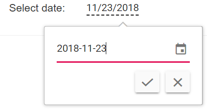

# Globalization in Blazor In-place Editor Component

## Localization

Localization library allows you to localize the default text content of the In-place Editor to different cultures using the `Locale` property. In-place Editor following keys will be localize based on culture.

> Use `Resource` file to translate the static text of the In-place Editor. The Resource file is an XML file which contains the strings(key and value pairs) that you want to translate into different language. You can also refer [`Localization`](../../common/localization/) link to know more about how to configure and use localization in the Blazor Server and WebAssembly project for Syncfusion Blazor components.

| Locale key | en-US (default) |
|------|------|
| InPlaceEditor_Save | Save |
| InPlaceEditor_Cancel | Cancel |
| InPlaceEditor_LoadingText | Loading... |
| InPlaceEditor_EditIcon | Click to edit |
| InPlaceEditor_EditAreaClick | Click to edit |
| InPlaceEditor_EditAreaDoubleClick | Double click to edit |

In the following sample, `French` culture is set to In-place Editor and change the tooltip text.

```cshtml

@using Syncfusion.Blazor.DropDowns
@using Syncfusion.Blazor.InPlaceEditor
@using Syncfusion.Blazor.Inputs

<table class="table-section">
    <tr>
        <td> Choose Editable Type: </td>
        <td>
            <SfDropDownList Width="90%" TValue="string" TItem="InplaceEditableModes" DataSource="@EditableData" @bind-Value="@DropDownValue">
                <DropDownListEvents TValue="string" TItem="InplaceEditableModes" ValueChange="@OnChange"></DropDownListEvents>
                <DropDownListFieldSettings Text="text" Value="value"></DropDownListFieldSettings>
            </SfDropDownList>
        </td>
    </tr>
    <tr>
        <td class="sample-td"> Enter your name: </td>
        <td class="sample-td">
            <SfInPlaceEditor @bind-Value="@TextValue" EditableOn="@EditableOn" TValue="string" Locale="fr-BE">
                <EditorComponent>
                    <SfTextBox @bind-Value="@TextValue"></SfTextBox>
                </EditorComponent>
            </SfInPlaceEditor>
        </td>
    </tr>
</table>

<style>
    .table-section {
        margin: 0 auto;
    }

    tr td:first-child {
        text-align: right;
        padding-right: 20px;
    }

    .sample-td {
        padding-top: 10px;
        min-width: 230px;
        height: 100px;
    }
</style>

@code {
    private string TextValue = "Andrew";
    public string DropDownValue = "Click";
    private EditableType EditableOn = EditableType.Click;

    public class InplaceEditableModes
    {
        public string value { get; set; }
        public string text { get; set; }
    }

    private List<InplaceEditableModes> EditableData = new List<InplaceEditableModes>()
    {
        new InplaceEditableModes(){ value= "Click", text= "Click" },
        new InplaceEditableModes(){ value= "Double Click", text= "Double Click" },
        new InplaceEditableModes(){ value= "Edit Icon Click", text= "Edit Icon Click" }
    };


    private void OnChange(Syncfusion.Blazor.DropDowns.ChangeEventArgs<string, InplaceEditableModes> args)
    {
        if (args.Value != null)
        {
            if (args.Value.ToString() == "Click")
            {
                this.EditableOn = EditableType.Click;
            }
            else if (args.Value.ToString() == "Double Click")
            {
                this.EditableOn = EditableType.DoubleClick;
            }
            else
            {
                this.EditableOn = EditableType.EditIconClick;
            }
            this.StateHasChanged();
        }
    }
}

```

The output will be as follows.


## Right to left

Specifies the direction of the In-place Editor component using the `EnableRtl` property. For writing systems that requires Arabic, Hebrew, and more. The direction can be switched to right-to-left.

> It will not change based on the locale property.

```cshtml

@using Syncfusion.Blazor.InPlaceEditor
@using Syncfusion.Blazor.Inputs

<table>
    <tr>
        <td class="control-title content-title"> Enter your name: </td>
        <td>
            <SfInPlaceEditor @bind-Value="@TextValue" EnableRtl="true" TValue="string">
                <EditorComponent>
                    <SfTextBox @bind-Value="@TextValue" Placeholder="Enter some text"></SfTextBox>
                </EditorComponent>
            </SfInPlaceEditor>
        </td>
    </tr>
</table>

@code {
    public string TextValue = "Andrew";
}

```

The output will be as follows.


## Format

Formatting is a way of representing the value in different formats. You can format the following mentioned components with its `format` property when it is directly configured in the Editor component.

* [DatePicker](../datepicker/date-format/)
* [DateRangePicker](../daterangepicker/globalization/)
* [DateTimePicker](../datetime-picker/globalization/)
* [NumericTextBox](../numeric-textbox/formats/#custom-formats)
* [Slider](../range-slider/format/)
* [TimePicker](../timepicker/globalization/)

```cshtml

@using Syncfusion.Blazor.InPlaceEditor
@using Syncfusion.Blazor.Calendars

<table>
    <tr>
        <td class="control-title"> DatePicker </td>
        <td>
            <SfInPlaceEditor Type="Syncfusion.Blazor.InPlaceEditor.InputType.Date" TValue="DateTime?" @bind-Value="@DateValue">
                <EditorComponent>
                    <SfDatePicker TValue="DateTime?" @bind-Value="@DateValue" Format="yyyy-MM-dd"  Placeholder="Choose a Date"></SfDatePicker>
                </EditorComponent>
            </SfInPlaceEditor>
        </td>
    </tr>
</table>

@code {
    public DateTime? DateValue { get; set; } = new DateTime(DateTime.Now.Year, DateTime.Now.Month, DateTime.Now.Day);
}

```

The output will be as follows.

