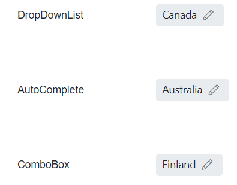

# Style and Appearance in Blazor In-place Editor Component

The following guidance shows the CSS selectors that can be used to customize the control’s appearance to match application branding and user preferences.

To get started quickly with customizing the Blazor In-place Editor, watch the following video or explore the [GitHub sample for customizing the Blazor In-place Editor](https://github.com/SyncfusionExamples/how-to-customize-the-blazor-in-place-editor-component):



## Customizing the In-place Editor text

Use the following CSS to customize the default In-place Editor text content, including font family, font size, color, and underline/border. These selectors target the display state of the value before editing.

```css
/* To change color, font family and font size */
.e-inplaceeditor .e-editable-value-wrapper .e-editable-value {
    border-bottom: 2px dotted green;
    color: red;
    font-size: 12px;
    font-family: Segoe UI
}
```

## Customizing the In-place Editor action buttons

Use the following CSS to customize the default action buttons (Save and Cancel) shown when the editor is active. These rules target both inline and popup (tip) modes.

```css
/* To change icon color for save button */
.e-inplaceeditor .e-editable-action-buttons .e-btn-save.e-icon-btn .e-btn-icon.e-icons,
.e-inplaceeditor-tip .e-editable-action-buttons .e-btn-save.e-icon-btn .e-btn-icon.e-icons{
    color: green;
}

/* To change icon color for cancel button */
.e-inplaceeditor .e-editable-action-buttons .e-btn-cancel.e-icon-btn .e-btn-icon.e-icons,  .e-inplaceeditor-tip .e-editable-action-buttons .e-btn-cancel.e-icon-btn .e-btn-icon.e-icons {
    color: red;
}

/* To change background color for save button */
.e-inplaceeditor .e-editable-action-buttons .e-btn-save.e-icon-btn,
.e-inplaceeditor-tip .e-editable-action-buttons .e-btn-save.e-icon-btn {
    background-color: antiquewhite;
}

/* To change background color for cancel button */
.e-inplaceeditor .e-editable-action-buttons .e-btn-cancel.e-icon-btn,
.e-inplaceeditor-tip .e-editable-action-buttons .e-btn-cancel.e-icon-btn {
    background-color: antiquewhite;
}
```

## Customizing In-place editor outer style like material filled

Use the following CSS to customize the outer container of the In-place Editor (for example, to emulate material filled text-field styles), including removing the default underline, changing background, and rounding corners. The overlay icon can also be shown persistently.

```css
/* To remove the default bottom underline */
.e-inplaceeditor .e-editable-value-container .e-editable-value {
    border-bottom: none;
}
/* To change background color and border radius of in-place editor container */
.e-inplaceeditor .e-editable-value-container {
    background: #e9ecef;
    border-radius: 4px;
}
/* To show the edit icon */
.e-inplaceeditor .e-editable-value-container .e-editable-overlay-icon {
    visibility: visible;
}

```


