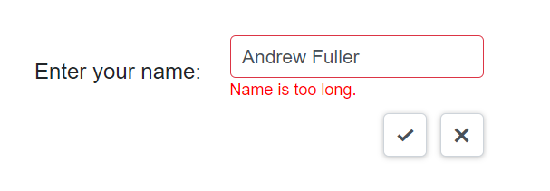

# Validation in Blazor In-place Editor Component

Validate the In-place Editor by using Blazor EditForm with DataAnnotations. Validation can be handled at the application level, and custom validation logic can also be implemented as needed. This approach works in both Blazor WebAssembly and Blazor Server apps.

To get started quickly with validation in the Blazor In-place Editor, watch the following video or explore the [GitHub](https://github.com/SyncfusionExamples/how-to-validate-a-textbox-in-blazor-in-place-editor-component) sample:



Refer to the following link for more details, [EditForm Validation](https://learn.microsoft.com/en-us/aspnet/core/blazor/forms/?view=aspnetcore-8.0). Validation for the `TextBox` is achieved in the following sample using the EditForm validation with a custom error message and validation rules.

```cshtml

@using Syncfusion.Blazor.InPlaceEditor
@using Syncfusion.Blazor.Inputs
@using System.ComponentModel.DataAnnotations;

<table class="table-section">
    <tr>
        <td class="sample-td"> Enter your name: </td>
        <td class="sample-td">
            <SfInPlaceEditor @bind-Value="exampleModel.Name" Type="Syncfusion.Blazor.InPlaceEditor.InputType.Text"  TValue="string">
                    <EditorComponent>
                            <EditForm Model="@exampleModel">
                                <DataAnnotationsValidator />
                                <SfTextBox @bind-Value="exampleModel.Name"></SfTextBox>
                                <ValidationMessage For=@(() => exampleModel.Name) />
                            </EditForm>
                    </EditorComponent>
                </SfInPlaceEditor>
        </td>
    </tr>
</table>

<style>
    .table-section {
        margin: 0 auto;
    }

    tr td:first-child {
        text-align: right;
        padding-right: 20px;
    }

    .sample-td {
        padding-top: 10px;
        min-width: 230px;
        height: 100px;
    }
</style>


@code {
    private string primaryKey { get; set; } = "editor1";
    private ExampleModel exampleModel = new ExampleModel();

    public class ExampleModel
    {
        [Required]
        [StringLength(10, ErrorMessage = "Name is too long.")]
        public string Name { get; set; } = "Andrew";
    }
}
```


