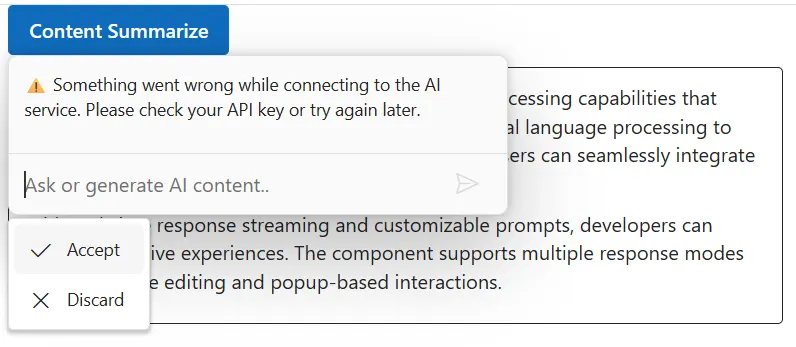

 
# Integrate Gemini AI with ASP.NET Core Inline AI Assist control
 
The Inline AI Assist control integrates with Google’s [Gemini](https://ai.google.dev/gemini-api/docs) API to deliver intelligent conversational interfaces. It leverages advanced natural language understanding to interpret user input, maintain context throughout interactions, and provide accurate, relevant responses. By configuring secure authentication and data handling, developers can unlock powerful AI-driven communication features that elevate user engagement and streamline support experiences.
 
## Prerequisites

Before starting, ensure you have the following:

* **Google Account**: For generating a Gemini API key.

* **Syncfusion Inline AI Assist**: Package [Syncfusion Blazor package](https://www.nuget.org/packages/Syncfusion.Blazor.InteractiveChat) installed.

* [Markdig](https://www.nuget.org/packages/Markdig) package: For parsing Markdown responses.

## Set Up the Inline AI Assist Component

Follow the [Getting Started](../getting-started) guide to configure and render the Inline AI Assist component in the application and that prerequisites are met.

## Install Dependencies

Install the required packages:

* Install the `Gemini AI` nuget package in the application.

```bash

Nuget\Install-Package Mscc.GenerativeAI

```

* Install the `Markdig` nuget packages in the application.

```bash

Nuget\Install-Package Markdig

```

## Generate API Key

1. **Access Google AI Studio**: Instructs users to sign into [Google AI Studio](https://aistudio.google.com/app/apikey) with a Google account or create a new account if needed. 

2. **Navigate to API Key Creation**: Go to the `Get API Key` option in the left-hand menu or top-right corner of the dashboard. Click the `Create API Key` button.

3. **Project Selection**: Choose an existing Google Cloud project or create a new one.

4. **API Key Generation**: After project selection, the API key is generated. Users are instructed to copy and store the key securely, as it is shown only once.

> Security note: Advises against committing the API key to version control and recommends using environment variables or a secret manager in production.
 
## Gemini AI with Inline AI Assist

Modify the razor file to integrate the Gemini AI with the Inline AI Assist control.
 
* Update your Gemini API key securely in the configuration:

```bash

const string GeminiApiKey = 'Place your API key here';

```
 



```razor
@using Syncfusion.Blazor.InteractiveChat
@using Syncfusion.Blazor.Buttons
@using System.Net.Http.Json
@using System.Text.Json
@using System.Text
@inject HttpClient Http

<style>
    #editableText {
        width: 100%;
        min-height: 120px;
        max-height: 300px;
        overflow-y: auto;
        font-size: 16px;
        padding: 12px;
        border-radius: 4px;
        border: 1px solid;
    }
</style>

<div class="container" style="height: 350px; width: 650px;">
    <span id="summarizeBtn" style="display: inline-block; margin-bottom: 10px;">
        <SfButton IsPrimary="true" @onclick="OnSummarizeClickAsync">
            Content Summarize
        </SfButton>
    </span>

    <div id="editableText" contenteditable="true">
        <p>Inline AI Assist component provides intelligent text processing capabilities that enhance user productivity.
            It leverages advanced natural language processing to understand context and deliver precise suggestions.
            Users can seamlessly integrate AI-powered features into their applications.</p>
        <p>With real-time response streaming and customizable prompts, developers can create interactive experiences.
            The component supports multiple response modes including inline editing and popup-based interactions.</p>
    </div>

    <SfInlineAIAssist @ref="inlineAssist"
                      RelateTo="#summarizeBtn"
                      EnableStreaming="true"
                      PromptRequested="OnPromptRequestAsync">
        <ChildContent>
            <InlineToolbar ItemClick="OnToolbarItemClickAsync"></InlineToolbar>
            <ResponseActions ItemSelect="OnResponseItemSelectAsync"></ResponseActions>
        </ChildContent>
    </SfInlineAIAssist>
</div>

@code {
    private SfInlineAIAssist inlineAssist = new();
    private bool stopStreaming = false;

    private const string GeminiApiKey = ""; // Replace with your Gemini API key
    private const string GeminiModel = "gemini-2.5-flash";
    private const int ResponseUpdateRate = 10; // chars per chunk, matches TS sample

    private async Task OnSummarizeClickAsync()
    {
        await inlineAssist.ShowPopupAsync();
    }

    private async Task OnPromptRequestAsync(PromptRequestedEventArgs args)
    {
        stopStreaming = false;
        try
        {
            var url = $"https://generativelanguage.googleapis.com/v1beta/models/{GeminiModel}:generateContent?key={GeminiApiKey}";
            var requestBody = new
            {
                contents = new[]
                {
                    new { parts = new[] { new { text = args.Prompt } } }
                }
            };

            var response = await Http.PostAsJsonAsync(url, requestBody);
            response.EnsureSuccessStatusCode();

            var json = await response.Content.ReadFromJsonAsync<JsonElement>();
            var responseText = json
                .GetProperty("candidates")[0]
                .GetProperty("content")
                .GetProperty("parts")[0]
                .GetProperty("text")
                .GetString()?.Trim() ?? "No response received.";

            await StreamResponseAsync(responseText);
        }
        catch (Exception ex)
        {
            Console.WriteLine($"Gemini error: {ex.Message}");
            await inlineAssist.UpdateResponseAsync(
                "⚠️ Something went wrong while connecting to the AI service. Please check your API key or try again later."
            );
            stopStreaming = true;
        }
    }
    private async Task StreamResponseAsync(string response)
    {
        var buffer = new StringBuilder();
        int i = 0;
        int total = response.Length;

        while (i < total && !stopStreaming)
        {
            buffer.Append(response[i]);
            i++;

            if (i % ResponseUpdateRate == 0 || i == total)
            {
                bool isFinal = (i == total);
                await inlineAssist.UpdateResponseAsync(buffer.ToString(), isFinal);
            }

            await Task.Delay(15); // matches TS 15ms delay for streaming effect
        }
    }

    private async Task OnToolbarItemClickAsync(ToolbarItemClickEventArgs args)
    {
        if (args.Item?.IconCss?.Contains("e-inline-stop") == true)
        {
            stopStreaming = true;
        }
    }

    private async Task OnResponseItemSelectAsync(ResponseItemSelectEventArgs args)
    {
        if (args.Item.Label == "Accept")
        {
            var lastPrompt = inlineAssist.Prompts.LastOrDefault();
            if (lastPrompt != null && !string.IsNullOrEmpty(lastPrompt.Response))
            {
                response + '</p>'
                await inlineAssist.HidePopupAsync();
            }
        }
        else if (args.Item.Label == "Discard")
        {
            await inlineAssist.HidePopupAsync();
        }
    }
}
```




 