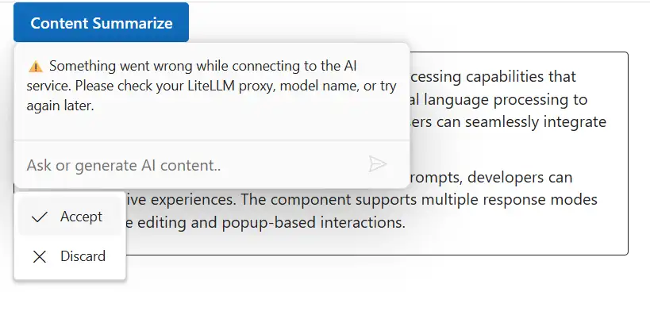

# Integrate Inline AI Assist with LiteLLM

The **Inline AI Assist** component can also be integrated with [LiteLLM](https://docs.litellm.ai/docs), an open-source proxy that provides a unified, OpenAI-compatible API for multiple LLM providers such as [OpenAI](https://openai.com) and [Azure OpenAI](https://azure.microsoft.com/en-us/products/ai-foundry/models/openai).

In this setup:
* **Inline AI Assist** serves as the user interface for entering prompts.
* Prompts are sent to the **LiteLLM proxy**, which forwards them to the configured LLM provider.
* The LLM provider processes the prompt and returns a response through LiteLLM.
* This enables **natural language understanding** and **context-aware responses** without changing the Inline AI Assist integration logic, as LiteLLM uses the same OpenAI-style API.

## Prerequisites

Before starting, ensure you have the following:

* **OpenAI Account**: Access to OpenAI services and a generated **API key**.

* **Python**: Required to run the **LiteLLM proxy**.

* **Syncfusion Inline AI Assist**: Package [Syncfusion Blazor package](https://www.nuget.org/packages/Syncfusion.Blazor.InteractiveChat) installed.

## Set Up the Inline AI Assist Component

Follow the [Getting Started](../getting-started) guide to configure and render the Inline AI Assist component in the application and that prerequisites are met.

## Configure the LiteLLM Proxy

* **Set Environment Variable**: Set your OpenAI API key as an environment variable for security (e.g.,`export OPENAI_API_KEY=<your-openai-api-key>` on macOS/Linux or `set OPENAI_API_KEY=<your-openai-api-key>` on Windows). Avoid hard-coding the key in files.

* **Create config.yaml**: In your project root, create a `config.yaml` file to define the model alias and routing. This exposes an OpenAI-compatible endpoint at `http://localhost:4000/v1/chat/completions`.



```yaml
model_list:
  - model_name: openai/gpt-4o-mini      # Alias your frontend will use
    LiteLLM_params:
      model: gpt-4o-mini                # OpenAI base model name
      api_key: OS.environ/OPENAI_API_KEY

router_settings:
  # Optional: master_key for proxy authentication
  # master_key: test_key
  cors:
    - "*"
  cors_allow_origins:
    - "*"
```



Security note: In production, use a secret manager for the API key and restrict CORS origins. The optional `master_key` can add proxy-level authentication—set `LITELLM_API_KEY` in the Blazor code to match if enabled.

## Configure Inline AI Assist with LiteLLM

To integrate **LiteLLM** with the **Syncfusion Inline AI Assist** component, modify the razor file in your Blazor application. The component will send user prompts to the LiteLLM proxy, which forwards them to the configured LLM provider (e.g., **OpenAI** or **Azure OpenAI**) and returns natural language responses.

In the following example:

* The `PromptRequested` event sends the user prompt to the LiteLLM proxy at `/v1/chat/completions`. 
* The proxy uses the **model alias** defined in `config.yaml` (e.g., `openai/gpt-4o-mini`) and routes the request to the actual LLM provider.



@rendermode InteractiveAuto
@using Syncfusion.Blazor.InteractiveChat
@using Syncfusion.Blazor.Buttons
@using System.Text.Json
@using System.Text
@inject HttpClient Http

<style>
    #editableText {
        width: 100%;
        min-height: 120px;
        max-height: 300px;
        overflow-y: auto;
        font-size: 16px;
        padding: 12px;
        border-radius: 4px;
        border: 1px solid;
    }
</style>

<div class="container" style="height: 350px; width: 650px;">
    <SfButton id="summarizeButton" IsPrimary="true" Style="margin-bottom: 10px;" @onclick="OnSummarizeClick">Content Summarize</SfButton>
    <div id="editableText" contenteditable="true">
        @((MarkupString)editableContent)
    </div>

    <SfInlineAIAssist @ref="inlineAssist" RelateTo="#summarizeButton" PromptRequested="OnPromptRequestAsync">
        <InlineToolbar ItemClick="OnToolbarItemClickAsync"></InlineToolbar>
        <ResponseActions ItemSelect="OnItemSelectAsync"></ResponseActions>
    </SfInlineAIAssist>
</div>

@code {
    private SfInlineAIAssist inlineAssist = new SfInlineAIAssist();
    private bool stopStreaming = false;

    private readonly string liteLlmHost = "http://localhost:4000";
    private readonly string liteLlmApiKey = ""; // If your LiteLLM proxy uses a master_key, set this to the same value; otherwise, leave as empty string

    private string editableContent = @"<p>Inline AI Assist component provides intelligent text processing capabilities that enhance user productivity. It leverages advanced natural language processing to understand context and deliver precise suggestions. Users can seamlessly integrate AI-powered features into their applications.</p>
        <p>With real-time response streaming and customizable prompts, developers can create interactive experiences. The component supports multiple response modes including inline editing and popup-based interactions.</p>";

    private async Task OnPromptRequestAsync(PromptRequestedEventArgs args)
    {
        try
        {
            stopStreaming = false;
            var url = $"{liteLlmHost.TrimEnd('/')}/v1/chat/completions";

            Http.DefaultRequestHeaders.Clear();
            Http.DefaultRequestHeaders.Add("Accept", "application/json");
            if (!string.IsNullOrEmpty(liteLlmApiKey))
            {
                Http.DefaultRequestHeaders.Add("Authorization", $"Bearer {liteLlmApiKey}");
            }

            var requestBody = new
            {
                model = "openai/gpt-4o-mini", // Must match model_name in config.yaml
                messages = new[] { new { role = "user", content = args.Prompt } },
                temperature = 0.7,
                max_tokens = 300,
                stream = false
            };

            var json = JsonSerializer.Serialize(requestBody);
            var content = new StringContent(json, Encoding.UTF8, "application/json");

            var response = await Http.PostAsync(url, content);
            if (!response.IsSuccessStatusCode)
            {
                throw new Exception($"HTTP {response.StatusCode}");
            }

            var responseContent = await response.Content.ReadAsStringAsync();
            using var document = JsonDocument.Parse(responseContent);
            var responseText = document.RootElement
                .GetProperty("choices")[0]
                .GetProperty("message")
                .GetProperty("content")
                .GetString()?.Trim() ?? "No response received.";

            var pipeline = new MarkdownPipelineBuilder()
                .UseAdvancedExtensions()
                .UsePipeTables()
                .UseTaskLists()
                .Build();

            if (!stopStreaming)
            {
                await inlineAssist.UpdateResponseAsync(Markdown.ToHtml(responseText, pipeline));
            }
        }
        catch (Exception ex)
        {
            Console.WriteLine($"Error fetching LiteLLM response: {ex.Message}");
            await inlineAssist.UpdateResponseAsync("⚠️ Something went wrong while connecting to the AI service. Please check your LiteLLM proxy, model name, or try again later.");
            stopStreaming = true;
        }
    }

    private async Task OnItemSelectAsync(ResponseItemSelectEventArgs args)
    {
        if (args.Item.Label == "Accept")
        {
            var lastPrompt = inlineAssist?.Prompts.LastOrDefault();
            if (lastPrompt != null && !string.IsNullOrEmpty(lastPrompt.Response))
            {
                editableContent = $"<p>{lastPrompt.Response}</p>";
            }
            await inlineAssist!.HidePopupAsync();
        }
        else if (args.Item.Label == "Discard")
        {
            await inlineAssist!.HidePopupAsync();
        }
    }

    private async Task OnToolbarItemClickAsync(ToolbarItemClickEventArgs args)
    {
        if (args.Item.IconCss == "e-icons e-inline-stop")
        {
            stopStreaming = true;
        }
    }

    private async Task OnSummarizeClick()
    {
        await inlineAssist.ShowPopupAsync();
    }
}





## Run and Test

### Start the proxy:

Navigate to your project root and run the following command to start the proxy:

```bash
pip install "litellm[proxy]"
litellm --config "./config.yaml" --port 4000 --host 0.0.0.0
```

### Start the application:

In a separate terminal window, navigate to your project folder and start the Blazor application:

```bash
dotnet run
```

Open your app to interact with the Inline AI Assist component integrated with LiteLLM.

## Troubleshooting

* `401 Unauthorized`: Verify your `API_KEY` and model deployment name.
* `Model not found`: Ensure model matches `model_name` in `config.yaml`.
* `CORS issues`: Configure `router_settings.cors_allow_origins` properly.