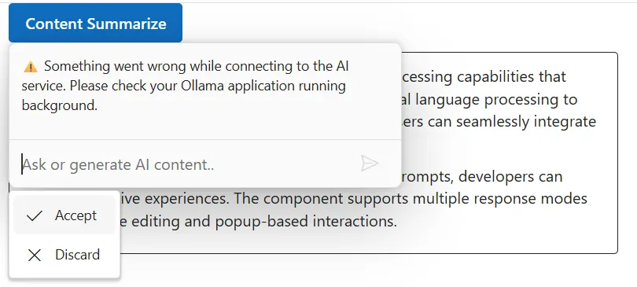

# Integrate LLM via Ollama with Blazor Inline AI Assist Component

The Inline AI Assist component integrates with [LLM via Ollama](https://ollama.com) to enable advanced conversational AI features in your Blazor application. The component acts as a user interface where user prompts are sent to the selected LLM model via API calls, providing natural language understanding and context-aware responses.

## Prerequisites

Before starting, ensure you have the following:

* [Ollama](https://ollama.com) installed to run and manage LLM models locally.

* **Syncfusion Inline AI Assist**: Package [Syncfusion Blazor package](https://www.nuget.org/packages/Syncfusion.Blazor.InteractiveChat) installed.

## Set Up the Inline AI Assist Component

Follow the [Getting Started](../getting-started) guide to configure and render the Inline AI Assist component in the application and that prerequisites are met.

## Configuring Ollama

Install Ollama for your operating system:




1. Visit [Windows](https://ollama.com/download)
2. Click `Download for Windows` to get the `.exe installer`. 
3. Run `OllamaSetup.exe` and follow the wizard to install.





1. Visit [macOS](https://ollama.com/download/mac)
2. Click `Download for macOS` to get `.dmg file`
3. Install it by following the wizard.





1. Visit [Linux](https://ollama.com/download/linux)
2. Run the below command to install Ollama in your system
      
    curl -fsSL https://ollama.com/install.sh | sh




## Download and run an Ollama model

* Download and run a model using the following command. Replace `deepseek-r1` with your preferred model (e.g., `llama3`, `phi4`). See the [Ollama model](https://ollama.com/search) library for available models.
 
```bash

ollama run deepseek-r1

```

* After the model download completes, start the Ollama server to make the model accessible:

```bash

ollama serve

```

## Configure Inline AI Assist with Ollama

To integrate Ollama with the Blazor Inline AI Assist component in your Blazor application:

* Configure the AI services in the `Program.cs` file to register the Ollama client and Blazor services.





using Blazor_InlineAIAssist_Ollama.Components;
using Microsoft.Extensions.AI;
using OllamaSharp;
using Syncfusion.Blazor;

var builder = WebApplication.CreateBuilder(args);

// Add services to the container.
builder.Services.AddRazorComponents()
    .AddInteractiveServerComponents();
builder.Services.AddSyncfusionBlazor();

builder.Services.AddHttpClient();

builder.Services.AddDistributedMemoryCache();

// Ollama configuration
builder.Services.AddChatClient(new OllamaApiClient(new Uri("http://localhost:11434/"), "llama3.2"))
    .UseDistributedCache()
    .UseLogging();

var app = builder.Build();

if (!app.Environment.IsDevelopment())
{
    app.UseExceptionHandler("/Error", createScopeForErrors: true);
    app.UseHsts();
}

app.UseHttpsRedirection();
app.UseAntiforgery();
app.MapStaticAssets();
app.MapRazorComponents<App>()
    .AddInteractiveServerRenderMode();

app.Run();




* Modify the `Index.razor` file (or a dedicated component) to host the integration logic and handle prompt requests.




@rendermode InteractiveServer
@using Syncfusion.Blazor.InteractiveChat
@using Syncfusion.Blazor.Buttons
@using System.Net.Http.Json
@using System.Text.Json
@using System.Text
@inject HttpClient Http

<style>
    #editableText {
        width: 100%;
        min-height: 120px;
        max-height: 300px;
        overflow-y: auto;
        font-size: 16px;
        padding: 12px;
        border-radius: 4px;
        border: 1px solid;
    }
</style>

<div class="container" style="height: 350px; width: 650px;">
    <span id="summarizeButton" style="display: inline-block; margin-bottom: 10px;">
        <SfButton IsPrimary="true" @onclick="OnSummarizeClickAsync">
            Content Summarize
        </SfButton>
    </span>

    <div id="editableText" contenteditable="true">
        <p>Inline AI Assist component provides intelligent text processing capabilities that enhance user productivity.
            It leverages advanced natural language processing to understand context and deliver precise suggestions.
            Users can seamlessly integrate AI-powered features into their applications.</p>
        <p>With real-time response streaming and customizable prompts, developers can create interactive experiences.
            The component supports multiple response modes including inline editing and popup-based interactions.</p>
    </div>

    <SfInlineAIAssist @ref="inlineAssist" RelateTo="#summarizeButton" EnableStreaming="true" PromptRequested="OnPromptRequestAsync">
        <ChildContent>
            <InlineToolbar ItemClick="OnToolbarItemClickAsync"></InlineToolbar>
            <ResponseActions ItemSelect="OnResponseItemSelectAsync"></ResponseActions>
        </ChildContent>
    </SfInlineAIAssist>
</div>

@code {
    private SfInlineAIAssist inlineAssist = new();
    private bool stopStreaming = false;
    private const string OllamaUrl = "http://localhost:11434/api/generate";
    private const string OllamaModel = "deepseek-r1";
    private const int ResponseUpdateRate = 10; // chars per chunk
    private const string DefaultErrorResponse =
        "⚠️ Something went wrong while connecting to the AI service. Please check your Ollama application running background.";
    private async Task OnSummarizeClickAsync()
    {
        await inlineAssist.ShowPopupAsync();
    }
    private async Task OnPromptRequestAsync(PromptRequestedEventArgs args)
    {
        try
        {
            var requestBody = new
            {
                model = OllamaModel,
                prompt = $"### Instruction:\nRespond in up to 5 lines.\n\n### Input:\n{args.Prompt}",
                stream = false
            };
            var response = await Http.PostAsJsonAsync(OllamaUrl, requestBody);
            response.EnsureSuccessStatusCode();
            var json = await response.Content.ReadFromJsonAsync<JsonElement>();
            var responseText = json.GetProperty("response").GetString()?.Trim()
                               ?? "No response received.";
            stopStreaming = false;
            await StreamResponseAsync(responseText);
        }
        catch (Exception ex)
        {
            Console.WriteLine($"Ollama error: {ex.Message}");
            await inlineAssist.UpdateResponseAsync(DefaultErrorResponse, true);
        }
    }
    private async Task StreamResponseAsync(string response)
    {
        var buffer = new StringBuilder();
        int i = 0;
        int total = response.Length;

        while (i < total && !stopStreaming)
        {
            buffer.Append(response[i]);
            i++;

            if (i % ResponseUpdateRate == 0 || i == total)
            {
                bool isFinal = (i == total);
                await inlineAssist.UpdateResponseAsync(buffer.ToString(), isFinal);
            }

            await Task.Delay(15); // mirrors: setTimeout(resolve, 15)
        }
    }
    private async Task OnToolbarItemClickAsync(ToolbarItemClickEventArgs args)
    {
        if (args.Item?.IconCss?.Contains("e-inline-stop") == true)
        {
            stopStreaming = true;
        }
    }
    private async Task OnResponseItemSelectAsync(ResponseItemSelectEventArgs args)
    {
        if (args.Item.Label == "Accept")
        {
            var lastPrompt = inlineAssist.Prompts.LastOrDefault();
            if (lastPrompt != null && !string.IsNullOrEmpty(lastPrompt.Response))
            {
                await inlineAssist.HidePopupAsync();
            }
        }
        else if (args.Item.Label == "Discard")
        {
            await inlineAssist.HidePopupAsync();
        }
    }
}




