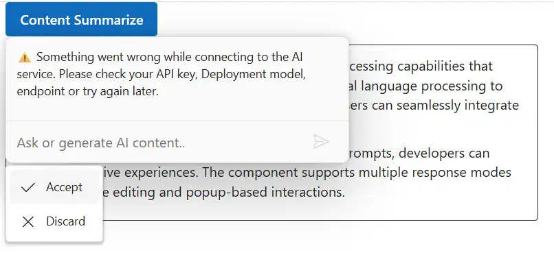

# Integrate Azure OpenAI with Blazor Inline AI Assist component

The Inline AI Assist component integrates with [Azure OpenAI](https://azure.microsoft.com/en-us/products/ai-foundry/models/openai) to enable advanced conversational AI features in your applications. The component acts as a user interface, where user prompts are sent to the Azure OpenAI service via API calls, providing natural language understanding and context-aware responses.

## Prerequisites

Before starting, ensure you have the following:

* **An Azure account**: with access to [Azure OpenAI](https://azure.microsoft.com/en-us/products/ai-foundry/models/openai) services and a generated API key.

* **Syncfusion Inline AI Assist**: Package [Syncfusion Blazor package](https://www.nuget.org/packages/Syncfusion.Blazor.InteractiveChat) installed.

## Set Up the Inline AI Assist Component

Follow the [Getting Started](../getting-started) guide to configure and render the Inline AI Assist component in the application and that prerequisites are met.

## Install Dependencies

Install the required packages:

* Install the `OpenAI` and `Azure` nuget packages in the application.

```bash

NuGet\Install-Package OpenAI
NuGet\Install-Package Azure.AI.OpenAI
NuGet\Install-Package Azure.Core

```

Note: The sample below uses HttpClient directly and does not require the Azure/OpenAI SDKs.

## Configure Azure OpenAI

1. Log in to the [Azure Portal](https://portal.azure.com/#home) and navigate to your Azure OpenAI resource.

2. Under resource Management, select keys and endpoint to retrieve your API key and endpoint URL. 

3. Note the following values:
   - API key
   - Endpoint
   - API version (must be supported by your resource)
   - Deployment name (for example, gpt-4o-mini)

4. Store these values securely, as they will be used in your application.

> `Security Note`: expose your API key in client-side code for production applications. Use a server-side proxy or environment variables to manage sensitive information securely.

## Configure Inline AI Assist with Azure OpenAI

- Configure your Azure OpenAI endpoint, API key, and deployment name in your **Program.cs** (or using your preferred configuration mechanism).

- Register the service for dependency injection.

- Inject and use the service in your Razor component.

Modify the razor file to integrate the Azure OpenAI with the Inline AI Assist component.




@using Syncfusion.Blazor.InteractiveChat
@using Syncfusion.Blazor.Buttons
@using System.Net.Http.Json
@using System.Text.Json
@using System.Text
@inject HttpClient Http

<style>
    #editableText {
        width: 100%;
        min-height: 120px;
        max-height: 300px;
        overflow-y: auto;
        font-size: 16px;
        padding: 12px;
        border-radius: 4px;
        border: 1px solid;
    }
</style>

<div class="container" style="height: 350px; width: 650px;">
    <span id="summarizeButton" style="display: inline-block; margin-bottom: 10px;">
        <SfButton IsPrimary="true" @onclick="OnSummarizeClickAsync">
            Content Summarize
        </SfButton>
    </span>

    <div id="editableText" contenteditable="true">
        <p>Inline AI Assist component provides intelligent text processing capabilities that enhance user productivity.
            It leverages advanced natural language processing to understand context and deliver precise suggestions.
            Users can seamlessly integrate AI-powered features into their applications.</p>
        <p>With real-time response streaming and customizable prompts, developers can create interactive experiences.
            The component supports multiple response modes including inline editing and popup-based interactions.</p>
    </div>

    <SfInlineAIAssist @ref="inlineAssist" RelateTo="#summarizeButton" EnableStreaming="true" PromptRequested="OnPromptRequestAsync">
        <ChildContent>
            <InlineToolbar ItemClick="OnToolbarItemClickAsync"></InlineToolbar>
            <ResponseActions ItemSelect="OnResponseItemSelectAsync"></ResponseActions>
        </ChildContent>
    </SfInlineAIAssist>
</div>

@code {
    private SfInlineAIAssist inlineAssist = new();
    private bool stopStreaming = false;
    private const string AzureOpenAIApiKey = "";       // Replace with your key
    private const string AzureOpenAIEndpoint = "";     // Replace with your endpoint
    private const string AzureOpenAIApiVersion = "";   // Replace with your API version
    private const string AzureDeploymentName = "";     // Replace with your deployment name
    private const int ResponseUpdateRate = 10;         // chars per chunk
    private const int MaxTokens = 150;

    private async Task OnSummarizeClickAsync()
    {
        await inlineAssist.ShowPopupAsync();
    }

    private async Task OnPromptRequestAsync(PromptRequestedEventArgs args)
    {
        var url = $"{AzureOpenAIEndpoint.TrimEnd('/')}" +
                  $"/openai/deployments/{Uri.EscapeDataString(AzureDeploymentName)}/chat/completions" +
                  $"?api-version={Uri.EscapeDataString(AzureOpenAIApiVersion)}";
        try
        {
            var requestBody = new
            {
                model = "gpt-4o-mini",
                messages = new[]
                {
                    new { role = "user", content = args.Prompt }
                },
                max_tokens = MaxTokens,
                stream = false
            };
            using var request = new HttpRequestMessage(HttpMethod.Post, url);
            request.Content = JsonContent.Create(requestBody);
            request.Headers.Add("api-key", AzureOpenAIApiKey);

            var response = await Http.SendAsync(request);
            response.EnsureSuccessStatusCode();

            var json = await response.Content.ReadFromJsonAsync<JsonElement>();
            var responseText = json
                .GetProperty("choices")[0]
                .GetProperty("message")
                .GetProperty("content")
                .GetString()?.Trim() ?? "No response received.";
            stopStreaming = false;
            await StreamResponseAsync(responseText);
        }
        catch (Exception ex)
        {
            Console.WriteLine($"Azure OpenAI error: {ex.Message}");
            await inlineAssist.UpdateResponseAsync(
                "⚠️ Something went wrong while connecting to the AI service. Please check your API key, Deployment model, endpoint or try again later.",
                true
            );
            stopStreaming = true;
        }
    }
    private async Task StreamResponseAsync(string response)
    {
        var buffer = new StringBuilder();
        int i = 0;
        int total = response.Length;

        while (i < total && !stopStreaming)
        {
            buffer.Append(response[i]);
            i++;

            if (i % ResponseUpdateRate == 0 || i == total)
            {
                bool isFinal = (i == total);
                // mirrors: marked.parse(lastResponse) + inlineAIAssist.addResponse(html, isFinal)
                await inlineAssist.UpdateResponseAsync(buffer.ToString(), isFinal);
            }

            await Task.Delay(15); // mirrors: setTimeout(resolve, 15)
        }
    }
    private async Task OnToolbarItemClickAsync(ToolbarItemClickEventArgs args)
    {
        if (args.Item?.IconCss?.Contains("e-inline-stop") == true)
        {
            stopStreaming = true;
        }
    }
    private async Task OnResponseItemSelectAsync(ResponseItemSelectEventArgs args)
    {
        if (args.Item.Label == "Accept")
        {
            var lastPrompt = inlineAssist.Prompts.LastOrDefault();
            if (lastPrompt != null && !string.IsNullOrEmpty(lastPrompt.Response))
            {
                await inlineAssist.HidePopupAsync();
            }
        }
        else if (args.Item.Label == "Discard")
        {
            await inlineAssist.HidePopupAsync();
        }
    }
}





