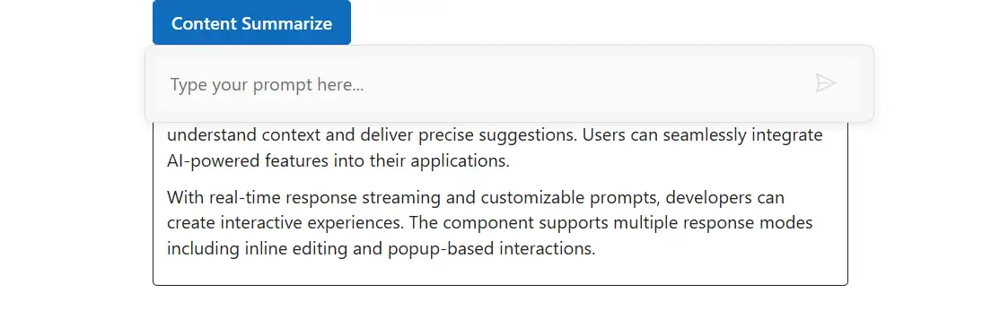

# Style and Appearance in Blazor Inline AI Assist component

## Component Dimensions

### Popup width

You can use the `PopupWidth` property to set the width of the Inline AI Assist. The default value is `400px`.

### Popup height

You can use the `PopupHeight` property to set the height of the Inline AI Assist. The default value is `auto`.

### Z-index

You can use the `ZIndex` property to set z-index for the Inline AI Assist popup. The default value is `1000`.

## Custom styling using cssClass

You can customize the appearance of the Inline AI Assist control by using the `CSSClass property.

The below example shows the use case of the properties such as `ZIndex`, `PopupWidth`, `PopupHeight` and `CssClass`.

```cshtml
@using Syncfusion.Blazor.InteractiveChat
@using Syncfusion.Blazor.Buttons

<style>
    #editableText {
        width: 100%;
        min-height: 120px;
        max-height: 300px;
        overflow-y: auto;
        font-size: 16px;
        padding: 12px;
        border-radius: 4px;
        border: 1px solid;
    }

    .custom-container {
        background-color: #f5f5f5;
        border-radius: 8px;
        padding: 10px;
        box-shadow: 0 2px 8px rgba(0, 0, 0, 0.1);
    }
</style>

<div class="container" style="height: 350px; width: 650px;">
    <SfButton id="summarizeButton" IsPrimary="true" Style="margin-bottom: 10px;" @onclick="OnSummarizeClick">Content Summarize</SfButton>
    <div id="editableText" contenteditable="true">
        @((MarkupString)editableContent)
    </div>

    <SfInlineAIAssist @ref="inlineAssist"vRelateTo="#summarizeButton" PopupHeight="70px" PopupWidth="650px" 
    Placeholder="Type your prompt here..." CssClass="custom-container" ZIndex="4000" PromptRequested="OnPromptRequestAsync">
        <ResponseActions ItemSelect="OnItemSelectAsync"></ResponseActions>
    </SfInlineAIAssist>
</div>

@code {
    private SfInlineAIAssist inlineAssist = new SfInlineAIAssist();
    private string editableContent = @"<p>Inline AI Assist component provides intelligent text processing capabilities that enhance user productivity. It leverages advanced natural language processing to understand context and deliver precise suggestions. Users can seamlessly integrate AI-powered features into their applications.</p>
        <p>With real-time response streaming and customizable prompts, developers can create interactive experiences. The component supports multiple response modes including inline editing and popup-based interactions.</p>";

    private async Task OnPromptRequestAsync(PromptRequestedEventArgs args)
    {
        await Task.Delay(1000);
        string defaultResponse = "For real-time prompt processing, connect the Inline AI Assist component to your preferred AI service, such as OpenAI or Azure Cognitive Services. Ensure you obtain the necessary API credentials to authenticate and enable seamless integration.";
        await inlineAssist.UpdateResponseAsync(defaultResponse);
    }

    private async Task OnItemSelectAsync(ResponseItemSelectEventArgs args)
    {
        if (args.Item.Label == "Accept")
        {
            var lastPrompt = inlineAssist?.Prompts.LastOrDefault();
            if (lastPrompt != null && !string.IsNullOrEmpty(lastPrompt.Response))
            {
                editableContent = $"<p>{lastPrompt.Response}</p>";
            }
            await inlineAssist!.HidePopupAsync();
        }
        else if (args.Item.Label == "Discard")
        {
            await inlineAssist!.HidePopupAsync();
        }
    }

    private async Task OnSummarizeClick()
    {
        await inlineAssist.ShowPopupAsync();
    }
}
```

