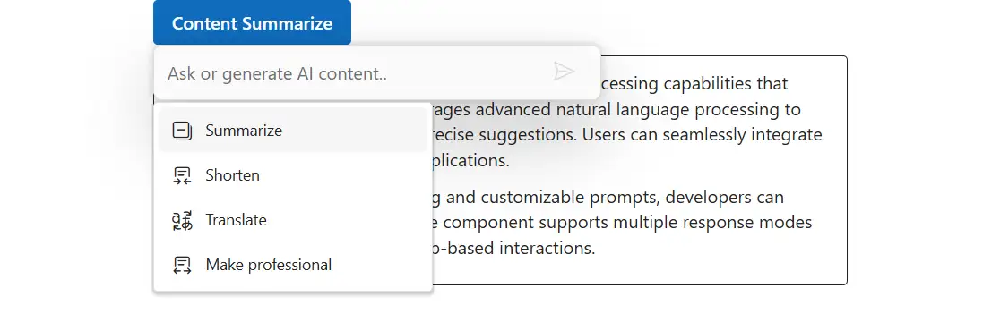

# Commands configuration in Blazor Inline AI Assist control

You can render and use the command action popup by using the `Commands` property in the `CommandSettings` tag helper. This property helps to supply commands, control popup dimensions, and customize behavior.

## Configure command items

You can use the `CommandSettings` tag to add commands that populate the command popup. Each command item can perform a quick request based on the configured `Prompt`.

Each command item object can include the following properties:

| Property    | Type    | Default | Description                                                  |
|-------------|---------|---------|--------------------------------------------------------------|
| Label       | string  | ''      | Specifies the display label of the command item.             |
| Prompt      | string  | ''      | Specifies the prompt text executed when the item is selected.|
| IconCss     | string  | ''      | Specifies the CSS class for the item's icon.                 |
| Disabled    | boolean | false   | Specifies whether the command is disabled and unselectable.  |
| GroupBy     | string  | ''      | Specifies the group category for organizing related commands.|
| Id          | string  | ''      | Specifies a unique identifier for the command item.          |
| Tooltip     | string  | ''      | Specifies the tooltip text displayed on hover.               |

## Command interactions

The `ItemSelect` event is triggered when a command item is selected from the command popup in the Inline AI Assist control.

## Customization of AI commands popup

### Setting popup width

Control the popup width with `PopupWidth` property in the CommandSettings. Accepts CSS values or number (px).

### Setting popup height

Control the popup height with `PopupHeight` property in the CommandSettings. Use this to enable scrollable lists when many commands exist.

The below sample demonstrates the `CommandSettings` property.

```cshtml
@using Syncfusion.Blazor.InteractiveChat
@using Syncfusion.Blazor.Buttons

<style>
    #editableText {
        width: 100%;
        min-height: 120px;
        max-height: 300px;
        overflow-y: auto;
        font-size: 16px;
        padding: 12px;
        border-radius: 4px;
        border: 1px solid;
    }
</style>
<div class="container" style="height: 350px; width: 650px;">
    <SfButton id="summarizeButton" IsPrimary="true" Style="margin-bottom: 10px;" @onclick="OnSummarizeClick">Content Summarize</SfButton>
    <div id="editableText" contenteditable="true">
        @((MarkupString)editableContent)
    </div>
    <SfInlineAIAssist @ref="inlineAssist" RelateTo="#summarizeButton" PromptRequested="OnPromptRequestAsync">
        <CommandMenu Commands="commandItems" PopupWidth="250px" PopupHeight="200px" ItemSelect="OnCommandItemSelectAsync"></CommandMenu>
        <ResponseActions ItemSelect="OnItemSelectAsync"></ResponseActions>
    </SfInlineAIAssist>
</div>
@code {
    private SfInlineAIAssist inlineAssist = new SfInlineAIAssist();
    private string editableContent = @"<p>Inline AI Assist component provides intelligent text processing capabilities that enhance user productivity. It leverages advanced natural language processing to understand context and deliver precise suggestions. Users can seamlessly integrate AI-powered features into their applications.</p>
        <p>With real-time response streaming and customizable prompts, developers can create interactive experiences. The component supports multiple response modes including inline editing and popup-based interactions.</p>";
    private List<CommandItem> commandItems = new List<CommandItem>
    {
        new CommandItem { Label = "Summarize", Prompt = "Summarize the content", IconCss =  "e-icons e-collapse-2"},
        new CommandItem { Label = "Shorten", Prompt = "Shorten the content", IconCss = "e-icons     e-shorten"},
        new CommandItem { Label = "Translate", Prompt = "Translate the content", IconCss =  "e-icons e-translate"},
        new CommandItem { Label = "Make professional", Prompt = "Make the content more  professional", IconCss = "e-icons e-elaborate"}
    };
    private async Task OnPromptRequestAsync(PromptRequestedEventArgs args)
    {
        await Task.Delay(1000);
        string defaultResponse = "For real-time prompt processing, connect the Inline AI Assist component to your preferred AI service, such as OpenAI or Azure Cognitive Services. Ensure you obtain the necessary API credentials to authenticate and enable seamless integration.";
        await inlineAssist.UpdateResponseAsync(defaultResponse);
    }
    private async Task OnItemSelectAsync(ResponseItemSelectEventArgs args)
    {
        if (args.Item.Label == "Accept")
        {
            var lastPrompt = inlineAssist?.Prompts.LastOrDefault();
            if (lastPrompt != null && !string.IsNullOrEmpty(lastPrompt.Response))
            {
                editableContent = $"<p>{lastPrompt.Response}</p>";
            }
            await inlineAssist!.HidePopupAsync();
        }
        else if (args.Item.Label == "Discard")
        {
            await inlineAssist!.HidePopupAsync();
        }
    }
    private async Task OnCommandItemSelectAsync(CommandItemSelectEventArgs args)
    {
        // Your required action here
    }
    private async Task OnSummarizeClick()
    {
        await inlineAssist.ShowPopupAsync();
    }
}
```



## See Also

- [Response Settings](./response-settings.md)
- [Inline Toolbar](./inline-toolbar.md)
- [Events Documentation](./events.md)