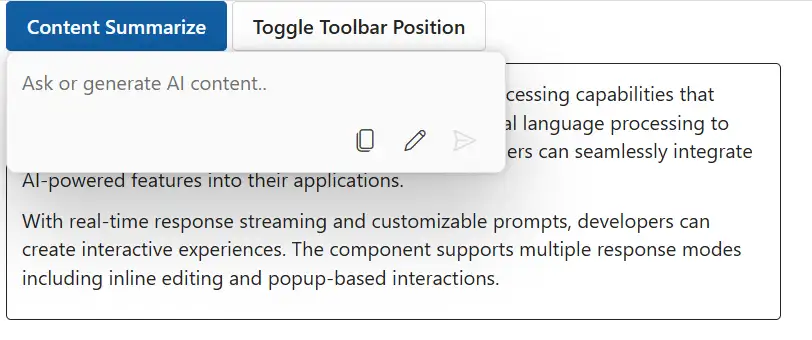
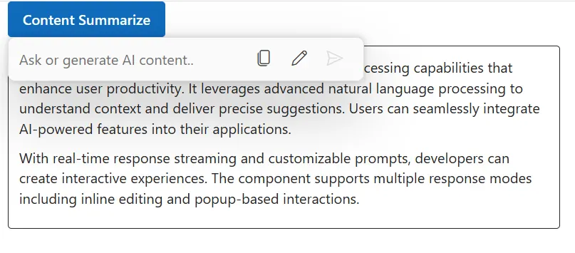

# Toolbar configuration in Blazor Inline AI Assist control

You can render the inline toolbar items by using the `Items` property in the `InlineToolbarItem` tag helper.

## Configure the toolbar and positioning

You can use the `ToolbarPosition` property to customize footer toolbar position. It has two modes such as `Inline`, and `Bottom`. By default, the ToolbarPosition is `Inline`.

By settings ToolbarPosition as `Bottom`, footer items will be rendered at the bottom with a dedicated footer area.




@using Syncfusion.Blazor.InteractiveChat
@using Syncfusion.Blazor.Buttons

<style>
    #editableText {
        width: 100%;
        min-height: 120px;
        max-height: 300px;
        overflow-y: auto;
        font-size: 16px;
        padding: 12px;
        border-radius: 4px;
        border: 1px solid;
    }
</style>

<div class="container" style="height: 350px; width: 650px;">
    <SfButton id="summarizeButton" IsPrimary="true" Style="margin-bottom: 10px;" @onclick="OnSummarizeClick">Content Summarize</SfButton>
    <SfButton Style="margin-bottom: 10px;" @onclick="OnToggleToolbarPosition">Toggle Toolbar Position</SfButton>
    <div id="editableText" contenteditable="true">
        @((MarkupString)editableContent)
    </div>
    <SfInlineAIAssist @ref="inlineAssist" RelateTo="#summarizeButton" PromptRequested="OnPromptRequestAsync">
        <InlineToolbar ToolbarPosition="@currentToolbarPosition" ItemClick="OnToolbarItemClickAsync">
            <InlineToolbarItems>
                @foreach (var item in toolbarItems)
                {
                    <InlineToolbarItem Text="@item.Text" IconCss="@item.IconCss" Tooltip="@item.Tooltip"></InlineToolbarItem>
                }
            </InlineToolbarItems>
        </InlineToolbar>
        <ResponseActions ItemSelect="OnItemSelectAsync"></ResponseActions>
    </SfInlineAIAssist>
</div>
@code {
    private SfInlineAIAssist inlineAssist = new SfInlineAIAssist();
    private ToolbarPosition currentToolbarPosition = ToolbarPosition.Bottom;
    private string editableContent = @"<p>Inline AI Assist component provides intelligent text processing capabilities that enhance user productivity. It leverages advanced natural language processing to understand context and deliver precise suggestions. Users can seamlessly integrate AI-powered features into their applications.</p>
        <p>With real-time response streaming and customizable prompts, developers can create interactive experiences. The component supports multiple response modes including inline editing and popup-based interactions.</p>";
    private List<InlineToolbarItem> toolbarItems = new List<InlineToolbarItem>
    {
        new InlineToolbarItem { Text = "Copy", IconCss = "e-icons e-copy", Tooltip = "Copy" },
        new InlineToolbarItem { Text = "Edit", IconCss = "e-icons e-edit", Tooltip = "Edit" }
    };
    private async Task OnPromptRequestAsync(PromptRequestedEventArgs args)
    {
        await Task.Delay(1000);
        string defaultResponse = "For real-time prompt processing, connect the Inline AI Assist component to your preferred AI service, such as OpenAI or Azure Cognitive Services. Ensure you obtain the necessary API credentials to authenticate and enable seamless integration.";
        await inlineAssist.UpdateResponseAsync(defaultResponse);
    }
    private async Task OnItemSelectAsync(ResponseItemSelectEventArgs args)
    {
        if (args.Item.Label == "Accept")
        {
            var lastPrompt = inlineAssist?.Prompts.LastOrDefault();
            if (lastPrompt != null && !string.IsNullOrEmpty(lastPrompt.Response))
            {
                editableContent = $"<p>{lastPrompt.Response}</p>";
            }
            await inlineAssist!.HidePopupAsync();
        }
        else if (args.Item.Label == "Discard")
        {
            await inlineAssist!.HidePopupAsync();
        }
    }
    private async Task OnToolbarItemClickAsync(ToolbarItemClickEventArgs args)
    {
        // Your required actions
    }
    private async Task OnSummarizeClick()
    {
        await inlineAssist.ShowPopupAsync();
    }
    private void OnToggleToolbarPosition()
    {
        currentToolbarPosition = currentToolbarPosition == ToolbarPosition.Inline
            ? ToolbarPosition.Bottom
            : ToolbarPosition.Inline;
    }
}
```






## Built-in toolbar items

By default, the inline toolbar renders the `Send` item which allows users to send the prompt text.

## Adding custom items

You can use the `InlineToolbarSettings` property to add custom items for the inline toolbar in the Inline AI Assist. The custom items will be added with the existing built-in items in the inline toolbar.

Each toolbar item object can include the following properties:

| Property    | Type    | Default  | Description                                                        |
|-------------|---------|----------|--------------------------------------------------------------------|
| `IconCss`   | string  | ''       | Specifies the CSS class for the item's icon.                       |
| `Type`      | string  | 'Button' | Supports three types of items: `Button`, `Separator`, and `Input`. |
| `Text`      | string  | ''       | Specifies the text label for the toolbar item.                     |
| `Template`  | string  | ''       | Specifies a custom template for the toolbar item.                  |
| `Visible`   | boolean | true     | Specifies whether to show or hide the toolbar item.                |
| `Id`        | string  | ''       | Specifies a unique identifier for the toolbar item.                |
| `Disabled`  | boolean | false    | Specifies whether the toolbar item is disabled and unselectable.   |
| `Tooltip`   | string  | ''       | Specifies the tooltip text displayed on hover.                     |
| `CssClass`  | string  | ''       | Specifies custom CSS classes for styling the toolbar item.         |
| `Align`     | string  | 'Left'   | Specifies the alignment of the toolbar item (Left, Center, Right). |
| `TabIndex`  | number  | -1       | Specifies the tab order for keyboard navigation.                   |

Below sample demonstrates the usage of custom toolbar items in Inline Assist control.




@using Syncfusion.Blazor.InteractiveChat
@using Syncfusion.Blazor.Buttons

<style>
    #editableText {
        width: 100%;
        min-height: 120px;
        max-height: 300px;
        overflow-y: auto;
        font-size: 16px;
        padding: 12px;
        border-radius: 4px;
        border: 1px solid;
    }
    .custom-btn {
        background-color: #007bff;
        color: white;
        padding: 8px 12px;
        border-radius: 4px;
    }
</style>
<div class="container" style="height: 350px; width: 650px;">
    <SfButton id="summarizeButton" IsPrimary="true" Style="margin-bottom: 10px;" @onclick="OnSummarizeClick">Content Summarize</SfButton>
    <div id="editableText" contenteditable="true">
        @((MarkupString)editableContent)
    </div>
    <SfInlineAIAssist @ref="inlineAssist" RelateTo="#summarizeButton" PromptRequested="OnPromptRequestAsync">
        <InlineToolbar ItemClick="OnToolbarItemClickAsync">
            <InlineToolbarItems>
                @foreach (var item in toolbarItems)
                {
                    <InlineToolbarItem Text="@item.Text" IconCss="@item.IconCss" Tooltip="@item.Tooltip"></InlineToolbarItem>
                }
            </InlineToolbarItems>
        </InlineToolbar>
        <ResponseActions ItemSelect="OnItemSelectAsync"></ResponseActions>
    </SfInlineAIAssist>
</div>
@code {
    private SfInlineAIAssist inlineAssist = new SfInlineAIAssist();
    private string editableContent = @"<p>Inline AI Assist component provides intelligent text processing capabilities that enhance user productivity. It leverages advanced natural language processing to understand context and deliver precise suggestions. Users can seamlessly integrate AI-powered features into their applications.</p>
        <p>With real-time response streaming and customizable prompts, developers can create interactive experiences. The component supports multiple response modes including inline editing and popup-based interactions.</p>";
    private List<InlineToolbarItem> toolbarItems = new List<InlineToolbarItem>
    {
        new InlineToolbarItem { Text = "Copy", IconCss = "e-icons e-copy", Tooltip = "Copy" },
        new InlineToolbarItem { Text = "Edit", IconCss = "e-icons e-edit", Tooltip = "Edit" }
    };
    private async Task OnPromptRequestAsync(PromptRequestedEventArgs args)
    {
        await Task.Delay(1000);
        string defaultResponse = "For real-time prompt processing, connect the Inline AI Assist component to your preferred AI service, such as OpenAI or Azure Cognitive Services. Ensure you obtain the necessary API credentials to authenticate and enable seamless integration.";
        await inlineAssist.UpdateResponseAsync(defaultResponse);
    }
    private async Task OnItemSelectAsync(ResponseItemSelectEventArgs args)
    {
        if (args.Item.Label == "Accept")
        {
            var lastPrompt = inlineAssist?.Prompts.LastOrDefault();
            if (lastPrompt != null && !string.IsNullOrEmpty(lastPrompt.Response))
            {
                editableContent = $"<p>{lastPrompt.Response}</p>";
            }
            await inlineAssist!.HidePopupAsync();
        }
        else if (args.Item.Label == "Discard")
        {
            await inlineAssist!.HidePopupAsync();
        }
    }
    private async Task OnToolbarItemClickAsync(ToolbarItemClickEventArgs args)
    {
        // Your required actions
    }
    private async Task OnSummarizeClick()
    {
        await inlineAssist.ShowPopupAsync();
    }
}
```






## Toolbar ItemClick event

The `ItemClick` event is triggered when the inline toolbar item is clicked.




@using Syncfusion.Blazor.InteractiveChat

<div class="container" style="height: 350px; width: 650px;">
    <SfInlineAIAssist Created="OnCreated">
        <InlineToolbar ItemClick="OnToolbarItemClick"></InlineToolbar>
    </SfInlineAIAssist>
</div>
@code {
    private void OnCreated(object args)
    {
        // Your required actions here
    }
    private void OnToolbarItemClick(ToolbarItemClickEventArgs args)
    {
        // Your required actions here
    }
}


