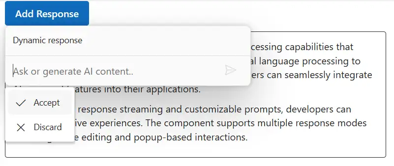
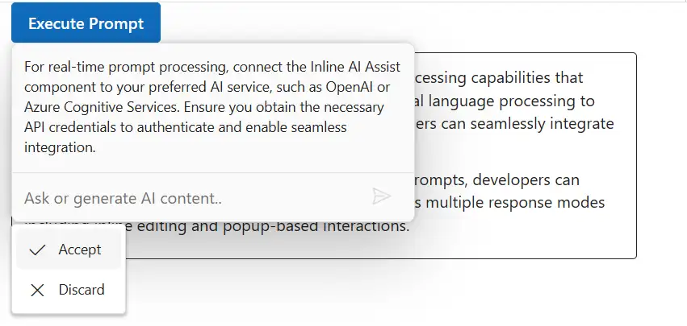
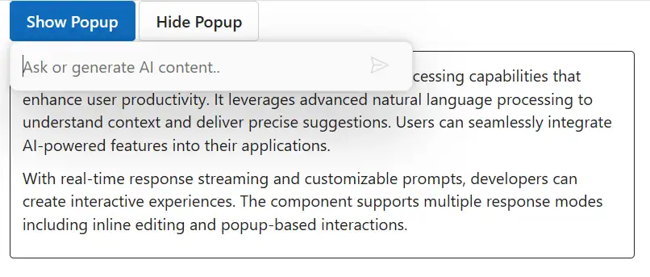
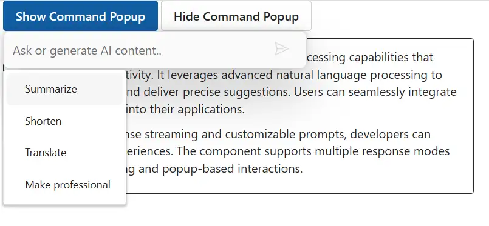

# Methods in Blazor Inline AI Assist control

## Adding response

You can use the `addResponse` public method to add the response to the Inline AI Assist.




```razor
@using Syncfusion.Blazor.InteractiveChat
@using Syncfusion.Blazor.Buttons

<style>
    #editableText {
        width: 100%;
        min-height: 120px;
        max-height: 300px;
        overflow-y: auto;
        font-size: 16px;
        padding: 12px;
        border-radius: 4px;
        border: 1px solid;
    }
</style>

<div class="container" style="height: 350px; width: 650px;">
    <SfButton id="addResponse" IsPrimary="true" Style="margin-bottom: 10px;" @onclick="OnAddResponseClickAsync">Add Response</SfButton>
    <div id="editableText" contenteditable="true">
        @((MarkupString)editableContent)
    </div>

    <SfInlineAIAssist @ref="inlineAssist" RelateTo="#addResponse" PromptRequested="OnPromptRequestAsync">
        <ResponseActions ItemSelect="OnItemSelectAsync"></ResponseActions>
    </SfInlineAIAssist>
</div>

@code {
    private SfInlineAIAssist inlineAssist = new SfInlineAIAssist();
    private string editableContent = @"<p>Inline AI Assist component provides intelligent text processing capabilities that enhance user productivity. It leverages advanced natural language processing to understand context and deliver precise suggestions. Users can seamlessly integrate AI-powered features into their applications.</p>
        <p>With real-time response streaming and customizable prompts, developers can create interactive experiences. The component supports multiple response modes including inline editing and popup-based interactions.</p>";

    private async Task OnPromptRequestAsync(PromptRequestedEventArgs args)
    {
        await Task.Delay(1000);
        string defaultResponse = "For real-time prompt processing, connect the Inline AI Assist component to your preferred AI service, such as OpenAI or Azure Cognitive Services. Ensure you obtain the necessary API credentials to authenticate and enable seamless integration.";
        await inlineAssist.UpdateResponseAsync(defaultResponse);
    }

    private async Task OnItemSelectAsync(ResponseItemSelectEventArgs args)
    {
        if (args.Item.Label == "Accept")
        {
            var lastPrompt = inlineAssist?.Prompts.LastOrDefault();
            if (lastPrompt != null && !string.IsNullOrEmpty(lastPrompt.Response))
            {
                editableContent = $"<p>{lastPrompt.Response}</p>";
            }
            await inlineAssist!.HidePopupAsync();
        }
        else if (args.Item.Label == "Discard")
        {
            await inlineAssist!.HidePopupAsync();
        }
    }

    private async Task OnAddResponseClickAsync()
    {
        await inlineAssist.ShowPopupAsync();
        await inlineAssist.UpdateResponseAsync("Dynamic response");
    }
}
```






## Executing prompt

You can use the `executePrompt` method to execute the prompts dynamically in the Inline AI Assist. It accepts prompts as string values, which triggers the `promptRequest` event and performs the callback actions.




```razor
@using Syncfusion.Blazor.InteractiveChat
@using Syncfusion.Blazor.Buttons

<style>
    #editableText {
        width: 100%;
        min-height: 120px;
        max-height: 300px;
        overflow-y: auto;
        font-size: 16px;
        padding: 12px;
        border-radius: 4px;
        border: 1px solid;
    }
</style>

<div class="container" style="height: 350px; width: 650px;">
    <SfButton id="executePrompt" IsPrimary="true" Style="margin-bottom: 10px;" @onclick="OnExecutePromptClickAsync">Execute Prompt</SfButton>
    <div id="editableText" contenteditable="true">
        @((MarkupString)editableContent)
    </div>

    <SfInlineAIAssist @ref="inlineAssist" RelateTo="#executePrompt" PromptRequested="OnPromptRequestAsync">
        <ResponseActions ItemSelect="OnItemSelectAsync"></ResponseActions>
    </SfInlineAIAssist>
</div>

@code {
    private SfInlineAIAssist inlineAssist = new SfInlineAIAssist();
    private string editableContent = @"<p>Inline AI Assist component provides intelligent text processing capabilities that enhance user productivity. It leverages advanced natural language processing to understand context and deliver precise suggestions. Users can seamlessly integrate AI-powered features into their applications.</p>
        <p>With real-time response streaming and customizable prompts, developers can create interactive experiences. The component supports multiple response modes including inline editing and popup-based interactions.</p>";

    private async Task OnPromptRequestAsync(PromptRequestedEventArgs args)
    {
        await Task.Delay(1000);
        string defaultResponse = "For real-time prompt processing, connect the Inline AI Assist component to your preferred AI service, such as OpenAI or Azure Cognitive Services. Ensure you obtain the necessary API credentials to authenticate and enable seamless integration.";
        await inlineAssist.UpdateResponseAsync(defaultResponse);
    }

    private async Task OnItemSelectAsync(ResponseItemSelectEventArgs args)
    {
        if (args.Item.Label == "Accept")
        {
            var lastPrompt = inlineAssist?.Prompts.LastOrDefault();
            if (lastPrompt != null && !string.IsNullOrEmpty(lastPrompt.Response))
            {
                editableContent = $"<p>{lastPrompt.Response}</p>";
            }
            await inlineAssist!.HidePopupAsync();
        }
        else if (args.Item.Label == "Discard")
        {
            await inlineAssist!.HidePopupAsync();
        }
    }

    private async Task OnExecutePromptClickAsync()
    {
        await inlineAssist.ShowPopupAsync();
        await inlineAssist.ExecutePromptAsync("What is the current temperature?");
    }
}
```






## Showing popup

You can use `showPopup` method to open the Inline AI Assist popup and optionally position it at specified coordinates.

## Hiding popup

You can use `hidePopup` method to close the Inline AI Assist popup.




```razor
@using Syncfusion.Blazor.InteractiveChat
@using Syncfusion.Blazor.Buttons

<style>
    #editableText {
        width: 100%;
        min-height: 120px;
        max-height: 300px;
        overflow-y: auto;
        font-size: 16px;
        padding: 12px;
        border-radius: 4px;
        border: 1px solid;
    }
</style>

<div class="container" style="height: 350px; width: 650px;">
    <SfButton id="showPopup" IsPrimary="true" Style="margin-bottom: 10px;" @onclick="OnShowPopupClickAsync">Show Popup</SfButton>
    <SfButton id="hidePopup" CssClass="e-outline" Style="margin-bottom: 10px;" @onclick="OnHidePopupClickAsync">Hide Popup</SfButton>
    <div id="editableText" contenteditable="true">
        @((MarkupString)editableContent)
    </div>

    <SfInlineAIAssist @ref="inlineAssist" RelateTo="#showPopup" PromptRequested="OnPromptRequestAsync">
        <ResponseActions ItemSelect="OnItemSelectAsync"></ResponseActions>
    </SfInlineAIAssist>
</div>

@code {
    private SfInlineAIAssist inlineAssist = new SfInlineAIAssist();
    private string editableContent = @"<p>Inline AI Assist component provides intelligent text processing capabilities that enhance user productivity. It leverages advanced natural language processing to understand context and deliver precise suggestions. Users can seamlessly integrate AI-powered features into their applications.</p>
        <p>With real-time response streaming and customizable prompts, developers can create interactive experiences. The component supports multiple response modes including inline editing and popup-based interactions.</p>";

    private async Task OnPromptRequestAsync(PromptRequestedEventArgs args)
    {
        await Task.Delay(1000);
        string defaultResponse = "For real-time prompt processing, connect the Inline AI Assist component to your preferred AI service, such as OpenAI or Azure Cognitive Services. Ensure you obtain the necessary API credentials to authenticate and enable seamless integration.";
        await inlineAssist.UpdateResponseAsync(defaultResponse);
    }

    private async Task OnItemSelectAsync(ResponseItemSelectEventArgs args)
    {
        if (args.Item.Label == "Accept")
        {
            var lastPrompt = inlineAssist?.Prompts.LastOrDefault();
            if (lastPrompt != null && !string.IsNullOrEmpty(lastPrompt.Response))
            {
                editableContent = $"<p>{lastPrompt.Response}</p>";
            }
            await inlineAssist!.HidePopupAsync();
        }
        else if (args.Item.Label == "Discard")
        {
            await inlineAssist!.HidePopupAsync();
        }
    }

    private async Task OnShowPopupClickAsync()
    {
        await inlineAssist.ShowPopupAsync();
    }

    private async Task OnHidePopupClickAsync()
    {
        await inlineAssist.HidePopupAsync();
    }
}
```






## Showing command popup

Use `showCommandPopup` to open the command action popup; it only opens when the Inline AI Assist popup is already opened.

## Hiding command popup

You can use `hideCommandPopup` to close the command action popup in the Inline AI Assist control.




```razor
@using Syncfusion.Blazor.InteractiveChat
@using Syncfusion.Blazor.Buttons

<style>
    #editableText {
        width: 100%;
        min-height: 120px;
        max-height: 300px;
        overflow-y: auto;
        font-size: 16px;
        padding: 12px;
        border-radius: 4px;
        border: 1px solid;
    }
</style>

<div class="container" style="height: 350px; width: 650px;">
    <SfButton id="showCommandsBtn" IsPrimary="true" Style="margin-bottom: 10px;" @onclick="OnShowCommandPopupClickAsync">Show Command Popup</SfButton>
    <SfButton id="hideCommandsBtn" CssClass="e-outline" Style="margin-bottom: 10px;" @onclick="OnHideCommandPopupClickAsync">Hide Command Popup</SfButton>
    <div id="editableText" contenteditable="true">
        @((MarkupString)editableContent)
    </div>

    <SfInlineAIAssist @ref="inlineAssist" RelateTo="#showCommandsBtn" Closed="OnClosedAsync" PromptRequested="OnPromptRequestAsync">
        <CommandMenu Commands="commandItems"></CommandMenu>
        <ResponseActions ItemSelect="OnItemSelectAsync"></ResponseActions>
    </SfInlineAIAssist>
</div>

@code {
    private SfInlineAIAssist inlineAssist = new SfInlineAIAssist();
    private bool showPopup = false;
    private string editableContent = @"<p>Inline AI Assist component provides intelligent text processing capabilities that enhance user productivity. It leverages advanced natural language processing to understand context and deliver precise suggestions. Users can seamlessly integrate AI-powered features into their applications.</p>
        <p>With real-time response streaming and customizable prompts, developers can create interactive experiences. The component supports multiple response modes including inline editing and popup-based interactions.</p>";

    private List<CommandItem> commandItems = new List<CommandItem>
    {
        new CommandItem { Label = "Summarize", Prompt = "Summarize the content" },
        new CommandItem { Label = "Shorten", Prompt = "Shorten the content" },
        new CommandItem { Label = "Translate", Prompt = "Translate the content" },
        new CommandItem { Label = "Make professional", Prompt = "Make the content more professional" }
    };

    private async Task OnPromptRequestAsync(PromptRequestedEventArgs args)
    {
        await Task.Delay(1000);
        string defaultResponse = "For real-time prompt processing, connect the Inline AI Assist component to your preferred AI service, such as OpenAI or Azure Cognitive Services. Ensure you obtain the necessary API credentials to authenticate and enable seamless integration.";
        await inlineAssist.UpdateResponseAsync(defaultResponse);
    }

    private async Task OnItemSelectAsync(ResponseItemSelectEventArgs args)
    {
        if (args.Item.Label == "Accept")
        {
            var lastPrompt = inlineAssist?.Prompts.LastOrDefault();
            if (lastPrompt != null && !string.IsNullOrEmpty(lastPrompt.Response))
            {
                editableContent = $"<p>{lastPrompt.Response}</p>";
            }
            await inlineAssist!.HidePopupAsync();
        }
        else if (args.Item.Label == "Discard")
        {
            await inlineAssist!.HidePopupAsync();
        }
    }

    private async Task OnClosedAsync()
    {
        if (showPopup)
        {
            await inlineAssist.ShowPopupAsync();
        }
    }

    private async Task OnShowCommandPopupClickAsync()
    {
        showPopup = true;
        await inlineAssist.ShowPopupAsync();
        await inlineAssist.ShowCommandPopupAsync();
    }

    private async Task OnHideCommandPopupClickAsync()
    {
        showPopup = false;
        await inlineAssist.HideCommandPopupAsync();
    }
}
```



