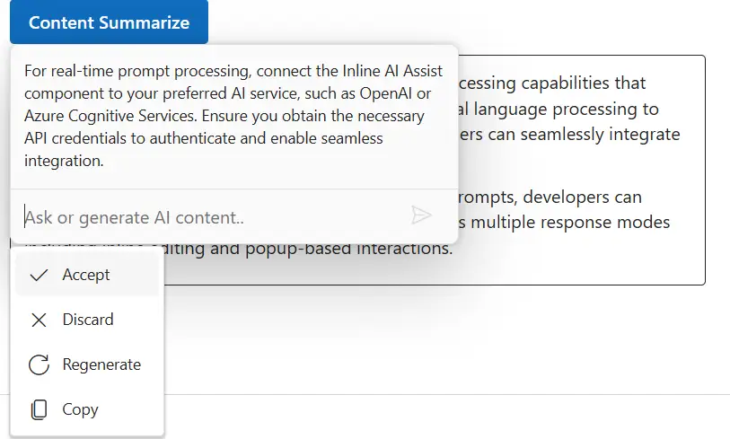

# Response actions in ##Platform_Name## Inline AI Assist control

You can render response action popup by using `items` property in the `e-inlineaiassist-responsesettings` tag helper.

## Built-in response items

By default, the response popup displays the built-in `accept` and `discard` items, allowing users to accept or discard the response. The response action popup is shown after a response is generated. This feature enables users to accept, discard, or perform custom actions on AI-generated responses.

Built-in items appear by default and cannot be removed, but custom items can be added alongside them.

## Custom response item configuration

You can use the `responseSettings` property to add custom items for the response popup in Inline AI Assist. The custom items will be added with the existing built-in items in the response popup. The custom items will be displayed together with the existing built-in items in the response popup.

Each response item object can include the following properties:

| Property    | Type    | Default | Description                                                      |
|-------------|---------|---------|------------------------------------------------------------------|
| label       | string  | ''      | Specifies the display label of the response item.                |
| iconCss     | string  | ''      | Specifies the CSS class for the item's icon.                     |
| disabled    | boolean | false   | Specifies whether the response item is disabled and unselectable.|
| groupBy     | string  | ''      | Specifies the group category for organizing related items.       |
| id          | string  | ''      | Specifies a unique identifier for the response item.             |
| tooltip     | string  | ''      | Specifies the tooltip text displayed on hover.                   |

## Response interactions

The `itemSelect` event is triggered when an item is selected from the response popup in the Inline AI Assist control.

The below example demonstrates the `ResponseSettings` property




```razor
@using Syncfusion.Blazor.InteractiveChat
@using Syncfusion.Blazor.Buttons

<style>
    #editableText {
        width: 100%;
        min-height: 120px;
        max-height: 300px;
        overflow-y: auto;
        font-size: 16px;
        padding: 12px;
        border-radius: 4px;
        border: 1px solid;
    }
</style>

<div class="container" style="height: 350px; width: 650px;">
    <SfButton id="summarizeBtn" IsPrimary="true" Style="margin-bottom: 10px;" @onclick="OnSummarizeClick">Content Summarize</SfButton>
    <div id="editableText" contenteditable="true">
        @((MarkupString)editableContent)
    </div>

    <SfInlineAIAssist @ref="inlineAssist" RelateTo="#summarizeBtn" PromptRequested="OnPromptRequestAsync">
        <ResponseActions Items="responseItems" ItemSelect="OnItemSelectAsync"></ResponseActions>
    </SfInlineAIAssist>
</div>

@code {
    private SfInlineAIAssist inlineAssist = new SfInlineAIAssist();
    private string editableContent = @"<p>Inline AI Assist component provides intelligent text processing capabilities that enhance user productivity. It leverages advanced natural language processing to understand context and deliver precise suggestions. Users can seamlessly integrate AI-powered features into their applications.</p>
        <p>With real-time response streaming and customizable prompts, developers can create interactive experiences. The component supports multiple response modes including inline editing and popup-based interactions.</p>";

    private List<ResponseItem> responseItems = new List<ResponseItem>
    {
        new ResponseItem { Label = "Regenerate", IconCss = "e-icons e-refresh", Tooltip = "Regenerate" },
        new ResponseItem { Label = "Copy", IconCss = "e-icons e-copy", Tooltip = "Copy" }
    };

    private async Task OnPromptRequestAsync(PromptRequestedEventArgs args)
    {
        await Task.Delay(1000);
        string defaultResponse = "For real-time prompt processing, connect the Inline AI Assist component to your preferred AI service, such as OpenAI or Azure Cognitive Services. Ensure you obtain the necessary API credentials to authenticate and enable seamless integration.";
        await inlineAssist.UpdateResponseAsync(defaultResponse);
    }

    private async Task OnItemSelectAsync(ResponseItemSelectEventArgs args)
    {
        // Your required action here
        if (args.Item.Label == "Accept")
        {
            var lastPrompt = inlineAssist?.Prompts.LastOrDefault();
            if (lastPrompt != null && !string.IsNullOrEmpty(lastPrompt.Response))
            {
                editableContent = $"<p>{lastPrompt.Response}</p>";
            }
            await inlineAssist!.HidePopupAsync();
        }
        else if (args.Item.Label == "Discard")
        {
            await inlineAssist!.HidePopupAsync();
        }
    }

    private async Task OnSummarizeClick()
    {
        await inlineAssist.ShowPopupAsync();
    }
}
```






## See Also

- [Command Settings](./command-settings.md)
- [Inline Toolbar](./inline-toolbar.md)
- [Events Documentation](./events.md)