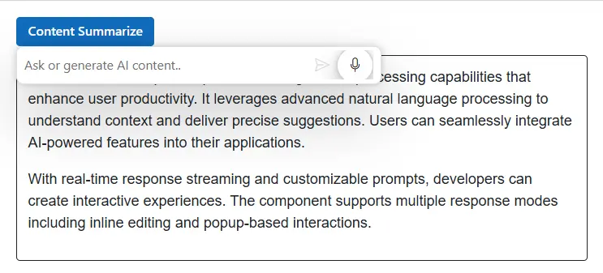

# Speech-to-Text in Blazor Inline AI Assist

The Blazor Inline AI Assist component provides built-in Speech-to-Text support through the browser's [Web Speech API](https://developer.mozilla.org/en-US/docs/Web/API/Web_Speech_API). This feature converts spoken words into text using the device's microphone, allowing users to enter prompts without typing. When content is selected, the recognized speech can be submitted as a prompt along with the selected content to provide contextual AI assistance.

## Prerequisites

Before integrating `Speech-to-Text`, ensure the following:

1. The Inline AI Assist component is properly set up in your Blazor application.
    - [Blazor Getting Started Guide](../getting-started-webapp)

2. The Inline AI Assist component is integrated with Azure OpenAI.
    - [Integration of Azure OpenAI With Blazor Inline AI Assist component](../ai-integrations/openai-integration.md)

## Enable speech-to-text

To enable the built-in Speech-to-Text functionality, add the `InlineAIAssistSpeechToText` child tag to the `SfInlineAIAssist` component and set the `Enable` property to `true`.

Once enabled, a microphone icon appears in the Inline AI Assist popup's built-in editor. When the microphone is selected, the component captures audio from the device's microphone, converts speech into text using the browser's [SpeechRecognition](https://developer.mozilla.org/en-US/docs/Web/API/SpeechRecognition) API, and inserts the recognized text into the prompt editor.

## Configure speech recognition language

The [`Language`](https://help.syncfusion.com/cr/blazor/Syncfusion.Blazor.InteractiveChat.InlineAIAssistSpeechToText.html#Syncfusion_Blazor_InteractiveChat_InlineAIAssistSpeechToText_Language) property specifies the language used for speech recognition. Set it to a language code such as `en-US` for American English or `fr-FR` for French. If no language is specified, speech recognition uses the browser's default language setting.

## Enable interim results

The [`AllowInterimResults`](https://help.syncfusion.com/cr/blazor/Syncfusion.Blazor.InteractiveChat.InlineAIAssistSpeechToText.html#Syncfusion_Blazor_InteractiveChat_InlineAIAssistSpeechToText_AllowInterimResults) property controls whether the prompt editor displays partial results while the user is speaking. Set it to `true` to show words as they are recognized in real time. Set it to `false` to update the prompt editor only after the speech recognition engine produces the final transcript.

```cshtml
@using Syncfusion.Blazor.InteractiveChat
@using Syncfusion.Blazor.Buttons

<style>
    #editableText {
        width: 100%;
        min-height: 120px;
        max-height: 300px;
        overflow-y: auto;
        font-size: 16px;
        padding: 12px;
        border-radius: 4px;
        border: 1px solid;
    }
</style>
<div class="container" style="height: 350px; width: 650px;">
    <SfButton id="summarizeButton" IsPrimary="true" Style="margin-bottom: 10px;" @onclick="OnSummarizeClick">Content Summarize</SfButton>
    <div id="editableText" contenteditable="true">
        @((MarkupString)editableContent)
    </div>
    <SfInlineAIAssist @ref="inlineAssist" RelateTo="#summarizeButton" PromptRequested="OnPromptRequestAsync">
		<InlineAIAssistSpeechToText Enable="true" Language="en-US" AllowInterimResults="true"></InlineAIAssistSpeechToText>
        <InlineToolbar>
                <InlineToolbarItem IconCss="e-icons e-inline-assist-speech-to-text"></InlineToolbarItem>
        </InlineToolbar>
        <ResponseActions ItemSelect="OnItemSelectAsync"></ResponseActions>
    </SfInlineAIAssist>
</div>
@code {
    private SfInlineAIAssist inlineAssist = new SfInlineAIAssist();
    private string editableContent = @"<p>Inline AI Assist component provides intelligent text processing capabilities that enhance user productivity. It leverages advanced natural language processing to understand context and deliver precise suggestions. Users can seamlessly integrate AI-powered features into their applications.</p>
        <p>With real-time response streaming and customizable prompts, developers can create interactive experiences. The component supports multiple response modes including inline editing and popup-based interactions.</p>";
    private async Task OnPromptRequestAsync(PromptRequestedEventArgs args)
    {
        await Task.Delay(1000);
        string defaultResponse = "For real-time prompt processing, connect the Inline AI Assist component to your preferred AI service, such as OpenAI or Azure Cognitive Services. Ensure you obtain the necessary API credentials to authenticate and enable seamless integration.";
        await inlineAssist.UpdateResponseAsync(defaultResponse);
    }
    private async Task OnItemSelectAsync(ResponseItemSelectEventArgs args)
    {
        if (args.Item.Label == "Accept")
        {
            var lastPrompt = inlineAssist?.Prompts.LastOrDefault();
            if (lastPrompt != null && !string.IsNullOrEmpty(lastPrompt.Response))
            {
                editableContent = $"<p>{lastPrompt.Response}</p>";
            }
            await inlineAssist!.HidePopupAsync();
        }
        else if (args.Item.Label == "Discard")
        {
            await inlineAssist!.HidePopupAsync();
        }
    }
    private async Task OnSummarizeClick()
    {
        await inlineAssist.ShowPopupAsync();
    }
}
```



## Error Handling

The `SpeechToText` component provides events to handle errors that may occur during speech recognition. For more information, refer to the [Error Handling](https://blazor.syncfusion.com/documentation/speech-to-text/speech-recognition#error-handling) section in the documentation.

## Browser Compatibility

The `SpeechToText` component relies on the [Speech Recognition API](https://developer.mozilla.org/en-US/docs/Web/API/SpeechRecognition), which has limited browser support. Refer to the [Browser Compatibility](https://blazor.syncfusion.com/documentation/speech-to-text/speech-recognition#browser-support) section for detailed information.