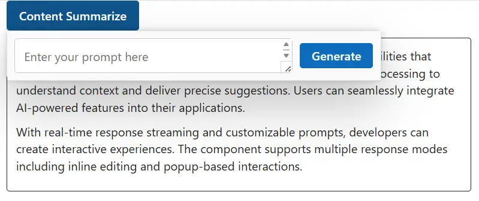
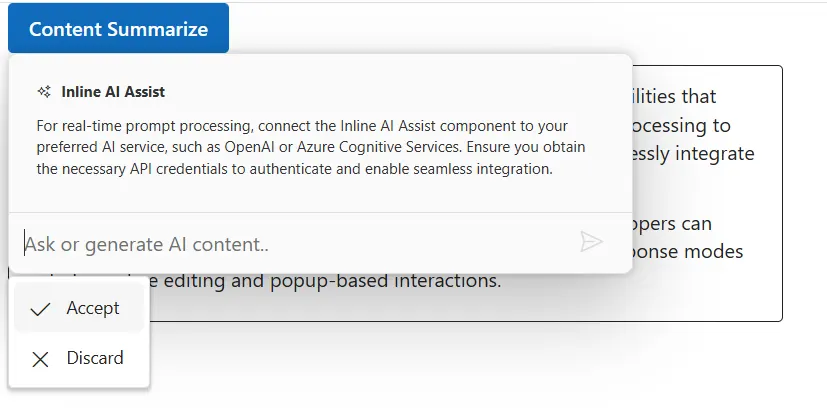

# Templates in Blazor Inline AI Assist control

The Inline AI Assist provides several template options to customize the response and footer items.

## Editor template

You can use the `editorTemplate` property to customize the default footer area and manage prompt request actions in the Inline AI Assist. This allows users to create unique footers that meet their specific needs.




```cshtml
@using Syncfusion.Blazor.InteractiveChat
@using Syncfusion.Blazor.Buttons

<style>
    #editableText {
        width: 100%;
        min-height: 120px;
        max-height: 300px;
        overflow-y: auto;
        font-size: 16px;
        padding: 12px;
        border-radius: 4px;
        border: 1px solid;
    }

    .custom-footer {
        display: flex;
        gap: 10px;
        padding: 10px;
        background-color: transparent;
    }

    #promptTextArea {
        width: 100%;
        padding: 12px;
        min-height: 46px;
        border-radius: 5px;
        border: 1px solid #ccc;
        margin-bottom: 0;
    }

    #sendPrompt {
        padding: 5px 15px;
        align-self: center;
    }
</style>

<div class="container" style="height: 350px; width: 650px;">
    <!-- Wrap the button in a span so RelateTo="#summarizeBtn" targets the button precisely -->
    <span id="summarizeBtn" style="display: inline-block; margin-bottom: 10px;">
        <SfButton IsPrimary="true" @onclick="OnSummarizeClickAsync">
            Content Summarize
        </SfButton>
    </span>

    <div id="editableText" contenteditable="true" @ref="editableTextRef">
        <p>Inline AI Assist component provides intelligent text processing capabilities that enhance user productivity.
            It leverages advanced natural language processing to understand context and deliver precise suggestions.
            Users can seamlessly integrate AI-powered features into their applications.</p>
        <p>With real-time response streaming and customizable prompts, developers can create interactive experiences.
            The component supports multiple response modes including inline editing and popup-based interactions.</p>
    </div>

    <SfInlineAIAssist @ref="inlineAssist" RelateTo="#summarizeBtn" PopupWidth="500px"
                      PromptRequested="OnPromptRequestAsync">
        <EditorTemplate>
            <div class="custom-footer">
                <textarea id="promptTextArea" class="e-input" rows="2" placeholder="Enter your prompt here"
                          @bind="promptText" @bind:event="oninput"></textarea>
                <SfButton id="sendPrompt" IsPrimary="true" @onclick="OnGenerateClickAsync">Generate</SfButton>
            </div>
        </EditorTemplate>
        <ChildContent>
            <ResponseActions ItemSelect="OnResponseItemSelectAsync"></ResponseActions>
        </ChildContent>
    </SfInlineAIAssist>
</div>

@code {
    private SfInlineAIAssist inlineAssist = new();
    private ElementReference editableTextRef;
    private string promptText = string.Empty;

    private async Task OnSummarizeClickAsync()
    {
        await inlineAssist.ShowPopupAsync();
    }

    private async Task OnGenerateClickAsync()
    {
        if (!string.IsNullOrWhiteSpace(promptText))
        {
            var prompt = promptText;
            promptText = string.Empty;
            await inlineAssist.ExecutePromptAsync(prompt);
        }
    }

    private async Task OnPromptRequestAsync(PromptRequestedEventArgs args)
    {
        await Task.Delay(1000);
        var defaultResponse = "For real-time prompt processing, connect the Inline AI Assist component to your preferred AI service, such as OpenAI or Azure Cognitive Services. Ensure you obtain the necessary API credentials to authenticate and enable seamless integration.";
        await inlineAssist.UpdateResponseAsync(defaultResponse);
    }

    private async Task OnResponseItemSelectAsync(ResponseItemSelectEventArgs args)
    {
        if (args.Item.Label == "Accept")
        {
            var lastPrompt = inlineAssist.Prompts.LastOrDefault();
            if (lastPrompt != null && !string.IsNullOrEmpty(lastPrompt.Response))
            {
                await JSRuntime.InvokeVoidAsync("eval",
                    $"document.getElementById('editableText').innerHTML = '<p>{lastPrompt.Response}</p>'");
            }
            await inlineAssist.HidePopupAsync();
        }
        else if (args.Item.Label == "Discard")
        {
            await inlineAssist.HidePopupAsync();
        }
    }
}
```






## Response template

You can use the `responseTemplate` property to customize response items within the Inline AI Assist. The template context includes the `response` and `toolbarItems` values.

```cshtml
@using Syncfusion.Blazor.InteractiveChat
@using Syncfusion.Blazor.Buttons

<style>
    #editableText {
        width: 100%;
        min-height: 120px;
        max-height: 300px;
        overflow-y: auto;
        font-size: 16px;
        padding: 12px;
        border-radius: 4px;
        border: 1px solid;
    }

    .responseItemContent {
        padding: 10px;
    }

    .response-header {
        display: flex;
        align-items: center;
        gap: 8px;
        margin-bottom: 10px;
        font-weight: bold;
    }

    .response-header .e-assistview-icon:before {
        font-size: 18px;
    }

    .responseContent {
        margin-top: 8px;
    }
</style>

<div class="container" style="height: 350px; width: 650px;">
    <span id="summarizeBtn" style="display: inline-block; margin-bottom: 10px;">
        <SfButton IsPrimary="true" @onclick="OnSummarizeClickAsync">
            Content Summarize
        </SfButton>
    </span>

    <div id="editableText" contenteditable="true">
        <p>Inline AI Assist component provides intelligent text processing capabilities that enhance user productivity.
            It leverages advanced natural language processing to understand context and deliver precise suggestions.
            Users can seamlessly integrate AI-powered features into their applications.</p>
        <p>With real-time response streaming and customizable prompts, developers can create interactive experiences.
            The component supports multiple response modes including inline editing and popup-based interactions.</p>
    </div>

    <SfInlineAIAssist @ref="inlineAssist" RelateTo="#summarizeBtn" PopupWidth="500px"
                      PromptRequested="OnPromptRequestAsync">
        <ChildContent>
            <ResponseActions ItemSelect="OnItemSelectAsync"></ResponseActions>
        </ChildContent>
        <ResponseTemplate>
            <div class="responseItemContent">
                <div class="response-header">
                    <span class="e-icons e-ai-chat"></span>
                    Inline AI Assist
                </div>
                <div class="responseContent">
                    @((MarkupString)(context.Response ?? string.Empty))
                </div>
            </div>
        </ResponseTemplate>
    </SfInlineAIAssist>
</div>

@code {
    private SfInlineAIAssist inlineAssist = new();

    private async Task OnSummarizeClickAsync()
    {
        await inlineAssist.ShowPopupAsync();
    }

    private async Task OnPromptRequestAsync(PromptRequestedEventArgs args)
    {
        await Task.Delay(1000);
        var defaultResponse = "For real-time prompt processing, connect the Inline AI Assist component to your preferred AI service, such as OpenAI or Azure Cognitive Services. Ensure you obtain the necessary API credentials to authenticate and enable seamless integration.";
        await inlineAssist.UpdateResponseAsync(defaultResponse);
    }

    private async Task OnItemSelectAsync(ResponseItemSelectEventArgs args)
    {
        if (args.Item.Label == "Accept")
        {
            var lastPrompt = inlineAssist.Prompts.LastOrDefault();
            if (lastPrompt != null && !string.IsNullOrEmpty(lastPrompt.Response))
            {
                await JSRuntime.InvokeVoidAsync("eval",
                    $"document.getElementById('editableText').innerHTML = '<p>{lastPrompt.Response}</p>'");
            }
            await inlineAssist.HidePopupAsync();
        }
        else if (args.Item.Label == "Discard")
        {
            await inlineAssist.HidePopupAsync();
        }
    }
}
```

