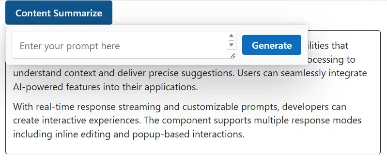
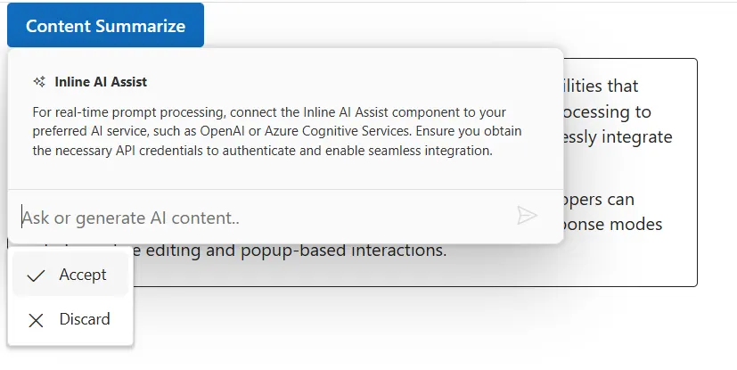

# Templates in Blazor Inline AI Assist

The Inline AI Assist provides several template options to customize the response and footer items.

## Editor template

You can use the `EditorTemplate` tag to customize the default footer area and manage prompt request actions in the Inline AI Assist. This allows users to create unique footers that meet their specific needs.









## Response template

You can use the `<Responsetemplate></ResponseTemplate>` tag to customize response items within the Inline AI Assist. The template context includes the `Response` and `ToolbarItems` values.









