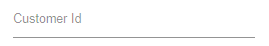

# Getting Started with Blazor Input Mask Component

This section briefly explains about how to include a [Blazor MaskedTextBox](https://www.syncfusion.com/blazor-components/blazor-input-mask) Component in your Blazor Server-Side and Client-Side application. You can refer to our Getting Started with [Blazor Server-Side MaskedTextBox](../getting-started/blazor-server-side-visual-studio-2019/) and [Blazor WebAssembly MaskedTextbox](../getting-started/blazor-webassembly-visual-studio-2019/) documentation pages for configuration specifications.

To get start quickly with Blazor MaskedTextBox component, you can check on this video.



## Importing Syncfusion Blazor component in the application

* Install `Syncfusion.Blazor.Inputs` NuGet package to the application by using the `NuGet Package Manager`.

> Please ensure to check the `Include prerelease` option for our Beta release.

* You can add the client-side resources through CDN or from NuGet package in the  **HEAD** element of the **~/wwwroot/index.html** page.

 ```html
<head>
        <link href="_content/Syncfusion.Blazor.Themes/bootstrap4.css" rel="stylesheet" />
        <!-- <link href="https://cdn.syncfusion.com/blazor/{{version}}/styles/{{theme}}.css" rel="stylesheet" /> -->
</head>
```

> For Internet Explorer 11 kindly refer the polyfills. Refer the [documentation](https://ej2.syncfusion.com/blazor/documentation/common/how-to/render-blazor-server-app-in-ie/) for more information.

 ```html
<head>
    <link href="_content/Syncfusion.Blazor.Themes/bootstrap4.css" rel="stylesheet" />
    <script src="https://github.com/Daddoon/Blazor.Polyfill/releases/download/3.0.1/blazor.polyfill.min.js"></script>
</head>
```

## Adding component package to the application

Open `~/_Imports.razor` file and import the `Syncfusion.Blazor.Inputs` package.

```cshtml
@using Syncfusion.Blazor.Inputs
```

## Add SyncfusionBlazor service in Program.cs

Open the **Program.cs** file and add services required by Syncfusion components using  **builder.Services.AddSyncfusionBlazor()** method.

```csharp
using Syncfusion.Blazor;

namespace BlazorApplication
{
    public class Program
    {
        public static async Task Main(string[] args)
        {
            ....
            ....
            builder.Services.AddSyncfusionBlazor();
            await builder.Build().RunAsync();
        }
    }
}
```

> To enable custom client side resource loading from CRG or CDN. You need to disable resource loading by `AddSyncfusionBlazor(true)` and load the scripts in the **HEAD** element of the **~/wwwroot/index.html** page.

 ```html
<head>
    <script src="https://cdn.syncfusion.com/blazor/{:version:}/syncfusion-blazor.min.js"></script>
</head>
```

## Adding MaskedTextBox component to the application

To initialize the MaskedTextBox component add the below code to your `Index.razor` view page which is present under `~/Pages` folder.

```csharp
<SfMaskedTextBox></SfMaskedTextBox>
```

The output will be as follows.



## Set the mask

You can set the mask to the MaskedTextBox to validate the user input by using the [Mask](https://help.syncfusion.com/cr/blazor/Syncfusion.Blazor.Inputs.MaskedTextBoxModel.html#Syncfusion_Blazor_Inputs_MaskedTextBoxModel_Mask) property.

The following example demonstrates the usage of mask element `0` that allows any single digit from `0` to `9`.

```csharp
<SfMaskedTextBox Mask='000-000-0000'></SfMaskedTextBox>
```

The output will be as follows.


## See Also

* [Getting Started with Syncfusion Blazor for Client-Side in .NET Core CLI](../getting-started/blazor-webassembly-dotnet-cli/)
* [Getting Started with Syncfusion Blazor for Server-side in Visual Studio 2019](../getting-started/blazor-server-side-visual-studio-2019/)
* [Getting Started with Syncfusion Blazor for Server-Side in .NET Core CLI](../getting-started/blazor-server-side-dotnet-cli/)