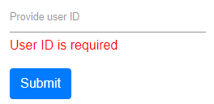

# Model Binding in Blazor Input Mask Component

This section demonstrates how to use model binding and validation with the MaskedTextBox in a Blazor EditForm. Bind a model to the form, annotate its properties with data annotations, bind the component’s Value parameter to a model property, and display validation messages when the form is submitted. For reference, see SfMaskedTextBox, Mask, Placeholder, and Value in the API, and the Blazor EditForm and data annotations validation guidance.

In this sample, click the submit button to post the value in the MaskedTextBox. When the bound value is null, empty, or otherwise invalid according to data annotations, a validation error message is shown below the MaskedTextBox.

```cshtml
@using Syncfusion.Blazor.Inputs
@using System.ComponentModel.DataAnnotations

<EditForm Model="@User">
    <DataAnnotationsValidator />
    <div asp-validation-summary="All" class="text-danger"></div>
    <div class="form-group">
        <SfMaskedTextBox Mask="00000" Placeholder='Provide user ID' @bind-Value="@User.ID"></SfMaskedTextBox>
        <ValidationMessage For="@(() => User.ID)" />
    </div>
    <button type="submit" class="btn btn-primary">Submit</button>
</EditForm>

@code {

    public Customer User = new Customer();

    public class Customer
    {
        [Required(ErrorMessage ="User ID is required")]

        public string ID { get; set; }

    }
}
```

