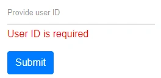

# Model Binding in Blazor Input Mask Component

This section demonstrates how to use model binding and validation with the MaskedTextBox in a Blazor `EditForm`. Bind a model to the form, annotate its properties with data annotations, bind the component’s `Value` parameter to a model property, and display validation messages when the form is submitted.

**Prerequisites:** Ensure the Syncfusion Blazor theme is referenced, the `Syncfusion.Blazor` service is registered in `Program.cs` using `builder.Services.AddSyncfusionBlazor()`, and Bootstrap (or a compatible CSS framework) is loaded for the example CSS classes. See the [Getting Started](../input-mask/getting-started) guide for setup steps.

For reference, see the [SfMaskedTextBox](https://help.syncfusion.com/cr/blazor/Syncfusion.Blazor.Inputs.SfMaskedTextBox.html), [Mask](https://help.syncfusion.com/cr/blazor/Syncfusion.Blazor.Inputs.SfMaskedTextBox.html#Syncfusion_Blazor_Inputs_SfMaskedTextBox_Mask), [Placeholder](https://help.syncfusion.com/cr/blazor/Syncfusion.Blazor.Inputs.SfMaskedTextBox.html#Syncfusion_Blazor_Inputs_SfMaskedTextBox_Placeholder), and [Value](https://help.syncfusion.com/cr/blazor/Syncfusion.Blazor.Inputs.SfMaskedTextBox.html#Syncfusion_Blazor_Inputs_SfMaskedTextBox_Value) API references, and the Blazor [EditForm and data annotations validation](https://learn.microsoft.com/en-us/aspnet/core/blazor/forms/validation) guidance.

In this sample, click the **Submit** button to post the value in the MaskedTextBox. When the bound value is null, empty, or otherwise invalid according to data annotations, a validation error message is shown below the MaskedTextBox. If the model property is null at first render, the `Value` will be an empty string until the user provides a value.

```cshtml
@using Syncfusion.Blazor.Inputs
@using System.ComponentModel.DataAnnotations
@using Microsoft.AspNetCore.Components.Forms

<EditForm Model="@User" OnValidSubmit="@HandleValidSubmit">
    <DataAnnotationsValidator />
    <ValidationSummary />
    <div class="form-group">
        <SfMaskedTextBox Mask="00000" Placeholder="Provide user ID" @bind-Value="@User.ID"></SfMaskedTextBox>
        <ValidationMessage For="@(() => User.ID)" />
    </div>
    <button type="submit" class="btn btn-primary">Submit</button>
</EditForm>

@code {

    public Customer User = new Customer();

    public class Customer
    {
        [Required(ErrorMessage = "User ID is required")]
        public string ID { get; set; }
    }

    private void HandleValidSubmit()
    {
        // Handle the valid submit here.
    }
}
```

