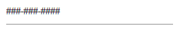
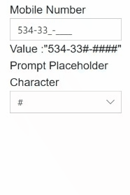

# Mask Configuration in Blazor Input Mask Component

The [Mask](https://help.syncfusion.com/cr/blazor/Syncfusion.Blazor.Inputs.SfMaskedTextBox.html#Syncfusion_Blazor_Inputs_SfMaskedTextBox_Mask) is a set of standard and custom elements that validate user input based on defined rules.

N> When the Mask property is not set or is empty, the MaskedTextBox behaves as a text input element.

## Standard mask elements

The following table lists the mask elements and their behavior based on the[MSDN](https://learn.microsoft.com/en-us/dotnet/api/system.windows.forms.maskedtextbox.mask?view=windowsdesktop-9.0&viewFallbackFrom=net-8.0) standard.

The mask can be formed by combining any one or more of these mask elements.

| Mask Element | Description |
| ------------- | ------------- |
| 0 | Digit required. This element accepts any single digit from **0** to **9**. |
| 9 | Digit or space, optional. |
| # | Digit or space, optional. Plus (**+**) and minus (**-**) signs are allowed. |
| L | Letter required. Accepts letters **a-z** and **A-Z**. |
| ? | Letter or space, optional. |
| & | Requires a character. |
| C | Character or space, optional. |
| A | Alphanumeric **(A-Za-z0-9)** required. |
| a | Alphanumeric **(A-Za-z0-9)** or space, optional. |
| < | Shift down. Converts all characters to lowercase. |
| > | Shift up. Converts all characters to uppercase. |
| &#124; | Disables a previous shift up or shift down. |
| \\\\ | Escapes a mask character, turning it into a literal. |
| All other characters | Literals. All non-mask elements (literals) appear as themselves within the MaskedTextBox. |

The following example demonstrates the usage of standard mask elements.

```cshtml
@using Syncfusion.Blazor.Inputs

<SfMaskedTextBox Mask="#####" Placeholder="Mask ##### (ex: 012+-)" FloatLabelType="@FloatLabelType.Always"></SfMaskedTextBox>
<SfMaskedTextBox Mask="LLLLLL" Placeholder="Mask LLLLLL (ex: Sample)" FloatLabelType="@FloatLabelType.Always"></SfMaskedTextBox>
<SfMaskedTextBox Mask="&&&&&" Placeholder="Mask &&&&& (ex: A12#)" FloatLabelType="@FloatLabelType.Always"></SfMaskedTextBox>
<SfMaskedTextBox Mask=">LLL<LLL" Placeholder="Mask >LLL<LL (ex: SAMple)" FloatLabelType="@FloatLabelType.Always"></SfMaskedTextBox>
<SfMaskedTextBox Mask="\\A999" Placeholder="Mask \\A999 (ex: A321)" FloatLabelType="@FloatLabelType.Always"></SfMaskedTextBox>
```


## Custom mask elements

Beyond the standard mask elements, the mask can be configured with custom characters or regular expressions to define specific behavior.

### Custom characters

Define any non-mask character as a mask element and specify its behavior by using the [CustomCharacters](https://help.syncfusion.com/cr/blazor/Syncfusion.Blazor.Inputs.SfMaskedTextBox.html#Syncfusion_Blazor_Inputs_SfMaskedTextBox_CustomCharacters) property.

In the following example, the non-mask element `P` accepts `P, A, p, a`, and `M` accepts `M, m`, as defined in the custom characters collection.

```cshtml
@using Syncfusion.Blazor.Inputs

<SfMaskedTextBox Mask="00:00 >PM" Placeholder="Time (ex: 10:00 PM, 10:00 AM)" CustomCharacters="@CustomMask"></SfMaskedTextBox>

@code {
    public Dictionary<string, string> CustomMask = new Dictionary<string, string>()
    {
        {"P" , "P,p,A,a" },
        {"M" , "m,M" }
    };
}
```


### Regular expression

Instead of predefined mask elements, use a regular expression to validate the input at a particular position. Enclose each position’s regular expression in square brackets (for example, [`Regex`]).

In the following example, a regular expression is set for each input position.

```cshtml
@using Syncfusion.Blazor.Inputs

<SfMaskedTextBox Placeholder="Enter value" Mask="[0-2][0-9][0-9].[0-2][0-9][0-9].[0-2][0-9][0-9].[0-2][0-9][0-9]" FloatLabelType="@FloatLabelType.Auto"></SfMaskedTextBox>
```


## Prompt character

The prompt character is the symbol used to indicate input positions defined by the mask. Customize the prompt character by using the [PromptChar](https://help.syncfusion.com/cr/blazor/Syncfusion.Blazor.Inputs.SfMaskedTextBox.html#Syncfusion_Blazor_Inputs_SfMaskedTextBox_PromptChar) property.

The following example demonstrates the MaskedTextBox with a customized prompt character `#`.

```cshtml
@using Syncfusion.Blazor.Inputs

<SfMaskedTextBox Mask="999-999-9999" PromptChar="@PromptCharacter"></SfMaskedTextBox>

@code{
    public char PromptCharacter { get; set; } = '#';
}
```



## Include literals in the value

By default, the component’s [Value](https://help.syncfusion.com/cr/blazor/Syncfusion.Blazor.Inputs.SfMaskedTextBox.html#Syncfusion_Blazor_Inputs_SfMaskedTextBox_Value) returns the raw value (without literals). To include mask literals in the returned value, enable the [EnableLiterals](https://help.syncfusion.com/cr/blazor/Syncfusion.Blazor.Inputs.SfMaskedTextBox.html#Syncfusion_Blazor_Inputs_SfMaskedTextBox_EnableLiterals) property.

The following example demonstrates how to obtain the value with mask literals.








### Prompt placeholder

By default, non-filling blank spaces in the mask are replaced with empty string in the Value property. You can change that prompt placeholder by using [PromptPlaceholder](https://www.syncfusion.com/blazor-components/blazor-input-mask) property.

Set the `Null` value to the PromptPlaceholder property when you don't want to use this character in the [Value](https://help.syncfusion.com/cr/blazor/Syncfusion.Blazor.Inputs.SfMaskedTextBox.html#Syncfusion_Blazor_Inputs_SfMaskedTextBox_Value) property.
 
N> An empty PromptPlaceholder will apply to the [Value](https://help.syncfusion.com/cr/blazor/Syncfusion.Blazor.Inputs.SfMaskedTextBox.html#Syncfusion_Blazor_Inputs_SfMaskedTextBox_Value) property when you have enabled the [EnableLiterals](https://www.syncfusion.com/blazor-components/blazor-input-mask) property.





 



N> Don't use the PromptPlaceholder character as valid for the user input in the mask. For example, if you have a mask "00/00/0000" and PromptPlaceholder as "5" then you type 2 in the input, [Value](https://help.syncfusion.com/cr/blazor/Syncfusion.Blazor.Inputs.SfMaskedTextBox.html#Syncfusion_Blazor_Inputs_SfMaskedTextBox_Value) will become "25/55/5555". Its lead to return wrong value as Value of the component.


