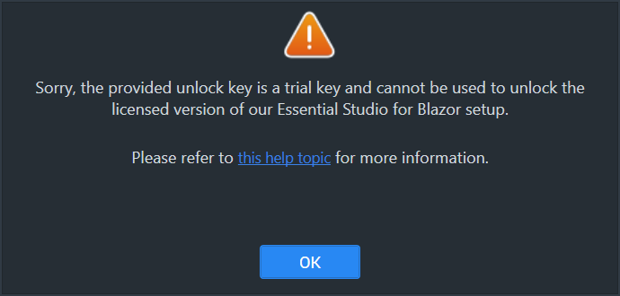
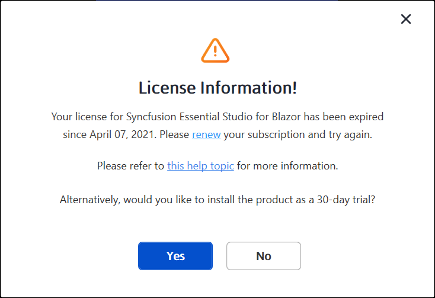
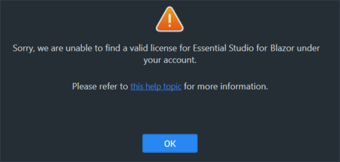
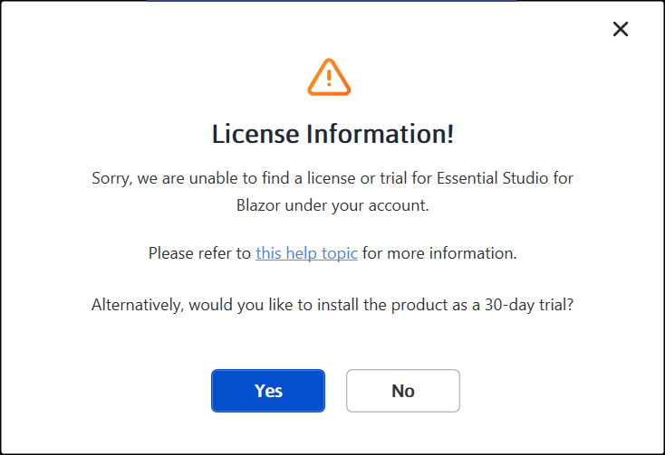

# Common Installation Errors

This article describes the most common installation errors, as well as the causes and solutions to those errors.

* [Unlocking the license installer using the trial key](/#unlocking-the-license-installer-using-the-trial-key)
* [License has expired](/#license-has-expired)
* [Unable to find a valid license or trial](/#unable-to-find-a-valid-license-or-trial)
* [Unable to install because of another installation](/#unable-to-install-because-of-another-installation)
* [Unable to install due to controlled folder access](/#unable-to-install-due-to-controlled-folder-access)

## Unlocking the license installer using the trial key

**Error Message:** Sorry, the provided unlock key is a trial unlock key and cannot be used to unlock the licensed version of our Essential Studio for Blazor installer.

**Reason**   You are attempting to use a Trial unlock key to unlock the licensed installer.

**Suggested solution**   Only a licensed unlock key can unlock a licensed installer. So, to unlock the Licensed installer, use the Licensed unlock key. To generate the licensed unlock key, refer to [this](http://syncfusion.com/kb/2326) article.

## License has expired

**Error Message:** Your license for Syncfusion Essential Studio for Blazor has been expired since {date}. Please renew your subscription and try again.

***Online Installer***

**Reason**   This error message will appear if your license has expired.

**Suggested solution**   You can choose from the options listed below.

1. You can renew your subscription [here](https://www.syncfusion.com/account/my-renewals).
2. You can get a new license [here](https://www.syncfusion.com/sales/products).
3. You can reach out to our sales team by emailing [salessupport@syncfusion.com](mailto:salessupport@syncfusion.com).
4. You can also extend the 30-day trial period after your license has expired.

## Unable to find a valid license or trial

**Error Message:** Sorry, we are unable to find a valid license or trial for Essential Studio for Blazor under your account.

***Offline installer***

***Online installer***

**Reason**   The following are possible causes of this error:

* When your trial period expired
* When you don’t have a license or an active trial
* You are not the license holder of your license
* Your account administrator has not yet assigned you a license.

**Suggested solution**  
1. You can get a new license [here](https://www.syncfusion.com/sales/products).
2. Contact your account administrator.
3. Send an email to [clientrelations@syncfusion.com](mailto:clientrelations@syncfusion.com) to request a license.
4. You can reach out to our sales team by emailing [salessupport@syncfusion.com](mailto:salessupport@syncfusion.com).

## Unable to install because of another installation

**Error Message:** Another installation is in progress. You cannot start this installation without completing all other currently active installations. Click cancel to end this installer or retry to attempt after currently active installation completed to install again.

**Reason**   You are trying to install when another installation is already running in your machine.

**Suggested solution**   Open and kill the msiexec process in the task manager and then continue to install Syncfusion. If the problem is still present, restart the computer and try Syncfusion installer.
1. Open the Windows Task Manager.
2. Browse the Details tab.
3. Select the msiexec.exe and click **End task**.

## Unable to install due to controlled folder access

***Offline***

**Error Message:** Controlled folder access seems to be enabled in your machine. The provided install or samples location (e.g., Public Documents) is protected by the controlled folder access settings.

***Online***

**Error Message:** Controlled folder access seems to be enabled in your machine. The provided install, samples, or download location (e.g., Public Documents) is protected by the controlled folder access settings.

**Reason**   You have enabled controlled folder access settings on your computer.

**Suggested solution**   Select a different location to install or deactivate your machine’s controlled folder access settings, and then try installing.